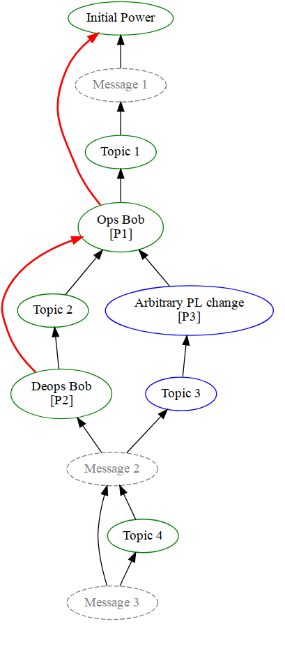
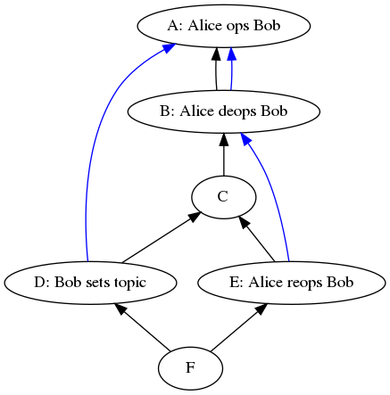

- **Author**: Erik Johnston
- **Created**: 2018-07-20
- **Updated**:
    - #1693: Clarify how to handle rejected events ─ Erik Johnston, 2018-10-30

# State Resolution: Reloaded

Thoughts on the next iteration of the state resolution algorithm that aims to
mitigate currently known attacks

# Background

The state of a room at an event is a mapping from key to event, which is built
up and updated by sending state events into the room. All the information about
the room is encoded in the state, from metadata like the name and topic to
membership of the room to security policies like bans and join rules.

It is therefore important that─wherever possible─the view of the state of the
room is consistent across all servers. If different servers have different
views of the state then it can lead to the room bifurcating, due to differing
ideas on who is in the room, who is allowed to talk, etc.

The difficulty comes when the room DAG forks and then merges again (which can
happen naturally if two servers send events at the same time or when a network
partition is resolved). The state after the merge has to be resolved from the
state of the two branches: the algorithm to resolve this is called the _state
resolution algorithm_.

Since the result of state resolution must be consistent across servers, the
information that the algorithm can use is strictly limited to the information
that will always be available to all servers (including future servers that may
not even be in the room at that point) at any point in time where the
resolution needs to be calculated. In particular, this has the consequence that
the algorithm cannot use information from the room DAG, since servers are not
required to store events for any length of time.

**As such, the state resolution algorithm is effectively a pure function from
sets of state to a single resolved set of state.**

The final important property for state resolution is that it should not allow
malicious servers to avoid moderation action by forking and merging the room
DAG. For example, if a server gets banned and then forks the room before the
ban, any merge back should always ensure that the ban is still in the state.

# Current Algorithm

The current state resolution is known to have some undesirable properties,
which can be summarized into two separate cases:

1.  Moderation evasion ─ where an attacker can avoid e.g. bans by forking and
    joining the room DAG in particular ways.
2.  State resets ─ where a server (often innocently) sends an event that points
    to disparate parts of the graph, causing state resolution to pick old state
    rather than later versions.

These have the following causes:

1.  Conflicting state must pass auth checks to be eligible to be picked, but the
    algorithm does not consider previous (superseded) state changes in a fork.
    For example, where Alice gives Bob power and then Bob gives Charlie power on
    one branch of a conflict, when the latter power level event is authed
    against the original power level (where Bob didn't have power), it fails.
1.  The algorithm relies on the deprecated and untrustable depth parameter to
    try and ensure that the "most recent" state is picked. Without having a copy
    of the complete room DAG the algorithm doesn't know that e.g. one topic
    event came strictly after another in the DAG.  For efficiency and storage
    reasons servers are not required (or expected) to store the whole room DAG.
1.  The algorithm always accepts events where there are no conflicting
    alternatives in other forks. This means that if an admin changed the join
    rules to `private`, then new joins on forks based on parts of the DAG which
    predate that change would always be accepted without being authed against
    the join_rules event.

# Desirable Properties

As well as the important properties listed in the "Background" section, there
are also some other properties that would significantly improve the experience
of end users, though not strictly essential. These include:

*   Banning and changing power levels should "do the right thing", i.e. end
    users shouldn't have to take extra steps to make the state resolution
    produce the "right" results.
*   Minimise occurrences of "state resets". Servers will sometimes point to
    disparate parts of the room DAG (due to a variety of reasons), which ideally
    should not result in changes in the state.
*   Be efficient; state resolution can happen a lot on some large rooms. Ideally
    it would also support efficiently working on "state deltas" - i.e. the
    ability to calculate state resolution incrementally from snapshots rather
    than having to consider the full state of each fork each time a conflict is
    resolved

# Ideas for New Algorithm

## Auth Chain

The _auth events_ of a given event is the set of events which justify why a
given event is allowed to be sent into a room (e.g. an m.room.create, an
m.room.power_levels and the sender's m.room.membership). The _auth chain_ of an
event is its auth events and their auth events, recursively. The auth chains of
a set of events in a given room form a DAG.

"Auth events" are events that can appear as auth events of an event. These
include power levels, membership etc.[^1]

Servers in a room are required to have the full auth chain for all events that
they have seen, and so the auth chain is available to be used by state
resolution algorithms.

## Unconflicted State

The current algorithm defines the notion of "unconflicted state" to be all
entries that for each set of state either has the same event or no entry. All
unconflicted state entries are included in the resolved state. This is
problematic due to the fact that any new entries introduced on forks always
appear in the resolved state, regardless of if they would pass the checks
applied to conflicted state.

The new algorithm could redefine "unconflicted state" to be all entries which
both exist and are the same in every state set (as opposed to previously where
the entry didn't need to exist in every state set).

## Replacing Depth

Since depth of an event cannot be reliably calculated without possessing the
full DAG, and cannot be trusted when provided by other servers, it can not be
used in future versions of state resolution. A potential alternative, however,
is to use "origin_server_ts". While it cannot be relied on to be accurate─an
attacker can set it to arbitrary values─it has the advantage over depth that
end users can clearly see when a server is using incorrect values. (Note that
server clocks don't need to be particularly accurate for the ordering to still
be more useful than other arbitrary orderings).

It can also be assumed that in most cases the origin_server_ts for a given
benign server will be mostly consistent. For example, if a server sends a join
and then a leave in the vast majority of cases the leave would have a greater
origin_server_ts.

This makes "origin_server_ts" a good candidate to be used as a last resort to
order events if necessary, where otherwise a different arbitrary ordering would
be used. However, it's important that there is some other mechanism to ensure
that malicious servers can't abuse origin_server_ts to ensure their state
always gets picked during resolution (In the proposal below we use the auth DAG
ordering to override users who set state with malicious origin_server_ts.)

## Ordering and Authing

Roughly, the current algorithm tries to ensure that moderation evasion doesn't
happen by ordering conflicted events by depth and (re)authing them
sequentially. The exact implementation has several issues, but the idea of
ensuring that state events from forks still need to pass auth subject to e.g.
bans and power level changes is a powerful one, as it reduces the utility of
maliciously forking.

For that to work we need to ensure that there is a suitable ordering that puts
e.g. bans before events sent in other forks. (However events can point to old
parts of the DAG, for a variety of reasons, and ideally in that case the
resolved state would closely match the recent state).

Similarly care should be taken when multiple changes to e.g. power levels happen
in a fork. If Alice gives Bob power (A), then Bob gives Charlie power (B) and
then Charlie, say, changes the ban level (C). If you try and resolve two state
sets one of which has A and the other has C, C will not pass auth unless B is
also taken into account. This case can be handled if we also consider the
difference in auth chains between the two sets, which in the previous example
would include B.

(This is also the root cause of the "Hotel California" issue, where left users
get spontaneously rejoined to rooms. This happens when a user has a sequence of
memberships changes of the form: leave (A), join (B) and then another leave (C).
In the current algorithm a resolution of A and C would pick A, and a resolution
of A and B would then pick B, i.e. the join. This means that a suitably forked
graph can reset the state to B. This is fixed if when resolving A and C we also
consider B, since its in the auth chain of C.)

## Power Level Ordering

Actions that malicious servers would try and evade are actions that require
greater power levels to perform, for example banning, reducing power level,
etc. We define "power events" as events that have the potential to remove the
ability of another user to do something.[^2] (Note that they are a subset of
auth events.)

In all these cases it is desirable for those privileged actions to take
precedence over events in other forks. This can be achieved by first
considering "power events", and requiring the remaining events to pass auth
based on them.

## Mainline

An issue caused by servers not storing the full room DAG is that one can't tell
how two arbitrary events are ordered. The auth chain gives a partial ordering
to certain events, though far from complete; however, all events do contain a
reference to the current power levels in their auth events. As such if two
state events reference two different power levels events, and one power levels'
auth chain references the other, then there is a strong likelihood that the
event referencing the latter power level came after the other event.

A "mainline" is a list of power levels events created if you pick a particular
power levels event (usually the current resolved power level) and recursively
follow each power level referenced in auth_events back to the first power level
event.

The mainline can then be used to induce an ordering on events by looking at
where the power level referenced in their auth_events is in the mainline (or
recursively following the chain of power level events back until one is found
that appears in the mainline). This effectively partitions the room into
epochs, where a new epoch is started whenever a new power level is sent.

If this mainline ordering is combined with ordering by origin_server_ts, then
it gives an ordering that is correct for servers that don't lie about the time,
while giving a mechanism that can be used to deal if a server lied (by room
admins starting a new epoch).

The natural course of action for a room admin to take when noticing a
user/server is misbehaving is to ban them from the room, rather than changing
the power levels. It would therefore be useful if banning a user or server
started a new epoch as well. This would require being able to create a mainline
that includes power level events and bans[^3], which would suggest that power
level and ban events would need to point to the latest ban event as well. (This
would be significantly easier if we maintained a list of bans in a single
event, however there is concern that would limit the number of possible bans in
a room.)

# Proposed Algorithm

First we define:

*   **"State sets"** are the sets of state that the resolution algorithm tries
    to resolve, i.e. the inputs to the algorithm.
*   **"Power events"** are events that have the potential to remove the ability
    of another user to do something. These are power levels, join rules, bans
    and kicks.
*   The **"unconflicted state map"** is the state where the value of each key
    exists and is the same in every state set. The **"conflicted state map"** is
    everything else. (Note that this is subtly different to the definition used
    in the existing algorithm, which considered the merge of a present event
    with an absent event to be unconflicted rather than conflicted)
*   The "**auth difference"** is calculated by first calculating the full auth
    chain for each state set and taking every event that doesn't appear in every
    auth chain.
*   The **"full conflicted set"** is the union of the conflicted state map and
    auth difference.
*   The **"reverse topological power ordering"**[^4] of a set of events is an
    ordering of the given events, plus any events in their auth chains that
    appear in the auth difference, topologically ordered by their auth chains
    with ties broken such that x < y if:

    1.  x's sender has a greater power level than y (calculated by looking at
        their respective auth events, or if
    2.  x's origin_server_ts is less than y's, or if
    3.  x's event_id is lexicographically less than y's

    This is also known as a lexicographical topological sort (i.e. this is the
    unique topological ordering such that for an entry x all entries after it
    must either have x in their auth chain or be greater than x as defined
    above). This can be implemented using Kahn's algorithm.

*   The **"mainline ordering"** based on a power level event P of a set of
    events is calculated as follows:
    1.  Generate the list of power levels starting at P and recursively take the
        power level from its auth events. This list is called the mainline,
        ordered such that P is last.
    1.  We say the "closest mainline event" of an event is the first power level
        event encountered in mainline when iteratively descending through the
        power level events in the auth events.
    1.  Order the set of events such that x < y if:
        1.  The closest mainline event of x appears strictly before the closest
            of y in the mainline list, or if
        1.  x's origin_server_ts is less than y's, or if
        1.  x's event_id lexicographically sorts before y's
*   The **"iterative auth checks"** algorithm is where given a sorted list of
    events, the auth check algorithm is applied to each event in turn. The state
    events used to auth are built up from previous events that passed the auth
    checks, starting from a base set of state. If a required auth key doesn't
    exist in the state, then the one in the event's auth_events is used if the
    auth event is not rejected. (See _Variations_ and _Attack Vectors_ below).

The algorithm proceeds as follows:

1.  Take all power events and any events in their auth chains that appear in the
    _full_ _conflicted set_ and order them by the _reverse topological power
    ordering._
1.  Apply the _iterative auth checks_ algorithm based on the unconflicted state
    map to get a partial set of resolved state.
1.  Take all remaining events that weren't picked in step 1 and order them by
    the _mainline ordering_ based on the power level in the partially resolved
    state.
1.  Apply the _iterative auth checks algorithm_ based on the partial resolved
    state.
1.  Update the result with the _unconflicted state_ to get the final resolved
    state[^5]. (_Note_: this is different from the current algorithm, which
    considered different event types at distinct stages)

An example python implementation can be found on github
[here](https://github.com/matrix-org/matrix-test-state-resolution-ideas).

Note that this works best if we also change which events to include as an
event's auth_events. See the "Auth Events" section below.

## Discussion

Essentially, the algorithm works by producing a sorted list of all conflicted
events (and differences in auth chains), and applies the auth checks one by
one, building up the state as it goes. The list is produced in two parts: first
the power events and auth dependencies are ordered by power level of the
senders and resolved, then the remaining events are ordered using the
"mainline" of the resolved power levels and then resolved to produce the final
resolved state.

(This is equivalent to linearizing the full conflicted set of events and
reapplying the usual state updates and auth rules.)

### Variations

There are multiple options for what to use as the base state for _iterative
auth checks_ algorithm; while it needs to be some variation of auth events and
unconflicted events, it is unclear exactly which combination is best (and least
manipulatable by malicious servers).

Care has to be taken if we want to ensure that old auth events that appear in
the _auth chain difference_ can't supersede unconflicted state entries.

Due to auth chain differences being added to the resolved states during
_iterative auth checks_, we therefore need to re-apply the unconflicted state
at the end to ensure that they appear in the final resolved state. This feels
like an odd fudge that shouldn't be necessary, and may point to a flaw in the
proposed algorithm.

### State Resets

The proposed algorithm still has some potentially unexpected behaviour.

One example of this is when Alice sets a topic and then gets banned. If an event
gets created (potentially much later) that points to both before and after the
topic and ban then the proposed algorithm will resolve and apply the ban before
resolving the topic, causing the topic to be denied and dropped from the
resolved state. This will result in no topic being set in the resolved state.

### Auth Events

The algorithm relies heavily on the ordering induced by the auth chain DAG.

There are two types of auth events (not necessarily distinct):

*   Those that give authorization to do something
*   Those that revoke authorization to do something.

For example, invites/joins are in the former category, leaves/kicks/bans are in
the latter and power levels are both.

Assuming[^6] revocations always point to (i.e., have in their auth chain) the
authorization event that they are revoking, and authorization events point to
revocations that they are superseding, then the algorithm will ensure that the
authorization events are applied in order (so generally the "latest"
authorization state would win).

This helps ensure that e.g. an invite cannot be reused after a leave/kick,
since the leave (revocation) would have the invite in their auth chain.

This idea also relies on revocations replacing the state that granted
authorization to do an action (and vice versa). For example, in the current
model bans (basically) revoke the ability for a particular user from being able
to join. If the user later gets unbanned and then rejoins, the join would point
to the join rules as the authorization that lets them join, but would not
(necessarily) point to the unban. This has the effect that if a state resolution
happened between the new join and the ban, the unban would not be included in
the resolution and so the join would be rejected.

The changes to the current model that would be required to make the above
assumptions true would be, for example:

1.  By default permissions are closed.
1.  Bans would need to be a list in either the join rules event or a separate
    event type which all membership events pointed to.
1.  Bans would only revoke the ability to join, not automatically remove users
    from the room.
1.  Change the defaults of join_rules to be closed by default

### Efficiency and Delta State Resolution

The current (unoptimised) implementation of the algorithm is 10x slower than
the current algorithm, based on a single, large test case. While hopefully some
optimisations can be made, the ability to [incrementally calculate state
resolution via deltas](https://github.com/matrix-org/synapse/pull/3122) will
also mitigate some of the slow down.

Another aspect that should be considered is the amount of data that is required
to perform the resolution. The current algorithm only requires the events for
the conflicted set, plus the events from the unconflicted set needed to auth
them. The proposed algorithm also requires the events in the auth chain
difference (calculating the auth chain difference may also require more data to
calculate).

Delta state resolution is where if you have, say, two state sets and their
resolution, then you can use that result to work out the new resolution where
there has been a small change to the state sets. For the proposed algorithm, if
the following properties hold true then the result can be found by simply
applying steps 3 and 4 to the state deltas. The properties are:

1.  The delta contains no power events
1.  The origin_server_ts of all events in state delta are strictly greater than
    those in the previous state sets
1.  Any event that has been removed must not have been used to auth subsequent
    events (e.g. if we replaced a member event and that user had also set a
    topic)

These properties will likely hold true for most state updates that happen in a
room, allowing servers to use this more efficient algorithm the majority of the
time.

### Full DAG

It's worth noting that if the algorithm had access to the full room DAG that it
would really only help by ensuring that the ordering in "reverse topological
ordering" and "mainline ordering" respected the ordering induced by the DAG.

This would help, e.g., ensure the latest topic was always picked rather than
rely on origin_server_ts and mainline. As well as obviate the need to maintain
a separate auth chain, and the difficulties that entails (like having to
reapply the unconflicted state at the end).

### Rejected Events

Events that have been rejected due to failing auth based on the state at the
event (rather than based on their auth chain) are handled as usual by the
algorithm, unless otherwise specified.

Note that no events rejected due to failure to auth against their auth chain
should appear in the process, as they should not appear in state (the algorithm
only uses events that appear in either the state sets or in the auth chain of
the events in the state sets).

This helps ensure that different servers' view of state is more likely to
converge, since rejection state of an event may be different. This can happen if
a third server gives an incorrect version of the state when a server joins a
room via it (either due to being faulty or malicious). Convergence of state is a
desirable property as it ensures that all users in the room have a (mostly)
consistent view of the state of the room. If the view of the state on different
servers diverges it can lead to bifurcation of the room due to e.g. servers
disagreeing on who is in the room.

Intuitively, using rejected events feels dangerous, however:

1. Servers cannot arbitrarily make up state, since they still need to pass the
   auth checks based on the event's auth chain (e.g. they can't grant themselves
   power levels if they didn't have them before).
2. For a previously rejected event to pass auth there must be a set of state
   that allows said event. A malicious server could therefore produce a
   fork where it claims the state is that particular set of state, duplicate the
   rejected event to point to that fork, and send the event. The
   duplicated event would then pass the auth checks. Ignoring rejected events
   would therefore not eliminate any potential attack vectors.

Rejected auth events are deliberately excluded from use in the iterative auth
checks, as auth events aren't re-authed (although non-auth events are) during
the iterative auth checks.

### Attack Vectors

The main potential attack vector that needs to be considered is in the
_iterative auth checks_ algorithm, and whether an attacker could make use of
the fact that it's based on the unconflicted state and/or auth events of the
event.

# Appendix

The following are some worked examples to illustrate some of the mechanisms in
the algorithm. In each we're interested in what happens to the topic.

## Example 1 - Mainline

The following is an example room DAG, where time flows down the page. We shall
work through resolving the state at both _Message 2_ and _Message 3_.

(Note that green circles are events sent by Alice, blue circles sent by Bob and
black arrows point to previous events. The red arrows are the mainline computed
during resolution.)

First we resolve the state at _Message 2_. The conflicted event types are the
power levels and topics, and since the auth chains are the same for both state
sets the auth difference is the empty set.

Step 1: The _full conflicted set_ are the events _P2, P3, Topic 2 _and _Topic
3_, of which _P2_ and _P3_ are the only power events. Since Alice (the room
creator) has a greater power level than Bob (and neither _P2 _and _P3_ appear
in each other's auth chain), the reverse topological ordering is: [_P2, P3_].

Step 2: Now we apply the auth rules iteratively, _P2_ trivially passes based on
the unconflicted state, but _P3_ does not pass since after _P2_ Bob no longer
has sufficient power to set state. This results in the power levels resolving
to _P2_.

Step 3: Now we work out the mainline based on P2, which is coloured in red on
the diagram. We use the mainline to order _Topic 2_ and _Topic 3_. _Topic 2_
points to_ P1_, while the closest mainline to _Topic 3_ is also _P1_. We then
order based on the _origin_server_ts_ of the two events, let's assume that
gives us: [_Topic 2_, _Topic 3_].

Step 4: Iteratively applying the auth rules results in _Topic 2_ being allowed,
but _Topic 3 _being denied (since Bob doesn't have power to set state anymore),
so the topic is resolved to _Topic 2_.

This gives the resolved state at _Message 2_ to be _P2 _and _Topic 2_. (This is
actually the same result as the existing algorithm gives)

Now let's look at the state at _Message 3_.

Step 1: The full conflicted set are simple: _Topic 2_ and _Topic 4_. There are
no conflicted power events.

Step 2: N/A

Step 3: _Topic 2_ points to _P1_ in the mainline, and _Topic 4_ points to _P2_
in its auth events.  Since _P2_ comes after _P1_ in the mainline, this gives an
ordering of [_Topic 2, Topic 4_].

Step 4: Iteratively applying the auth rules results in both topics passing the
auth checks, and so the last topic, _Topic 4_, is chosen.

This gives the resolved state at _Message 3_ to be _Topic 4_.

## Example 2  - Rejected Events

The following is an example room DAG, where time flows down the page. The event
`D` is initially rejected by the server (due to not passing auth against the
state), but does pass auth against its auth chain.

(Note that the blue lines are the power levels pointed to in the event's auth
events)

At `F` we first resolve the power levels, which results in `E`. When we then go
to resolve the topics against the partially resolved state, Bob has ops and so
the resolved state includes the topic change `D`, even though it was initially
rejected.

## Notes

[^1]: In the current room protocol these are: the create event, power levels,
     membership, join rules and third party invites. See the
     [spec](https://github.com/matrix-org/matrix-doc/blob/7cb918407dc8c505c67c750578c63b43042c8425/specification/server_server_api.rst#41pdu-fields).

[^2]: In the current protocol these are: power levels, kicks, bans and join
     rules.

[^3]: Future room versions may have a concept of server ban event that works
     like existing bans, which would also be included

[^4]: The topology being considered here is the auth chain DAG, rather than the
     room DAG, so this ordering is only applicable to events which appear in the
     auth chain DAG.

[^5]: We do this so that, if we receive events with misleading auth_events, this
     ensures that the unconflicted state at least is correct.

[^6]: This isn't true in the current protocol

