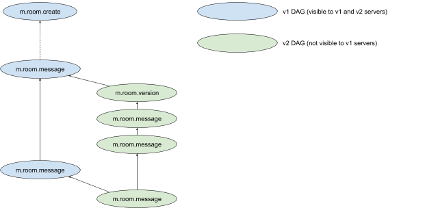

# Room version upgrades

## Background

[MSC1425](https://github.com/matrix-org/matrix-doc/issues/1425) introduces a
mechanism for associating a "version" with a room, which allows us to introduce
changes to the mechanics of rooms.

Assuming that a given change is successful, the next challenge is to introduce
it to existing rooms. This proposal introduces a mechanism for doing so.

## Proposal

In short: room upgrades are implemented by creating a new room, shutting down
the old one, and linking between the two.

The mechanics of this are as follows. When Alice upgrades a room, her client
hits a new C-S api:

```
POST /_matrix/client/r0/rooms/{roomId}/upgrade
```
```json
{
    "new_version": "2"
}
```

Response:

```json
{
    "replacement_room": "!QtykxKocfsgujksjgd:matrix.org"
}
```

When this is called, the server:

 * Checks that Alice has permissions to send `m.room.tombstone` state events.

 * Creates a replacement room, with an `m.room.create` with a `predecessor` field
   which links to the last known event in the old room:

   ```json
   {
       "sender": "@alice:somewhere.com",
       "type": "m.room.create",
       "state_key": "",
       "room_id": "!QtykxKocfsgujksjgd:matrix.org",
       "content": {
           "room_version": "2",
           "predecessor": {
               "room_id": "!cURbaf:matrix.org",
               "event_id": "$1235135aksjgdkg:matrix.org"
           }
       }
   }
   ```

 * Replicates PL/privacy/topic/etc events to the new room.

 * Moves any local aliases to the new room.

 * Sends an `m.room.tombstone` state event in the old room to tell participants
   that it is dead:

   ```json
   {
       "sender": "@alice:somewhere.com",
       "type": "m.room.tombstone",
       "state_key": "",
       "room_id": "!cURbaf:matrix.org",
       "content": {
           "body": "This room has been replaced",
           "replacement_room": "!QtykxKocfsgujksjgd:matrix.org"
       }
   }
   ```

   The `body` of the tombstone event is defined by the server (for now, at
   least).

 * Assuming Alice has the powers to do so, sets the power levels in the old
   room to stop people speaking. In practice, this means setting
   `events_default` and `invite` to the greater of `50` and `users_default+1`.

Bob's client understands the `m.room.tombstone` event, and:

 * Hides the old room in the room list (the room continues to be accessible
   via the old room id (permalinks, backlinks from the new room, etc).

 * Displays, at the very bottom of the timeline of the old room: "This room
   has been upgraded. Click here to follow the conversation to the new room".
   The link is simply a permalink to the new room. When Bob opens it, he will
   get joined to the new room.

   [Note that if Bob is on a version of synapse which doesn't understand room
   versions, following the permalink will take him to a room view which churns
   for a while and eventually fails. Synapse 0.33.3 should at least give a
   sensible error code.]

   If it turns out that the replacement room also has a tombstone event, the
   client may automatically keep following the chain until it reaches a room
   that isn't dead.

 * Optional extension: if the user is in both rooms, then the "N unread
   messages" banner when scrolled up in the old room could be made to track
   messages in the new room (so in practice the user would only ever see the
   hiatus between the versions if they scrolled all the way to the beginning
   of the new room or the end of the old one.)

Bob's client also understands the `predecessor` field in the `m.room.create`, and:

 * At the top of scrollback in the new room, displays: "This room is a
   continuation of a previous room. Click here to see the old conversation."
   The link is a permalink to the old room.

 * Optional extensions might include things like extending room search to
   work across two rooms.

### Client changes needed

 * Ability for an op to view the current room version and upgrade it (by
   hitting `/upgrade`).

   * ~~Also the ability for an op to see what versions the servers in the
     current room supports (nb via a cap API) and so how many users will get
     locked out~~ (This is descoped for now.)

 * Display `m.room.tombstone`s as a sticky message at the bottom of the old
   room (perhaps replacing the message composer input) as “This room has been
   replaced. Please click here to continue” or similar.

   * When the user clicks the link, the client attempts to join the new room if
     we are not already a member, and then switches to a view on the new room.

     The client should supply the name of the server which sent the tombstone
     event as the `server_name` for the `/join` request. (That being the most
     likely server to have an up-to-date copy of the room - this is essentially
     a workaround for [vector-im/riot-web#2925](https://github.com/vector-im/riot-web/issues/2925).)

 * If the client sees a pair of rooms with a tombstone correctly joined to the
   new room, it should hide the old one from the RoomList.

 * If one backpaginates the new room to its creation, we should show the
   `m.room.create` as “This room is a continuation of a previous room; click here
   to view” (or similar).

 * Search is extended to search old rooms (could be done clientside for now).

Future eye-candy:

 * When one is viewing the old room:

   * Rather than showing a sticky tombstone at the bottom, one should probably
     have the “10 unread messages” section in the status bar which refers to
     the current version of the room.

   * We should probably also show the membership list of the current room. (Perhaps?)

## Future extensions

### Invite-only rooms

Invite-only rooms are not dealt with explicitly here; they are made tricky by
the fact that users in the old room won't be able to join the new room without
an invite.

For now, we are assuming that the main reasons for carrying out a room-version
upgrade (ie, security problems due to state resets and the like) do not apply
as strongly to invite-only rooms, and we have descoped them for now.

In future, we will most likely deal with them as follows:

 * For local users, we need to first create an invite for each user in the
   room. This is easy, if a bit high-overhead.

 * For remote users:

     * Alice's server could send invites; however this is likely to give an
       unsatisfactory UX due to servers being offline, maybe not supporting the
       new room version, and then spamming Bob with mysterious invites.

     * We could change the auth rules to treat a membership of the old room as
       equivalent to an invite to the new room. However, this is likely to
       reintroduce the problems we are trying to solve by replacing the room in
       the first place.

     * We could create a new type of membership which acts like an invite for
       the purposes of allowing users into invite-only rooms, but doesn't need
       to be sent to remote servers.

### Parting users from the old room

It's not obvious if users should stay members of the old room indefinitely
(until they manually leave). Perhaps they should automatically leave after a
respectful period? What if the user leaves the *new* room?

For now, we'll assume that they stay members until they manually leave. We can
see how that feels in practice.

## Potential issues

 * What about clients that don't understand tombstones?

   * I think they'll just show you two separate rooms (both with the same
     name), and you won't be able to talk in one of them. It's not great but it
     will probably do.

 * It's a shame that scrollback in the new room will show a load of joins
   before you get to the link to the old room.

## Dismissed solutions

### Variations on this proposal

#### Have servers auto-join their users on upgrade

In order to make the upgrade more seamless, it might be good for servers to
automatically join any users that were in the old room to the new room.

In short, when Bob's server receives a tombstone event, it would attempt to
auto-join Bob to the new room, and updates any aliases it may have to point to
the new room.

It's worth noting that the join may not be successful: for example, because
Bob's server is too old, or because Bob has been blocked from joining the new
room, or because joins are generally flaky. In this case Bob might attempt a
rejoin via his client.

#### Have servers merge old and new rooms together

Instead of expecting clients to interpret tombstone events, servers could merge
/sync results together for the two rooms and present both as the old room in
/sync results - and then map from the old room ID back to the new one for API
calls.

(Note that doing this the other way around (mapping both rooms into the *new*
room ID) doesn't really work without massively confusing clients which have
cached data about the old room.)

This sounds pretty confusing though: would the server do this forever
for all users on the server?

#### have clients merge old and new rooms

At the top of scrollback for the new room, shows some sort of "messages from a
previous version of this room" divider, above which it shows messages from the
old room <sup name="a10">[1](#f10)</sup>.

This gets quite messy quite quickly. For instance, it will be confusing to see
any ongoing traffic in the old room (people whose servers didn't get the memo
about the tombstone; people leaving the old room; etc). Ultimately it's all
client polish though, so we can consider this for the future.

<b name="f10">1</b> It's probably worth noting that this alone is a somewhat
fundamental reworking of a bunch of complicated stuff in matrix-react-sdk (and
presumably likewise in the mobile clients). [↩](#a10)

### Counter-proposal: upgrade existing rooms in-place

The general idea here is to divide the room DAG into v1 and v2 parts. Servers
which do not support v2 will not see the v2 part of the DAG. This might look
like the below:



In this model, room version is tracked as a state event:

```json
{
    "type": "m.room.version",
    "content": {
        "version": 2
    }
}
```

This event can only ever be sent by the **original room creator** - i.e., the
sender of the `m.room.create event` - even if the `m.room.power_levels` say
otherwise <sup name="a1">[1](#f1)</sup> <sup name="a2">[2](#f2)</sup>.

The DAG is now divided into parts where the state of m.room.version is 2, and
those where it is missing (and therefore implicitly 1).

When sending out federation transactions, v2 events are listed under a new
versioned_pdus key in the /send request:

```
PUT /_matrix/federation/v1/send/991079979

{
 "origin_server_ts": 1404835423000,
 "origin": "matrix.org",
 "pdus": [],
 "versioned_pdus": {
   2: [...]
 },
 "edus": [...]
}
```

Old servers which do not support v2 will therefore not receive any v2 parts of
the DAG, and transactions which only contain updates to the v2 part of the DAG
will be treated as no-ops. Servers should ignore entries under versioned_pdus
which correspond to versions they do not know about.

As a special case, `m.room_version events` themselves are treated as having the
version previously in force in the room, unless that was v1, in which case,
they are treated as being v2. This means that the upgrade from v1 to v2, *and*
the upgrade from v2 to v3, are included under `versioned_pdus[2]`, but the
upgrade from v3 to v4 is included under `versioned_pdus[3]`. If a server
receives an `m.room_version` event with a version it does not understand, it
must refuse to allow any other events into the upgraded part of the DAG (and
probably *should* refuse to allow any events into the DAG at all)
<sup name="a1">[3](#f3)</sup>. The reasons for this are as follows:

 * We want to ensure that v1-only servers do not receive the room_version
   event, since they don't know how to auth it correctly, and more importantly
   we want to ensure that they can't get hold of it to construct bits of DAG
   which refer to it, and would have to follow the v2 rules.

 * However, putting subsequent upgrades in a place where older servers will see
   it means that we can do more graceful upgrades in future by telling their
   clients that the room seems to have been upgraded.

As normal, we require joining servers to declare their support for room
versions, and reject any which do not include the version of the room given by
the current room state.

In theory this is all that is required to ensure that v1-only servers never see
any v2 parts of the DAG (events are only sent via /send, and a v1 server should
have no way to reference v2 parts of the DAG); however we may want to consider
adding a "versions" parameter to API calls like /event and /state which allow a
server to specify an event_id to fill from, in case a (non-synapse, presumably)
implementation gets an event id from a /context request or similar and tries to
fill from it.

The experience for clients could be improved by awareness of the m.room.version
event and querying a capabilities API (e.g. /versions?) to determine whether a
room has been upgraded newer than the server can support.  If so, a client
could say: “Your server must be upgraded to continue to participate in this
room” (and manually prevent the user from trying to speak).

#### Problems

 * This leaves users on old v1-only servers in their own view of the room,
   potentially continuing to speak but only seeing a subset of events (those
   from their own and other v1 servers).

   In the worst case, they might ask questions which those on v2 servers can see but have no way of replying to.

   One way to mitigate this would be to ensure that the last event sent in the
   v1 part of the DAG is an m.room.power_levels to make the room read-only to
   casual users; then restore the situation in the v2 DAG.

 * There's nothing to stop "inquisitive" users on v1 servers sending
   m.room.version events, which is likely to completely split-brain the room.

 * This doesn't help us do things like change the format of the room id.

<b name="f1">1</b> This avoids the version event itself being vulnerable to state
resets. [↩](#a1)

<b name="f2">2</b> This is therefore a change to the event authorisation rules
which we need to introduce with room version 2. [↩](#a2)

<b name="f3">3</b> It's worth noting this does give the room creator a
kill-switch for the room, even if they've subsequently been de-opped. Such is
life. [↩](#a3)
