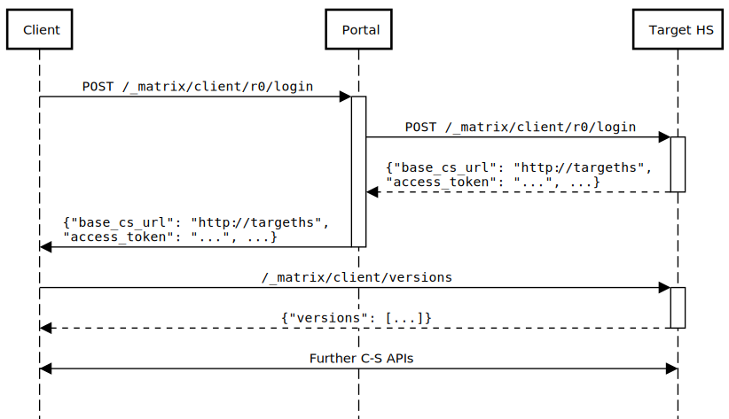

# MSC1730: Mechanism for redirecting to an alternative server during login

Complex homeserver deployments may consist of several homeserver instances,
where the HS to be used depends on the individual user, and is determined at
login time.

It may therefore be useful to provide a mechanism to tell clients which
endpoint they should use for the client-server (C-S) API after login.

## Proposal

The response to `POST /_matrix/client/r0/login` currently includes the fields
`user_id`, `access_token`, `device_id`, and the deprecated `home_server`.

We should add to this an optional field `base_cs_url`, which gives a base URL
for the client-server API.

As with
[.well-known](https://matrix.org/docs/spec/client_server/r0.4.0.html#well-known-uri),
clients would then add `/_matrix/client/...` to this URL to form valid C-S
endpoints.

(Note that the deprecated `home_server` field gives the `server_name` of the
relevant homeserver, which may be quite different to the location of the C-S
API, so is not of use here. Further we cannot repurpose it, because (a) this
might break existing clients; (b) it spells homeserver wrong.)

A representative sequence diagram is shown below.

## Tradeoffs

Alternative solutions might include:

### Proxy all C-S endpoints

It would be possible for the portal to proxy all C-S interaction, as well as
`/login`, directing requests to the right server for the user.

This is unsatisfactory due to the additional latency imposed, the load on the
portal server, and the fact that it makes the portal a single point of failure
for the entire system.

### Perform a .well-known lookup after login

Once clients know the server name of the homeserver they should be using
(having extracted it from the `/login` response), they could perform a
`.well-known` lookup on the target server to locate its C-S API.

This has the advantage of reusing existing mechanisms, but has the following
problems:

* Clients are currently required to do a `.well-known` lookup *before* login,
  so that they can find the correct endpoint for the `/login` API. That means
  they will have to do *two* `.well-known` lookups - one before and one after
  login.

  This adds latency and overhead, and complicates client implementations.

* It complicates deployment, since each target server has to support a
  `.well-known` lookup.

* Since the portal already has knowledge of the location of the C-S API for the
  target homeserver, and has mapped the login request onto the correct HS, it
  feels redundant to have a separate mechanism which repeats that mapping.
