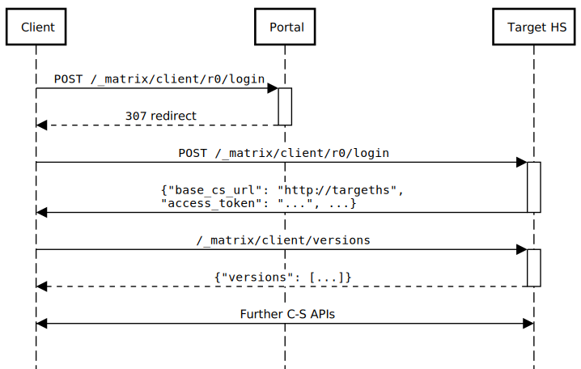

# MSC1730: Mechanism for redirecting to an alternative server during login

Complex homeserver deployments may consist of several homeserver instances,
where the HS to be used for a user session is determined at login time. The HS
might be chosen based on any of a number of factors, such as the individual
user, or a simple round-robin to load-balance.

One solution to this is for users to log in via a "portal server", which
accepts the login request, and picks the server accordingly. This proposal
suggests adding a field to the `/login` response which tells clients which
endpoint they should use for the client-server (C-S) API after login.

## Proposal

The response to `POST /_matrix/client/r0/login` currently includes the fields
`user_id`, `access_token`, `device_id`, and the deprecated `home_server`.

We should add to this a `base_cs_url` field, which SHOULD be returned by
compliant homeservers, which gives a base URL for the client-server API.

As with
[.well-known](https://matrix.org/docs/spec/client_server/r0.4.0.html#well-known-uri),
clients would then add `/_matrix/client/...` to this URL to form valid C-S
endpoints.

One way that this could be used is that the portal server proxies the `/login`
request, and passes it on to the target HS, as shown in the sequence diagram below:

Alternatively, the portal server could redirect the original `login` request to
the target HS with a `307 Temporary Redirect` response:

(Note that the deprecated `home_server` field gives the `server_name` of the
relevant homeserver, which may be quite different to the location of the C-S
API, so is not of use here. Further we cannot repurpose it, because (a) this
might break existing clients; (b) it spells homeserver wrong.)

### Notes on proxying vs redirecting

Proxying the `/login` request as shown in the first sequence diagram above
leads to the following concerns:

* The target homeserver sees the request coming from the portal server rather
  than the client, so that the wrong IP address will be recorded against the
  user's session. (This might be a problem for, for example, IP locking the
  session, and might affect the `last_seen_ip` field returned by `GET
  /_matrix/client/r0/devices`.)

  This can be mitigated to some extent via the use of an `X-Forwarded-For`
  header, but that then requires the portal server to authenticate itself with
  the target homeserver in some way.

* It causes additional complexity in the portal server, which must now be
  responsible for making outbound HTTP requests.

* It potentially leads to a privacy leak, since the portal server could snoop
  on the returned access token. (Given that the portal server must be trusted
  to some extent in this architecture, it is unclear how much of a concern this
  really is.)

On the other hand, redirecting it with a `307` response may reduce flexibility,
or require more state to be managed on the portal server [1]. Furthermore
support for `307` redirects among user-agents may vary
([RFC2616](https://tools.ietf.org/html/rfc2616#section-10.3.8) said "If the 307
status code is received in response to a request other than GET or HEAD, the
user agent MUST NOT automatically redirect the request unless it can be
confirmed by the user", though this appears to have been dropped by
[RFC7231](https://tools.ietf.org/html/rfc7231#section-6.4.7) and I am unaware
of any current browsers which do not follow `307` redirects.)

In any case, this is an implementation decision; portal servers can use
whichever method best suits their needs.

## Rejected solutions

Alternative solutions might include:

### Proxy all C-S endpoints

It would be possible for the portal to proxy all C-S interaction, as well as
`/login`, directing requests to the right server for the user.

This is unsatisfactory due to the additional latency imposed, the load on the
portal server, and the fact that it makes the portal a single point of failure
for the entire system.

### Perform a .well-known lookup after login

Once clients know the server name of the homeserver they should be using
(having extracted it from the `/login` response), they could perform a
`.well-known` lookup on the target server to locate its C-S API.

This has the advantage of reusing existing mechanisms, but has the following
problems:

* Clients are currently required to do a `.well-known` lookup *before* login,
  so that they can find the correct endpoint for the `/login` API. That means
  they will have to do *two* `.well-known` lookups - one before and one after
  login.

  This adds latency and overhead, and complicates client implementations.

* It complicates deployment, since each target server has to support a
  `.well-known` lookup. (This is somewhat weak: target servers should
  support `.well-known` lookups anyway.)

### Add an alternative redirection mechanism in the login flow

We could specify that the `/login` response could contain a `redirect` field
property instead of the existing `user_id`/`access_token`/`device_id`
properties. The `redirect` property would give the C-S API of the target
HS. The client would then repeat its `/login` request, and use the specified
endpoint for all future C-S interaction.

This approach would complicate client implementations.

[1] The reason more state is needed is as follows: because the portal is now
redirecting the login rather than proxying it, it cannot modify the login
dictionary. This is a problem for the single-sign-on flow, which culminates in
an `m.login.token` login. The only way that the portal can identify a given
user session - and thus know where to redirect to - is via the login token, and
of course, it cannot modify that token without making it invalid for the target
HS. It therefore has to use the login token as a session identifier, and store
session state..
