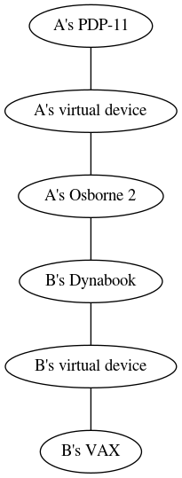
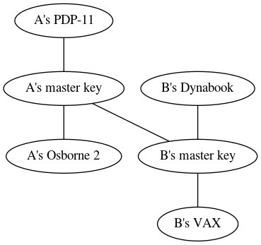

# Cross-signing devices with device signing keys

## Background

If a user has multiple devices, each device will have a different key for
end-to-end encryption.  Other users who want to communicate securely with this
user must then verify each key on each of their own devices.  If Alice has *n*
devices, and Bob has *m* devices, then for Alice to be able to communicate with
Bob on any of their devices, this involves *n×m* key verifications.

One way to address this is for each user to use a device signing key to sign
all of their devices.  Thus another user who wishes to verify their identity
only needs to verify the device signing key and can use the signatures created
by the device signing key to verify their devices.

[MSC1680](https://github.com/matrix-org/matrix-doc/issues/1680) presents a
different solution to the problem.  A comparison between this proposal and
MSC1680 is presented below.

## Proposal

Each user has three key pairs:

- a *master* cross-signing key pair that is used to identify themselves and to
  sign their other cross-signing keys,
- a *self-signing* key pair that is used to sign their own devices, and
- a *user-signing* key pair that is used to sign other users' master keys.

When one user (e.g. Alice) verifies another user's (Bob's) identity, Alice will
sign Bob's master key with her user-signing key. (This will mean that
verification methods will need to be modified to pass along the public part of
Bob's master key.) Alice's device will trust Bob's device if:

- Alice's device is using a master key that has signed her user-signing key,
- Alice's user-signing key has signed Bob's master key,
- Bob's master key has signed Bob's self-signing key, and
- Bob's self-signing key has signed Bob's device key.

### Key security

A user's master key could allow an attacker to impersonate that user to other
users, or other users to that user.  Thus clients must ensure that the private
part of the master key is treated securely.  If clients do not have a secure
means of storing the master key (such as a secret storage system provided by
the operating system), then clients must not store the private part.  If a user
changes their master key, clients of users that they communicate with must
notify their users about the change.

A user's user-signing and self-signing keys are intended to be easily
replaceable if they are compromised by re-issuing a new key signed by the
user's master key and possibly by re-verifying devices or users.  However,
doing so relies on the user being able to notice when their keys have been
compromised, and it involves extra work for the user, and so although clients
do not have to treat the private parts as sensitively as the master key,
clients should still make efforts to store the private part securely, or not
store it at all.  Clients will need to balance the security of the keys with
the usability of signing users and devices when performing key verification.

The private halves of a user's cross-signing keys may be stored encrypted on the
server so that they may be retrieved by new devices, or shared between devices
using [MSC1946](https://github.com/matrix-org/matrix-doc/pull/1946).  When
handled in this way, the keys must be base64-encoded, and use the names
`m.cross_signing.master`, `m.cross_signing.self_signing`, and
`m.cross_signing.user_signing` for the master, self-signing, and user-signing
keys, respectively.

### Signature distribution

Currently, users will only be allowed to see
* signatures made by their own master, self-signing or user-signing keys,
* signatures made by their own devices about their own master key,
* signatures made by other users' self-signing keys about their own respective
  devices,
* signatures made by other users' master keys about their respective
  self-signing key, or
* signatures made by other users' devices about their respective master keys
  (these signatures are used for [migrating from device
  verifications](#migrating-from-device-verifications)).

This is done in order to preserve the privacy of social connections.  Future
proposals may define mechanisms for distributing signatures to other users in
order to allow for other web-of-trust use cases.

### Migrating from device verifications

Users who have verified individual devices may wish to migrate these
verifications to use cross-signing instead.  In order to aid with this,
signatures of a user's master key, made by their own devices, may be uploaded
to the server.  If another user's client sees that that a given user's master key has a valid
signature from a device that was previously verified, then the client may
choose to trust and sign the master key.  The client should take precautions to
ensure that a stolen device cannot be used to cause it to trust a malicious
master key.  For example, a client could prompt the user before signing the
master key, or it could only do this migration on the first master key that it
sees from a user.

### API description

#### Uploading signing keys

Public keys for the cross-signing keys are uploaded to the servers using
`/keys/device_signing/upload`.  This endpoint requires [UI
Auth](https://matrix.org/docs/spec/client_server/r0.4.0.html#user-interactive-authentication-api).

`POST /keys/device_signing/upload`

``` json
{
  "master_key": {
    "user_id": "@alice:example.com",
    "usage": ["master"],
    "keys": {
      "ed25519:base64+master+public+key": "base64+self+master+key",
    }
  },
  "self_signing_key": {
    "user_id": "@alice:example.com",
    "usage": ["self_signing"],
    "keys": {
      "ed25519:base64+self+signing+public+key": "base64+self+signing+public+key",
    },
    "signatures": {
      "@alice:example.com": {
        "ed25519:base64+master+public+key": "base64+signature"
      }
    }
  },
  "user_signing_key": {
    "user_id": "@alice:example.com",
    "keys": {
      "ed25519:base64+device+signing+public+key": "base64+device+signing+public+key",
    },
    "usage": ["user_signing"],
    "signatures": {
      "@alice:example.com": {
        "ed25519:base64+master+public+key": "base64+signature"
      }
    }
  }
}
```

Cross-signing keys are JSON objects with the following properties:

* `user_id` (string): The user who owns the key
* `usage` ([string]): Allowed uses for the key.  Must contain `"master"` for
  master keys, `"self_signing"` for self-signing keys, and `"user_signing"`
  for user-signing keys.
* `keys` ({string: string}): an object that must have one entry, whose name is
  "`ed25519:`" followed by the unpadded base64 encoding of the public key, and
  whose value is the unpadded base64 encoding of the public key.
* `signatures` ({string: {string: string}}): signatures of the key. A
  self-signing or user-signing key must be signed by the master key. A master
  key may be signed by a device.

In order to ensure that there will be no collisions in the `signatures`
property, the server must respond with an `M_FORBIDDEN` error if any of
the uploaded public keys match an existing device ID for the user.  Similarly,
if a user attempts to log in specifying a device ID matching one of the signing
keys, the server must respond with an `M_FORBIDDEN` error.

If a self-signing or user-signing key is uploaded, it must be signed by the
master key that is included in the request, or the current master key if no
master key is included.  If the signature from the master key is incorrect, the
server should respond with an error code of `M_INVALID_SIGNATURE`.

After uploading cross-signing keys, they will be included under the
`/keys/query` endpoint under the `master_keys`, `self_signing_keys` and
`user_signing_keys` properties.  The `user_signing_keys` property will only be
included when a user requests their own keys.

`POST /keys/query`

``` json
{
   "device_keys": {
      "@alice:example.com": []
   },
   "token": "string"
}
```

response:

``` json
{
  "failures": {},
  "device_keys": {
    "@alice:example.com": {
      // ...
    }
  },
  "master_keys": {
    "@alice:example.com": {
      "user_id": "@alice:example.com",
      "usage": ["master"],
      "keys": {
        "ed25519:base64+master+public+key": "base64+master+public+key"
      }
    }
  },
  "self_signing_keys": {
    "@alice:example.com": {
      "user_id": "@alice:example.com",
      "usage": ["self_signing"],
      "keys": {
        "ed25519:base64+self+signing+public+key": "base64+self+signing+public+key"
      },
      "signatures": {
        "@alice:example.com": {
          "ed25519:base64+master+public+key": "base64+signature"
        }
      }
    }
  }
}
```

Similarly, the federation endpoints `POST /user/keys/query` and `POST
/user/devices/{userId}` will include the master and self-signing keys.  (It
will not include the user-signing key because it is not intended to be visible
to other users.)

`POST /user/keys/query`

``` json
{
   "device_keys": {
      "@alice:example.com": []
   }
}
```

response:

``` json
{
  "device_keys": {
    "@alice:example.com": {
      // ...
    }
  },
  "master_keys": {
    "@alice:example.com": {
      "user_id": "@alice:example.com",
      "usage": ["master"],
      "keys": {
        "ed25519:base64+master+public+key": "base64+master+public+key"
      }
    }
  },
  "self_signing_keys": {
    "@alice:example.com": {
      "user_id": "@alice:example.com",
      "usage": ["self_signing"],
      "keys": {
        "ed25519:base64+self+signing+public+key": "base64+self+signing+public+key"
      },
      "signatures": {
        "@alice:example.com": {
          "ed25519:base64+master+public+key": "base64+signature"
        }
      }
    }
  }
}
```

`GET /user/devices/%40alice%3Aexample.com`

response:

``` json
{
  "user_id": "@alice:example.com",
  "stream_id": 5,
  "devices": [
     // ...
  ],
  "master_key": {
    "user_id": "@alice:example.com",
    "usage": ["master"],
    "keys": {
      "ed25519:base64+master+public+key": "base64+master+public+key"
    }
  },
  "self_signing_key": {
    "user_id": "@alice:example.com",
    "usage": ["self_signing"],
    "keys": {
      "ed25519:base64+self+signing+public+key": "base64+self+signing+public+key"
    },
    "signatures": {
      "@alice:example.com": {
        "ed25519:base64+master+public+key": "base64+signature"
      }
    }
  }
}
```

In addition, Alice's homeserver will send a `m.signing_key_update` EDU to
servers that have users who share encrypted rooms with Alice.  The `content` of
that EDU has the following properties:

* `user_id` (string): Required. The user ID who owns the signing key
* `master_key` (object): The master key, as above.
* `self_signing_key` (object): The self-signing key, as above.

After uploading self-signing and user-signing keys, the user will show up in
the `changed` property of the `device_lists` field of the sync result of any
others users who share an encrypted room with that user.

#### Uploading signatures

Signatures of device keys can be uploaded using `/keys/signatures/upload`.

For example, Alice signs one of her devices (HIJKLMN) (using her self-signing
key), her own master key (using her HIJKLMN device), Bob's master key (using
her user-signing key).

`POST /keys/signatures/upload`

``` json
{
  "@alice:example.com": {
    "HIJKLMN": {
      "user_id": "@alice:example.com",
      "device_id": "HIJKLMN",
      "algorithms": [
        "m.olm.curve25519-aes-sha256",
        "m.megolm.v1.aes-sha"
      ],
      "keys": {
        "curve25519:HIJKLMN": "base64+curve25519+key",
        "ed25519:HIJKLMN": "base64+ed25519+key"
      },
      "signatures": {
        "@alice:example.com": {
          "ed25519:base64+self+signing+public+key": "base64+signature+of+HIJKLMN"
        }
      }
    },
    "base64+master+public+key": {
      "user_id": "@alice:example.com",
      "usage": ["master"],
      "keys": {
        "ed25519:base64+master+public+key": "base64+master+public+key"
      },
      "signatures": {
        "@alice:example.com": {
          "ed25519:HIJKLMN": "base64+signature+of+master+key"
        }
      }
    }
  },
  "@bob:example.com": {
    "bobs+base64+self+signing+public+key": {
      "user_id": "@bob:example.com",
      "keys": {
        "ed25519:bobs+base64+master+public+key": "bobs+base64+master+public+key"
      },
      "usage": ["master"],
      "signatures": {
        "@alice:example.com": {
          "ed25519:base64+user+signing+public+key": "base64+signature+of+bobs+master+key"
        }
      }
    }
  }
}
```

response:

``` json
{
  "failures": {}
}
```

The response contains a `failures` property, which is a map of user ID to
device ID to failure reason, if any of the uploaded keys failed.  The
homeserver should verify that the signatures on the uploaded keys are valid.
If a signature is not valid, the homeserver should set the corresponding entry
in `failures` to a JSON object with the `errcode` property set to
`M_INVALID_SIGNATURE`.

After Alice uploads a signature for her own devices or master key, her
signature will be included in the results of the `/keys/query` request when
*anyone* requests her keys.  However, signatures made for other users' keys,
made by her user-signing key, will not be included.

`POST /keys/query`

``` json
{
   "device_keys": {
      "@alice:example.com": []
   },
   "token": "string"
}
```

response:

``` json
{
  "failures": {},
  "device_keys": {
    "@alice:example.com": {
      "HIJKLMN": {
        "user_id": "@alice:example.com",
        "device_id": "HIJKLMN",
        "algorithms": [
          "m.olm.v1.curve25519-aes-sha256",
          "m.megolm.v1.aes-sha"
        ],
        "keys": {
          "curve25519:HIJKLMN": "base64+curve25519+key",
          "ed25519:HIJKLMN": "base64+ed25519+key"
        },
        "signatures": {
          "@alice:example.com": {
            "ed25519:HIJKLMN": "base64+self+signature",
            "ed25519:base64+self+signing+public+key": "base64+signature+of+HIJKLMN"
          }
        },
        "unsigned": {
          "device_display_name": "Alice's Osborne 2"
        }
      }
    }
  },
  "master_key": {
    "user_id": "@alice:example.com",
    "usage": ["master"],
    "keys": {
      "ed25519:base64+master+public+key": "base64+master+public+key"
    },
    "signatures": {
      "@alice:example.com": {
        "ed25519:HIJKLMN": "base64+signature+of+master+key"
      }
    }
  },
  "self_signing_key": {
    "user_id": "@alice:example.com",
    "usage": ["self_signing"],
    "keys": {
      "ed25519:base64+self+signing+public+key": "base64+self+signing+public+key"
    },
    "signatures": {
      "@alice:example.com": {
        "ed25519:base64+master+public+key": "base64+signature"
      }
    }
  }
}
```

Similarly, the federation endpoints `GET /user/keys/query` and `POST
/user/devices/{userId}` will include the new signatures for her own devices or
master key, but not signatures made by her user-signing key.

In addition, when Alice uploads signatures for her own device, Alice's server
will send an `m.device_list_update` EDU to servers that have users who share
encrypted rooms with Alice, updating her device to include her new signature.
And when a signature of a master key is uploaded, Alice's server will send an
`m.signing_key_update` EDU, updating her master key to include her new
signature.

After Alice uploads a signature for Bob's user-signing key, her signature will
be included in the results of the `/keys/query` request when Alice requests
Bob's key, but will not be included when anyone else requests Bob's key:

`GET /keys/query`

``` json
{
  "failures": {},
  "device_keys": {
    "@bob:example.com": {
      // ...
    }
  },
  "master_keys": {
    "@bob:example.com": {
      "user_id": "@bob:example.com",
      "keys": {
        "ed25519:bobs+base64+master+public+key": "bobs+base64+master+public+key"
      },
      "usage": ["master"],
      "signatures": {
        "@alice:example.com": {
          "ed25519:base64+user+signing+public+key": "base64+signature+of+bobs+master+key"
        }
      }
    }
  }
}
```

## Comparison with MSC1680

MSC1680 suffers from the fact that the attestation graph may be arbitrarily
complex and may become ambiguous how the graph should be interpreted.  In
particular, it is not obvious exactly how revocations should be interpreted --
should they be interpreted as only revoking the signature created previously by
the device making the revocation, or should it be interpreted as a statement
that the device should not be trusted at all?  As well, a revocation may split
the attestation graph, causing devices that were previously trusted to possibly
become untrusted.  Logging out a device may also split the attestation graph.
Moreover, it may not be clear to a user what device verifications would be
needed to reattach the parts of the graph.

One way to solve this is by registering a "virtual device", which is used to
sign other devices.  This solution would be similar to this proposal.  However,
real devices would still form an integral part of the attestation graph.  For
example, if Alice's Osborne 2 verifies Bob's Dynabook, the attestation graph might
look like:



If Bob replaces his Dynabook without re-verifying with Alice, this will split
the graph and Alice will not be able to verify Bob's other devices.  In
contrast, in this proposal, Alice and Bob sign each other's self-signing key
with their user-signing keys, and the attestation graph would look like:



In this case, Bob's Dynabook can be replaced without breaking the graph.

With normal cross-signing, it is not clear how to recover from a stolen device.
For example, if Mallory steals one of Alice's devices and revokes Alice's other
devices, it is unclear how Alice can rebuild the attestation graph with her
devices, as there may be stale attestations and revocations lingering around.
(This also relates to the question of whether a revocation should only revoke
the signature created previously by the device making the attestation, or
whether it should be a statement that the device should not be trusted at all.)
In contrast, with this proposal, if a device is stolen, then only the
user-signing key must be re-issued.

## Security considerations

This proposal relies on servers to communicate when cross-signing keys are
deleted and replaced.  An attacker who is able to both steal a user's device
and control their homeserver could prevent that device from being marked as
untrusted.

An attacker may be able to upload a large number of signatures in a DoS attack
against clients or servers, similar to the [attack against the SKS keyserver
network](https://gist.github.com/rjhansen/67ab921ffb4084c865b3618d6955275f).
Since clients are only sent a subset of signatures, and the attestation graph
is limited, a DoS attack is less likely to be successful in this case.

## Conclusion

This proposal presents an alternative cross-signing mechanism to MSC1680,
allowing users to trust another user's devices without needing to verify each
one individually.
