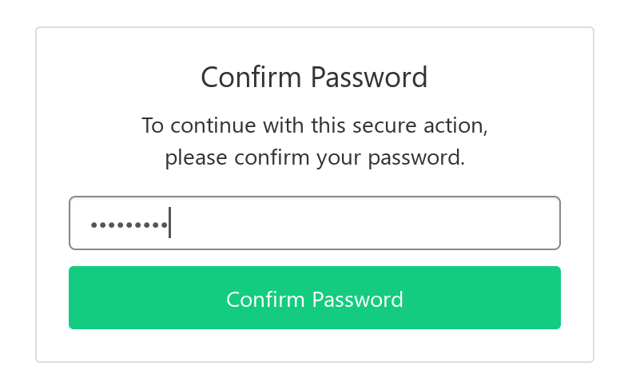
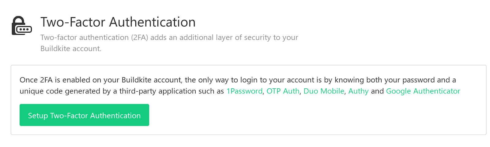
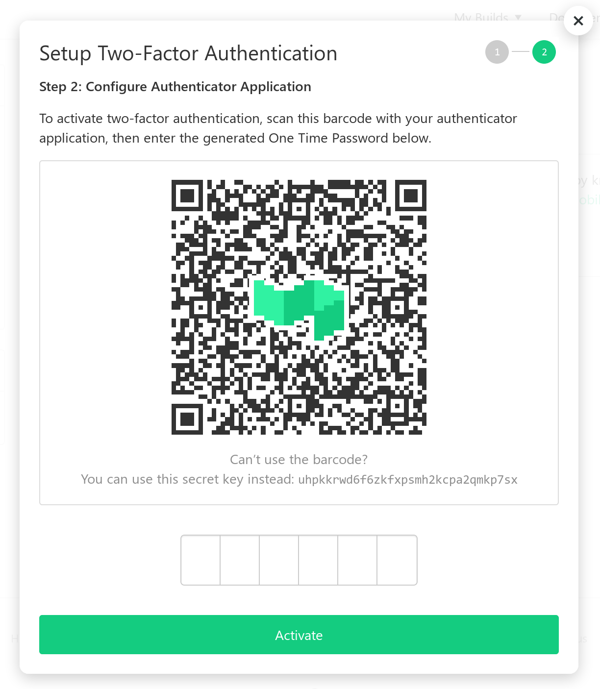
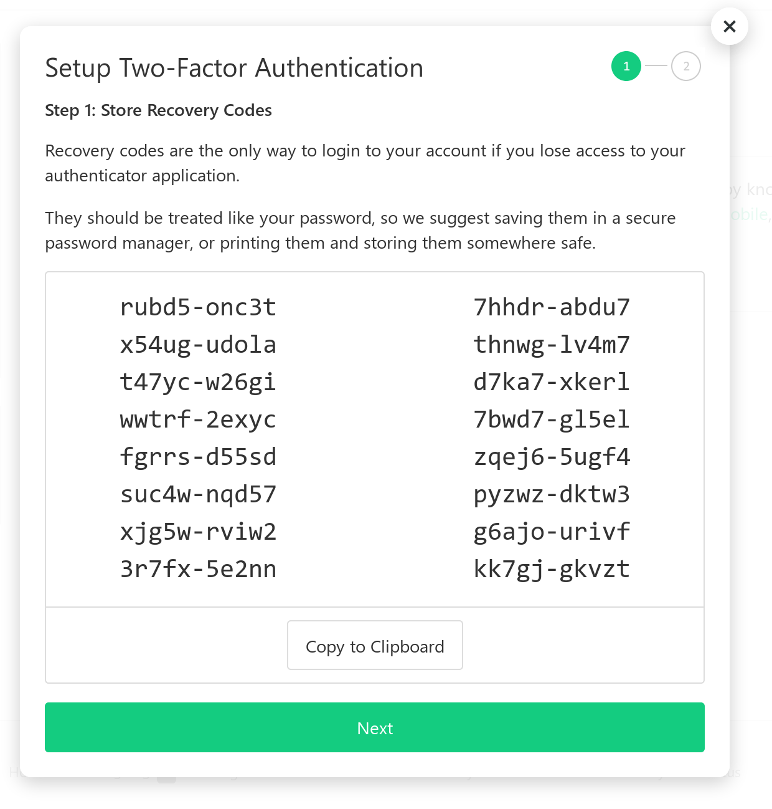

# Proposal for TOTP 2FA

(A high level proposal from @hawkowl, ported from https://docs.google.com/document/d/1CxQGq94rerRs6Z9u0LkTJNqge0l11aPLvfHYa_bsT8M)

## Proposal

TOTP is an implementation of a time-based one time password. It is commonly
used as a secure two-factor method, preventing unauthorised access to
accounts. It’s one of the simplest and most effective methods for increasing
user security against password brute-forcing and reuse. It would be a valuable
feature in homeservers.

## Required Extra Functionality

 * Generating a TOTP key and storing it
 * (optional but expected) Generating one-use ‘backup keys’
 * Removing a TOTP key (with use of password for verification)
 * TOTP request on login, as an added login flow item
 * TOTP request looks at first the saved TOTP key, and then the user’s backup keys. If a backup key is used, it is deleted and cannot be reused.

## Potential API

`GET /_matrix/client/r0/user/{user_id}/totp`

Get TOTP status. Does not return the TOTP key. Used for UI
Returns: `{"enabled": true/false}`

`POST /_matrix/client/r0/user/{user_id}/totp`

Provision a new TOTP key. Require password as a parameter (?). Maybe include unencoded PNG QR code?
Returns: `{"totp_key": "keyhere", "backup_keys": ["a", "b", "c"]}`

`DELETE /_matrix/client/r0/user/{user_id}/totp`
Remove TOTP from the account. Require password as a parameter (?)

New authentication step: `m.login.totp`

Auth dict:
```json
{
  "type": "m.login.totp",
  "response": "123456",
  "session": "<session ID>"
}
```

## Example UIs




