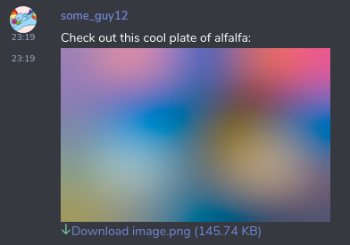
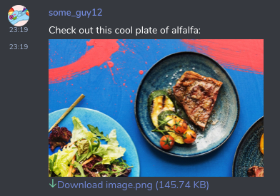
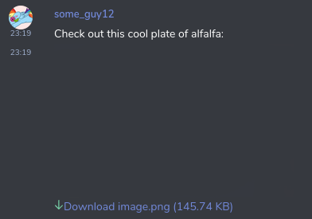

# MSC2448: Using BlurHash as a Placeholder for Media in Matrix

[BlurHash](https://blurha.sh) is a compact representation of a placeholder
for an image (or the frame of a video). Currently in Matrix, clients must
display a placeholder image in the message timeline while a piece of media is
loading. Some clients, such as Element, simply display an empty space.

While thumbnails exist to combat this to some degree, they still need to be
downloaded from a homeserver, which is not instantaneous.

Instead, a BlurHash can be sent inside the `m.room.message` event, which upon
receipt other clients can render for a pretty preview while the actual
thumbnail downloads. They also do not contain any `"` characters, making them
simple to stick inside existing JSON blobs.

To be clear: A BlurHash does not replace a thumbnail - it will be shown
before the thumbnail is downloaded.

## Proposal

### m.room.message

A optional field is added in `m.room.message`'s `content.info` dictionary
with the key `blurhash`. It is a BlurHash of the original piece of media.
Clients could then render this using [one of the available BlurHash
implementations](https://github.com/woltapp/blurhash).

This would be optionally displayed while the thumbnail of the media is loaded
in parallel.

Example `m.room.message` content:

```json
{
  "body": "image.png",
  "info": {
    "size": 149234,
    "mimetype": "image/png",
    "thumbnail_info": {
      "w": 301,
      "h": 193,
      "mimetype": "image/png",
      "size": 72958
    },
    "w": 301,
    "h": 193,
    "thumbnail_url": "mxc://example.org/abcdefg",
    "blurhash": "JadR*.7kCMdnj"
  },
  "msgtype": "m.image",
  "url": "mxc://example.org/abcde",
}
```

Note that a BlurHash representation is really only applicable to media, and
as such should only be used in conjunction with the following
`m.room.message` msgtypes:

* `m.image`
* `m.video`

### m.sticker

An optional field is added to `m.sticker`'s `content.info` dictionary with
the key `blurhash`. Its value is a BlurHash of the sticker media.

Example `m.sticker` content:

```json
{
  "body": "Landing",
  "info": {
    "h": 200,
    "mimetype": "image/png",
    "size": 73602,
    "thumbnail_info": {
      "h": 200,
      "mimetype": "image/png",
      "size": 73602,
      "w": 140
    },
    "thumbnail_url": "mxc://matrix.org/sHhqkFCvSkFwtmvtETOtKnLP",
    "w": 140,
    "blurhash": "JadR*.7kCMdnj"
  },
  "url": "mxc://matrix.org/sHhqkFCvSkFwtmvtETOtKnLP"
}
```

### m.room.avatar

Room avatars having BlurHashes available will be especially useful when
viewing a server's Public Rooms directory.

An optional field is added to `m.room.avatar`'s `content` dictionary with the
key `blurhash`. Its value is a BlurHash of the media that is pointed to by
`url`.

Example `m.room.avatar` content:

```json
{
  "url": "mxc://amorgan.xyz/a59ee02f180677d83d1b57d366127f8e1afdd4ed",
  "blurhash": "JadR*.7kCMdnj"
}
```

### m.room.member

Much like room avatars, user avatars can have BlurHashes as well. There is a
little more required to implement this, but the outcome of no longer having
missing avatars upon opening a room is worthwhile.

An optional field is added to `m.room.member`'s `content` dictionary with
the key `blurhash`. Its value is a BlurHash of the media that is pointed
to by `avatar_url`.

Note that `blurhash` SHOULD be omitted if `avatar_url` is not present.

Example `m.room.member` event content:

```json
{
  "avatar_url": "mxc://example.org/SEsfnsuifSDFSSEF",
  "displayname": "Alice Margatroid",
  "membership": "join",
  "blurhash": "JadR*.7kCMdnj"
}
```

### Profile endpoints

Endpoints that return profile information, and thus MXC URLs to user avatars, are
extended to optionally include BlurHashes as well.

[`GET /_matrix/client/r0/profile/{userId}`](https://matrix.org/docs/spec/client_server/r0.6.1#get-matrix-client-r0-profile-userid) has an optional field added with
the key `blurhash`. Its value is a BlurHash of the media that is pointed to
by `avatar_url`. `blurhash` MUST be omitted if `avatar_url` is not present.
The same applies to [`GET /_matrix/client/r0/profile/{userId}/avatar_url`](https://matrix.org/docs/spec/client_server/r0.6.1#get-matrix-client-r0-profile-userid-avatar-url), and to the federation endpoint [`GET /_matrix/federation/v1/query/profile`](https://matrix.org/docs/spec/server_server/r0.1.4#get-matrix-federation-v1-query-profile).

[`PUT /_matrix/client/r0/profile/{userId}/avatar_url`](https://matrix.org/docs/spec/client_server/r0.6.1#put-matrix-client-r0-profile-userid-avatar-url) has an optional field added
to the request body with the key `blurhash`. Its value is a BlurHash of the media that is pointed to by the value of the `avatar_url` field in the same request.

### URL previews

An optional attribute is added to the OpenGraph data returned by a call
to
[`GET /_matrix/media/r0/preview_url`](https://matrix.org/docs/spec/client_server/r0.6.1#get-matrix-media-r0-preview-url)
called `matrix:image:blurhash`. The value
of this attribute is the blurhash representation of the media specified
by `og:image`.

Note that `matrix:image:blurhash` MUST be omitted if `og:image` is not present
in the response.

Example response to `GET /_matrix/media/r0/preview_url`:

```json
{
  "og:title": "Matrix Blog Post",
  "og:description": "This is a really cool blog post from matrix.org",
  "og:image": "mxc://example.com/ascERGshawAWawugaAcauga",
  "og:image:type": "image/png",
  "og:image:height": 48,
  "og:image:width": 48,
  "matrix:image:size": 102400,
  "matrix:image:blurhash": "oyp8ky2BWn7VHEL"
}
```

### Inline images

An optional attribute is added to `` tags in messages:
`data-mx-blurhash`, where the value of the attribute is the blurhash
representation of the inline image.

This would be optionally displayed while the inline image itself is loaded in
parallel.

Example `m.room.message.formatted_body`:

```
"formatted_body": This is awesome 
```

## Calculating a blurhash

BlurHashes are inserted into `m.room.message` events by the client, however
some clients may not be able to implement the BlurHash library for whatever
reason. In this case, it would be nice to allow the media repository to
calculate the BlurHash of a piece of media for the client, similar to how
thumbnails are calculated by media repositories today.

The
[`/_matrix/media/r0/upload`](https://matrix.org/docs/spec/client_server/r0.6.0#post-matrix-media-r0-upload)
endpoint response is modified to include an optional `blurhash` key,
which the client may use to insert into messages if desired:

Example response:

```
{
  "content_uri": "mxc://example.com/abcde123",
  "blurhash": "LKO2?U%2Tw=w]~RB"
}
```

Servers will obviously not be able to return a BlurHash string for encrypted
media.

In addition, the server can return the BlurHash string for an image when
given an MXC URL. This would be through something like the Media Information
API (specified in
[MSC2380](https://github.com/matrix-org/matrix-doc/pull/2380)), or similar.

## Visualisation

Viewing an image message that is loading:



Once the image loads:



For reference, the current state of things in Element is:



## Alternatives

We could include a base64 thumbnail of the image in the event, but blurhash
produces much more efficient textual representations.

## Backwards compatibility

Older clients would ignore the new `blurhash` parameter.

Newer clients would only show it if it exists.

Users who have not specified `blurhash` in their `m.room.member` event yet may
stand out from users who have while both are loading. This is entirely up to
clients to handle, though a suggestion may be to "fake" a blurhash by
blurring some placeholder image (perhaps something with variation between
users like Element's coloured backgrounds with letters in them, or [an
identicon](https://en.wikipedia.org/wiki/Identicon) derived from the user's
ID) until the user's actual avatar loads.

## Unstable prefixes

Implementations wishing to add this before this MSC is merged can do so with
the following:

* The `blurhash` key in any events, request or response bodies should be
replaced with `xyz.amorgan.blurhash`.

* `/_matrix/media/r0/upload` should return a `xyz.amorgan.blurhash` key
containing the blurhash instead of `blurhash`. This is preferred to adding
another endpoint, which is messier to later remove.

* The `data-mx-blurhash` attribute in `` tags should be replaced with
`data-xyz-amorgan-blurhash`.

* And finally, an entry should be added to the homeserver's `GET
/_matrix/client/versions` endpoint, in `unstable_features`, with the key
`xyz.amorgan.blurhash` set to `true`.

## Security considerations

Blurhash entries in encrypted events, be it as part of the `info` property,
or `` tags, should be encrypted along with the rest of the event
content.

## Links

BlurHash's algorithm description can be found
[here](https://github.com/woltapp/blurhash/blob/master/Algorithm.md), which
also includes the full output character set.
