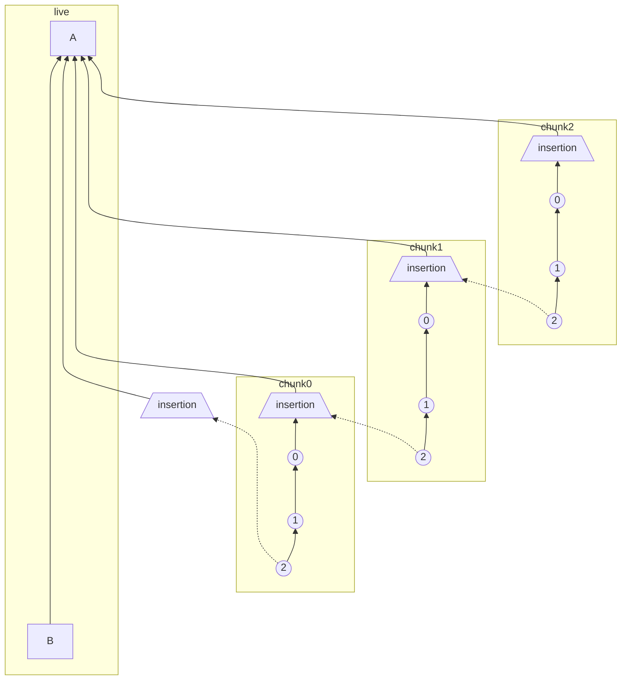

# MSC2716: Batch send historical messages

For the full problem statement, considerations, see the other `proposals/2716-importing-history-into-existing-rooms.md` document. Happy to merge the two, once we get more feedback on it.

## Alternative batch send proposal


### Expectation

Historical messages that we insert should appear in the timeline just like they would if they were sent back at that time.

Here is what scrollback is expected to look like in Element:


### New batch send approach

Add a new endpoint, `POST /_matrix/client/unstable/org.matrix.msc2716/rooms/<roomID>/batch_send?prev_event=<eventID>&chunk_id=<chunkID>`, which can insert a chunk of events historically back in time next to the given `prev_event`. `chunk_id` comes from `next_chunk_id` in the response of the batch send endpoint and is derived from the "insertion" events added to each chunk. It's not required for the first batch send.
```
# Body
{
    "events": [ ... ],
    "state_events_at_start": [ ... ]
}

# Response
{
  "state_events": [...list of state event ID's we inserted],
  "events": [...list of historical event ID's we inserted],
  "next_chunk_id": "random-unique-string",
}
```

`state_events_at_start` is used to define the historical state events needed to auth the `events` like join events. These events can float outside of the normal DAG. In Synapse, these are called `outlier`'s and won't be visible in the chat history which also allows us to insert multiple chunks without having a bunch of `@mxid joined the room` noise between each chunk.

`events` is chronological chunk/list of events you want to insert. For Synapse, there is a reverse-chronological constraint on chunks so once you insert one chunk of messages, you can only insert older an older chunk after that. tldr; Insert from your most recent chunk of history -> oldest history.

The `state_events`/`events` payload is in **chronological** order (`[0, 1, 2]`) and is processed it in that order so the `prev_events` point to it's older-in-time previous message which is more sane in the DAG. **Depth discussion:** For Synapse, when persisting, we **reverse the list (to make it reverse-chronological)** so we can still get the correct `(topological_ordering, stream_ordering)` so it sorts between A and B as we expect. Why?  `depth` is not re-calculated when historical messages are inserted into the DAG. This means we have to take care to insert in the right order. Events are sorted by `(topological_ordering, stream_ordering)` where `topological_ordering` is just `depth`. Normally, `stream_ordering` is an auto incrementing integer but for `backfilled=true` events, it decrements. Historical messages are inserted all at the same `depth`, and marked as backfilled so the `stream_ordering` decrements and each event is sorted behind the next. (from https://github.com/matrix-org/synapse/pull/9247#discussion_r588479201)

With the new process, the DAG will look like:


Next we add "insertion" and "marker" events into the mix so that federated remote servers can also navigate and to know where/how to fetch historical messages correctly.

To lay out the different types of servers consuming these historical messages (more context on why we need "marker"/"insertion" events):

 1. Local server
    - This can pretty much work out of the box. Just add the events to the database and they're available. The new endpoint is just a mechanism to insert the events.
 1. Federated remote server that already has all scrollback history and then new history is inserted
    - The big problem is how does a HS know it needs to go fetch more history if they already fetched all of the history in the room? We're solving this with "marker" events which are sent on the "live" timeline and point back to the event where we inserted history next to. The HS can then go and backfill the "insertion" event and continue navigating the chunks from there.
 1. Federated remote server that joins a new room with historical messages
    - We need to update the `/backfill` response to include historical messages from the chunks
 1. Federated remote server already in the room when history is inserted
    - Depends on whether the HS has the scrollback history for where the history was inserted at. If already has all history, see scenario 2, if doesn't, see scenario 3.
 1. For federated servers already in the room that haven't implemented MSC2716
    - Those homeservers won't have historical messages available because they're unable to navigate the marker/insertion events. But the historical messages would be available once the HS implements MSC2716 and processes the "marker" events that point to the history.


### New approach with "insertion" events

 - With "insertion" events, we just add them to the start of each chronological chunk (where the oldest message in the chunk is). The next older in time chunk can connect to that "insertion" point from the previous chunk.
 - The initial "insertion" event could be from the main DAG or we can create it ad-hoc in the first chunk so the homeserver can start traversing up the chunk from there after a "marker" event points to it. In subsequent chunks, we can already traverse from the insertion event it points to.
 - Consideration: the "insertion" events add a new way for an application service to tie the chunk reconciliation in knots(similar to the DAG knots that can happen).


[Mermaid live editor playground link](https://mermaid-js.github.io/mermaid-live-editor/edit/#eyJjb2RlIjoiZmxvd2NoYXJ0IEJUXG4gICAgc3ViZ3JhcGggbGl2ZVxuICAgICAgICBCIC0tLS0tLS0tLS0tLT4gQVxuICAgIGVuZFxuICAgIFxuICAgIHN1YmdyYXBoIGNodW5rMFxuICAgICAgICBjaHVuazAtMigoXCIyXCIpKSAtLT4gY2h1bmswLTEoKDEpKSAtLT4gY2h1bmswLTAoKDApKSAtLT4gY2h1bmswLWluc2VydGlvblsvaW5zZXJ0aW9uXFxdXG4gICAgZW5kXG5cbiAgICBzdWJncmFwaCBjaHVuazFcbiAgICAgICAgY2h1bmsxLTIoKFwiMlwiKSkgLS0-IGNodW5rMS0xKCgxKSkgLS0-IGNodW5rMS0wKCgwKSkgLS0-IGNodW5rMS1pbnNlcnRpb25bL2luc2VydGlvblxcXVxuICAgIGVuZFxuICAgIFxuICAgIHN1YmdyYXBoIGNodW5rMlxuICAgICAgICBjaHVuazItMigoXCIyXCIpKSAtLT4gY2h1bmsyLTEoKDEpKSAtLT4gY2h1bmsyLTAoKDApKSAtLT4gY2h1bmsyLWluc2VydGlvblsvaW5zZXJ0aW9uXFxdXG4gICAgZW5kXG5cbiAgICBcbiAgICBjaHVuazAtaW5zZXJ0aW9uQmFzZVsvaW5zZXJ0aW9uXFxdIC0tLS0tLS0-IEFcbiAgICBjaHVuazAtMigoXCIyXCIpKSAtLi0-IGNodW5rMC1pbnNlcnRpb25CYXNlWy9pbnNlcnRpb25cXF1cbiAgICBjaHVuazAtaW5zZXJ0aW9uIC0tLS0tLS0-IEFcbiAgICBjaHVuazEtaW5zZXJ0aW9uIC0tPiBBXG4gICAgY2h1bmsxLTIgLS4tPiBjaHVuazAtaW5zZXJ0aW9uXG4gICAgY2h1bmsyLWluc2VydGlvbiAtLT4gQVxuICAgIGNodW5rMi0yIC0uLT4gY2h1bmsxLWluc2VydGlvbiIsIm1lcm1haWQiOiJ7fSIsInVwZGF0ZUVkaXRvciI6dHJ1ZSwiYXV0b1N5bmMiOnRydWUsInVwZGF0ZURpYWdyYW0iOnRydWV9)
<details>
<summary>mermaid graph syntax</summary>



</details>


The structure of the insertion event would look like:
```js
{
  "type": "m.room.insertion",
  "sender": "@example:example.org",
  "content": {
    "m.next_chunk_id": next_chunk_id,
    "m.historical": True,
  },
  # Since the insertion event is put at the start of the chunk,
  # where the oldest event is, copy the origin_server_ts from
  # the first event we're inserting
  "origin_server_ts": events_to_create[0]["origin_server_ts"],
}
```


### "Marker" events

 - A "marker" event points simply back to an "insertion" event.
 - The "marker" event solves the problem of, how does a federated homeserver know about the historical events which won't come down incremental sync? And the scenario where the federated HS already has all the history in the room, so it won't do a full sync of the room again.
 - Unlike the historical events, the "marker" event is sent as a normal event on the "live" timeline so that comes down incremental sync and is available to all homeservers regardless of how much scrollback history they already have.
 - A "marker" event is not needed for every chunk/batch of historical messages. Multiple chunks can be inserted then once we're done importing everything, we can add one "marker" event pointing at the root "insertion" point
    - If more history is decided to be added later, another "marker" can be sent to let the homeservers know again.
 - When a remote federated homeserver, receives a "marker" event, it can mark the "insertion" prev events as needing to backfill from that point again and can fetch the historical messages when the user scrolls back to that area in the future.  For Synapse, we plan to add the details to the `insertion_event_lookups` table. 
    - In Synapse, we discussed not wanting to fetch the "insertion" event when the "marker" comes down the pipe but I've realized that in order to store `insertion_prev_event_id` in the table, we either need to a) add it as part of the "marker" event which works to not fetch anything additional or b) backfill just the "insertion" event to get it. I think I am going to opt for option A though. The plan is to add a new `insertion_event_lookups` table to store which events are marked as insertion points. It stores, `insertion_event_id` and `insertion_prev_event_id` and when we scrollback over `insertion_prev_event_id` again, we trigger some backfill logic to go fetch it. Similar to the `event_backward_extremities` already implemented.
 - We could remove the need for "marker" events if we decided to only allow sending "insertion" events on the "live" timeline at any point where you would later want to add history.  But this isn't compatible with our dynamic insertion use cases like Gitter where the rooms are already created (no "insertion" event at the start of the room), and the examples from this MSC like NNTP (newsgroup) and email which can potentially want to branch off of everything.

So the structure of the "marker" event would look like:
```js
{
    "type": "m.room.marker",
    "sender": "@example:example.org",
    "content": {
        "m.insertion_id": insertion_event.event_id,
        "m.insertion_prev_events": insertion_event.prev_events,
    },
    "room_id": "!jEsUZKDJdhlrceRyVU:example.org"
}
```


