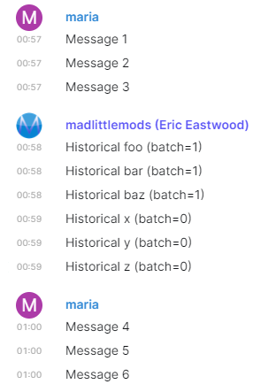
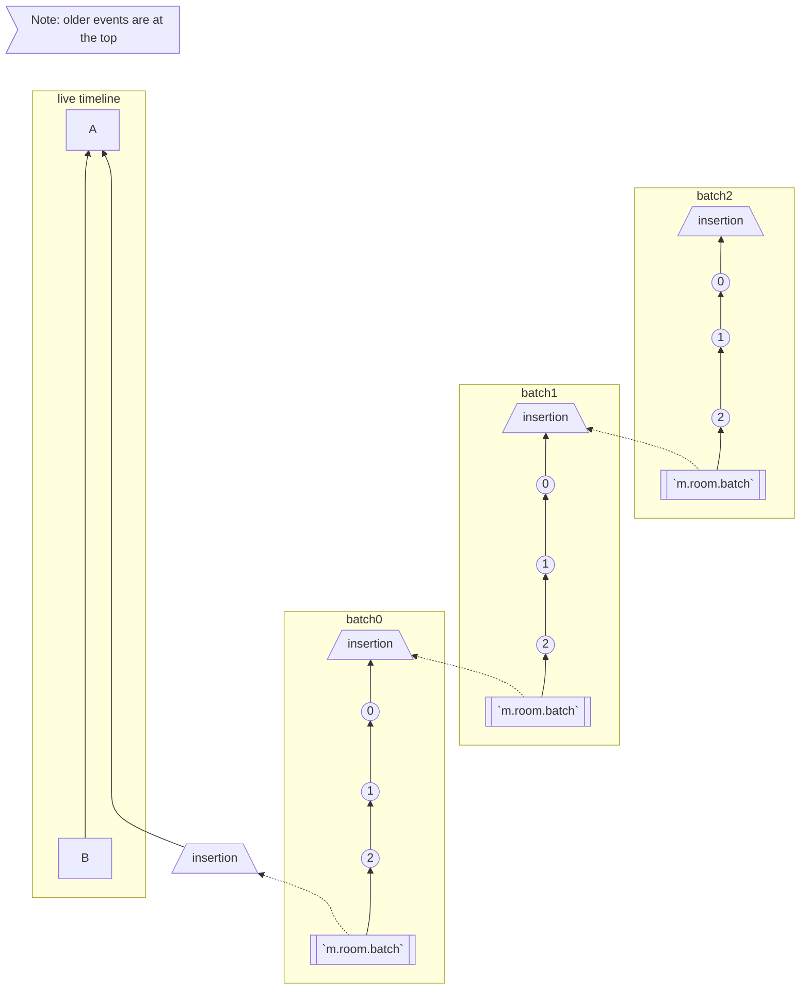
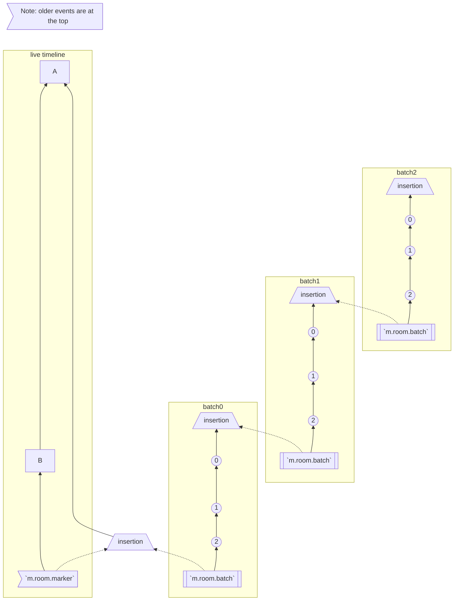
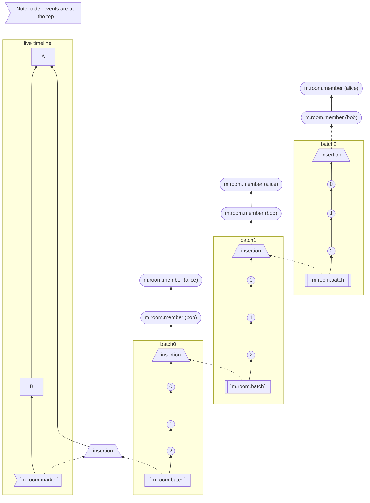

# MSC2716: Incrementally importing history into existing rooms

## Problem

Matrix has historically been unable to easily import existing history into a
room that already exists. This is a major problem when bridging existing
conversations into Matrix, particularly if the scrollback is being
incrementally or lazily imported.

For instance, an NNTP bridge might work by letting a user join a room that
maps to a given newsgroup, first showing an empty room, and then importing the
most recent 1000 newsgroup posts for that room to flesh out some history.  The
bridge might then choose to slowly import additional posts for that newsgroup
in the background, until however many decades of backfill were complete.
Finally, as more archives surface, they might also need to be manually
gradually added into the history of the room - slowly building up the complete
history of the conversations over time.

This is currently not supported because:
 * There is no way to create messages in the context of historical room state in
   a room via CS or AS API - you can only create events relative to current room
   state.
 * It is possible to override the timestamp with the `?ts` query parameter
   ([timestamp
   massaging](](https://spec.matrix.org/v1.3/application-service-api/#timestamp-massaging)))
   using the AS API but the event will still be appended to the tip of the DAG.
   It's not possible to change the DAG ordering with this.


## Expectation

Historical messages that we import should appear in the timeline just like they
would if they were sent back at that time. In the example below, Maria's
messages 1-6 were sent originally in the room and the "Historical" messages in
the middle were imported after the fact.

Here is what scrollback is expected to look like in Element:




## Proposal

### `historical` `content` property on any event

A new `historical` property is defined which can be included in the content of any
event to indicate it was retrospectively imported.

key | type | value | description | Required
--- | --- | --- | --- | ---
`historical` | bool | `true` | Used on any event to hint that it was historically imported after the fact. This field should just be omitted if `false`. | no


### `m.room.insertion`

Events that mark points in time where you can insert historical messages.

**`m.room.insertion` event `content` field definitions:**

key | type | value | description | required
--- | --- | --- | --- | ---
`next_batch_id` | string | randomly generated string | This is a random unique string that the next `m.room.batch` event should specify in order to connect to it. | yes

A full example of the `m.room.insertion` event:
```json5
{
  "type": "m.room.insertion",
  "sender": "@appservice:example.org",
  "content": {
    "next_batch_id": "w25ljc1kb4",
    "historical": true
  },
  "event_id": "$insertionabcd:example.org",
  "room_id": "!jEsUZKDJdhlrceRyVU:example.org",
  // Doesn't affect much but good to use the same time as the closest event
  "origin_server_ts": 1626914158639
}
```

### `m.room.batch`

This is what connects one historical batch to the other. In the DAG, we navigate
from an insertion event to the batch event that points at it, up the historical
messages to the next insertion event, then repeat the process.

**`m.room.batch` event `content` field definitions:**

key | type | value | description | required
--- | --- | --- | --- | ---
`batch_id` | string | A batch ID from an insertion event | Used to indicate which `m.room.insertion` event it connects to by its `next_batch_id` field. | yes

A full example of the `m.room.batch` event:
```json5
{
  "type": "m.room.batch",
  "sender": "@appservice:example.org",
  "content": {
    "batch_id": "w25ljc1kb4",
    "historical": true
  },
  "event_id": "$batchabcd:example.org",
  "room_id": "!jEsUZKDJdhlrceRyVU:example.org",
  // Doesn't affect much but good to use the same time as the closest event
  "origin_server_ts": 1626914158639
}
```


### `m.room.marker`

State event used to hint to homeservers that there is new
history back in time that you should go fetch next time someone scrolls back
around the specified insertion event. Also used on clients to cache bust the
timeline.

**`m.room.marker` event `content` field definitions:**

key | type | value | description | required
--- | --- | --- | --- | ---
`insertion_event_reference` | string | Another `event_id` | Used to point at an `m.room.insertion` event by its `event_id`. | yes

A full example of the `m.room.marker` event:
```json5
{
    "type": "m.room.marker",
    "state_key": "<some-unique-state-key>",
    "sender": "@appservice:example.org",
    "content": {
        "insertion_event_reference": "$insertionabcd:example.org"
    },
    "event_id": "$markerabcd:example.org",
    "room_id": "!jEsUZKDJdhlrceRyVU:example.org",
    "origin_server_ts": 1626914158639,
}
```


### New historical batch send endpoint

Add a new endpoint, `POST
/_matrix/client/v1/org.matrix.msc2716/rooms/<roomID>/batch_send?prev_event_id=<eventID>&batch_id=<batchID>`,
which can insert a batch of events historically back in time next to the given
`?prev_event_id` (required). This endpoint can only be used by application
services. `?batch_id` is not required for the first batch send and is only
necessary to connect the current batch to the previous.

This endpoint handles the complexity of creating `m.room.insertion` and `m.room.batch` events.
All the application service has to do is use `?batch_id` which comes from
`next_batch_id` in the response of the batch send endpoint to connect batches
together. `next_batch_id` is derived from the insertion events added to each
batch.

Request body:
```json
{
    "state_events_at_start": [{
      "type": "m.room.member",
      "sender": "@someone:matrix.org",
      "origin_server_ts": 1628277690333,
      "content": {
          "membership": "join"
      },
      "state_key": "@someone:matrix.org"
    }],
    "events": [
      {
        "type": "m.room.message",
        "sender": "@someone:matrix.org",
        "origin_server_ts": 1628277690333,
        "content": {
          "msgtype": "m.text",
          "body": "Historical message1"
        },
      },
      {
        "type": "m.room.message",
        "sender": "@someone:matrix.org",
        "origin_server_ts": 1628277690334,
        "content": {
          "msgtype": "m.text",
          "body": "Historical message2"
        },
      }
    ],
}
```

Request response:
```json5
{
  // List of state event ID's we inserted
  "state_event_ids": [
    // member state event ID
  ],
  // List of historical event ID's we inserted
  "event_ids": [
    // historical message1 event ID
    // historical message2 event ID
  ],
  "next_batch_id": "random-unique-string",
  "insertion_event_id": "$X9RSsCPKu5gTVIJCoDe6HeCmsrp6kD31zXjMRfBCADE",
  "batch_event_id": "$kHspK8a5kQN2xkTJMDWL-BbmeYVYAloQAA9QSLOsOZ4",
  // When `?batch_id` isn't provided, the homeserver automatically creates an
  // insertion event as a starting place to hang the history off of. This automatic
  // insertion event ID is returned in this field.
  //
  // When `?batch_id` is provided, this field is not present because we can hang
  // the history off the insertion event specified and associated by the batch ID.
  "base_insertion_event_id": "$pmmaTamxhcyLrrOKSrJf3c1zNmfvsE5SGpFpgE_UvN0"
}
```

`state_events_at_start` is unioned with the state at the `prev_event_id` and is
used to define the historical state events needed to auth the `events` like
invite and join events. These events can float outside of the normal DAG. In
Synapse, these are called `outlier`s and won't be visible in the chat history
which also allows us to insert multiple batches without having a bunch of `@mxid
joined the room` noise between each batch. **The state will not be resolved into
the current state of the room.**

`events` is a chronological list of events you want to insert. It's possible to
also include `state_events` here which will be used to auth further events in
the batch. For Synapse, there is a reverse-chronological constraint on batches
so once you insert one batch of messages, you can only insert an older batch
after that. For more information on this Synapse constraint, see the ["Depth
discussion"](#depth-discussion) below. **tldr; Insert from your most recent
batch of history -> oldest history.**

One aspect that isn't solved yet is how to handle relations/annotations (such as
reactions, replies, and threaded conversations) that reference each other within
the same `events` batch because the events don't have `event_ids` to reference
before being persisted. A solution for this can be proposed in another MSC.


#### What does the batch send endpoint do behind the scenes?

This section explains the homeserver magic that happens when someone uses the
`/batch_send` endpoint. If you're just trying to understand how the `m.room.insertion`,
`m.room.batch`, `m.room.marker` events work, you might want to just skip down to the room DAG
breakdown which incrementally explains how everything fits together.

 1. A `m.room.insertion` event for the batch is added to the start of the batch.
    This will be the starting point of the next batch and holds the `next_batch_id`
    that we return in the batch send response. The application service passes
    this as `?batch_id` next time to continue the chain of historical messages.
 1. A `m.room.batch` event is added to the end of the batch. This is the event
    that connects to an `m.room.insertion` event by specifying a `batch_id` that
    matches the `next_batch_id` on the `m.room.insertion` event.
 1. If `?batch_id` is not specified (usually only for the first batch), create a
    base `m.room.insertion` event as a jumping off point from `?prev_event_id` which can
    be added to the end of the `events` list in the response.
 1. All of the events in the historical batch get a content field,
    `"historical": true`, to indicate that they are historical at the point of
    being added to a room.
 1. The `state_events_at_start`/`events` payload is in **chronological** order
    (`[0, 1, 2]`) and is processed in that order so the `prev_events` point to
    it's older-in-time previous message which gives us a nice straight line in
    the DAG.
    - <a name="depth-discussion"></a>**Depth discussion:** For Synapse, when
      persisting, we **reverse the list (to make it reverse-chronological)** so
      we can still get the correct `(topological_ordering, stream_ordering)` so
      it sorts between A and B as we expect. Why?  `depth` (or the
      `topological_ordering`) is not re-calculated when historical messages are
      inserted into the DAG. This means we have to take care to insert in the
      right order. Events are sorted by `(topological_ordering,
      stream_ordering)` where `topological_ordering` is just `depth`. Normally,
      `stream_ordering` is an auto incrementing integer but for
      `backfilled=true` events, it decrements. Since historical messages are
      inserted all at the same `depth`, the only way we can control the ordering
      in between is the `stream_ordering`. Historical messages are marked as
      backfilled so the `stream_ordering` decrements and each event is sorted
      behind the next. (from
      https://github.com/matrix-org/synapse/pull/9247#discussion_r588479201)


### Power levels

Since events being silently sent in the past is hard to moderate, it will
probably be good to limit who can add historical messages to the timeline. The
batch send endpoint is already limited to application services but we also need
to limit who can send `m.room.insertion`, `m.room.batch`, and `m.room.marker` events since someone
can attempt to send them via the normal `/send` API (we don't want any nasty
weird knots to reconcile either).

 - `historical`: A new top-level field in the `content` dictionary of the room's
    power levels, controlling who can send `m.room.insertion`, `m.room.batch`,
    and `m.room.marker` events in the room.

### Room version

The new `historical` power level necessitates a new room version (changes the structure of `m.room.power_levels`).

The redaction algorithm changes is also hard requirement for a new room
version because we need to make sure when redacting, we only strip out fields
without affecting anything at the protocol level. This means that we need to
keep all of the structural fields that allow us to navigate the batches of
history in the DAG. We also only want to auth events against fields that
wouldn't be removed during redaction. In practice, this means:

 - When redacting `m.room.insertion` events, keep the `next_batch_id` content field around
 - When redacting `m.room.batch` events, keep the `batch_id` content field around
 - When redacting `m.room.marker` events, keep the `insertion_event_reference` content field around
 - When redacting `m.room.power_levels` events, keep the `historical` content field around


#### Backwards compatibility with existing room versions

However, this MSC is mostly backwards compatible and can be used with the
current room version with the fact that redactions aren't supported for
`m.room.insertion`, `m.room.batch`, `m.room.marker` events. We can protect
people from this limitation by throwing an error when they try to use [`PUT
/_matrix/client/v3/rooms/{roomId}/redact/{eventId}/{txnId}`](https://spec.matrix.org/v1.3/client-server-api/#put_matrixclientv3roomsroomidredacteventidtxnid)
to redact one of those events. We would have to accept the redaction if
it came over federation to avoid split-brained rooms.

Because we also can't use the `historical` power level for controlling who can
send these events in the existing room version, we always persist but instead
only process and give meaning to the `m.room.insertion`, `m.room.batch`, and
`m.room.marker` events when the room `creator` sends them. This caveat/rule only
applies to existing room versions.


### Room DAG breakdown

#### `m.room.insertion` and `m.room.batch` events

We use `m.room.insertion` and `m.room.batch` events to describe how each historical batch
should connect to each other and how the homeserver can navigate the DAG.

 - With `m.room.insertion` events, we just add them to the start of each chronological
   batch (where the oldest message in the batch is). The next older-in-time
   batch can connect to that `m.room.insertion` event from the previous batch.
 - The initial base `m.room.insertion` event could be from the main DAG or we can
   create it ad-hoc in the first batch. In the latter case, a `m.room.marker` event
   (detailed below) inserted into the main DAG can be used to point to the new
   `m.room.insertion` event.
 - `m.room.batch` events have a `next_batch_id` field which is used to indicate the
   `m.room.insertion` event that the batch connects to.

Here is how the historical batch concept looks like in the DAG:

 - `A <--- B` is any point in the DAG that we want to import between.
 - `A` is the oldest-in-time message
 - `B` is the newest-in-time message
 - `batch0` is the first batch we try to import
 - Each batch of messages is older-in-time than the last (`batch1` is
   older-in-time than `batch0`, etc)




#### Adding marker events

Finally, we add `m.room.marker` state events into the mix so that federated remote
servers also know where in the DAG they should look for historical messages.

To lay out the different types of servers consuming these historical messages
(more context on why we need `m.room.marker` events):

 1. Local server
    - This pretty much works out of the box. It's possible to just add the
      historical events to the database and they're available. The new endpoint
      is just a mechanism to insert the events.
 1. Federated remote server that already has *all* scrollback history and then
    new history is inserted
    - The big problem is how does a HS know it needs to go fetch more history if
      they already fetched all of the history in the room? We're solving this
      with `m.room.marker` state events which are sent on the "live" timeline and point
      back to the `m.room.insertion` event where we inserted history next to. The HS
      can then go and backfill the `m.room.insertion` event and continue navigating the
      historical batches from there.
 1. Federated remote server that joins a new room with historical messages
    - The originating homeserver just needs to update the `/backfill` response
      to include historical messages from the batches.
 1. Federated remote server already in the room when history is inserted
    - Depends on whether the HS has the scrollback history. If the HS already
      has all history, see scenario 2, if doesn't, see scenario 3.
 1. For federated servers already in the room that haven't implemented MSC2716
    - Those homeservers won't have historical messages available because they're
      unable to navigate the `m.room.marker`/`m.room.insertion`/`m.room.batch` events. But the
      historical messages would be available once the HS implements MSC2716 and
      processes the `m.room.marker` events that point to the history.


---

 - A `m.room.marker` event simply points back to an `m.room.insertion` event.
 - The `m.room.marker` event solves the problem of, how does a federated homeserver
   know about the historical events which won't come down incremental sync? And
   the scenario where the federated HS already has all the history in the room,
   so it won't do a full sync of the room again.
 - Unlike the historical events sent via `/batch_send`, **the `m.room.marker` event is
   sent separately as a normal state event on the "live" timeline** so that
   comes down incremental sync and is available to all homeservers regardless of
   how much scrollback history they already have. And since it's state it never
   gets lost in a timeline gap and is immediately apparent to all servers that
   join.
 - Also instead of overwriting the same generic `state_key: ""` over and over,
   the expected behavior is send each `m.room.marker` event with a unique `state_key`.
   This way all of the "markers" are discoverable in the current state without
   us having to go through the chain of previous state to figure it all out.
   This also avoids potential state resolution conflicts where only one of the
   `m.room.marker` events win and we would lose the other chain history.
 - A `m.room.marker` event is not needed for every batch of historical messages added
   via `/batch_send`. Multiple batches can be inserted. Then once we're done
   importing everything, we can add one `m.room.marker` event pointing at the root
   `m.room.insertion` event
    - If more history is decided to be added later, another `m.room.marker` can be sent to let the homeservers know again.
 - When a remote federated homeserver receives a `m.room.marker` event, it can mark
   the `m.room.insertion` prev events as needing to backfill from that point again and
   can fetch the historical messages when the user scrolls back to that area in
   the future.




#### Add in the historical state

In order to show the display name and avatar for the historical messages,
the state provided by `state_events_at_start` needs to resolve when one of
the historical messages is fetched.

It's probably most semantic to have the historical state float outside of the
normal DAG in a chain by specifying no `prev_events` (empty `prev_events=[]`)
for the first one. Then the insertion event can reference the last piece in the
floating state chain.

In Synapse, historical state is marked as an `outlier`. As a result, the state
will not be resolved into the current state of the room, and it won't be visible
in the chat history. This allows us to insert multiple batches without having a
bunch of `@mxid joined the room` noise between each batch.




## Potential issues

Also see the security considerations section below.

This doesn't provide a way for a HS to tell an AS that a client has tried to
call `/messages` beyond the beginning of a room, and that the AS should try to
lazy-insert some more messages (as per
https://github.com/matrix-org/matrix-doc/issues/698). For this MSC to be
extra useful, we might want to flesh that out. Another related problem with
the existing AS query APIs is that they don't include who is querying,
so they're hard to use in bridges that require logging in. If a similar query
API is added here, it should include the ID of the user who's asking for
history.


## Alternatives

We could insist that we use the SS API to import history history in this manner
rather than extending the AS API.  However, it seems unnecessarily burdensome to
make bridge authors understand the SS API, especially when we already have so
many AS API bridges.  Hence these minor extensions to the existing AS API.

Another way of doing this is using the existing single send state and event API
endpoints. We could use `PUT /_matrix/client/r0/rooms/{roomId}/state/{eventType}/{stateKey}`
with `?historical=true` which would create the floating outlier state events.
Then we could use `PUT /_matrix/client/r0/rooms/{roomId}/send/{eventType}/{txnId}`,
with `?prev_event_id` pointing at that floating state to auth the event and where we
want to insert the event.

Another way of doing this might be to store the different eras of the room as
different versions of the room, using `m.room.tombstone` events to form a linked
list of the eras. This has the advantage of isolating room state between
different eras of the room, simplifying state resolution calculations and
avoiding risk of any cross-talk.  It's also easier to reason about, and avoids
exposing the DAG to bridge developers.  However, it would require better
presentation of room versions in clients, and it would require support for
retrospectively specifying the `predecessor` of the current room when you
retrospectively import history.  Currently `predecessor` is in the immutable
`m.room.create` event of a room, so cannot be changed retrospectively - and
doing so in a safe and race-free manner sounds hard. A big problem with this
approach is if you just want to inject a few old lost messages - eg if you're
importing a mail or newsgroup archive and you stumble across a lost mbox with a
few msgs in retrospect, you wouldn't want or be able to splice a whole new room
in with tombstones.

Another way could be to let the server who issued the `m.room.create` also go
and retrospectively insert events into the room outside the context of the DAG
(i.e. without parent prev_events or signatures).  To quote the original
[bug](https://github.com/matrix-org/matrix-doc/issues/698#issuecomment-259478116):

> You could just create synthetic events which look like normal DAG events but
  exist before the m.room.create event. Their signatures and prev-events would
  all be missing, but they would be blindly trusted based on the HS who is
  allowed to serve them (based on metadata in the m.room.create event). Thus
  you'd have a perimeter in the DAG beyond which events are no longer
  decentralised or signed, but are blindly trusted to let HSes insert ancient
  history provided by ASes.

However, this feels needlessly complicated if the DAG approach is sufficient.


## Security considerations

The `m.room.insertion` and `m.room.batch` events add a new way for an application service to
tie the batch reconciliation in knots(similar to the DAG knots that can happen)
which can potentially DoS message and backfill navigation on the server.

This also makes it much easier for an AS to maliciously spoof history.  This is
a bit unavoidable given the nature of the feature, and is also possible today
via SS API.


## Unstable prefix

Servers will indicate support for the new endpoint via a `true` value for feature flag
`org.matrix.msc2716` in `unstable_features` in the response to `GET
/_matrix/client/versions`.

**Endpoints:**

 - `POST /_matrix/client/unstable/org.matrix.msc2716/rooms/<roomID>/batch_send`

**Event types:**

 - `org.matrix.msc2716.insertion`
 - `org.matrix.msc2716.batch`
 - `org.matrix.msc2716.marker`

**Content fields:**

 - `org.matrix.msc2716.historical`

**Room version:**

 - `org.matrix.msc2716` and `org.matrix.msc2716v2`, etc as we develop and
   iterate along the way

**Power level:**

 - `historical` (does not need prefixing because it's already under an
   experimental room version)
