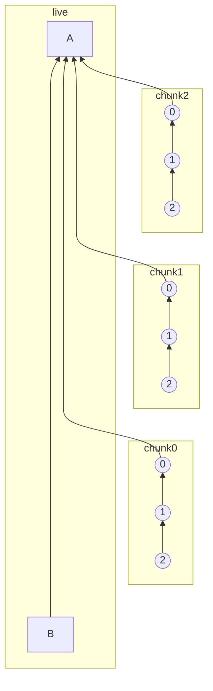
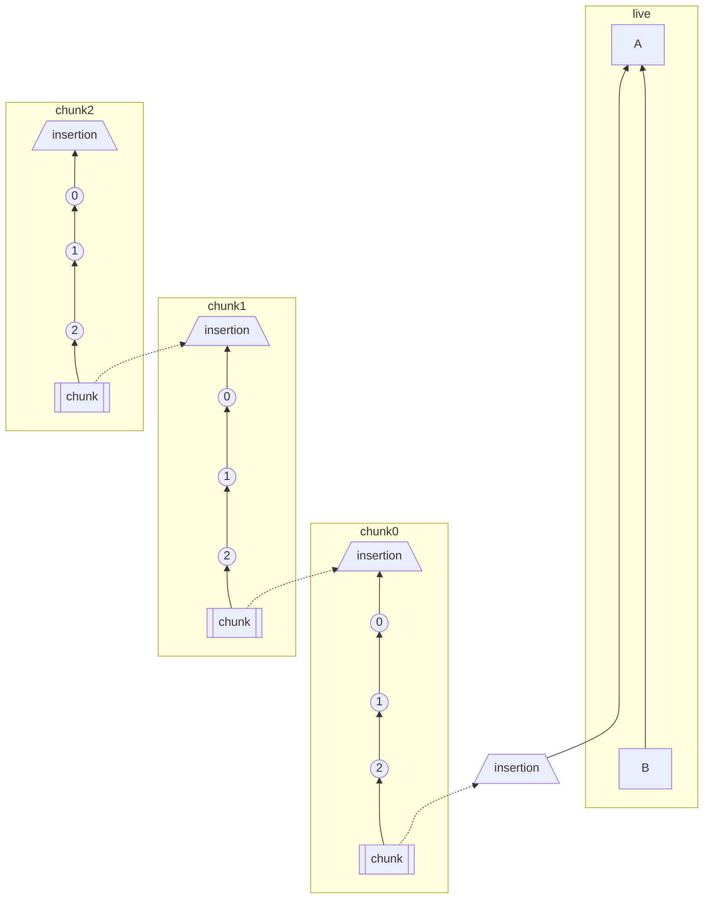

# MSC2716: Incrementally importing history into existing rooms

## Problem

Matrix has historically been unable to easily import existing history into a
room that already exists. This is a major problem when bridging existing
conversations into Matrix, particularly if the scrollback is being
incrementally or lazily imported.

For instance, an NNTP bridge might work by letting a user join a room that
maps to a given newsgroup, first showing an empty room, and then importing the
most recent 1000 newsgroup posts for that room to flesh out some history.  The
bridge might then choose to slowly import additional posts for that newsgroup
in the background, until however many decades of backfill were complete.
Finally, as more archives surface, they might also need to be manually
gradually added into the history of the room - slowly building up the complete
history of the conversations over time.

This is currently not supported because:
 * There is no way to set historical room state in a room via the CS or AS API -
   you can only edit current room state.
 * There is no way to create messages in the context of historical room state in
   a room via CS or AS API - you can only create events relative to current room
   state.
 * There is currently no way to override the timestamp on an event via the AS API.
   (We used to have the concept of [timestamp
   massaging](https://matrix.org/docs/spec/application_service/r0.1.2#timestamp-massaging),
   but it never got properly specified)


## Proposal

### Expectation

Historical messages that we insert should appear in the timeline just like they
would if they were sent back at that time.

Here is what scrollback is expected to look like in Element:


### Overview

**Endpoint:**

 - `POST /_matrix/client/r0/rooms/<roomID>/batch_send?prev_event=<eventID>&chunk_id=<chunkID>`

**Event types:**

 - `m.room.insertion`: Events that mark points in time where you can insert
   historical messages
 - `m.room.chunk`: This is what connects one historical chunk to the other. In
   the DAG, we navigate from an insertion event to the chunk event that points
   at it, up the historical messages to the insertion event, then repeat the
   process
 - `m.room.marker`: Used to hint to homeservers (and potentially to cache bust
   on clients) that there is new history back time that you should go fetch next
   time someone scrolls back around the specified insertion event.

**Content fields:**

 - `m.historical` (`[true|false]`): Used on any event to indicate that it was
   historically imported after the fact
 - `m.next_chunk_id` (`string`): This is a random unique string for a
   `m.room.insertion` event to indicate what ID the next "chunk" event should
   specify in order to connect to it
 - `m.chunk_id` (`string`): Used on `m.room.chunk` events to indicate which
   `m.room.insertion` event it connects to by its `m.next_chunk_id` field
 - `m.marker.insertion` (another `event_id` string): For `m.room.marker` events
   to point at an `m.room.insertion` event by `event_id`

**Power level:**

Since events being silently sent in the past is hard to moderate, it will
probably be good to limit who can add historical messages to the timeline. The
batch send endpoint is already limited to application services but we also need
to limit who can send "insertion", "chunk", and "marker" events since someone
can attempt to send them via the normal `/send` API (we don't want any nasty
weird knots to reconcile either).

 - `historical`: This controls who can send `m.room.insertion`, `m.room.chunk`,
   and `m.room.marker` in the room.

**Room version:**

The redaction algorithm changes are the only hard requirement for a new room
version because we need to make sure when redacting, we only strip out fields
without affecting anything at the protocol level. This means that we need to
keep all of the structural fields that allow us to navigate the chunks of
history in the DAG. We also only want to auth events against fields that
wouldn't be removed during redaction. In practice, this means:

 - When redacting `m.room.insertion` events, keep the `m.next_chunk_id` content field around
 - When redacting `m.room.chunk` events, keep the `m.chunk_id` content field around
 - When redacting `m.room.marker` events, keep the `m.marker.insertion` content field around
 - When redacting `m.room.power_levels` events, keep the `historical` content field around


#### Backwards compatibility

However, this MSC is mostly backwards compatible and can be used with the
current room version with the fact that redactions aren't supported for
`m.room.insertion`, `m.room.chunk`, `m.room.marker` events. We can protect
people from this limitation by throwing an error when they try to use `PUT
/_matrix/client/r0/rooms/{roomId}/redact/{eventId}/{txnId}` to redact one of
those events. We would have to accept the redaction if it came over federation
to avoid split-brained rooms.

Because we also can't use the `historical` power level for controlling who can
send these events in the existing room version, we instead only allow the room
`creator` to send `m.room.insertion`, `m.room.chunk`, and `m.room.chunk` events.


### New historical batch send endpoint

Add a new endpoint, `POST
/_matrix/client/unstable/org.matrix.msc2716/rooms/<roomID>/batch_send?prev_event=<eventID>&chunk_id=<chunkID>`,
which can insert a chunk of events historically back in time next to the given
`prev_event`. This endpoint can only be used by application services. 

This endpoint will handle the complexity of creating "insertion" and "chunk"
events. All the application service has to do is use `?chunk_id` which comes
from `next_chunk_id` in the response of the batch send endpoint. `next_chunk_id`
is derived from the insertion events added to each chunk and is not required for
the first batch send.

Request body:
```json
{
    "state_events_at_start": [{
      "type": "m.room.member",
      "sender": "@someone:matrix.org",
      "origin_server_ts": 1628277690333,
      "content": {
          "membership": "join"
      },
      "state_key": "@someone:matrix.org"
    }],
    "events": [
      {
        "type": "m.room.message",
        "sender": "@someone:matrix.org",
        "origin_server_ts": 1628277690333,
        "content": {
          "msgtype": "m.text",
          "body": "Historical message1"
        },
      },
      {
        "type": "m.room.message",
        "sender": "@someone:matrix.org",
        "origin_server_ts": 1628277690334,
        "content": {
          "msgtype": "m.text",
          "body": "Historical message2"
        },
      }
    ],
}
```

Request response:
```jsonc
{
  "state_events": [
    // list of state event ID's we inserted...
  ],
  // List of historical event ID's we inserted which includes the
  // auto-generated insertion and chunk events...
  "events": [
    // insertion event ID for chunk
    // historical message1 event ID
    // historical message2 event ID
    // chunk event ID
    // base insertion event ID
  ],
  "next_chunk_id": "random-unique-string",
}
```


`state_events_at_start` is used to define the historical state events needed to
auth the `events` like invite and join events. These events can float outside of
the normal DAG. In Synapse, these are called `outlier`'s and won't be visible in
the chat history which also allows us to insert multiple chunks without having a
bunch of `@mxid joined the room` noise between each chunk. **The state will not
be resolved into the current state of the room.**

`events` is chronological chunk/list of events you want to insert. For Synapse,
there is a reverse-chronological constraint on chunks so once you insert one
chunk of messages, you can only insert older an older chunk after that. **tldr;
Insert from your most recent chunk of history -> oldest history.**


#### What does the batch send endpoint do behind the scenes?

This section explains the homeserver magic that happens when someone uses the
`batch_send` endpoint. If you're just trying to understand how the "insertion",
"chunk", "marker" events work, you might want to just skip down to the room DAG
breakdown which incrementally explains how everything fits together.

 1. An "insertion" event for the "chunk" is added to the start of the chunk.
    This is the starting point of the next chunk and holds the `next_chunk_id`
    that we return in the batch send response. The application service passes
    this as `?chunk_id`
 1. A "chunk" event is added to the end of the chunk. This is the event that
    connects to an insertion event by `?chunk_id`.
 1. If `?chunk_id` is not specified (usually only for the first chunk), create a
    base "insertion" event as a jumping off point from `?prev_event` which can
    be added to the end of the `events` list in the response.
 1. All of the events in the historical chunk get a content field,
    `"m.historical": true`, to indicate that they are historical at the point of
    being added to a room.
 1. The `state_events_at_start`/`events` payload is in **chronological** order
    (`[0, 1, 2]`) and is processed in that order so the `prev_events` point to
    it's older-in-time previous message which gives us a nice straight line in
    the DAG.
    - **Depth discussion:** For Synapse, when persisting, we **reverse the list
      (to make it reverse-chronological)** so we can still get the correct
      `(topological_ordering, stream_ordering)` so it sorts between A and B as
      we expect. Why?  `depth` is not re-calculated when historical messages are
      inserted into the DAG. This means we have to take care to insert in the
      right order. Events are sorted by `(topological_ordering,
      stream_ordering)` where `topological_ordering` is just `depth`. Normally,
      `stream_ordering` is an auto incrementing integer but for
      `backfilled=true` events, it decrements. Historical messages are inserted
      all at the same `depth`, and marked as backfilled so the `stream_ordering`
      decrements and each event is sorted behind the next. (from
      https://github.com/matrix-org/synapse/pull/9247#discussion_r588479201)


### Room DAG breakdown

#### Basic chunk structure

Here is the starting point for how the historical chunk concept looks like in
the DAG. We're going to build from this in the next sections.

 - `A` is the oldest-in-time message
 - `B` is the newest-in-time message
 - `chunk0` is the first chunk we try to import
 - Each chunk of messages is older-in-time than the last (`chunk1` is
   older-in-time than `chunk0`, etc)


[Mermaid live editor playground link](https://mermaid-js.github.io/mermaid-live-editor/edit/#eyJjb2RlIjoiZmxvd2NoYXJ0IEJUXG4gICAgc3ViZ3JhcGggbGl2ZVxuICAgICAgICBCIC0tLS0tLS0tLS0tLS0-IEFcbiAgICBlbmRcbiAgICBcbiAgICBzdWJncmFwaCBjaHVuazBcbiAgICAgICAgY2h1bmswLTIoKFwiMlwiKSkgLS0-IGNodW5rMC0xKCgxKSkgLS0-IGNodW5rMC0wKCgwKSlcbiAgICBlbmRcblxuICAgIHN1YmdyYXBoIGNodW5rMVxuICAgICAgICBjaHVuazEtMigoXCIyXCIpKSAtLT4gY2h1bmsxLTEoKDEpKSAtLT4gY2h1bmsxLTAoKDApKVxuICAgIGVuZFxuICAgIFxuICAgIHN1YmdyYXBoIGNodW5rMlxuICAgICAgICBjaHVuazItMigoXCIyXCIpKSAtLT4gY2h1bmsyLTEoKDEpKSAtLT4gY2h1bmsyLTAoKDApKVxuICAgIGVuZFxuXG4gICAgXG4gICAgY2h1bmswLTAgLS0tLS0tLT4gQVxuICAgIGNodW5rMS0wIC0tPiBBXG4gICAgY2h1bmsyLTAgLS0-IEFcbiAgICBcbiAgICAlJSBhbGlnbm1lbnQgbGlua3MgXG4gICAgY2h1bmswLTAgLS0tIGNodW5rMS0yXG4gICAgY2h1bmsxLTAgLS0tIGNodW5rMi0yXG4gICAgJSUgbWFrZSB0aGUgbGlua3MgaW52aXNpYmxlIFxuICAgIGxpbmtTdHlsZSAxMCBzdHJva2Utd2lkdGg6MnB4LGZpbGw6bm9uZSxzdHJva2U6bm9uZTtcbiAgICBsaW5rU3R5bGUgMTEgc3Ryb2tlLXdpZHRoOjJweCxmaWxsOm5vbmUsc3Ryb2tlOm5vbmU7IiwibWVybWFpZCI6Int9IiwidXBkYXRlRWRpdG9yIjpmYWxzZSwiYXV0b1N5bmMiOnRydWUsInVwZGF0ZURpYWdyYW0iOmZhbHNlfQ)

<details>
<summary>mermaid graph syntax</summary>



</details>


#### Adding "insertion" and "chunk" events

Next we add "insertion" and "chunk" events so it's more prescriptive on how each
historical chunk should connect to each other and how the homeserver can
navigate the DAG.

 - With "insertion" events, we just add them to the start of each chronological
   chunk (where the oldest message in the chunk is). The next older-in-time
   chunk can connect to that "insertion" point from the previous chunk.
 - The initial base "insertion" event could be from the main DAG or we can
   create it ad-hoc in the first chunk so the homeserver can start traversing up
   the chunk from there after a "marker" event points to it.
 - We use `m.room.chunk` events to indicate which `m.room.insertion` event it
   connects to by its `m.next_chunk_id` field.


[Mermaid live editor playground link](https://mermaid-js.github.io/mermaid-live-editor/edit/#eyJjb2RlIjoiZmxvd2NoYXJ0IEJUXG4gICAgc3ViZ3JhcGggbGl2ZVxuICAgICAgICBCIC0tLS0tLS0tLS0tLS0tLS0tPiBBXG4gICAgZW5kXG4gICAgXG4gICAgc3ViZ3JhcGggY2h1bmswXG4gICAgICAgIGNodW5rMC1jaHVua1tbXCJjaHVua1wiXV0gLS0-IGNodW5rMC0yKChcIjJcIikpIC0tPiBjaHVuazAtMSgoMSkpIC0tPiBjaHVuazAtMCgoMCkpIC0tPiBjaHVuazAtaW5zZXJ0aW9uWy9pbnNlcnRpb25cXF1cbiAgICBlbmRcblxuICAgIHN1YmdyYXBoIGNodW5rMVxuICAgICAgICBjaHVuazEtY2h1bmtbW1wiY2h1bmtcIl1dIC0tPiBjaHVuazEtMigoXCIyXCIpKSAtLT4gY2h1bmsxLTEoKDEpKSAtLT4gY2h1bmsxLTAoKDApKSAtLT4gY2h1bmsxLWluc2VydGlvblsvaW5zZXJ0aW9uXFxdXG4gICAgZW5kXG4gICAgXG4gICAgc3ViZ3JhcGggY2h1bmsyXG4gICAgICAgIGNodW5rMi1jaHVua1tbXCJjaHVua1wiXV0gLS0-IGNodW5rMi0yKChcIjJcIikpIC0tPiBjaHVuazItMSgoMSkpIC0tPiBjaHVuazItMCgoMCkpIC0tPiBjaHVuazItaW5zZXJ0aW9uWy9pbnNlcnRpb25cXF1cbiAgICBlbmRcblxuICAgIFxuICAgIGNodW5rMC1pbnNlcnRpb25CYXNlWy9pbnNlcnRpb25cXF0gLS0tLS0tLS0tLS0tLT4gQVxuICAgIGNodW5rMC1jaHVuayAtLi0-IGNodW5rMC1pbnNlcnRpb25CYXNlWy9pbnNlcnRpb25cXF1cbiAgICBjaHVuazEtY2h1bmsgLS4tPiBjaHVuazAtaW5zZXJ0aW9uXG4gICAgY2h1bmsyLWNodW5rIC0uLT4gY2h1bmsxLWluc2VydGlvblxuIiwibWVybWFpZCI6Int9IiwidXBkYXRlRWRpdG9yIjpmYWxzZSwiYXV0b1N5bmMiOnRydWUsInVwZGF0ZURpYWdyYW0iOmZhbHNlfQ)

<details>
<summary>mermaid graph syntax</summary>



</details>


The structure of the insertion event looks like:
```js
{
  "type": "m.room.insertion",
  "sender": "@appservice:example.org",
  "content": {
    "m.next_chunk_id": next_chunk_id,
    "m.historical": true
  },
  "room_id": "!jEsUZKDJdhlrceRyVU:example.org",
  // Doesn't affect much but good to use the same time as the closest event
  "origin_server_ts": 1626914158639
}
```


The structure of the chunk event looks like:
```js
{
  "type": "m.room.chunk",
  "sender": "@appservice:example.org",
  "content": {
    "m.chunk_id": chunk_id,
    "m.historical": true
  },
  "room_id": "!jEsUZKDJdhlrceRyVU:example.org",
  // Doesn't affect much but good to use the same time as the closest event
  "origin_server_ts": 1626914158639
}
```


#### Adding marker events

Finally, we add "marker" events into the mix so that federated remote servers
also know where in the DAG they should look for historical messages.

To lay out the different types of servers consuming these historical messages
(more context on why we need "marker" events):

 1. Local server
    - This pretty much works out of the box. It's possible to just add the
      historical events to the database and they're available. The new endpoint
      is just a mechanism to insert the events.
 1. Federated remote server that already has all scrollback history and then new
    history is inserted
    - The big problem is how does a HS know it needs to go fetch more history if
      they already fetched all of the history in the room? We're solving this
      with "marker" events which are sent on the "live" timeline and point back
      to the "insertion" event where we inserted history next to. The HS can
      then go and backfill the "insertion" event and continue navigating the
      historical chunks from there.
 1. Federated remote server that joins a new room with historical messages
    - The originating homeserver just needs to update the `/backfill` response
      to include historical messages from the chunks.
 1. Federated remote server already in the room when history is inserted
    - Depends on whether the HS has the scrollback history. If the HS already
      has all history, see scenario 2, if doesn't, see scenario 3.
 1. For federated servers already in the room that haven't implemented MSC2716
    - Those homeservers won't have historical messages available because they're
      unable to navigate the "marker"/"insertion"/"chunk" events. But the
      historical messages would be available once the HS implements MSC2716 and
      processes the "marker" events that point to the history.


---

 - A "marker" event simply points back to an "insertion" event.
 - The "marker" event solves the problem of, how does a federated homeserver
   know about the historical events which won't come down incremental sync? And
   the scenario where the federated HS already has all the history in the room,
   so it won't do a full sync of the room again.
 - Unlike the historical events sent via `/batch_send`, **the "marker" event is
   sent separately as a normal event on the "live" timeline** so that comes down
   incremental sync and is available to all homeservers regardless of how much
   scrollback history they already have.
    - Note: If a server joins after a "marker" event is sent, it could be lost
      in the middle of the timeline and they could jump back in time past the
      "marker" and never pick it up. But `backfill/` response should have
      historical messages included. It gets a bit hairy if the server has the
      room backfilled, the user leaves, a "marker" event is sent, more messages
      put it back in the timeline, the user joins back, jumps back in the
      timeline and misses the "marker" and expects to see the historical
      messages. They will be missing the historical messages until they can
      backfill the gap where they left.
 - A "marker" event is not needed for every chunk of historical messages added
   via `/batch_send`. Multiple chunks can be inserted then once we're done
   importing everything, we can add one "marker" event pointing at the root
   "insertion" event
    - If more history is decided to be added later, another "marker" can be sent to let the homeservers know again.
 - When a remote federated homeserver, receives a "marker" event, it can mark
   the "insertion" prev events as needing to backfill from that point again and
   can fetch the historical messages when the user scrolls back to that area in
   the future.

The structure of the "marker" event looks like:
```js
{
    "type": "m.room.marker",
    "sender": "@appservice:example.org",
    "content": {
        "m.insertion_id": insertion_event.event_id,
        "m.historical": true
    },
    "room_id": "!jEsUZKDJdhlrceRyVU:example.org",
    "origin_server_ts": 1626914158639,
}
```


[Mermaid live editor playground link](https://mermaid-js.github.io/mermaid-live-editor/edit/#eyJjb2RlIjoiZmxvd2NoYXJ0IEJUXG4gICAgc3ViZ3JhcGggbGl2ZVxuICAgICAgICBtYXJrZXIxPlwibWFya2VyXCJdIC0tLS0-IEIgLS0tLS0tLS0tLS0tLS0tLS0-IEFcbiAgICBlbmRcbiAgICBcbiAgICBzdWJncmFwaCBjaHVuazBcbiAgICAgICAgY2h1bmswLWNodW5rW1tcImNodW5rXCJdXSAtLT4gY2h1bmswLTIoKFwiMlwiKSkgLS0-IGNodW5rMC0xKCgxKSkgLS0-IGNodW5rMC0wKCgwKSkgLS0-IGNodW5rMC1pbnNlcnRpb25bL2luc2VydGlvblxcXVxuICAgIGVuZFxuXG4gICAgc3ViZ3JhcGggY2h1bmsxXG4gICAgICAgIGNodW5rMS1jaHVua1tbXCJjaHVua1wiXV0gLS0-IGNodW5rMS0yKChcIjJcIikpIC0tPiBjaHVuazEtMSgoMSkpIC0tPiBjaHVuazEtMCgoMCkpIC0tPiBjaHVuazEtaW5zZXJ0aW9uWy9pbnNlcnRpb25cXF1cbiAgICBlbmRcbiAgICBcbiAgICBzdWJncmFwaCBjaHVuazJcbiAgICAgICAgY2h1bmsyLWNodW5rW1tcImNodW5rXCJdXSAtLT4gY2h1bmsyLTIoKFwiMlwiKSkgLS0-IGNodW5rMi0xKCgxKSkgLS0-IGNodW5rMi0wKCgwKSkgLS0-IGNodW5rMi1pbnNlcnRpb25bL2luc2VydGlvblxcXVxuICAgIGVuZFxuXG4gICAgXG4gICAgbWFya2VyMSAtLi0-IGNodW5rMC1pbnNlcnRpb25CYXNlXG4gICAgY2h1bmswLWluc2VydGlvbkJhc2VbL2luc2VydGlvblxcXSAtLS0tLS0tLS0tLS0tPiBBXG4gICAgY2h1bmswLWNodW5rIC0uLT4gY2h1bmswLWluc2VydGlvbkJhc2VbL2luc2VydGlvblxcXVxuICAgIGNodW5rMS1jaHVuayAtLi0-IGNodW5rMC1pbnNlcnRpb25cbiAgICBjaHVuazItY2h1bmsgLS4tPiBjaHVuazEtaW5zZXJ0aW9uXG4iLCJtZXJtYWlkIjoie30iLCJ1cGRhdGVFZGl0b3IiOmZhbHNlLCJhdXRvU3luYyI6dHJ1ZSwidXBkYXRlRGlhZ3JhbSI6ZmFsc2V9)

<details>
<summary>mermaid graph syntax</summary>


</details>


## Potential issues

Also see the security considerations section below.

This doesn't provide a way for a HS to tell an AS that a client has tried to
call `/messages` beyond the beginning of a room, and that the AS should try to
lazy-insert some more messages (as per
https://github.com/matrix-org/matrix-doc/issues/698). For this MSC to be
extra useful, we might want to flesh that out. Another related problem with
the existing AS query APIs is that they don't include who is querying,
so they're hard to use in bridges that require logging in. If a similar query
API is added here, it should include the ID of the user who's asking for
history.


## Alternatives

We could insist that we use the SS API to import history history in this manner
rather than extending the AS API.  However, it seems unnecessarily burdensome to
make bridge authors understand the SS API, especially when we already have so
many AS API bridges.  Hence these minor extensions to the existing AS API.

Another way of doing this is using the existing single send state and event API
endpoints. We could use `PUT /_matrix/client/r0/rooms/{roomId}/state/{eventType}/{stateKey}`
with `?historical=true` which would create the floating outlier state events.
Then we could use `PUT /_matrix/client/r0/rooms/{roomId}/send/{eventType}/{txnId}`,
with `?prev_event` pointing at that floating state to auth the event and where we
want to insert the event.

Another way of doing this might be to store the different eras of the room as
different versions of the room, using `m.room.tombstone` events to form a linked
list of the eras. This has the advantage of isolating room state between
different eras of the room, simplifying state resolution calculations and
avoiding risk of any cross-talk.  It's also easier to reason about, and avoids
exposing the DAG to bridge developers.  However, it would require better
presentation of room versions in clients, and it would require support for
retrospectively specifying the `predecessor` of the current room when you
retrospectively import history.  Currently `predecessor` is in the immutable
`m.room.create` event of a room, so cannot be changed retrospectively - and
doing so in a safe and race-free manner sounds Hard. A big problem with this
approach is if you just want to inject a few old lost messages - eg if you're
importing a mail or newsgroup archive and you stumble across a lost mbox with a
few msgs in retrospect, you wouldn't want or be able to splice a whole new room
in with tombstones.

Another way could be to let the server who issued the `m.room.create` also go
and retrospectively insert events into the room outside the context of the DAG
(i.e. without parent prev_events or signatures).  To quote the original
[bug](https://github.com/matrix-org/matrix-doc/issues/698#issuecomment-259478116):

> You could just create synthetic events which look like normal DAG events but
  exist before the m.room.create event. Their signatures and prev-events would
  all be missing, but they would be blindly trusted based on the HS who is
  allowed to serve them (based on metadata in the m.room.create event). Thus
  you'd have a perimeter in the DAG beyond which events are no longer
  decentralised or signed, but are blindly trusted to let HSes insert ancient
  history provided by ASes.

However, this feels needlessly complicated if the DAG approach is sufficient.


## Security considerations

The "insertion" and "chunk" events add a new way for an application service to
tie the chunk reconciliation in knots(similar to the DAG knots that can happen)
which can potentially DoS message and backfill navigation on the server.

This also makes it much easier for an AS to maliciously spoof history.  This is
a bit unavoidable given the nature of the feature, and is also possible today
via SS API.


## Unstable prefix

**Endpoints:**

 - `POST /_matrix/client/unstable/org.matrix.msc2716/rooms/<roomID>/batch_send`

**Event types:**

 - `org.matrix.msc2716.insertion`
 - `org.matrix.msc2716.chunk`
 - `org.matrix.msc2716.marker`

**Content fields:**

 - `org.matrix.msc2716.historical`
 - `org.matrix.msc2716.next_chunk_id`
 - `org.matrix.msc2716.chunk_id`
 - `org.matrix.msc2716.marker.insertion`

**Room version:**

 - `org.matrix.msc2716` and `org.matrix.msc2716v2`, etc as we develop and
   iterate along the way

**Power level:**

 - `historical` (does not need prefixing because it's already under an
   experimental room version)
