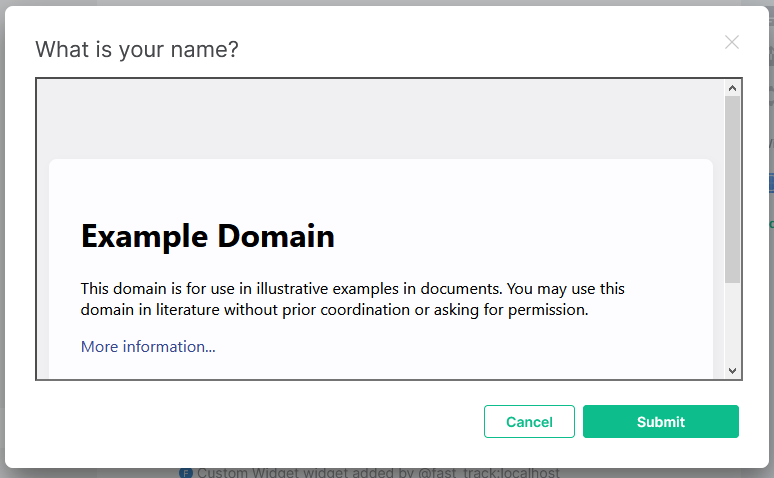

# MSC2790: Widgets - Prompting for user input within the client

Currently widgets are their own isolated bit of functionality which exists independently of the
client, allowing for relatively simple widgets to add functionality to rooms or user accounts. A
drawback of this system is that complex extensions to clients, such as calendar management, are
not as easily represented. Largely speaking, the way in which widgets are rendered do not often
allow for common UI principles like modal dialogs to acquire user input, or they are so heavily
integrated that the UX is unexpected or does not aesthetically match the client.

This proposal introduces a rudimentary system for widgets to be able to acquire user input using
the client's built-in styles where possible. This is done through a new kind of widget called
"modal widgets" and have some additional restrictions on them.

As of writing, the best resource for reading on the widget specification is the work-in-progress
PR: https://github.com/matrix-org/matrix-doc/pull/2764

## Proposal

In addition to the existing room and account widgets, a new widget type, "modal", is introduced.
Modal widgets can be spawned by room and account widgets only - it is not intended to allow modal
widgets to stack. Modal widgets are not persisted in any particular location.

To help with permissions, modal widgets can only be spawned if the *source widget* (the widget
which opened the modal widget) has the `m.modals` capability. As with all capabilities, users should
be prompted to approve the widget's use of this new capability.

Modal widgets SHOULD be rendered in a dialog-like component within the client to get the user's
attention. The dialog should have a title, possibly subtitle, the modal widget, and any buttons
requested by the source widget. The dialog-like component is also called the widget's frame in
this proposal.

A modal widget takes a very similar shape to the common widget properties definition:

```json
{
  "type": "m.custom",
  "url": "https://example.org/modal_widget.html?user_id=$matrix_user_id",
  "name": "What is your name?",
  "data": {
    "custom-key": "This is a custom key"
  },
  "waitForIframeLoad": true,
  "buttons": [
    {"id": "com.example.save", "label": "Submit", "kind": "m.primary"},
    {"id": "m.close", "label": "Cancel", "kind": "m.link"}
  ]
}
```

Most notably, the `creatorUserId` is not present on modal widgets and is implied to be the currently
active user ID. When supplied, the client should ignore it. All the other properties in common with
the standard widget definition keep their meanings and requirements as specified.

The `buttons` array is only valid on modal widgets and is optional. When not supplied or invalid, its
value is implied to be an empty array (no buttons). Buttons have 3 properties to them, all required:

* `id` - Using [MSC2758](https://github.com/matrix-org/matrix-doc/pull/2758), an identifier to indicate
  which button was clicked by the user to the modal widget. Only `m.close` is specified by this MSC,
  allowing clients to render any applicable close buttons on their UI.
* `label` - A human-readable string for the text of the button.
* `kind` - Using MSC2758 again, the kind of button the client should present the button as. Clients
  which do not understand the `kind` or do not have styling rules for the `kind` should render the
  button as a `m.primary` button. This MSC defines the following common types:
  * `m.primary` - A button which is styled as the primary action. Usually this will mean a background
    of the client's accent colour.
  * `m.secondary` - A button which is styled similar to the primary button but denotes secondary action.
  * `m.warning` - A button which is styled to warn the user of potential harm in the action about to
    be taken. Usually yellow or orange backgrounds are used.
  * `m.danger` - A button which is styled to warn the user of imminent risk of severe consequences,
    such as deleting an object. Usually these are red in background colour.
  * `m.link` - A button which looks like a link but has sizing to have it match other buttons.

The client is not required to have styling rules for all button `kind`s, though is encouraged to
support at least the ones listed in this MSC. Clients should ignore any buttons missing any of the
3 required fields.

An example rendering of the above example widget would be as follows:



In this example, the title is the `name` of the widget (a subtitle could be shown from the `title`
attribute under `data`, if present). The iframe in the middle is simply the modal widget itself,
rendered just like any other widget would be (fill in the `url` template, render). The buttons at
the bottom are specified by the `buttons` array.

The example image has a close button in the top right too - this is an example of the client
rendering the `m.close` ID'd button in custom UI. When clicked, this would behave exactly like
the "Cancel" button on the bottom.

Room and account widgets, assuming they have the appropriate capability, can open modal widgets
with a `fromWidget` API request as follows:

```json
{
  "api": "fromWidget",
  "action": "open_modal",
  "requestId": "AAABBB",
  "widgetId": "CCCDDD",
  "data": {
    "type": "m.custom",
    "url": "https://example.org/modal_widget.html?user_id=$matrix_user_id",
    "name": "What is your name?",
    "data": {
      "custom-key": "This is a custom key"
    },
    "waitForIframeLoad": true,
    "buttons": [
      {"id": "com.example.save", "label": "Submit", "kind": "m.primary"},
      {"id": "m.close", "label": "Cancel", "kind": "m.link"}
    ]
  }
}
```

As shown, the `action` is `open_modal` and the `data` is the modal widget definition as described
above. The client will then either reject the request with an error (no permission, not able to
fulfill at the moment, etc) or show the modal by acknowledging the request with an empty response
object. The client can reject a modal widget for any reason, including a `type` it does not
wish to support in this way.

Clients should not ask for the user's permission to open the modal because the capability will have
already been approved. A widget which receives a successful response to `open_modal` can expect
the user to be currently prompted with the modal (this matters more later).

The modal widget dialog is like any other widget with a few added actions. The modal widget gets
assigned a widget ID that is generated by the client, and the regular widget API steps are set up.
Due to the nature of modal widgets and their use case, modal widgets MUST support the widget API.
Similarly, clients MUST handle the widget API when interacting with a modal widget. If the source
widget's session ends before the modal widget is closed, the client MUST close the modal widget
and terminate its session.

This MSC does not define any restrictions for the number of modal widgets that can be active at
any one time, and does not define behaviour for how to handle multiple modal widgets. The client
is expected to remember which widget opened which modal, however - more on this later in the
proposal.

After the modal widget's session is established (capabilities exchanged), the client MUST send
a `toWidget` API request informing the widget of its configuration. The source widget is able to
pass data through to the modal widget by making use of custom keys in the widget `data`. This request
looks like the following:

```json
{
  "api": "toWidget",
  "action": "widget_config",
  "requestId": "AAABBB",
  "widgetId": "CCCDDD",
  "data": {
    "type": "m.custom",
    "url": "https://example.org/modal_widget.html?user_id=$matrix_user_id",
    "name": "What is your name?",
    "data": {
      "custom-key": "This is a custom key"
    },
    "waitForIframeLoad": true,
    "buttons": [
      {"id": "com.example.save", "label": "Submit", "kind": "m.primary"},
      {"id": "m.close", "label": "Cancel", "kind": "m.link"}
    ]
  }
}
```

The `widget_config` action has a `data` copied from the original `open_modal` action sent by the
source widget. The client *should* strip any keys off the modal widget definition which are not
covered by this MSC - the source widget is expected to only use the `data` property of the widget
definition, not the root of the widget definition, to pass data through.

The modal widget acknowledges the request with an empty response object.

After the modal widget receives its widget configuration, it can then start acquiring user input
and interaction. The client will notify the modal widget over the `toWidget` API of any button
presses, like so:

```json
{
  "api": "toWidget",
  "action": "button_clicked",
  "requestId": "AAABBB",
  "widgetId": "CCCDDD",
  "data": {
    "id": "m.close"
  }
}
```

The `button_clicked` action has a single `id` request parameter which is the `id` of the button
the user clicked, as defined by the original widget definition. The modal widget acknowledges this
with an empty response object.

When the modal widget is ready to close, it sends a `close_modal` action over `fromWidget`, like so:

```json
{
  "api": "fromWidget",
  "action": "close_modal",
  "requestId": "AAABBB",
  "widgetId": "CCCDDD",
  "data": {
    "answer": 42
  }
}
```

The `data` of the request is entirely determined by the modal widget and will be passed along to
the source widget with a matching `close_modal` action over `toWidget` this time:

```json
{
  "api": "toWidget",
  "action": "close_modal",
  "requestId": "AAABBB",
  "widgetId": "CCCDDD",
  "data": {
    "answer": 42
  }
}
```

The `data` is a clone of the modal widget's `close_modal` request data. The source widget acknowledges
the request with an empty response object.

Once the client receives a `close_modal` request from the modal widget, the client MUST terminate that
widget's session and close the modal. It should respond with an empty response object first, however
by nature of severing the connection the modal widget should not have an issue with never receiving a
reply. The client must reject any subsequent `close_modal` requests from the modal widget.

Between a successful `open_modal` and `close_modal` request, the source widget can assume that the
user is being prompted as expected. This is typically useful for the source widget to prevent accidental
interaction from the user while it is acquiring more information.

Unless the widget specifies an `m.close` button, one with the label `Close` and type `m.link` is
implied. The close button does not automatically close the modal widget - the modal widget is simply
informed of the button click and left to send a close action if it requires.

It is important that the user can escape a modal widget's grasp on their attention, however. A client
can terminate the modal widget at any time and send a `close_modal` `toWidget` request to the source
widget to indicate as such. When terminating the modal widget this way, the client sends an `m.exited`
field to indicate that the user/client has cancelled the user input. An example request is:

```json
{
  "api": "toWidget",
  "action": "close_modal",
  "requestId": "AAABBB",
  "widgetId": "CCCDDD",
  "data": {
    "m.exited": true
  }
}
```

An example for when the client would want to terminate the widget this way is when the user clicks on
the background around the dialog, thus closing the dialog, or when the client believes the widget is
acting in bad faith and refusing to close (eg: not closing within 5 seconds of clicking the close button).

## Real world example

For a real world scenario, let's assume the user has a calendar widget on their account. The calendar
widget has a "New Event" button for the user to click, however the widget is rendered in such a way
where asking the user for event details would look and feel bad. The calendar widget can spawn a
modal widget to get the user's event details using an `open_modal` request:

```json
{
  "api": "fromWidget",
  "action": "open_modal",
  "requestId": "AAABBB",
  "widgetId": "CCCDDD",
  "data": {
    "type": "com.example.calendar.new_event",
    "url": "https://example.org/event_details.html?user_id=$matrix_user_id",
    "name": "New event details",
    "data": {
      "calendarId": 53,
      "startDate": "2020-09-22"
    },
    "buttons": [
      {"id": "com.example.save", "label": "Add Event", "kind": "m.primary"},
      {"id": "m.close", "label": "Cancel", "kind": "m.link"}
    ]
  }
}
```

In this example, the client has already approved the widget's capability to open modals and doesn't
have an issue with the widget definition, so it responds to the request and shows the widget to the
user. Note that in this example the widget has a custom `type` to allow the client to natively
render the widget instead of using an iframe if it so desired.

After the modal widget's session has been initialized and the widget config sent over to it, the
user enters information into the widget. Once complete, they click the "Add Event" button at the
bottom of the dialog. The modal widget sees this and packages up the user's information into a
`close_modal` request:

```json
{
  "api": "fromWidget",
  "action": "close_modal",
  "requestId": "AAABBB",
  "widgetId": "CCCDDD",
  "data": {
    "calendarId": 53,
    "date": "2020-12-31",
    "startTime": "00:00",
    "durationHours": 24,
    "title": "New Year's Eve party",
    "description": "Something witty would go here",
    "invitees": [
      "@alice:example.org",
      "mailto:bob@example.org"
    ]
  }
}
```

The client acknowledges this, terminates the modal widget, and proxies a similar `close_modal`
request to the original calendar widget. The calendar widget then processes this information and
adds the event to the calendar.

Note that the user interaction flow doesn't have to be this way: the modal widget could just as
easily use the same backend as the calendar widget and add the event directly. It would simply send
and empty `data` objects through, and the calendar widget would likely ignore the request anyways.
A potential reason for using this data channel is because the calendar widget may have already gone
through all the hoops to validate the user's identity and authentication, and while the modal can
do all those same steps again it could be disruptive to the user's experience.

## Potential issues

Modal widgets don't have a way to disable buttons inthe dialog with this proposal. This is currently
a limitation and not planned to be included by this MSC. Likewise are other common button kinds
like "secondary", "info", "light", and "dark".

## Alternatives

A modal widget could instead be the whole dialog (title, buttons - everything), however this has a
number of concerns relating to styling the buttons for every single client possible. The widget API
would also need to be extended to pass through theme information, which it may very well want to do
anyways, but would still be added complexity for a simple form-style widget.

A modal widget could also be replaced with a custom HTML declaration or form syntax, though this is
even harder for clients to sanitize and represent. It would also be limited and require over-specifying
a lot of the functionality that a typical widget probably won't use, like extended validation of inputs
or complex field types.

## Security considerations

A malicious widget could spam the user with modal dialog requests. Clients should apply rate limiting
to the widget API, or provide a mechanism for the user to delete the badly behaving widget.

Similarly, a client can MITM the `close_modal` request sequence and spy on the user or alter the
information. This MSC should not be used for anything that requires verifiably-accurate input. Instead,
the widget author should consider a custom Matrix client or alternative service that isn't operated
through widgets. Another option would be for the widget author to set up an encryption scheme for
the data being passed through, making it secret from the client and obvious when modified.

Clients SHOULD prevent the modal widget from speaking with the source widget directly. This is to
prevent possible MITM attacks from the user's browser extensions and other potential security/privacy
issues with the modal widget itself.

This API allows for arbitrary user-defined data to be passed between two places and rendered in several
others. Clients should apply relevant safety measures before rendering any text, buttons, or widgets
such as limiting text length and refusing to handle corrupt/invalid/large widget definitions.

Modal widgets can also be styled to create phishing scenarios for the user, appearing like settings
dialogs for the client or asking for the user's password. Clients should protect the user from such
cases however they deem reasonable, though are encouraged to use warnings and design principles to
accomplish a feeling of caution within the user. Users should remain vigilant of malicious widgets,
as they already do.

## Unstable prefix

While this MSC is not in a stable version of the specification, implementations should only call the
actions described above if the other end supports the `org.matrix.msc2790` API version. When using
the actions, `org.matrix.msc2790.` should be used instead of `m.` for applicable identifiers.

Identifiers not prefixed with a namespace should be covered by the version check and thus do not need
their own prefix.

Implementations may also wish to use an alternative event type for widgets to signify that the actions
are implicitly supported.
