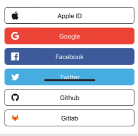

# MSC2858: Multiple SSO Identity Providers

Matrix already has generic SSO support, but it does not yield the best user experience especially for
instances which wish to offer multiple identity providers (IdPs). This MSC provides a simple and fully
backwards compatible way to extend the current spec which would allow clients to give users options
like `Continue with Google` and `Continue with Github` side-by-side.

Currently, Matrix supports `m.login.sso`, `m.login.token` and `/login/sso/redirect` for clients to
pass their user to the configured Identity provider and for them to come back with something which
is exchangeable for a Matrix access token. This flow offers no insight to the user as to what
Identity providers are available: clients can offer only a very generic `Sign in with SSO`
button. With the currently possible solutions and workarounds the experience is far from great
and users have to blindly click `Sign in with SSO` without any clue as to what's hiding on the other
side of the door. Some users will definitely not be familiar with `SSO` but will be with the concept of
"Continue with Google" or similar.

## Proposal

We extend the [login
flow](https://matrix.org/docs/spec/client_server/r0.6.1#login) to allow clients
to choose an SSO Identity provider before control is handed over to the
server. The following sequence diagram illustrates the proposed, updated, login flow:

<!-- source for the following is in images/2858-seq-diagram.txt -->


### Extensions to login flow discovery

The response to [`GET /_matrix/client/r0/login`](https://matrix.org/docs/spec/client_server/r0.6.1#get-matrix-client-r0-login)
is extended to **optionally** include an `identity_providers` property for
flows whose type `m.login.sso`. This would look like this:

```json
{
    "flows": [
        {
            "type": "m.login.sso",
            "identity_providers": [
                {
                    "id": "google",
                    "name": "Google",
                    "icon": "mxc://...",
                    "brand": "google"
                },
                {
                    "id": "github",
                    "name": "Github",
                    "icon": "mxc://...",
                    "brand": "github"
                }
            ]
        },
        {
            "type": "m.login.token"
        }
    ]
}
```

The value of the `identity_providers` property is a list, each entry consisting
of an object with the following fields:

 * The `id` field is **required**. It is an opaque string chosen by the
   homeserver implementation, and uniquely identifies the identity provider on
   that server. Clients should not infer any semantic meaning from the
   identifier. The identifier should be between 1 and 255 characters in length,
   and should consist of the characters matching unreserved URI characters as
   defined in [RFC3986](http://www.ietf.org/rfc/rfc3986.txt):

   ```
   ALPHA  DIGIT  "-" / "." / "_" / "~"
   ```

 * The `name` field is **required**. It should be a human readable string
   intended for printing by the client. No explicit length limit or grammar is
   specified.

 * The `icon` field is **optional**. It should point to an icon representing
   the IdP. If present then it must be an MXC URI to an image resource.

 * The `brand` field is **optional**. It allows the client to style the login
   button to suit a particular brand. It should be a string using the following
   grammar:

    * Must be at least one character and no more than 255 characters in length.
    * Must start with one of the characters `[a-z]`, and be entirely composed
      of the characters `[a-z]`, `[0-9]`, `-`, `_` and `.`.

   To reduce confusion over which identifier should be used for each brand
   (for example: should "Sign in with Microsoft" be `microsoft` or
   `azure`?), it is proposed to maintain a registry of identifiers outside
   the core specification document, avoiding the need for a full MSC to add
   entries to the list. An initial list of proposed identifiers is given below.

   [Rationale: this grammar is based on the
   [MSC2758](https://github.com/matrix-org/matrix-doc/pull/2758), removing the
   requirements for a namespaced hierarchy. In
   [discussion](https://github.com/matrix-org/matrix-doc/pull/2858#discussion_r565506802),
   it was agreed that a separate registry was seen as important for a
   lightweight process by which implementations can agree on identifiers. The
   registry makes the namespacing of MSC2758 redundant; the namespacing system
   was also somewhat confusing.]

   Server implementations are free to add additional brands, though they should
   be mindful of clients which do not recognise any given brand.

   Clients are free to implement any set of brands they wish, including all or
   any of the brands listed in the registry, but are expected to apply a
   sensible unbranded fallback for any brand they do not recognise/support.

   Where `icon` and `brand` are both present, it is recommended that clients
   which support the `brand` give precedence to `brand` over `icon`.

### Extend the `/login/sso/redirect` endpoint

A new endpoint is added to support redirecting directly to one of the IdPs:

`GET /_matrix/client/r0/login/sso/redirect/{idp_id}`

This would behave identically to the existing endpoint without the last argument
except would allow the server to forward the user directly to the correct IdP.

For the case of backwards compatibility the existing endpoint is to remain,
and if the server supports multiple SSO IdPs it should offer the user a page
which lets them choose between the available IdP options as a fallback.

If the `idp_id` is unrecognised, the server should display some sort of error
page to the user. (A protocol whereby an error can be returned to the original
client could be a matter for a future improvement, but is out of scope for now.)

### Notes on user-interactive auth

No change is proposed to the SSO flow for User-Interactive Authentication.

For a reauthentication operation, the server implementation is free to choose
any suitable IdP to authenticate the user. (Often, this will simply be
the IdP that the user logged in with.)

### Proposed initial identifiers for the `brand` identifier

The following identifiers are proposed for the initial content of the `brand`
identifier registry. The descriptions are guidelines to help server
administrators pick a suitable brand identifier, and to help client authors
style buttons in their clients.

 * Identifier: `apple`

   Description: Suitable for "Sign in with Apple": see
   https://developer.apple.com/design/human-interface-guidelines/sign-in-with-apple/overview/buttons/.

 * Identifier: `facebook`

   Description: "Continue with Facebook": see
   https://developers.facebook.com/docs/facebook-login/web/login-button/.

 * Identifier: `github`

   Description: Logos available at https://github.com/logos.

 * Identifier: `gitlab`

   Description: Logos available at https://about.gitlab.com/press/press-kit/.

 * Identifier: `google`

   Description: Suitable for "Google Sign-In": see
   https://developers.google.com/identity/branding-guidelines.

 * Identifier: `twitter`

   Description: Suitable for "Log in with Twitter": see
   https://developer.twitter.com/en/docs/authentication/guides/log-in-with-twitter#tab1.

When considering a new identifier for private use, administrators should pick
some sensible name following the advice of [RFC6648 sec
3](https://tools.ietf.org/html/rfc6648#section-3).

## Alternatives

An alternative to the whole approach would be to allow `m.login.sso.$idp` but this forces
treating an opaque identifier as hierarchical and offers worse backwards compatibility.

An alternative to the proposed backwards compatibility plan where the server offers a
fallback page which fills the gap and lets the user choose which SSO IdP they need is
for the server to deterministically always pick one, maybe the first option and let
old clients only auth via that one but that means potentially locking users out of their
accounts.

[MSC2964](https://github.com/matrix-org/matrix-doc/pull/2964) proposes
replacing much of Matrix's authentication mechanism with OAuth2.0. If that is
adopted, then the Matrix client would not be able to specify an authentication
mechanism; rather it is left up to the server to host pages allowing the user
to choose their authentication mechanism.

### Styling information as an alternative to `brand`

The `brand` field is intended to allow clients to style "login" buttons according
to the identity provider in question. For example, a mobile application might
show:



Some identity providers have very specific rules about how such buttons should
be presented, so a fine level of control is important.

An alternative way to achieve this would be for the server to give full details
about the styling: icon, font colour, border colour, background colour,
etc. However, this soon becomes unscalable. For example, it might be desirable
to offer each logo at a range of resolutions to suit different screen sizes.
Likewise, some brands need different styling depending on the background
colour, so a complete second set of colours must be specified to account for
dark or light themes.

## Potential issues

 * New Identity Providers added by server administators will be unbranded until
   clients adopt support for the new brand.

## Security considerations

This could potentially aid phishing attacks by bad homeservers, where if the app says
`Continue with Google` and then they are taken to a page which is styled to look like
the Google login page they might be a tiny bit more susceptible to being phished as opposed
as to when they click a more generic `Sign in with SSO` button, but this attack was possible
anyhow using a different vector of a controlled Element/client instance which modifies
the text.


## Unstable prefix

Whilst in development use `org.matrix.msc2858.identity_providers` for the flow
discovery and
`/_matrix/client/unstable/org.matrix.msc2858/login/sso/redirect/{idp_id}` for
the new endpoints.

When identity providers are listed under the experimental
`org.matrix.msc2858.identity_providers` field of the response to `/login`,
(instead of `identity_providers`), different values for the `brand` field are
used. In particular the following were defined:

  * `org.matrix.gitlab` (now `gitlab`).
  * `org.matrix.github` (now `github`).
  * `org.matrix.apple` (now `apple`).
  * `org.matrix.google` (now `google`).
  * `org.matrix.facebook` (now `facebook`).
  * `org.matrix.twitter` (now `twitter`).
