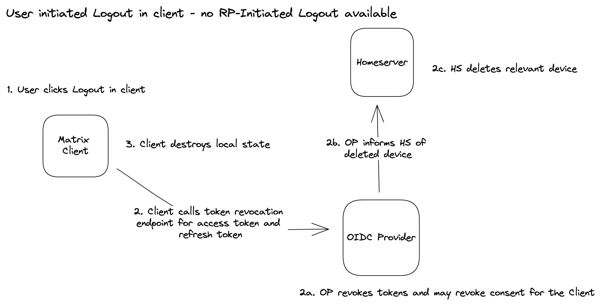
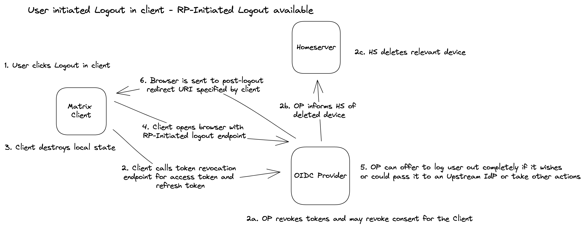
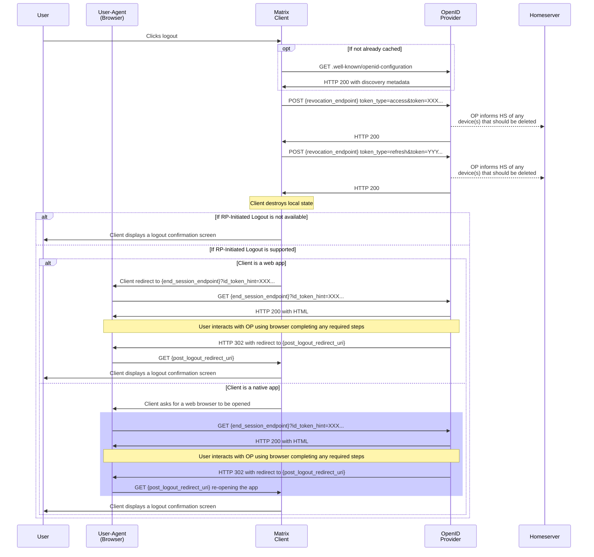
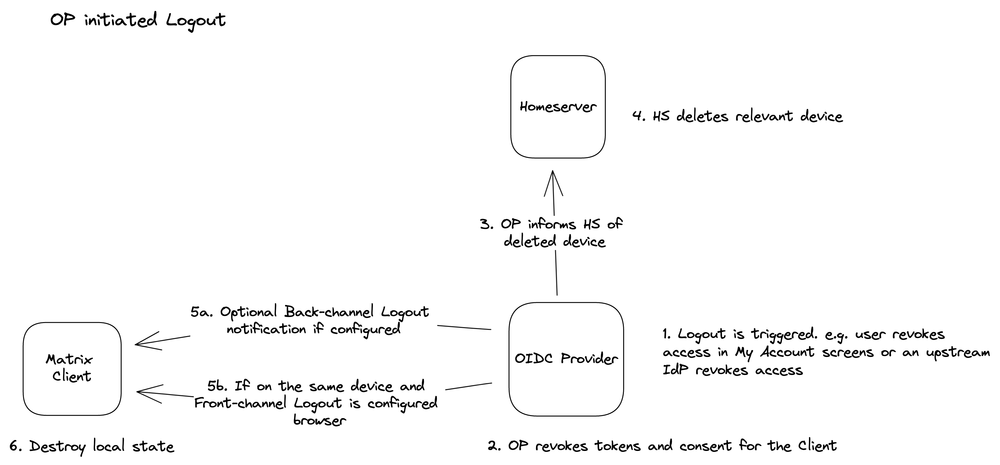
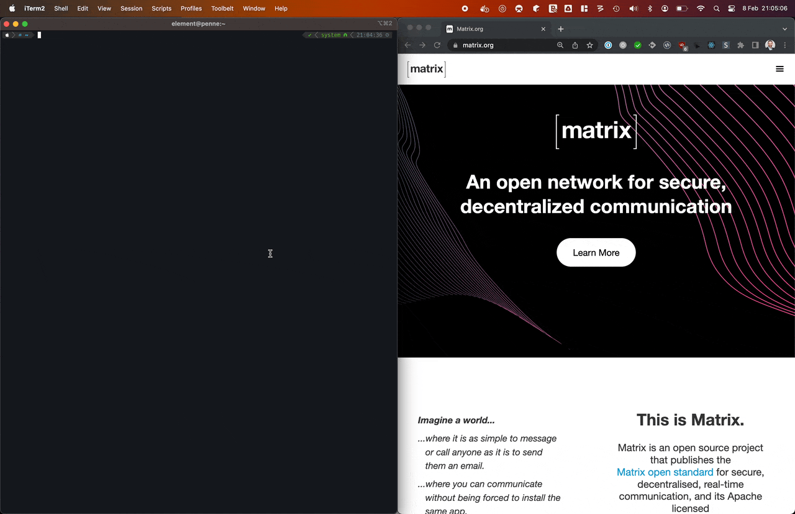

# MSC2964: Delegation of auth from homeserver to OpenID Provider

This proposal is part of the broader [MSC3861: Matrix architecture change to delegate authentication via OIDC](https://github.com/matrix-org/matrix-spec-proposals/pull/3861).

A fundamental change is that access tokens will no longer be issued by the homeserver and instead will be issued by an auth server (OpenID Provider) directly to the Matrix client.

This MSC in particular defines how clients should authenticate with the OpenID Provider to obtain the access token used to access the Matrix Client-to-Server API.

## Proposal

### Terminology

**OAuth 2.0** is an authorization framework. Authentication systems are built on top of OAuth2. It is based on numerous RFCs by the IETF.

**OpenID Connect** is a set of specifications defining a standard auth system built on top of OAuth2. Often abbreviated OIDC. Specs to know about: OIDC Core defines the actual auth system, OIDC Discovery defines the discovery of OP metadata, OIDC Registration allows clients to register themselves dynamically.

An **OpenID Provider** (OP) in the context of OIDC is the service that fulfills an authentication request. In the context of Matrix, it is either the homeserver itself acting as the OP or an external one like Keycloak, Auth0, etc.

A **Resource Server** (RS) is a protected service that requires authentication. In the context of Matrix, the homeserver is a RS.

A **Resource Owner** (RO) is an end user.

A **Relying Party** (RP) (client applications) is an app using resources from RS on behalf of the RO. In the context of Matrix, Matrix clients like Element Web are RPs.

A **User-Agent** (UA) is a thing that hosts client applications, like a web browser.

### Assumptions and existing specifications

This proposal assumes the client (RP) knows what OpenID Provider (OP) it should use.
The OP discovery is defined in [MSC2965](https://github.com/matrix-org/matrix-doc/pull/2965).

It also assumes the client (RP) is already known by the OpenID Provider (OP).
Clients may be "statically" registered with the OP or can make use of the "dynamic" client registration process defined in [MSC2966](https://github.com/matrix-org/matrix-doc/pull/2966).

The goal of this MSC is not to explain how OAuth 2.0 works but rather what mechanisms of OAuth 2.0 the homeserver (RS), client (RP) and OP are expected to implement.
This is done to ensure interoperability between Matrix clients and Homeservers while ensuring that the login flow is secure.

### Client profiles

#### Native and browser-based clients

This client type applies to clients that are running directly on the user-agent.
These clients are either browser-based or are capable of interacting with a separate web browser to have the user interact with the OpenID Provider.

Those clients must use the authorization code flow by directing the user to the authorization endpoint to obtain authorization.
After the user authenticated and authorized the client, the user's web browser is redirected to a URI hosted by the client with an authorization code.
The client then exchanges the authorization code to obtain an access token using the token endpoint.

Those clients are public and therefore must use [PKCE](https://tools.ietf.org/html/rfc7636) with the S256 code challenge mechanism.

The authorization must issue refresh tokens for those type of clients if requested by them.

#### Server-based clients

This client type applies to hosted clients.
These clients must be capable to redirect the user to have them interact with the OpenID Provider.

As with native and public browser-based clients, they must use the authorization code flow to obtain authorization.
Those clients are confidential and must authenticate their requests to the OpenID Provider with their client credentials.

The authorization must issue refresh tokens for those type of clients if requested by them.

### Requests to the authorization endpoint

When making a request to the authorization endpoint, clients must provide an unpredictable value for the `state` parameter and validate it when returning to the redirect URI.
They must ensure the `state` value is securely tied to the current session.

The redirect URIs used by the clients must match exactly with the ones registered to prevent open redirection attacks.
The full redirect URI must be included in the authorization request.

The client might include a login hint to what MXID the user is trying to use.

The scopes the client can request are defined in [MSC2967](https://github.com/matrix-org/matrix-doc/pull/2967).

Sample authorization request:

```
https://account.example.com/oauth2/auth?
    client_id     = s6BhdRkqt3 &
    response_type = code &
    redirect_uri  = https://app.example.com/oauth2-callback &
    scope         = openid urn:matrix:* &
    state         = ewubooN9weezeewah9fol4oothohroh3 &
    nonce         = aazeiD3ahmai6ui9eiveiphochoyaewi &
    login_hint    = mxid:@john:example.com &
    code_challenge        = 72xySjpngTcCxgbPfFmkPHjMvVDl2jW1aWP7-J6rmwU &
    code_challenge_method = S256
```

### Requests to the token endpoint

When exchanging the `code`, clients must include their `client_id` and the `redirect_uri` they used for the initial request.
The server must verify they match for this `code`.

If PKCE was used in the authorization request (required for public client), the client must include the `code_verifier` and the server must validate it.

If the client is confidential, it must authenticate by including its `client_secret`.

TBD: should confidential clients use [JWT assertions](https://tools.ietf.org/html/rfc7523#section-2.2) instead?

```
POST /oauth2/token HTTP/1.1
Host: account.example.com
Content-Type: application/x-www-form-urlencoded
Accept: application/json

grant_type=authorization_code
  &code=iuB7Eiz9heengah1joh2ioy9ahChuP6R
  &redirect_uri=https%3A%2F%2Fapp.element.io%2Foauth2-callback
  &client_id=s6BhdRkqt3
  &code_verifier=ogie4iVaeteeKeeLaid0aizuimairaCh
```

```json
{
  "access_token": "2YotnFZFEjr1zCsicMWpAA",
  "token_type": "Bearer",
  "expires_in": 299,
  "refresh_token": "tGzv3JOkF0XG5Qx2TlKWIA",
  "scope": "openid urn:matrix:api:*",
  "id_token": "..."
}
```

The access token must be short-lived and should be refreshed using the `refresh_token` when expired.

### Existing authentication types equivalence

The current authentication mechanism can have multiple stages allowing to ask users to perform certain actions. These include:

- social login (`m.login.sso`), with multiple providers ([MSC2858](https://github.com/matrix-org/matrix-doc/pull/2858))
- complete a CAPTCHA (`m.login.recaptcha`)
- agree to terms of services and privacy policies (`m.login.terms`, [MSC1692](https://github.com/matrix-org/matrix-doc/pull/1692))
- TOTP/2FA (`m.login.totp`, [MSC2271](https://github.com/matrix-org/matrix-doc/pull/2271))

All of this can be done by the OpenID Provider without any modification to the specification.

### Replacement of UIA

Some API endpoints use User-Interactive Authentication to perform some higher-privileged operations, like deleting a device or adding a 3PID.
An equivalent behaviour can be achieved by temporarily upgrade the client authorization with additional scopes.

Whenever the client ask for a token (either with a refresh token or by initiating a authorization code flow) the OP returns the list of scopes for which the token is valid.
This helps client track what scopes they currently have access to, and let them upgrade temporarily a token with additional scopes to perform privileged actions.
The OP can also downgrade the scopes of a session after a certain time by returning a reduced list of scopes when refreshing the token.
The scope definitions are out of scope of this MSC and are defined in [MSC2967](https://github.com/matrix-org/matrix-doc/pull/2967).

### User registration

User can register themselves by initiating a authorization code flow with the `prompt=create` parameter as defined in [Initiating User Registration via OpenID Connect 1.0](https://openid.net/specs/openid-connect-prompt-create-1_0.html).

### Logging out

There are two scenarios for logout:

- Logout initiated from a Matrix client
- Logout initiated from the OpenID Provider

The OP is the authority on whether a user or session is valid or not and is responsible for managing the Matrix devices on the Homeserver.

#### Logout initiated from a Matrix client

When a user logs out of a Matrix client, the client should revoke the access token and refresh token it has been using by calling the [RFC7009](https://www.rfc-editor.org/rfc/rfc7009) token revocation endpoint exposed by the OpenID Provider.

The OpenID Provider is responsible for informing the Homeserver that any associated Matrix device has been deleted so that it can be removed from the user's account.

If the OpenID Provider supports the [OIDC RP-Initiated Logout 1.0](https://openid.net/specs/openid-connect-rpinitiated-1_0.html) mechanism specification, the client should also redirect or open a browser window on the RP-Initiated Logout end session endpoint.

The client should also destroy any local state it has about the user.

In the case that RP-Initiated Logout is not available the high-level flow looks like this:


With  RP-Initiated Logout available the high-level flow looks like this:



Or, as a sequence diagram including both scenarios:



#### Logout initiated from the OpenID Provider

In this scenario the logout is initiated by the OP. Scenarios where this are applicable include where a user has made use of a My Account web interface provided by the OP to sign out, or by the OP based on some other policy such as a notice from an upstream identity provider.

As above, the OP should inform the Homeservers that any associated Matrix devices have been deleted so that it can be removed from the user's account.

Where the OP supports it, the Matrix client can also choose to be informed of a logout via the [OIDC Front-Channel Logout 1.0](https://openid.net/specs/openid-connect-frontchannel-1_0.html) mechanism.

n.b. If a Matrix client (or other Relying Party) has a server based component then the [OIDC Back-Channel Logout 1.0](https://openid.net/specs/openid-connect-backchannel-1_0.html) mechanism could also be used where the OP supports it.

At a high-level the process looks like:



#### Client encounters an invalid access token

This is similar to the current behaviour where the client encounters an invalid access token. The client can attempt to use the refresh token to obtain a new access token. If the refresh token is invalid, the client can then redirect the user to the OP's authorization endpoint to obtain a new access token.

If this fails then the client should treat the user as having logged out and should destroy any local state it has about the user.

### Tracking of 3PIDs

Currently the Homeserver is responsible for managing which third-party identifiers (3PIDs) are associated with a Matrix ID. This responsibility includes verifying that the 3PID is valid and owned by the user.

Uses of these 3PIDs are typically:

- where applicable, allowing the user to reset their password
- allowing email and SMS notifications rules (pushers) to be configured
- providing the Matrix client with a list of email addresses and phone numbers that the user might wish to add to the Identity Server

Within the proposed architecture the OP becomes responsible for managing these 3PIDs. However, the Homeserver will still needs to track which 3PIDs are valid and verified for a user so that it only allows notifications to be set up for those 3PIDs.

Unfortunately OIDC doesn't provide a standard way to represent multiple 3PIDs for a user.

As such it is proposed that:

- the OP should inform the Homeserver of any changes to the 3PIDs associated with a user
- the client can continue to use `GET /account/3pid` to discover the available 3PIDs for a user

### Removal of endpoints

Because responsibility for registration, authentication and off-boarding of users is moved to the OP, the following Client-Server API endpoints are no longer within the scope of the Matrix spec and so should be removed:

| Endpoint(s)                                                                                                                                                                                            | Notes                                                                                                                                                                                                                                     |
| ------------------------------------------------------------------------------------------------------------------------------------------------------------------------------------------------------ | ----------------------------------------------------------------------------------------------------------------------------------------------------------------------------------------------------------------------------------------- |
| `GET /register`<br>`POST /register`<br>`GET /register/available`<br>`POST /register/email/requestToken`<br>`POST /register/msisdn/requestToken`<br>`GET /register/m.login.registration_token/validity` | The user would interact directly with the OP to complete registration.                                                                                                                                                                    |
| `GET /login`<br>`POST /login`<br>`GET /login/sso/redirect`<br>`GET /refresh`                                                                                                                           | The user would interact directly with the OP to complete log in.                                                                                                                                                                          |
| `POST /logout`<br>`POST /logout/all`<br>`POST /delete_devices`<br>`DELETE /devices/{deviceId}`                                                                                                         | The client can still initiate a logout, but responsibility for completing it is down to the OP.                                                                                                                                           |
| `POST /account/3pid/add`<br>`POST /account/3pid/delete`<br>`POST /account/3pid/email/requestToken`<br>`POST /account/3pid/msisdn/requestToken`                                                         | The user will add 3pids for auth directly with the OP. The OP is then responsible for verifying them. n.b. the `POST /account/3pid/bind` and `POST /account/3pid/unbind` remain as these are related to the Identity Server functionality |
| `POST /account/password`<br>`POST /password/email/requestToken`<br>`POST /password/msisdn/requestToken`                                                                                                | More generally the OP becomes responsible for account recovery in the case of credential loss.                                                                                                                                            |
| `POST /account/deactivate`                                                                                                                                                                             | Where provided by the OP, the client could link out to a My Account web interface to complete this operation                                                                                                                              |

Additionally, the following proposed endpoints would no longer be needed:

| Endpoint(s)                                                                                     | MSC                                                                      | Notes                                                                                                                        |
| ----------------------------------------------------------------------------------------------- | ------------------------------------------------------------------------ | ---------------------------------------------------------------------------------------------------------------------------- |
| `POST /login/token`                                                                             | [MSC3882](https://github.com/matrix-org/matrix-spec-proposals/pull/3882) | Instead the Device Authorization Grant can be used.                                                                          |
| `POST /terms`                                                                                   | [MSC3012](https://github.com/matrix-org/matrix-spec-proposals/pull/3012) | The OP would manage any terms acceptance directly with the user probably by means of a web page or My Account functionality. |
| `POST /account/authenticator`<br>`DELETE /account/authenticator/<auth_type>/<authenticator_id>` | [MSC3774](https://github.com/matrix-org/matrix-spec-proposals/pull/3744) | The user would manage any authenticators directly with the OP by means of My Account functionality. |

### Removal of User-Interactive Authentication API

After removing all the endpoints listed above, the only remaining endpoint that currently uses User-Interactive Authentication (UIA) is: `POST /_matrix/client/v3/keys/device_signing/upload`

This endpoint is used to set up and reset end-to-end encryption cross-signing.

[MSC3967](https://github.com/matrix-org/matrix-spec-proposals/pull/3967) proposes that UIA is not required when the user first uploads cross-signing keys. Furthermore, it is anticipated that an alternative mechanism to do a reset will be devised soon and that doesn't have to require UIA in OIDC.

As such, this proposal assumes that the UIA API is not required where auth is delegated via OIDC and as such would be removed from the Matrix spec.

### Equivalence of existing flows

#### Direct replacement to the `m.login.password`

If a Matrix client and homeserver wishes to mimic the current `m.login.password` flow where the client is trusted to manage the login screen, this can be implemented using the [Resource Owner Password Credentials Grant](https://www.rfc-editor.org/rfc/rfc6749#section-4.3).

However, it is worth noting that the [OAuth 2.0 Security Best Current Practice](https://datatracker.ietf.org/doc/html/draft-ietf-oauth-security-topics#name-resource-owner-password-cre) recommends against using this flow and [OAuth 2.1](https://datatracker.ietf.org/doc/html/draft-ietf-oauth-v2-1-07) omits this flow entirely.

#### Authentication for devices without a browser

The [Device Authorization Grant](https://www.rfc-editor.org/rfc/rfc8628) is designed for devices that do not have a browser, such as a smart TV, a set-top box or a CLI.

An example of a CLI login flow built using the device authorization grant is shown below:


Alternatively, an OP may provide a mechanism by which a long-lived personal access token can be obtained by the user, which can then be entered into the client and used to authenticate with the homeserver. The [Client Credentials Grant](https://tools.ietf.org/html/rfc6749#section-4.4) could be used for this purpose.

#### Sign in with QR code

[MSC3906](https://github.com/matrix-org/matrix-spec-proposals/pull/3906) proposes a QR code based flow to sign in and set up E2EE on an additional device.

The existing proposal can be extended to make use of the [Device Authorization Grant](https://www.rfc-editor.org/rfc/rfc8628) in place of the [MSC3882](https://github.com/matrix-org/matrix-spec-proposals/pull/3882) `m.login.token` based approach so that it will work with homeservers delegating auth via OIDC.

## Potential issues

There are still open questions that need to be addressed in future MSCs.
These include:

- using OAuth 2.0 to authenticate application services
- interactions with widgets and integrations

The current authentication mechanism will be deprecated later on, but a migration period where the two authentication mechanisms cohabit needs to exist.
This is doable in clients but harder to do in servers.
One requirement for a smooth migration is [MSC2918](https://github.com/matrix-org/matrix-doc/pull/2918) refresh tokens that were accepted into the Matrix 1.3 release.

### Confusion with existing `m.login.sso` OIDC capabilities

Care is needed to ensure that the OIDC capabilities are not confused with the existing `m.login.sso` OIDC capabilities. A general (non-homeserver implementation specific) migration guide may be appropriate to help with this. Furthermore, each homeserver implementation may wish to provide a migration guide specific to their implementation.

### Confusion with OpenID ID Token capabilities used for federated auth

Again, some care is needed to ensure that the OIDC capabilities are not confused with the existing OpenID token generation capabilities used for federated auth.

References to OpenID within the spec include:

- [Client-Server API](https://spec.matrix.org/v1.5/client-server-api/#openid)
- [Server-Server API](https://spec.matrix.org/v1.5/server-server-api/#openid)
- [Identity Service API](https://spec.matrix.org/v1.5/identity-service-api/#authentication)

## Alternatives

For a discussion on alternatives please see [MSC3861](https://github.com/matrix-org/matrix-spec-proposals/pull/3861).

## Security considerations

Since this touches one of the most sensitive part of the API, there are a lot of security considerations to have.

The [OAuth 2.0 Security Best Practice](https://tools.ietf.org/html/draft-ietf-oauth-security-topics-16) IETF draft has many attack scenarios. Many of those scenarios are mitigated by the choices enforced in the client profiles outlined in this MSC.

## Unstable prefix

None as part of this MSC.

## Dependencies

- [MSC2964](https://github.com/matrix-org/matrix-spec-proposals/pull/2964)
- [MSC2965](https://github.com/matrix-org/matrix-spec-proposals/pull/2965)
- [MSC2966](https://github.com/matrix-org/matrix-spec-proposals/pull/2966)
- [MSC2967](https://github.com/matrix-org/matrix-spec-proposals/pull/2967)
- [MSC3967](https://github.com/matrix-org/matrix-spec-proposals/pull/3967)
