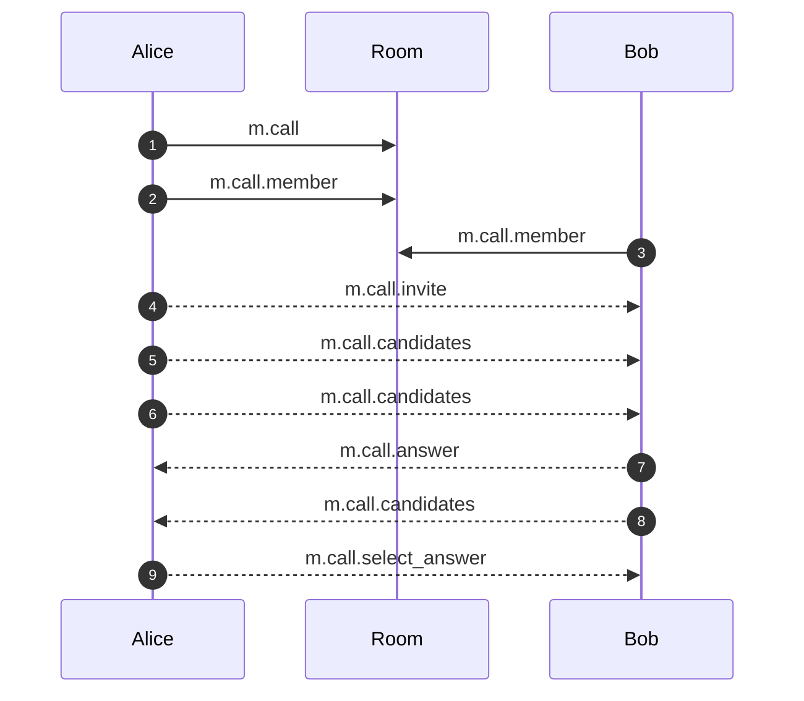

# MSC3401: Native Group VoIP signalling

Note: previously this MSC included SFU signalling which has now been moved to
[MSC3898](https://github.com/matrix-org/matrix-spec-proposals/pull/3898) to
avoid making this MSC too large.

## Problem

VoIP signalling in Matrix is currently conducted via timeline events in a 1:1 room.
This has some limitations, especially if you try to broaden the approach to multiparty VoIP calls:

* VoIP signalling can generate a lot of events as candidates are incrementally
  discovered, and for rapid call setup these need to be relayed as rapidly as
  possible.
  * Putting these into the room timeline means that if the client has a gappy
    sync, for VoIP to be reliable it will need to go back and fill in the gap
    before it can process any VoIP events, slowing things down badly.
  * Timeline events are (currently) subject to harsh rate limiting, as they are
    assumed to be a spam vector.
* VoIP signalling leaks IP addresses.  There is no reason to keep these around
  for posterity, and they should only be exposed to the devices which care about
  them.
* Candidates are ephemeral data, and there is no reason to keep them around for
  posterity - they're just clogging up the DAG.

Meanwhile we have no native signalling for group calls at all, forcing you to instead embed a separate system such as Jitsi, which has its own dependencies and doesn't directly leverage any of Matrix's encryption, decentralisation, access control or data model.

## Proposal

This proposal provides a signalling framework using to-device messages which can
be applied to native Matrix 1:1 calls, full-mesh calls and in the future SFU
calls, cascaded SFU calls MCU calls, and hybrid SFU/MCU approaches. It replaces
the early flawed sketch at
[MSC2359](https://github.com/matrix-org/matrix-doc/pull/2359).

This does not immediately replace the current 1:1 call signalling, but may in future provide a migration path to unified signalling for 1:1 and group calls.

Diagrammatically, this looks like:

1:1:

```diagram
          A -------- B
```

Full mesh between clients

```diagram
          A -------- B
           \       /
            \     /
             \   /
              \ /
               C
```

SFU (aka Focus):

```diagram
          A __    __ B
              \  /   
               F 
               | 
               |
               C
Where F is an SFU focus
```

Cascaded decentralised SFU:

```diagram
     A1 --.           .-- B1
     A2 ---Fa ----- Fb--- B2
           \       /
            \     /
             \   /
              \ /
               Fc
              |  |
             C1  C2

Where Fa, Fb and Fc are SFU foci, one per homeserver, each with two clients.
```

### m.call state event

The user who wants to initiate a call sends a `m.call` state event into the room to inform the room participants that a call is happening in the room. This effectively becomes the placeholder event in the timeline which clients would use to display the call in their scrollback (including duration and termination reason using `m.terminated`). Its body has the following fields:

* `m.intent` to describe the intended UX for handling the call.  One of:
  * `m.ring` if the call is meant to cause the room participants devices to ring
    (e.g. 1:1 call or group call)
  * `m.prompt` is the call should be presented as a conference call which users
    in the room are prompted to connect to
  * `m.room` if the call should be presented as a voice/video channel in which
    the user is immediately immersed on selecting the room.
* `m.type` to say whether the initial type of call is voice only (`m.voice`) or
  video (`m.video`).  This signals the intent of the user when placing the call
  to the participants (i.e. "i want to have a voice call with you" or "i want to
  have a video call with you") and warns the receiver whether they may be
  expected to view video or not, and provide suitable initial UX for displaying
  that type of call... even if it later gets upgraded to a video call.
* `m.terminated` if this event indicates that the call in question has finished,
  including the reason why. (A voice/video room will never terminate.) (do we
  need a duration, or can we figure that out from the previous state event?).  
* `m.name` as an optional human-visible label for the call (e.g. "Conference
  call").
* The State key is a unique ID for that call. (We can't use the event ID, given
  `m.type` and `m.terminated` is mutable).  If there are multiple non-terminated
  conf ID state events in the room, the client should display the most recently
  edited event.

For instance:

```jsonc
{
    "type": "m.call",
    "state_key": "cvsiu2893",
    "content": {
        "m.intent": "m.room",
        "m.type": "m.voice",
        "m.name": "Voice room"
    }
}
```

We mandate at most one call per room at any given point to avoid UX nightmares - if you want the user to participate in multiple parallel calls, you should simply create multiple rooms, each with one call.

### Call participation

Users who want to participate in the call declare this by publishing a `m.call.member` state event using their matrix ID as the state key (thus ensuring other users cannot edit it).  The event contains an array `m.calls` of objects describing which calls the user is participating in within that room.  This array must contain one item (for now).

The fields within the item in the `m.calls` contents are:

* `m.call_id` - the ID of the conference the user is claiming to participate in.
  If this doesn't match an unterminated `m.call` event, it should be ignored.
* `m.devices` - The list of the member's active devices in the call. A member
  may join from one or more devices at a time, but they may not have two active
  sessions from the same device. Each device contains the following properties:
  * `device_id` - The device id to use for to-device messages when establishing
    a call
  * `session_id` - A unique identifier used for resolving duplicate sessions
    from a given device. When the `session_id` field changes from an incoming
    `m.call.member` event, any existing calls from this device in this call
    should be terminated. `session_id` should be generated once per client
    session on application load.
  * `expires_ts` - A POSIX timestamp in milliseconds describing when this device
    data should be considered stale. When updating their own device state,
    clients should choose a reasonable value for `expires_ts` in case they go
    offline unexpectedly. If the user stays connected for longer than this time,
    the client must actively update the state event with a new expiration
    timestamp. A device must be ignored if the `expires_ts` field indicates it
    has expired, or if the user's `m.room.member` event's membership field is
    not `join`.
  * `feeds` - Contains an array of feeds the member is sharing and the opponent
    member may reference when setting up their WebRTC connection.
    * `purpose` - Either `m.usermedia` or `m.screenshare` otherwise the feed
      should be ignored.

For instance:

```jsonc
{
    "type": "m.call.member",
    "state_key": "@matthew:matrix.org",
    "content": {
        "m.calls": [
            {
                "m.call_id": "cvsiu2893",
                "m.devices": [
                    {
                        "device_id": "ASDUHDGFYUW", // Used to target to-device messages
                        "session_id": "GHKJFKLJLJ", // Used to resolve duplicate calls from a device
                        "expires_ts": 1654616071686,
                        "feeds": [
                            {
                                "purpose": "m.usermedia",
                                "id": "qegwy64121wqw", // WebRTC MediaStream id
                                "tracks": [
                                    {
                                        "kind": "audio",
                                        "id": "zvhjiwqsx", // WebRTC MediaStreamTrack id
                                        "label": "Sennheiser Mic",
                                        "settings": { // WebRTC MediaTrackSettings object
                                            "channelCount": 2,
                                            "sampleRate": 48000,
                                            "m.maxbr": 32000, // Matrix-specific extension to advertise the max bitrate of this track
                                        }
                                    },
                                    {
                                        "kind": "video",
                                        "id": "zbhsbdhzs",
                                        "label": "Logitech Webcam",
                                        "settings": {
                                            "width": 1280,
                                            "height": 720,
                                            "facingMode": "user",
                                            "frameRate": 30.0,
                                            "m.maxbr": 512000,
                                        }
                                    },
                                ],
                            },
                            {
                                "purpose": "m.screenshare",
                                "id": "suigv372y8378",
                                "tracks": [
                                    {
                                        "kind": "video",
                                        "id": "xbhsbdhzs",
                                        "label": "My Screenshare",
                                        "settings": {
                                            "width": 3072,
                                            "height": 1920,
                                            "cursor": "moving",
                                            "displaySurface": "monitor",
                                            "frameRate": 30.0,
                                            "m.maxbr": 768000,
                                        }
                                    },
                                ]
                            }
                        ]
                    }
                ]
            }
        ],
    }
}
```

This builds on [MSC3077](https://github.com/matrix-org/matrix-spec-proposals/pull/3077), which describes streams in `m.call.*` events via a `sdp_stream_metadata` field.

**TODO: Do we need all of this data? Why would we need it?** **TODO: This
doesn't follow the MSC3077 format very well - can we do something about that?**
**TODO: Add tracks field** **TODO: Add bitrate/format fields**

Clients should do their best to ensure that calls in `m.call.member` state are removed when the member leaves the call. However, there will be cases where the device loses network connectivity, power, the application is forced closed, or it crashes. If the `m.call.member` state has stale device data the call setup will fail. Clients should re-attempt invites up to 3 times before giving up on calling a member.

### Call setup

In a full mesh call, for any two participants, the one with the lexicographically lower user ID is responsible for calling the other. If two participants share the same user ID (that is, if a user has joined the call from multiple devices), then the one with the lexicographically lower device ID is responsible for calling the other.

Call setup then uses the normal `m.call.*` events, except they are sent over to-device messages to the relevant devices (encrypted via Olm).  This means:

* When initiating a 1:1 call, the `m.call.invite` is sent to the devices listed in `m.call.member` event's `m.devices` array using the `device_id` field.
* `m.call.*` events sent via to-device messages should also include the following properties in their content:
  * `conf_id` - The group call id listed in `m.call`
  * `dest_session_id` - The recipient's session id. Incoming messages with a
    `dest_session_id` that doesn't match your current session id should be
    discarded.
  * `seq` - The sequence number of the to-device message. This is done since the
    order of to-device messages is not guaranteed. With each new to-device
    message this number gets incremented by `1` and it starts at `0`
* In addition to the fields above `m.call.invite` events sent via to-device messages should include the following properties  :
  * `device_id` - The message sender's device id. Used by the opponent member to send response to-device signalling messages even if the `m.call.member` event has not been received yet.
  * `sender_session_id` - Like the `device_id` the `sender_session_id` is used
     by the opponent member to filter out messages unrelated to the sender's
     session even if the `m.call.member` event has not been received yet.
* For 1:1 calls, we might want to let the to-device messages flow and cause the client to ring even before the `m.call` event propagates, to minimise latency.  Therefore we'll need to include an `m.intent` on the `m.call.invite` too.

## Example Diagrams

### Legend

| Arrow Style | Description |
|-------------|-------------|
| Solid | [State Event](https://spec.matrix.org/latest/client-server-api/#types-of-room-events) |
| Dashed | [Event (sent as to-device message)](https://spec.matrix.org/latest/client-server-api/#send-to-device-messaging) |

### Basic Call



## Potential issues

To-device messages are point-to-point between servers, whereas today's `m.call.*` messages can transitively traverse servers via the room DAG, thus working around federation problems.  In practice if you are relying on that behaviour, you're already in a bad place.

## Alternatives

There are many many different ways to do this.  The main other alternative considered was not to use state events to track membership, but instead gossip it via either to-device or DC messages between participants.  This fell apart however due to trust: you effectively end up reinventing large parts of Matrix layered on top of to-device or DC.  So you might as well publish and distribute the participation data in the DAG rather than reinvent the wheel.

An alternative to to-device messages is to use DMs.  You still risk gappy sync problems though due to lots of traffic, as well as the hassle of creating DMs and requiring canonical DMs to set up the calls.  It does make debugging easier though, rather than having to track encrypted ephemeral to-device msgs.

## Security considerations

State events are not encrypted currently, and so this leaks that a call is happening, and who is participating in it, and from which devices.

Malicious users in a room could try to sabotage a conference by overwriting the `m.call` state event of the current ongoing call.

## Unstable prefix

| stable event type | unstable event type |
|-------------------|---------------------|
| m.call            | org.matrix.msc3401.call |
| m.call.member     | org.matrix.msc3401.call.member |
