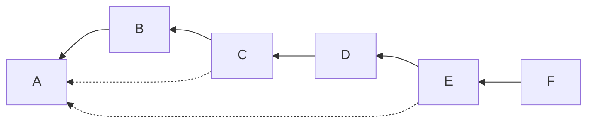
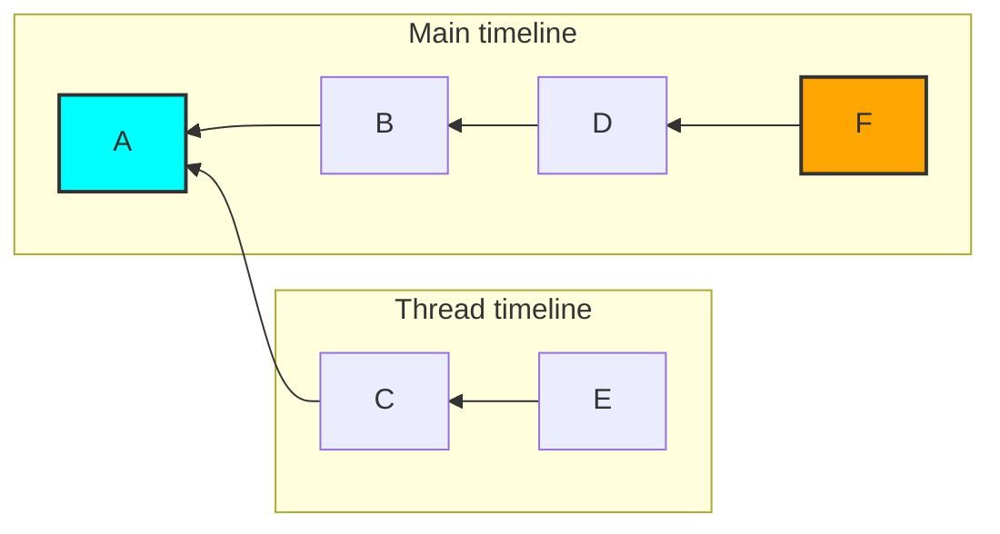

# MSC3771: Read receipts for threads

Currently, each room has a single read receipt per user. This is used to sync the
read status of a room across clients and calculate the number of unread messages.

Unfortunately a client displaying threads may show a subset of a room's messages
at a time, causing the read receipt to be misleading.

This might better be described by an example. Given a room with the following
DAG of events (note that the dotted lines are a thread relation, as specified by
[MSC3440](https://github.com/matrix-org/matrix-doc/pull/3440)):



A client might interpret this as:



While viewing the "main" timeline of the room, a client might move the read
receipt from event `A` to event `F` without ever showing events `C` and `E`. The
user then reads the thread, the client has no way to mark `E` as read.

## Proposal

This MSC proposes allowing the same receipt type to exist multiple times in a room
by adding a `threadId` parameter to reach receipt.

The [`/receipt`](https://spec.matrix.org/v1.2/client-server-api/#post_matrixclientv3roomsroomidreceiptreceipttypeeventid)
endpoint gains a new optional path part and becomes:

`POST /_matrix/client/v3/rooms/{roomId}/receipt/{receiptType}/{eventId}/{threadId}`

The `threadId` contains the thread that the read receipts belongs to (i.e. it should
match the `event_id` contained within the `m.relates_to` of the event represented
by `eventId`).

This updates the unique tuple for receipts from
`(room ID, user ID, receipt type)` to `(room ID, user ID, receipt type, threadId)`.
A missing (or empty) `threadId` refers to the "main" timeline (or events which are
not part of a thread).

Given a threaded message:

```json
{
  "event_id": "$thread_reply",
  "room_id": "!room:example.org",
  "content": {
    "m.relates_to": {
      "rel_type": "m.thread",
      "event_id": "$thread_root"
    }
  }
}
```

A client could mark this as read by sending a request:

```
POST /_matrix/client/r0/rooms/!room:example.org/receipt/m.read/$thread_reply/$thread_root

{}
```

This would then come down `/sync` for the user with other receipts, but with an
additional property in the body containing the thread ID:

```json
{
  "content": {
    "$thread_reply": {
      "m.read.thread.private": {
        "@rikj:jki.re": {
          "ts": 1436451550453,
          "thread_id": "$thread_root"
        }
      }
    }
  },
  "room_id": "!jEsUZKDJdhlrceRyVU:example.org",
  "type": "m.receipt"
}
```

## Potential issues

For long-lived rooms or rooms with many threads there could be a significant number
of receipts. This has a few downsides:

* The size of the `/sync` response would increase without bound.
* The effort to generate and process the receipts for each room would increase
  without bound.

[MSC2285](https://github.com/matrix-org/matrix-spec-proposals/pull/2285) suggests
that the `/read_markers` endpoint should become a generic bulk receipt endpoint.
This is not compatible with the additional `threadId` parameter in this MSC.

### Compatibility with unthreaded clients

When a user has both a client which is "unthreaded" and "threaded" then there
is a possibility for read receipts to be misrepresented when switching between
clients. Solutions to this problem are deemed out of scope of this MSC.

## Alternatives

Instead of adding the thread ID as a new path part, it could be added to the body
of the receipt. There may be a small backwards compatibility benefit to this, but
it seems clearer to put it as part of the URL.

Instead of encoding the thread ID as an integral part of the receipt, the read
threads could be added to the body of the receipt. This could cause data
integrity issues if multiple clients attempt to update the receipt without first
reading it.

## Security considerations

There is potential for abuse by allowing clients to specify a unique `threadId`.
A mitigation could be to ensure that the receipt is related to an event of the
thread, ensuring that each thread only has a single receipt.

## Future extensions

Future extensions will tackle how the thread read receipts impact notification counts.

## Unstable prefix

To detect server support, clients can either rely on the spec version (when stable)
or the presence of a `org.matrix.msc3771` flag in `unstable_features` on `/versions`.

## Dependencies

This MSC depends on the following MSCs, which have been accepted into the spec,
but have yet to be released:

* [MSC3440](https://github.com/matrix-org/matrix-spec-proposals/pull/3440): Threading via `m.thread` relation
