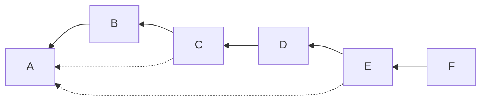
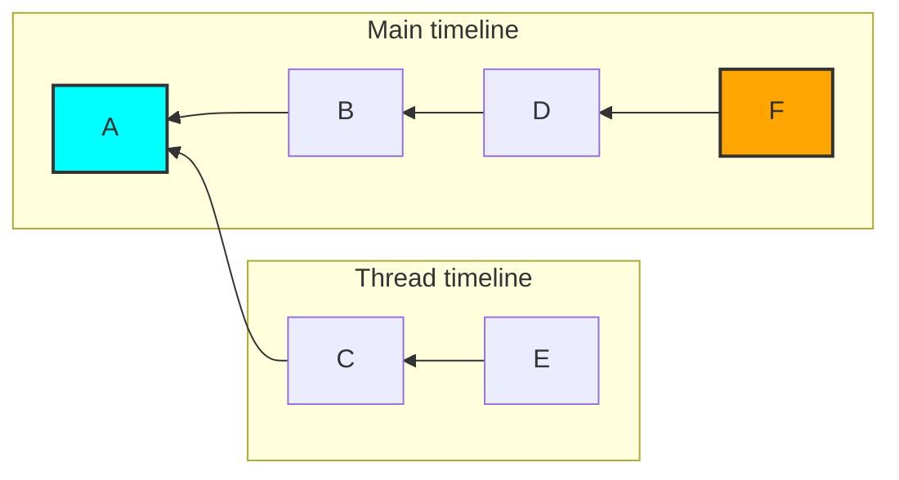

# MSC3771: Read receipts for threads

Currently, each room has a single read receipt per user. This is used to sync the
read status of a room across clients and calculate the number of unread messages.

Unfortunately a client displaying threads may show a subset of a room's messages
at a time, causing the read receipt to be misleading.

This might better be described by an example. Given a room with the following
DAG of events (note that the dotted lines are a thread relation, as specified by
[MSC3440](https://github.com/matrix-org/matrix-doc/pull/3440)):



A client might interpret this as:



While viewing the "main" timeline of the room, a client might move the read
receipt from event `A` to event `F` without ever showing events `C` and `E`. The
user then reads the thread, the client has no way to mark `E` as read.

## Proposal

This MSC proposes adding a new receipt type of `m.read.thread.private` is to be
added. This receipt type is used for clients to sync the read status of each
thread in a room.

The [`/receipt`](https://spec.matrix.org/v1.2/client-server-api/#post_matrixclientv3roomsroomidreceiptreceipttypeeventid)
endpoint gains a new optional path part and becomes:

`POST /_matrix/client/v3/rooms/{roomId}/receipt/{receiptType}/{eventId}/{context}`

The `context` contains the thread that the read receipts belongs to (i.e. it should
match the `event_id` contained within the `m.relates_to` of the event represented
by `eventId`). This updates the unique tuple for receipts from
`(room ID, user ID, receipt type)` to `(room ID, user ID, receipt type, context)`.
For backwards compatibility, a missing `context` is equivalent to an empty context.

Given a threaded message:

```json
{
  "event_id": "$thread_reply",
  "room_id": "!room:example.org",
  "content": {
    "m.relates_to": {
      "rel_type": "m.thread",
      "event_id": "$thread_root"
    }
  }
}
```

A client could mark this as read by sending a request:

```
POST /_matrix/client/r0/rooms/!room:example.org/receipt/m.read.thread.private/$thread_reply/$thread_root

{}
```

Similarly to the hidden read receipts from [MSC2285](https://github.com/matrix-org/matrix-spec-proposals/pull/2285),
homeservers are not to send the receipt to any other users except the sender nor
over federation.

This would then come down `/sync` for the user with other receipts:

```json
{
  "content": {
    "$thread_reply": {
      "m.read.thread.private": {
        "@rikj:jki.re": {
          "ts": 1436451550453,
          "context": "$thread_root"
        }
      }
    }
  },
  "room_id": "!jEsUZKDJdhlrceRyVU:example.org",
  "type": "m.receipt"
}
```

Since this is not shared, only the own user's matrix ID would be expected to
have this kind of receipt.

## Potential issues

For long-lived rooms or rooms with many threads there could be a significant number
of receipts. This has a few downsides:

* The size of the `/sync` response would increase without bound.
* The effort to generate and process the receipts for each room would increase
  without bound.

Due to both of the above, this proposal is limited to a *private* read receipt for
threads. This limits the impact to a user's own read receipts for threads, but
does not completely solve the issue.

[MSC2285](https://github.com/matrix-org/matrix-spec-proposals/pull/2285) suggests
that the `/read_markers` endpoint should become a generic bulk receipt endpoint.
This is not compatible with the additional `context` parameter in this MSC.

## Alternatives

Instead of adding the thread ID as a new path part, it could be added to the body
of the receipt. There may be a small backwards compatibility benefit to this, but
it seems clearer to put it as part of the URL.

Similarly, instead of adding a new receipt type, the read status of each thread in
a room could be added to the body of the `m.read.private` receipt. This could
cause data integrity issues if multiple clients attempt to update the receipt
without first reading it.

Instead of adding the thread ID as a new path part, it could be  encoded as a suffix
on the receipt, e.g. `m.thread.read.private-$abcd`. This has the benefit of not
changing the current receipt mechanisms, but seems sub-par and requires additional
parsing of opaque identifiers.

## Security considerations

There is potential for abuse by allowing clients to specify a unique `context`.
A mitigation could be to ensure that it is the related event of the thread, ensuring
that each thread only has a single context.

## Future extensions

Future extensions will tackle how the thread read receipts impact notification counts.

## Unstable prefix

During implementation the receipt type shall be `org.matrix.mscXXXX`.

To avoid receipts that will never be updated, after stabilization, homeservers are
expected to reject the unstable receipt type and purge all receipts using the
unstable receipt type.

To detect server support, clients can either rely on the spec version (when stable)
or the presence of a `org.matrix.msc3771` flag in `unstable_features` on `/versions`.

## Dependencies

This MSC depends on the following MSCs, which at the time of writing have not yet
been accepted into the spec:

* [MSC2285](https://github.com/matrix-org/matrix-spec-proposals/pull/2285): Hidden read receipts

As well as the following MSCs, which have been accepted into the spec, but have
yet to be released:

* [MSC2674](https://github.com/matrix-org/matrix-doc/pull/2674): Event Relationships
* [MSC3440](https://github.com/matrix-org/matrix-spec-proposals/pull/3440): Threading via `m.thread` relation
