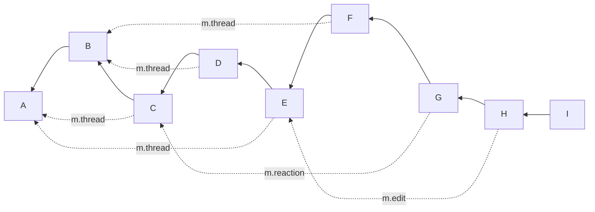
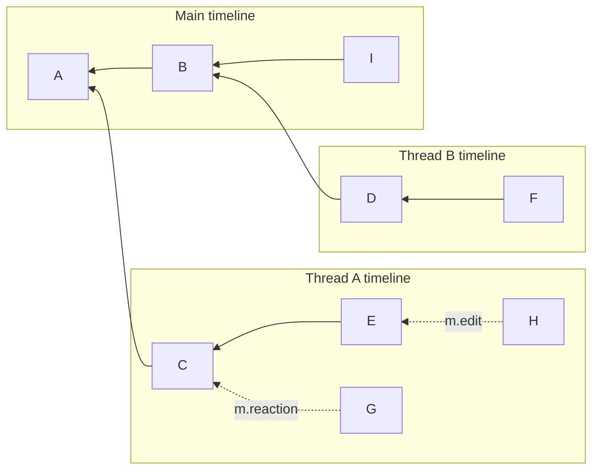
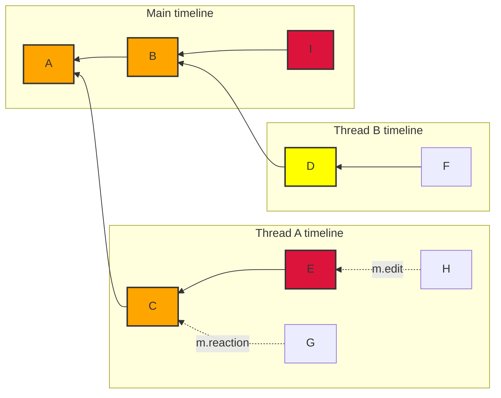

# MSC3771: Read receipts for threads

## Background

Currently, each room can only have a single receipt of each type per user. The
read receipt ([`m.read`](https://spec.matrix.org/v1.3/client-server-api/#receipts)
or [`m.read.private`](https://github.com/matrix-org/matrix-spec-proposals/pull/2285))
is used to sync the read status of a room across clients, to share with other
users which events have been read, and is used by the homeserver to calculate the
number of unread messages.

Now that [MSC3440](https://github.com/matrix-org/matrix-doc/pull/3440) has merged
to add support for threads, there are two ways to display messages:

* *Unthreaded*: The traditional way of displaying messages before threads existed.
  All messages are just shown in the order they’re provided by the server as a
  single timeline[^1].
* *Threaded*: Taking into account the `m.thread` and other relations to separate
  a room DAG into multiple sub-timelines:
  * One timeline for each root message (I.e. the target of a thread relation)
  * One for messages which are not part of a thread: the main timeline.

For an example room DAG (solid lines are show topological ordering, dotted lines
show event relations):



This can be separated into three threaded timelines:



Due to this separation of messages into separate timelines a single read receipt
per room causes missed (or flaky) notification counts and does not give an accurate
representation of what messages have been read by people.

Note that it is expected that some clients will continue to show only an unthreaded
view of the room, either until they are able to support a threaded view or because
they do not wish to incorporate threads.

## Proposal

This MSC proposes allowing a receipt per thread, as well as an unthreaded receipt.
Thus, receipts are split into two categories, which this document calls "unthreaded"
and "threaded". Threaded receipts are identified by the root message of the thread;
additionally there is a special pseudo-thread for the main timeline.

The most significant difference between threaded and unthreaded receipts is how
they clear notifications:

* Unthreaded receipts clear notifications just as they do today (i.e.
  "notifications prior to and including that event MUST be marked as read").
* Threaded receipts clear notifications in a similar way, but taking into account
  the thread the receipt is part of (i.e. "notifications generated from events
  with a thread relation matching the receipt’s thread ID prior to and including
  that event which are MUST be marked as read")

Using the above diagrams with threaded read receipts on `E` and `I`; and an
unthreaded read receipt on `D` would give:



As denoted by the colors:

* The unthreaded read receipt on `D` would mark `A`, `B`, `C`, and `D` as read.
* The threaded read receipt on `E` would mark `C` and `E` as read.
* The threaded read receipt on `I` would mark `A`, `B`, and `I` as read.

### Threaded receipts

This MSC proposes allowing the same receipt type to exist multiple times in a room
per user:

* Once for the unthreaded timeline.
* Once for the main timeline in the room.
* Once per threaded timeline.

No other changes to receipts are proposed, i.e. this still does not allow a caller
to move their receipts backwards in a room. The relationship between `m.read` and
`m.read.private` is not changed.

The body of request to the [`/receipt` endpoint](https://spec.matrix.org/v1.2/client-server-api/#post_matrixclientv3roomsroomidreceiptreceipttypeeventid)
gains the following optional fields:

* `thread_id` (`string`): The thread that the receipt belongs to (i.e. the
  `event_id` contained within the `m.relates_to` of the event represented by
  `eventId`).

  A special value of `"main"` corresponds to the receipt being for the main
  timeline (i.e. events which are not part of a thread).

  If this field is not provided than the receipt applies to the unthreaded
  version of the room.[^2]

The following conditions are errors and should be rejected with a `400` error
with `errcode` of `M_INVALID_PARAM`:

* A non-string `thread_id` (or empty) `thread_id` field.
* Providing the `thread_id` properties for a receipt of type `m.fully_read`.
* If the given `event_id` is not related to the `thread_id`. There may be multiple
  relations between events ((e.g. a `m.annotation` to `m.thread`), homeservers
  should apply a reasonable maximum number of relations to traverse when attempting
  to identify if an event is part of a thread.

  It is recommended that at least 3 relations are traversed when attempting to find
  a thread, implementations should be careful to not infinitely recurse.[^3]

Given a threaded message:

```json
{
  "event_id": "$thread_reply",
  "room_id": "!room:example.org",
  "content": {
    "m.relates_to": {
      "rel_type": "m.thread",
      "event_id": "$thread_root"
    }
  }
}
```

A client could mark this as read by sending a request:

```
POST /_matrix/client/r0/rooms/!room:example.org/receipt/m.read/$thread_reply

{
  "thread_id": "$thread_root"
}
```

And to send a receipt on the main timeline (e.g. on the root event):

```
POST /_matrix/client/r0/rooms/!room:example.org/receipt/m.read/$thread_root

{
  "thread_id": "main"
}
```

As it is today, not providing the `thread_id` field sends an unthreaded receipt:

```
POST /_matrix/client/r0/rooms/!room:example.org/receipt/m.read/$thread_root

{}
```

### Receiving threaded receipts via `/sync`.

The client would receive this as part of `/sync` response similar to other receipts:

```json5
{
  "content": {
    "$thread_reply": {
      "m.read": {
        "@rikj:jki.re": {
          "ts": 1436451550453,
          "thread_id": "$thread_root" // or "main" or absent
        }
      }
    }
  },
  "room_id": "!jEsUZKDJdhlrceRyVU:example.org",
  "type": "m.receipt"
}
```

If there is no `thread_id` field then the receipt applies to the unthreaded
timeline. Clients may interpret this as applying only to the main timeline or
as applying across the main timeline and all threaded timelines.

### Sending threaded receipts over federation

Homeservers should include a `thread_id` field for threaded receipts in the
[Receipt Metadata](https://spec.matrix.org/v1.3/server-server-api/#receipts) when
sending the `m.receipt` EDU over federation. Unthreaded receipts lack this field,
as they do today.

### Notifications

[MSC3773](https://github.com/matrix-org/matrix-spec-proposals/pull/3773) discusses
how notifications for threads are created and returned to the client, but does
not provide a way to clear threaded notifications.

A threaded read receipt (i.e. a `m.read` or `m.read.private` receipt with a `thread_id`
property) should clear notifications for the matching thread following the
[current rules](https://spec.matrix.org/v1.3/client-server-api/#receiving-notifications),
but only clear notifications with a matching `thread_id` (as discussed in MSC3773).
See the examples of the read receipts on `E` and `I` [above](#proposal).

An unthreaded read receipt (i.e. a `m.read` or `m.read.private` receipt *without*
a `thread_id`) should apply the [current rules](https://spec.matrix.org/v1.3/client-server-api/#receiving-notifications)
and disregard thread information when clearing notifications. To re-iterate, this
means it would clear any earlier notifications across *all* threads. This is
illustrated by the read receipt on event `D` [above](#proposal).

## Potential issues

### Long-lived rooms

For long-lived rooms or rooms with many threads there could be a significant number
of receipts. This has a few downsides:

* The size of the `/sync` response would increase without bound.
* The effort to generate and process the receipts for each room would increase
  without bound.

### Compatibility with unthreaded clients

When a user has both a client which is "unthreaded" and "threaded" then there
is a possibility for read receipts to be misrepresented when switching between
clients. Using the example room DAG from the preamble of this MSC:

* A user which has an unthreaded receipt on event `D` and a threaded receipt on
  event `E` would likely see event `E` as unread on an "unthreaded" client.

The proposed solution may result in events being incorrectly marked as unread
(when they have been read). The false positive for unread notifications is
deliberate to avoid losing message / missing notifications.

Solutions to this problem are deemed out of scope of this MSC. A solution that
was briefly explored was [ranged read receipts](https://hackmd.io/Gxm8zuuSROeencoJ6gjgSg).

### Federation compatibility

A homeserver which does not understand threaded receipts will be unable to properly
understand that multiple receipts exist in a room. They will generally be processed
as unthreaded receipts with the latest receipt winning, regardless of thread.

This could make read receipts of remote users jump between threads, but this should
not be any worse than it is today. Additionally, since it only affects remote
users, it will not impact notifications.

## Alternatives

### Thread ID location

Instead of adding the thread ID as a new path part, it could be added to the body
of the receipt. There may be a small backwards compatibility benefit to this, but
it seems clearer to put it as part of the URL.

Instead of encoding the thread ID as an integral part of the receipt, all of the
read threads could be added to the body of the single receipt. This could cause
data integrity issues if multiple clients attempt to update the receipt without
first reading it.

### Receipt type

To potentially improve compatibility it could make sense to use a separate receipt
type (e.g. `m.read.thread`) as the read receipt for threads. Without some syncing
mechanism between unthreaded and threaded receipts this seems likely to cause
users to re-read the same notifications on threaded and unthreaded clients.

While it is possible to map from an unthreaded read receipt to multiple threaded
read receipts, the opposite is not possible (to the author's knowledge). In short,
it seems the [compatibility issues discussed above](#compatibility-with-unthreaded-clients)
would not be solved by adding more receipt types.

This also gets more complcated with the addition of the `m.read.private` receipt --
would there additionally be an `m.read.private.thread`? How do you map between
all of these?

## Security considerations

There is potential for abuse by allowing clients to specify a unique `threadId`.
A mitigation could be to ensure that the receipt is related to an event of the
thread, ensuring that each thread only has a single receipt.

## Future extensions

### Threaded fully read markers

The `m.fully_read` marker is not supported in threads, a future MSC could expand
support to this pseudo-receipt.

### Setting threaded receipts using the `/read_markers` endpoint

This MSC does not propose expanding the `/read_markers` endpoint to support threaded
receipts. A future MSC might expand this to support an object per receipt with
an event ID and thread ID or some other way of setting multiple receipts at once.

## Unstable prefix

To detect server support, clients can either rely on the spec version (when stable)
or the presence of a `org.matrix.msc3771` flag in `unstable_features` on `/versions`.

## Dependencies

This MSC depends on the following MSCs, which have not yet been accepted into
the spec:

* [MSC3773](https://github.com/matrix-org/matrix-spec-proposals/pull/3773): Notifications for threads

[^1]: Throughout this document "timeline" is used to mean what the user sees in
the user interface of their Matrix client.

[^2]: Generally it would be surprising if the same client sent both threaded and
unthreaded receipts, but it is allowed. The only known use-case for this is that
a threaded client can use this to clear *all* notifications in a room by sending
an unthreaded read receipt on the latest event in the room (regardless of which
thread it appears in).

[^3]: Three relations is relatively arbitrary, but is meant to cover an edit or
reaction to a thread (to an event with no relations, i.e. the root of a thread):
`A<--[m.thread]--B<--[m.annotation]--C`.
With an additional leftover for future improvements. This is considered reasonable
since threads cannot fork, edits cannot modify relation information, and generally
annotations to annotations are ignored by user interfaces.
