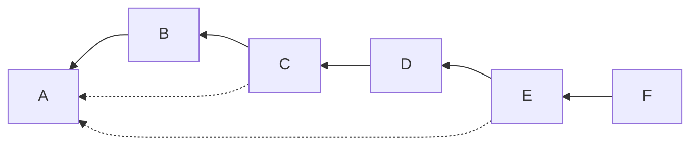
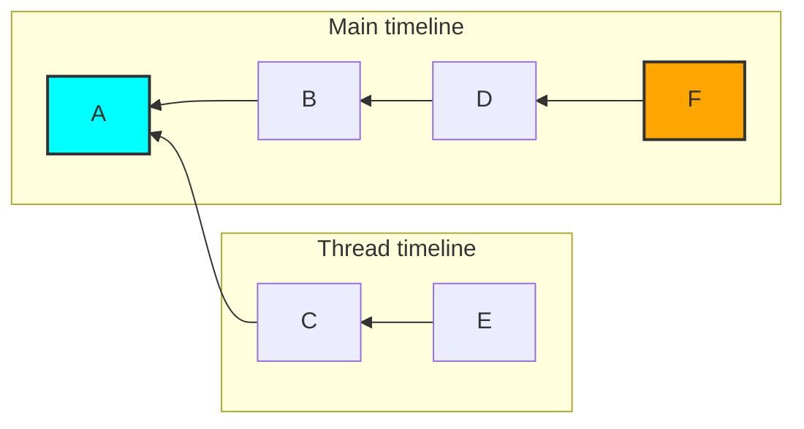

# MSC3771: Read receipts for threads

Currently, each room can only have a single receipt of each type per user. The
read receipt (`m.read` or `m.read.private`) is used to sync the read status of a
room across clients, to share with other users which events have been read and
is used by the homeserver to calculate the number of unread messages.

Unfortunately a client displaying threads may show a subset of a room's messages
at a time, causing a user's read receipt to be misleading.

This might better be described by an example. Given a room with the following
DAG of events (note that the dotted lines are a thread relation, as specified by
[MSC3440](https://github.com/matrix-org/matrix-doc/pull/3440)):



A client might interpret this as:



While viewing the "main" timeline of the room, a client might move the read
receipt from event `A` to event `F` without ever showing events `C` and `E`. The
user then reads the thread, the client has no way to mark `E` as read.

## Proposal

### Threaded receipts

This MSC proposes allowing the same receipt type to exist multiple times in a room,
once per thread.

To denote that a receipt belongs to a thread, the body of the receipt can include
a `thread_id` property when calling the [`/receipt` endpoint](https://spec.matrix.org/v1.2/client-server-api/#post_matrixclientv3roomsroomidreceiptreceipttypeeventid).

The `thread_id` contains the thread that the receipt belongs to (i.e. it should
match the `event_id` contained within the `m.relates_to` of the event represented
by `eventId`). Omitting the `thread_id` corresponds to the receipt being for the
"main" timeline (or events which are not part of a thread). A non-string `thread_id`
(or empty) `thread_id` field is an error and should be rejected with a `400` error
with `errcode` of `M_INVALID_PARAM`.

This updates the unique tuple for receipts from
`(room ID, user ID, receipt type)` to `(room ID, user ID, receipt type, thread ID)`.

Given a threaded message:

```json
{
  "event_id": "$thread_reply",
  "room_id": "!room:example.org",
  "content": {
    "m.relates_to": {
      "rel_type": "m.thread",
      "event_id": "$thread_root"
    }
  }
}
```

A client could mark this as read by sending a request:

```
POST /_matrix/client/r0/rooms/!room:example.org/receipt/m.read/$thread_reply

{
  "thread_id": "$thread_root"
}
```

The `thread_id` property is not valid for `m.fully_read` receipts.

### Receiving threaded receipts

This would then come down `/sync` for the user with other receipts:

```json
{
  "content": {
    "$thread_reply": {
      "m.read": {
        "@rikj:jki.re": {
          "ts": 1436451550453,
          "thread_id": "$thread_root"
        }
      }
    }
  },
  "room_id": "!jEsUZKDJdhlrceRyVU:example.org",
  "type": "m.receipt"
}
```

Since [event bodies must be treated as untrusted](https://spec.matrix.org/latest/client-server-api/#room-event-format)
the `thread_id` field may be of an invalid form. It should be treated as missing
if the field is not a non-empty string.

### Notifications

[MSC3773](https://github.com/matrix-org/matrix-spec-proposals/pull/3773) discusses
how notifications for threads are created and returned to the client, but does
not provide a way to clear threaded notifications.

A threaded read receipt (i.e. a `m.read` or `m.read.private` receipt with a `thread_id`
property) should clear notifications for the matching thread following the
[same rules](https://spec.matrix.org/latest/client-server-api/#receiving-notifications)
as notifications which are not part of a thread.

XXX Add an example here.

## Potential issues

For long-lived rooms or rooms with many threads there could be a significant number
of receipts. This has a few downsides:

* The size of the `/sync` response would increase without bound.
* The effort to generate and process the receipts for each room would increase
  without bound.

[MSC2285](https://github.com/matrix-org/matrix-spec-proposals/pull/2285) suggests
that the `/read_markers` endpoint should become a generic bulk receipt endpoint.
This is not compatible with the additional `threadId` parameter in this MSC.

### Compatibility with unthreaded clients

When a user has both a client which is "unthreaded" and "threaded" then there
is a possibility for read receipts to be misrepresented when switching between
clients. Solutions to this problem are deemed out of scope of this MSC.

### Second-order relations

XXX Is this valid?

## Alternatives

### Thread ID location

Instead of adding the thread ID as a new path part, it could be added to the body
of the receipt. There may be a small backwards compatibility benefit to this, but
it seems clearer to put it as part of the URL.

Instead of encoding the thread ID as an integral part of the receipt, all of the
read threads could be added to the body of the single receipt. This could cause
data integrity issues if multiple clients attempt to update the receipt without
first reading it.

### Receipt type

To potentially improve compatibility it could make sense to use a separate receipt
type (e.g. `m.read.thread`) as the read receipt for threads. Without some syncing
mechanism between unthreaded and threaded receipts this seems likely to cause
users to re-read the same notifications on threaded and unthreaded clients.

While it is possible to map from an unthreaded read receipt to multiple threaded
read receipts, the opposite is not possible (to the author's knowledge). In short,
it seems the [compatibility issues discussed above](#compatibility-with-unthreaded-clients)
would not be solved by adding more receipt types.

This also gets more complcated with the addition of the `m.read.private` receipt --
would there additionally be an `m.read.private.thread`? How do you map between
all of these?

## Security considerations

There is potential for abuse by allowing clients to specify a unique `threadId`.
A mitigation could be to ensure that the receipt is related to an event of the
thread, ensuring that each thread only has a single receipt.

## Future extensions

### Threaded fully read markers

The `m.fully_read` marker is not supported in threads, a future MSC could expand
support to this pseudo-receipt.

### Setting threaded receipts using the `/read_markers` endpoint

This MSC does not propose expanding the `/read_markers` endpoint to support threaded
receipts. A future MSC might expand this to support an object per receipt with
an event ID and thread ID or some other way of setting multiple receipts at once.

## Unstable prefix

To detect server support, clients can either rely on the spec version (when stable)
or the presence of a `org.matrix.msc3771` flag in `unstable_features` on `/versions`.

## Dependencies

This MSC depends on the following MSCs, which have not yet been accepted into
the spec:

* [MSC3773](https://github.com/matrix-org/matrix-spec-proposals/pull/3773): Notifications for threads
