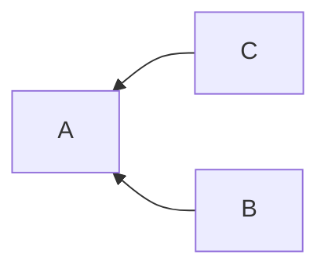

# MSC3772: Push rule for mutually related events

It is useful for users to be able to control getting notified for events which
relate to events they have shown interest in. This is useful if:

* Another user replies to a thread the user has also replied to, i.e. the user is
  interested in a thread and wants to know when others respond.
* Another user has voted in a poll the user has voted in, i.e. the user wants to
  know the results of a poll as people vote for it.
* For "subscribing" to or "following" a thread or poll.[^1]

## Proposal

## New push rule condition: ``relation_match``

A new [push rule condition](https://spec.matrix.org/v1.2/client-server-api/#conditions-1)
is proposed to match against other events which relate to the same event as the
current event. Unlike [MSC3664](https://github.com/matrix-org/matrix-spec-proposals/pull/3664),
which matches against the *related event*, this proposes matching against *other events
with the same relation*. Such a condition could look like this:

```json
{
  "kind": "relation_match",
  "rel_type": "m.thread",
  "sender": "@me:my.server"
}
```

This condition can be used to notify me whenever someone sends a reply to a thread
that I have also replied to. For example, if there's a thread on event `A` and
I have sent event `B`, the rule could match event `C` from another user.



The condition can include the following fields to check:

* `rel_type`: The relation type of the other event to the parent event.
* `sender` (optional): The sender of the other event.
* `type` (optional): The type of the other event.

Another example would be to be notified of a poll closing (from
[MSC3381](https://github.com/matrix-org/matrix-spec-proposals/pull/3381)), but
only if the user has voted in it:

```json
[
  {
    "kind": "event_match",
    "key": "type",
    "pattern": "m.poll.end"
  },
  {
    "kind": "relation_match",
    "rel_type": "m.reference",
    "sender": "@me:my.server",
    "type": "m.poll.response"
  }
]
```

(Note that the `type` is important since `m.reference` is used in multiple contexts.)

A client can check for the `relation_match` condition being supported by testing
for an existing `.m.rule.thread_reply` in the default rules (see below).

Matching is done on a best effort basis: when evaluating the push rule against an event,
if the server (or client) doesn't know of any other events which meet the specified
conditions than the rule should not be matched and processing continues with the
next push rule.

### A push rule for threads

For users to easily track notification of threads they have interacted with the
following default push rules are proposed.

Each rule should be a [default underride rule](https://spec.matrix.org/latest/client-server-api/#default-underride-rules),
since it can't be a content rule and should be overridden when setting a room to
mentions only. They should be placed just before `.m.rule.message` in the list.
This ensures you get notified for replies to threads you're interested in. The
actions are the same as for `.m.rule.message` and `m.rule.encrypted`.

Note that an encrypted form of these rules are not needed since relation information
and metadata required for it to function is not encrypted.

#### Threaded replies to the user's message

To receive notification that there is a reply to a thread that has the user's
message as the root message. (Note that this uses `related_event_match` from
[MSC3664](https://github.com/matrix-org/matrix-spec-proposals/pull/3664).)

```json5
{
  "rule_id": ".m.rule.thread_reply_to_me",
  "default": true,
  "enabled": true,
  "conditions": [
    {
      "kind": "related_event_match", // from MSC3664
      "rel_type": "m.thread",
      "key": "sender",
      "pattern": "@me:my.server"
    }
  ],
  "actions": [
    "notify"
  ]
}
```

#### Replies to threads the user has replied to

To receive notification when there is a reply to a thread that the user has also
replied to.

```json5
{
  "rule_id": ".m.rule.thread_reply",
  "default": true,
  "enabled": true,
  "conditions": [
    {
      "kind": "relation_match",
      "rel_type": "m.thread",
      "sender": "@me:my.server"
    }
  ],
  "actions": [
    "notify"
  ]
}
```

## Potential issues

### Performance

Most push rules for mutually related events will need a lookup into metadata on
other events. This causes additional implementation complexity and can potentially
be expensive. The fields available for the `relation_match` are chosen to be event
and relation metadata to avoid requiring evaluation against the event contents
of many events.

### Client implementation

This may be difficult for clients to implement (as they may not know every related
event without fetching many events locally), but for the default case of matching
against the sender's events it should be reasonable to implement.

Additionally, it should be possible to implement this for encrypted rooms server
side due to [event relations not being encrypted](https://github.com/matrix-org/matrix-spec/issues/660).
There may not be enough information for a client to understand why an unread
notification came from a relation, however.

### Updating default push rules

As mentioned in [MSC3664](https://github.com/matrix-org/matrix-spec-proposals/pull/3664),
adding a new rule could cause notifications for users who have previously disabled
notifications. This is made worse by clients potentially not yet having UI to
disable the notifications. Overall it is seen as an improvement that allows users
to have finger grain control of notifications in threads.

## Alternatives

### Alternative to push rules

There have been thoughts to replace push rules (see [MSC2785](https://github.com/matrix-org/matrix-spec-proposals/pull/2785))
or to circumvent them (see [MSC2654](https://github.com/matrix-org/matrix-spec-proposals/pull/2654))
for some notification work, but since they are the current system used for notification
it seems prudent to build on top of them instead of blocking behind work that is
not finished.

### `sender` field

All of the given examples are only relevant when the current user also has a
relation to same parent event as the current event being checked. This could be
assumed instead of having a `sender` field, but would be less flexible. For
example, it would not be possible to create a rule such as "notify me of any thread
which includes a poll in it".

## Security considerations

N/A

## Unstable prefix

While this feature is in development the following unstable prefixes should be used:

* `relation_match` --> `org.matrix.msc3772.relation_match`
* `.m.rule.thread_reply_to_me` --> `.org.matrix.msc3772.thread_reply_to_me`
* `.m.rule.thread_reply` --> `.org.matrix.msc3772.thread_reply`

## Dependencies

This MSC depends on the following MSCs, which at the time of writing have not yet
been accepted into the spec:

* [MSC3664](https://github.com/matrix-org/matrix-spec-proposals/pull/3664): Pushrules for relations

This MSC depends on the following MSCs, which have been accepted into the spec,
but have yet to be released:

* [MSC2674](https://github.com/matrix-org/matrix-doc/pull/2674): Event Relationships
* [MSC3440](https://github.com/matrix-org/matrix-spec-proposals/pull/3440): Threading via `m.thread` relation

[^1]: This is already possible today, but it is a useful example to consider.
For threads which a user is interested in a push rule can be added with the
following condition:

```json
[
  {
    "kind": "event_match",
    "key": "content.relates_to.rel_type",
    "pattern": "m.thread"
  },
  {
    "kind": "event_match",
    "key": "content.relates_to.event_id",
    "pattern": "$thread_root"
  }
]
```
