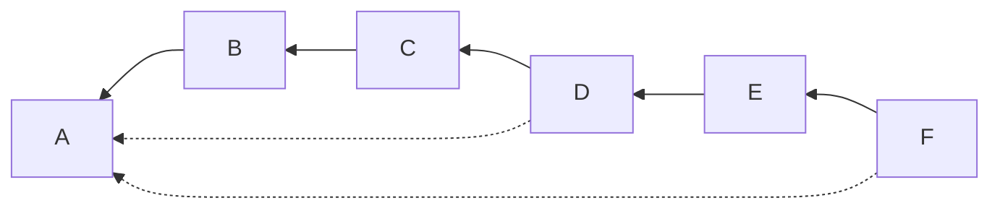
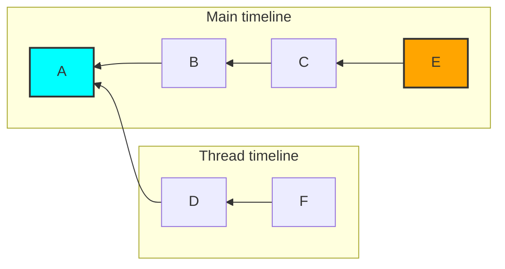

# MSC3773: Notifications for threads

Since the unread notification count does not consider threads, a client is unable
to separate the unread message counts into threads without iterating over every
missing message. Without this, clients are unable to:

* Let users know that a thread has new messages since they last read it.
* Accurately display a count of unread messages in a room.

To illustrate the issue with the current unread notification counts, we can use
the following DAG of events (note that the dotted lines are a thread relation,
as specified by [MSC3440](https://github.com/matrix-org/matrix-doc/pull/3440)):



A client might interpret this as:



While viewing the "main" timeline of the room, a client might move the read
receipt from event `A` to event `E`. While the read receipt is at `A`, the unread
notifications would be 5, once it moves to `E` it would be 1. Neither of these
numbers make much sense to the user:

* They have only read 3 messages (`B`, `C`, and `E`), but the unread count dropped by 4.
* There's no more messages to read, but it reports 1 unread message.

## Proposal

### A new push rule action: `relation`

In order for clients to separate the notification of threads from the main timeline,
a new `action` is proposed for push rules:

* `notify_thread`: This causes each matching event to generate a notification
  in the context of a thread matching the `m.relates_to` information. If the event
  is not part of a thread the behavior is the same as `dont_notify`.

[Similarly to the `notify` action](https://spec.matrix.org/v1.2/client-server-api/#receiving-notifications),
this increments the notification count for a thread specific notification count
n addition to the overall room's unread notification count.  Setting a `highlight`
tweak will cause the highlight count to increase in addition to the notification
count.[^1]

MSC3773 compatible clients will need to subtract off the count of each thread from
the overall room count to get an accurate room count. This is to be backwards
compatible with the current unread counts.

In order to make use of this by default, the `actions` section of the
`.m.rule.thread_reply` proposed in MSC3773 is updated to be `notfiy_thread`.

```json5
{
  "rule_id": ".m.rule.thread_reply",
  "default": true,
  "enabled": true,
  "conditions": [
    {
      "kind": "related_event_match", // from MSC3664
      "rel_type": "m.thread",
      "key": "sender",
      "pattern": "@me:my.server"
    },
    {
      "kind": "relation_match",  // from MSC3772
      "rel_type": "m.thread",
      "sender": "@me:my.server"
    }
  ],
  "actions": [
    "notify_thread"  // from MSC3773
  ]
}
```

### Unread thread notifications in the sync response

For each ["Joined Room" in the `/sync` response](https://spec.matrix.org/latest/client-server-api/#get_matrixclientv3sync)
a new field is added:

* `unread_threads`: Counts of unread thread notifications for this room, a map of
  thread ID to "Unread Notification Counts".

An example of a joined room from a sync response:

```json5
{
  "account_data": {
    // ...
  },
  "ephemeral": {
    // ...
  },
  "state": {
    // ...
  },
  "summary": {
    // ...
  },
  "timeline": {
    "events": [
      {
        "event_id": "$143273582443PhrSn:example.org",
        // other fields ...
      },
      {
        "event_id": "$SGNxGPGUopcPBUoTTL:example.org",
        "m.relates_to": {
          "event_id": "$143273582443PhrSn:example.org",
          "rel_type": "m.thread"
        }
        // other fields ...
      }
    ]
  },
  "unread_notifications": {
    "highlight_count": 2,
    "notification_count": 18
  },
  "unread_threads": {
    "$143273582443PhrSn:example.org": {
      "highlight_count": 0,
      "notification_count": 1
    }
  }
}
```

Similarly to read receipts, when the user updates their `m.read.thread.private`
read receipt from [MSC3771](https://github.com/matrix-org/matrix-spec-proposals/pull/3771)
(either by using the API or by sending an event into the thread), notifications
prior to and including that event in the thread MUST be marked as read. In order
to keep the unread counts for the room, the equivalent amount of unread
notifications for the room are decremented at the same time.

## Potential issues

Trying to support backwards compatibility with the unread notifications count may
prove finicky, but should be workable. This creates a significant amount more
bookkeeping for the homeserver which could prove to be expensive.

This has similar caveats to MSC3771 about the size of the `/sync` response -- if
there are threads which are never read it the notification counts will continually
appear in the sync response. This is not dissimilar to rooms which are never read,
however, as their unread counts are tracked and returned.

This is somewhat incompatible with [MSC3768](https://github.com/matrix-org/matrix-spec-proposals/pull/3768)
as that adds a new action as well (`notify_in_app`). It should be possible to
layer in support without having to create a `notify_thread_in_app` action, but
this hasn't been fully considered:

| `actions`                        | Implied value                                          |
|----------------------------------|--------------------------------------------------------|
| [`notify`]                         | `notify`                                               |
| [`notify_thread`]                  | `notify` + `notify_thread` (MSC3773 behavior)          |
| [`notify_in_app`]                  | `notify_in_app`                                        |
| [`notify_in_app`, `notify_thread`] | `notify_in_app`, `notify_thread` (MSC3768 for threads) |

## Alternatives

### Alternative to push rules

There have been thoughts to replace push rules (see [MSC2785](https://github.com/matrix-org/matrix-spec-proposals/pull/2785))
or to circumvent them (see [MSC2654](https://github.com/matrix-org/matrix-spec-proposals/pull/2654))
for some notification work, but since they are the current system used for notification
it seems prudent to build on top of them instead of blocking behind work that is
not finished.

### An `action` instead of a `tweak`?

It was considered to add a `relation` or `thread` tweak, but this would not be
passed through to the push server, which is at odds with the current `tweaks`
mechanism.

## Security considerations

N/A

## Unstable prefix

While this feature is in development the following unstable prefixes should be used:

* `unread_threads` --> `org.matrix.msc3773.unread_threads`

To detect server support, clients can either rely on the spec version (when stable)
or the presence of a `org.matrix.msc3773` flag in `unstable_features` on `/versions`.

## Dependencies

This MSC depends on the following MSCs, which at the time of writing have not yet
been accepted into the spec:

* [MSC3771](https://github.com/matrix-org/matrix-spec-proposals/pull/3771): Read receipts for threads
* [MSC3772](https://github.com/matrix-org/matrix-spec-proposals/pull/3772): Push rule for mutually related events

[^1]: Note that this section is already vague and does not mention the difference
between "unread" and "highlight".
