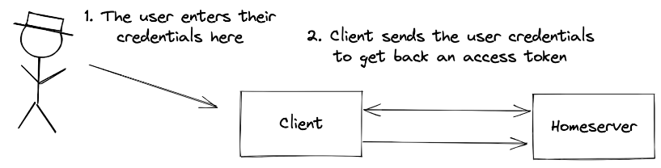
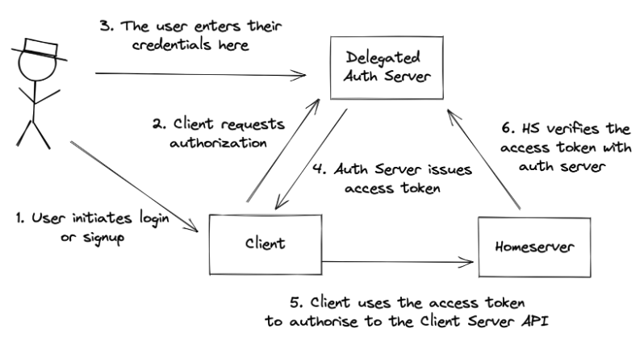
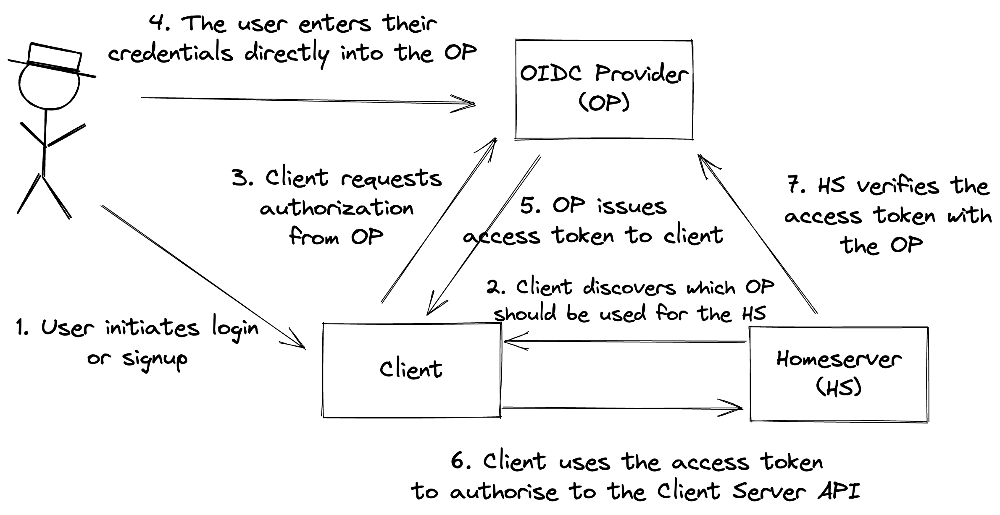

# MSC3861: Matrix architecture change to delegate authentication via OIDC

This MSC proposes a change to the architecture of Matrix with respect to how authentication works.

## Existing architecture

Currently Matrix uses a custom authentication protocol baked in to the Client-Server API.

In a overly simplified form it looks a bit like this:

- Matrix Clients are required (and trusted) to show the UI for login and registration.
- Matrix Homeservers are responsible for authenticating users and issuing access tokens.

We've then added on things like: User-Interactive Auth which provides a standard for specifying an arbitrary sequence of steps including auth, T&C acceptance, CAPTCHA; password management; sessions management; and more.

The are issues with this current approach:

- 👎 Heavyweight for client and homeserver to implement and as a consequence many do not implement all capabilities
  - e.g. Dendrite only does password auth
- 👎 Doesn't incorporate best security practices (particularly in case of SSO flow)
- 👎 Requires an MSC for every "new" auth capability such as 2FA and WebAuthn
- 👎 We're training our users to enter their Matrix credentials in random web pages and native apps

## Matrix is not an authentication protocol

Quoting the [spec](https://spec.matrix.org/latest/#introduction-to-the-matrix-apis):

> Matrix is a set of open APIs for open-federated Instant Messaging (IM), Voice over IP (VoIP) and Internet of Things (IoT) communication, designed to create and support a new global real-time communication ecosystem. The intention is to provide an **open decentralised pubsub layer for the internet for securely persisting and publishing/subscribing JSON objects**.

So, fundamentally, Matrix does not set out to be a authentication protocol.

Yes, the ecosystem needs authentication to work, but it is not core to the mission.

## Alternative architecture

The key concept of this proposal is the idea that the Matrix ecosystem would be better served by an architecture where authentication is decoupled from the Homeserver to some kind of authentication server.

That decoupling would be achieved by adopting an existing open authentication protocol rather than writing our own.

It would look something like this:

Some of the benefits of this are:

- 👍 Simpler for Homeservers and clients to implement
- 👍 Benefits similar to SSO such as:
  - logging into multiple clients on the same device without entering the credentials multiple times
  - having the credentials bound to the auth server domain instead of the client (for password managers and WebAuthn)
- 👍 Benefit from larger existing community around a standard:
  - Existing SDKs
  - More battle testing and hardening
- 👍 Moves auth outside of the scope of Matrix spec
  - ...allows the community to focus on what Matrix does best

It also allows the work of the Matrix community around auth to benefit other communities and users of the standard.

## Adoption of OIDC as delegated protocol of choice 

Specifically it is proposed that the OpenID Connect (OIDC) protocol is chosen to support the Matrix ecosystem.

There are six proposed action points:

1. Accept the set of MSCs to enable delegation via OIDC.
1. The Matrix.org Foundation join the [OpenID Foundation](https://openid.net/foundation/) as a non-profit member to support their work to build a robust and audited ecosystem for open authentication.
1. Deprecate non-OIDC auth related API endpoints or capabilities in existing Matrix APIs.
1. Provide migration support to the ecosystem.
1. Close all existing MSCs relating to non-OIDC as `obsolete`.
1. Remove the deprecated API endpoints/capabilities from the spec at an appropriate point in future.

Due to the complexity of this proposal it has been broken down into a number of constituent sub-proposals:

| Ref | Purpose |
| - | - |
| [MSC2964](https://github.com/matrix-org/matrix-doc/pull/2964) | Describes how homeservers can delegate auth to an OpenID Provider |
| [MSC2965](https://github.com/matrix-org/matrix-doc/pull/2965) | Describes how participants in the Matrix ecosystem can discover the available capabilities of OIDC-enabled Homeservers and OpenID Providers |
| [MSC2966](https://github.com/matrix-org/matrix-doc/pull/2966) | Describes how OAuth 2.0 Dynamic Client Registration can be used to facilitate interoperability and openness of clients whilst promoting trust |
| [MSC2967](https://github.com/matrix-org/matrix-doc/pull/2967) | Defines the namespace for a set of API scopes that can can expanded in future to allow for finer grained permissioning |
| [MSC3824](https://github.com/matrix-org/matrix-doc/pull/3824) | Proposes some minor changes to the C-S API to allow Matrix clients that are not fully OIDC-native to work best with an OIDC enabled homeserver that has is serving a compatibility layer |

## Potential issues

This proposal requires changes to all Clients, Homeservers, Bridges etc. This will take some time.

Furthermore, during a migration period it will be necessary to support both existing "legacy" auth as well as OIDC.

For existing Homeserver deployments we will need to work out migration paths and provide tools to facilitate the transition.

## Alternatives

The primary alternative is to continue to build out the auth capabilities within the Client-Server API.

For example, UIA (User-Interactive Auth) could be added to the `/login` endpoint and additional capabilities/flows added to UIA.

Examples of existing proposals include:

| Proposals | Comments |
| - | - |
| [MSC1998: Two-Factor Authentication Providers](https://github.com/matrix-org/matrix-spec-proposals/pull/1998) [MSC2271: TOTP 2FA login](https://github.com/matrix-org/matrix-spec-proposals/pull/2271) | OP is free to implement MFA and many do. The [Matrix OIDC Playground](https://github.com/vector-im/oidc-playground) contains a Keycloak configured to demonstrate this |
| [MSC2000: Server-side password policies](https://github.com/matrix-org/matrix-spec-proposals/pull/2000) | Because the UI is served by the OP it is free to implement whatever password policies it sees fit |
| [MSC3105: Previewing UIA flows](https://github.com/matrix-org/matrix-spec-proposals/pull/3105) [MSC3741: Revealing the useful login flows to clients after a soft logout](https://github.com/matrix-org/matrix-spec-proposals/pull/3741) | These become unnecessary as the burden to implement auth flows is moved away from the client to the OP |
| [MSC3262: aPAKE authentication](https://github.com/matrix-org/matrix-spec-proposals/pull/3262) [MSC2957: Cryptographically Concealed Credentials](https://github.com/matrix-org/matrix-spec-proposals/pull/2957) | This is an interesting one as OIDC explicitly discourages a user from trusting their client with credentials. As such there is no existing flow for PAKEs. To achieve this in OIDC you would need to implement a custom grant in the Client and OP (perhaps an extension of the Resource Owner Password Credentials flow).|
| [MSC3782: Matrix public key login spec](https://github.com/matrix-org/matrix-spec-proposals/pull/3782) | Similar to above |
| [MSC3744: Support for flexible authentication](https://github.com/matrix-org/matrix-spec-proposals/pull/3744) | OIDC would instead be used as the pluggable layer for auth in Matrix|

## Security considerations

Please refer to individual proposals.

## Unstable prefix

Please refer to individual proposals.

## Dependencies

The following MSCs are part of this proposal:

- [MSC2964](https://github.com/matrix-org/matrix-doc/pull/2964)
- [MSC2965](https://github.com/matrix-org/matrix-doc/pull/2965)
- [MSC2966](https://github.com/matrix-org/matrix-doc/pull/2966)
- [MSC2967](https://github.com/matrix-org/matrix-doc/pull/2967)
- [MSC3824](https://github.com/matrix-org/matrix-doc/pull/3824)

The following MSCs are not directly part of this proposal but this proposal assumes that these are accepted:

- [MSC3970: Scope transaction IDs to devices](https://github.com/matrix-org/matrix-spec-proposals/pull/3970)
- [MSC3967: Do not require UIA when first uploading cross signing keys](https://github.com/matrix-org/matrix-spec-proposals/pull/3967)
