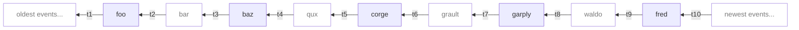

# MSC3871: Gappy timeline

`/messages` returns a linearized version of the event DAG. From any given
homeservers perspective of the room, the DAG can have gaps where they're missing
events. This could be because the homeserver hasn't fetched them yet or because
it failed to fetch the events because those homeservers are unreachable and no
one else knows about the event.

Currently, there is an unwritten rule between the server and client that the
server will always return all contiguous events in that part of the timeline.
But the server has to break this rule sometimes when it doesn't have the event
and is unable to get the event from anyone else. This MSC aims to change the
dynamic so the server can give the client feedback and an indication of where
the gaps are.

This way, clients know where they are missing events and can even retry fetching
by perhaps adding some UI to the timeline like "We failed to get some messages
in this gap, try again."

This can also make servers faster to respond to `/messages`. For example,
currently, Synapse always tries to backfill and fill in the gap (even when it
has enough messages locally to respond). In big rooms like `#matrix:matrix.org`
(Matrix HQ), almost every place you ask for has gaps in it (thousands of
backwards extremities) and lots of those events are unreachable so we try the
same thing over and over hoping the response will be different this time but
instead, we just make the `/messages` response time slow. With this MSC, we can
instead be more intelligent about backfilling in the background and just tell
the client about the gap that they can retry fetching a little later.


## Proposal

Add a `gaps` field to the response of [`GET
/_matrix/client/v3/rooms/{roomId}/messages`](https://spec.matrix.org/v1.1/client-server-api/#get_matrixclientv3roomsroomidmessages).
This field is an array of `GapEntry` indicating where missing events in the
timeline are as defined below.


### 200 response

This describes the new `gaps` response field being added to the `200 response`
of `/messages`:

Name | Type | Description | required
--- | --- | --- | ---
`gaps` | `[GapEntry]` | A list of gaps indicating where events are missing in the `chunk` | no


#### `GapEntry`

key | type | value | description | required
--- | --- | --- | --- | ---
`event_id` | string | Event ID | The event ID indicating the position in the `/messages` `chunk` response  | yes
`prev_pagination_token` | string | Pagination token | A pagination token that represents the spot in the DAG before the given `event_id` in the `chunk`. Omitting this field just means there is no gap on this side. | no
`next_pagination_token` | string | Pagination token | A pagination token that represents the spot in the DAG after the given `event_id` in the `chunk`. Omitting this field just means there is no gap on this side. | no


### `/messages` response examples

The following mermaid diagram represents the room DAG snapshot used for the following
`/messages` responses. The slightly transparent events with no background are events
that the homeserver does not have and are in the gap.

Pagination tokens are positions between events. This already an established concept but
to illustrate this better, see the following `tX` pagination tokens in the following
diagram.



The idea is to be able to keep paginating from
`prev_pagination_token`/`next_pagination_token` in the respective direction to fill in
the gap.


#### `/messages?dir=b`

`/messages?dir=b` response example with gaps (`chunk` has events in
reverse-chronoligcal order since we're paginating backwards):

`/messages?dir=b&from=t6`
```json5
{
  "chunk": [
    {
      "event_id": "$corge",
      "type": "m.room.message",
      "content": {
        "body": "corge",
      }
    },
    {
      "event_id": "$baz",
      "type": "m.room.message",
      "content": {
        "body": "baz",
      }
    },
    {
      "event_id": "$foo",
      "type": "m.room.message",
      "content": {
        "body": "foo",
      }
    }
  ]
  "gaps": [
        {
          "prev_pagination_token": "t6",
          "event_id": "$corge",
          "next_pagination_token": "t5",
        },
        {
          "prev_pagination_token": "t4",
          "event_id": "$baz",
          "next_pagination_token": "t3",
        },
        {
          "prev_pagination_token": "t2",
          "event_id": "$foo",
          "next_pagination_token": "t1",
        }
  ]
}
```


#### `/messages?dir=f`

`/messages?dir=f` response example with gaps (`chunk` has events in
chronoligcal order since we're paginating forwards):

`/messages?dir=f&from=t6`
```json5
{
  "chunk": [
    {
      "event_id": "$garply",
      "type": "m.room.message",
      "content": {
        "body": "garply",
      }
    },
    {
      "event_id": "$fred",
      "type": "m.room.message",
      "content": {
        "body": "fred",
      }
    },
  ]
  "gaps": [
        {
          "prev_pagination_token": "t7",
          "event_id": "$garply",
          "next_pagination_token": "t8",
        },
        {
          "prev_pagination_token": "t9",
          "event_id": "$fred",
          "next_pagination_token": "t10",
        }
  ]
}
```


## Potential issues

Lots of gaps/extremities are generated when a spam attack occurs and federation
falls behind. If clients start showing gaps with retry links, we might just be
exposing the spam more.


## Alternatives

As an alternative, we can continue to do nothing as we do today and not worry
about the occasional missing events. People seem not to notice any missing
messages anyway but they do probably see our slow `/messages` pagination.


### Expose `prev_events` to the client

One alternative is including the `prev_events` in the events that the client sees so
they can figure out the DAG chain themselves and see if there is an missing event in the
middle.

There is an [unspecced `/messages?raw=true` query parameter in
Synapse](https://github.com/matrix-org/synapse/blob/20c76cecb9eb84dadfa7b2d25b436d3ab9218a1a/synapse/rest/client/room.py#L653)
that returns the full raw event as seen over federation which means it will include the
`prev_events`.

You can also specify `event_format: federation` directly in that JSON `filter` parameter
of `/messages` ->
`/_matrix/client/v3/rooms/{room_id}}/messages?dir=b&filter=%7B%22event_format%22%3A%20%22federation%22%7D`

Related to:

 - https://github.com/matrix-org/matrix-spec/issues/859
 - https://github.com/matrix-org/matrix-spec/issues/1047


### Synthetic `m.timeline.gap` event alternative

Another alternative is using synthetic events (thing that looks like an event
without an `event_id`) which the server inserts alongside other events in the
`chunk` to indicate where the gap is. But this has detractors since it's harder
to implement in strongly typed SDK's and easy for a client to naively display
every "event" in the `chunk`.

`/messages` response example with a gap:

```json
{
  "chunk": [
    {
      "type": "m.room.message",
      "content": {
        "body": "foo",
      }
    },
    {
      "type": "m.timeline.gap",
      "content": {
        "gap_start_event_id": "$12345",
        "pagination_token": "t47409-4357353_219380_26003_2265",
      }
    },
    {
      "type": "m.room.message",
      "content": {
        "body": "baz",
      }
    },
  ]
}
```


### `GapEntry` alternative only indicating a gap `next_to_event_id` (only one side)

Same concept as the existing `GapEntry` proposal but we only indicate the gap on one
side of an event `next_to_event_id` according to the direction that `/messages` is going
already.

The problem with this alternative is that clients store events differently and it's
valid to want to paginate in either direction from a given event. This alternative works
fine in the Element Web case where you always paginate backwards in the scrollback and
store events as a whole timeline list but another client like the [Trixinity
SDK](https://github.com/benkuly/trixnity), where events are stored individually in a
linked list, where each event could have a gap before and after, and where a gap could
be 100's, 1000's of events wide, it would be useful to paginate from both ends to fill
the gap faster.

<details>
<summary>
  Details for the <code>GapEntry</code> alternative only indicating a gap <code>next_to_event_id</code>
</summary>

#### `GapEntry`

key | type | value | description | required
--- | --- | --- | --- | ---
`next_to_event_id` | string | Event ID | The event ID indicating the position in the `/messages` `"chunk"` response where the gap starts after that position. This field can be `null` or completely omitted to indicate that the gap is at the start of the `/messages` `"chunk"` | no
`pagination_token` | string | Pagination token | A pagination token that represents the spot in the DAG to be able to continue paginating in the same direction as the request and fill in the gap from `next_to_event_id` to the next known event. | yes


### `/messages` response examples

The following mermaid diagram represents the room DAG snapshot used for the following
`/messages` responses. The slightly transparent events with no background are events
that the homeserver does not have and are in the gap.

Pagination tokens are positions between events. This already an established concept but
to illustrate this better, see the following `tX` pagination tokens in the following
diagram.


The idea is to be able to keep paginating from `pagination_token` in the same
direction of the request to fill in the gap.


#### `/messages?dir=b`

`/messages?dir=b` response example with gaps (`chunk` has events in
reverse-chronoligcal order since we're paginating backwards):

`/messages?dir=b&from=t6`
```json5
{
  "chunk": [
    // there is no gap from `t6` to `$corge` as expected
    {
      "event_id": "$corge",
      "type": "m.room.message",
      "content": {
        "body": "corge",
      }
    },
    // <the first `GapEntry` indicates a gap here>
    {
      "event_id": "$baz",
      "type": "m.room.message",
      "content": {
        "body": "baz",
      }
    },
    // <the second `GapEntry` indicates a gap here>
    {
      "event_id": "$foo",
      "type": "m.room.message",
      "content": {
        "body": "foo",
      }
    }
    // <the third `GapEntry` indicates a gap here>
  ]
  "gaps": [
        {
          "next_to_event_id": "$corge",
          "pagination_token": "t5",
        },
        {
          "next_to_event_id": "$baz",
          "pagination_token": "t3",
        },
        {
          "next_to_event_id": "$foo",
          "pagination_token": "t1",
        }
  ]
}
```


#### `/messages?dir=f`

`/messages?dir=f` response example with gaps (`chunk` has events in
chronoligcal order since we're paginating forwards):

`/messages?dir=f&from=t6`
```json5
{
  "chunk": [
    // <the first `GapEntry` indicates a gap here>
    {
      "event_id": "$garply",
      "type": "m.room.message",
      "content": {
        "body": "garply",
      }
    },
    // <the second `GapEntry` indicates a gap here>
    {
      "event_id": "$fred",
      "type": "m.room.message",
      "content": {
        "body": "fred",
      }
    },
    // <the third`GapEntry` indicates a gap here>
  ]
  "gaps": [
        {
          "next_to_event_id": null,
          "pagination_token": "t6",
        },
        {
          "next_to_event_id": "$garply",
          "pagination_token": "t8",
        },
        {
          "next_to_event_id": "$fred",
          "pagination_token": "t10",
        }
  ]
}
```

</details>


## Future considerations

In the future, we should consider adding the same `gaps` field to `/context` because
it's another endpoint that returns a linearized version of the DAG.

It could make sense to roll this into this MSC but it might make the proposal less clear
if we have to bulk it up by specifying the same details for `/context`. Leaving it to be
follow-up MSC for now.


## Security considerations

Only your own homeserver controls whether a gap is added to the `/messages`
response so there shouldn't be any weird edge case where someone else can
control whether you to fetch something.


## Unstable prefix

While this feature is in development, the `gaps` field can be used as
`org.matrix.msc3871.gaps`

### While the MSC is unstable

During this period, to detect server support clients should check for the
presence of the `org.matrix.msc3871` flag in `unstable_features` on `/versions`.
Clients are also required to use the unstable prefixes (see [unstable
prefix](#unstable-prefix)) during this time.

### Once the MSC is merged but not in a spec version

Once this MSC is merged, but is not yet part of the spec, clients should rely on
the presence of the `org.matrix.msc3871.stable` flag in `unstable_features` to
determine server support. If the flag is present, clients are required to use
stable prefixes (see [unstable prefix](#unstable-prefix)).

### Once the MSC is in a spec version

Once this MSC becomes a part of a spec version, clients should rely on the
presence of the spec version, that supports the MSC, in `versions` on
`/versions`, to determine support. Servers are encouraged to keep the
`org.matrix.msc3871.stable` flag around for a reasonable amount of time
to help smooth over the transition for clients. "Reasonable" is intentionally
left as an implementation detail, however the MSC process currently recommends
*at most* 2 months from the date of spec release.
