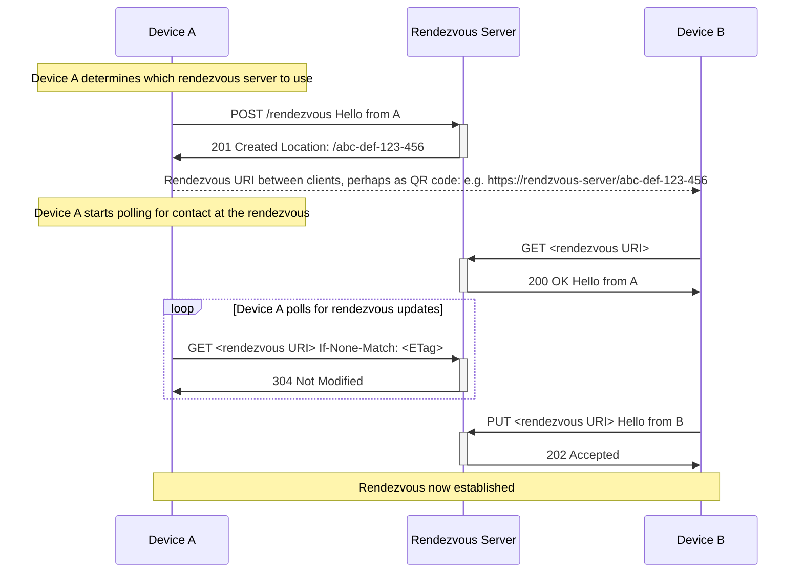

# MSC3886: Simple client rendezvous capability

In [MSC3906](https://github.com/matrix-org/matrix-spec-proposals/pull/3906) a proposal is made to allow a user to login on a new device using an existing device by means of scanning a
QR code.

In order to facilitate this the two devices need some bi-directional communication channel which they can use to exchange
information such as:

- the homeserver being used
- the user ID
- facilitation of issuing a new access token
- device ID for end-to-end encryption
- data for establishing a secure communication channel (e.g. via
  [MSC3903](https://github.com/matrix-org/matrix-spec-proposals/pull/3903))

To enable [MSC3906](https://github.com/matrix-org/matrix-spec-proposals/pull/3906) and support any future proposals this MSC proposes a simple HTTP based protocol that can be used to
establish a direct communication channel between two IP connected devices.

This channel [SHOULD be considered untrusted](#confidentiality-of-data)
by both devices, and SHOULD NOT be used to transmit sensitive data in plaintext.

It will work with devices behind NAT. It doesn't require homeserver administrators to deploy a separate server.

## Proposal

It is proposed that a general purpose HTTP based protocol be used to establish ephemeral bi-directional communication
channels over which arbitrary data can be exchanged.

Please note that it is intentional that this protocol does nothing to ensure the integrity of the data exchanged at a rendezvous.

### High-level description

Suppose that Device A wants to establish communications with Device B. A can do
so by creating a _rendezvous session_ via a `POST /_matrix/client/rendezvous`
call to an appropriate server. Its response includes an HTTP _rendezvous URL_
which should be shared out-of-band with device B. (This URL may be located on a
different domain to the initial `POST`.)

The rendezvous URL points to an arbitrary data resource ("the payload"), which
is initially populated using data from A's `POST` request. There are no
restrictions on the payload itself, but the rendezvous server SHOULD impose a
maximum size limit. The payload may be retrieved (`GET`) and updated (`PUT`) by
anyone—A, B, or a third party—who is able to reach the rendezvous URL.

In this way, A and B can communicate by repeatedly inspecting and updating the
payload pointed at the rendezvous URL.

#### The update mechanism

Every update request MUST include an `ETag` header, whose value is supplied
the `ETag` header in the last `GET` response seen by the requester. (The
initiating device may also use the `ETag` supplied in the initial `POST`
response to immediately update the payload.) Updates will succeed only if the
supplied `ETag` matches the server's current revision of the payload. This
prevents concurrent writes to the payload.

The `ETag` header is standard, described by
[RFC9110](https://www.rfc-editor.org/rfc/rfc9110.html#name-etag). In this
proposal we only accept strong, single-valued ETag values; anything else
constitutes a malformed request.

There is no mechanism to retrieve previous payloads after an update.

#### Expiry

The rendezvous session (i.e. the payload) SHOULD expire after a period of time
communicated to clients via the `Expires` header. After this point, any
further attempts to query or update the payload MUST fail. The expiry time
SHOULD be extended every time the payload is updated. The rendezvous session can
be manually expired with a `DELETE` call to the rendezvous URL.

### Example

A typical flow might look like this where device A is initiating the rendezvous with device B:



### Protocol

#### Create a new rendezvous point: `POST /_matrix/client/rendezvous`

HTTP request headers:

- `Content-Length` - required
- `Content-Type` - optional, server should assume `application/octet-stream` if not specified

HTTP request body:

- any data up to maximum size allowed by the server

HTTP response codes, and Matrix error codes:

- `201 Created` - rendezvous created
- `400 Bad Request` (`M_MISSING_PARAM`) - no `Content-Length` was provided.
- `403 Forbidden` (`M_FORBIDDEN`) - forbidden by server policy
- `413 Payload Too Large` (`M_TOO_LARGE`) - the supplied payload is too large
- `429 Too Many Requests` (`M_UNKNOWN`) - the request has been rate limited
- `307 Temporary Redirect` - if the request should be served from somewhere else specified in the `Location` response header

n.b. the relatively unusual [`307 Temporary Redirect`](https://developer.mozilla.org/en-US/docs/Web/HTTP/Status/307) response
code has been chosen explicitly for the behaviour of ensuring that the method and body will not change whilst the user-agent
follows the redirect. For this reason, no other `30x` response codes are allowed.

HTTP response headers for `201 Created`:

- `Location` - required, the allocated rendezvous URI which can be on a different server
- `X-Max-Bytes` - required, the maximum allowed bytes for the payload
- `ETag` - required, ETag for the current payload at the rendezvous point as per [RFC7232](https://httpwg.org/specs/rfc7232.html#header.etag)
- `Expires` - required, the expiry time of the rendezvous as per [RFC7234](https://httpwg.org/specs/rfc7234.html#header.expires)
- `Last-Modified` - required, the last modified date of the payload as per [RFC7232](https://httpwg.org/specs/rfc7232.html#header.last-modified)

Example response headers:

```http
Location: /abcdEFG12345
X-Max-Bytes: 10240
ETag: VmbxF13QDusTgOCt8aoa0d2PQcnBOXeIxEqhw5aQ03o=
Expires: Wed, 07 Sep 2022 14:28:51 GMT
Last-Modified: Wed, 07 Sep 2022 14:27:51 GMT
```

#### Update payload at rendezvous point: `PUT <rendezvous URI>`

HTTP request headers:

- `Content-Length` - required
- `Content-Type` - optional, server should assume `application/octet-stream` if not specified
- `If-Match` - required. The ETag of the last payload seen by the requesting device.

if not specified

HTTP request body:

- any data up to maximum size allowed by the server

HTTP response codes, and Matrix error codes:

- `202 Accepted` - payload updated
- `400 Bad Request` (`M_MISSING_PARAM`) - a required header was not provided.
- `404 Not Found` (`M_NOT_FOUND`) - rendezvous URI is not valid (it could have expired)
- `412 Precondition Failed` (`M_CONCURRENT_WRITE`, **a new error code**) - when the ETag does not match
- `413 Payload Too Large` (`M_TOO_LARGE`) - the supplied payload is too large
- `429 Too Many Requests` (`M_UNKNOWN`) - the request has been rate limited

HTTP response headers for `202 Accepted` and `412 Precondition Failed`:

- `ETag` - required, ETag for the current payload at the rendezvous point as per [RFC7232](https://httpwg.org/specs/rfc7232.html#header.etag)
- `Expires` - required, the expiry time of the rendezvous as per [RFC7233](https://httpwg.org/specs/rfc7234.html#header.expires)
- `Last-Modified` - required, the last modified date of the payload as per [RFC7232](https://httpwg.org/specs/rfc7232.html#header.last-modified)

#### Get payload from rendezvous point: `GET <rendezvous URI>`

HTTP request headers:

- `If-None-Match` - optional, as per [RFC7232](https://httpwg.org/specs/rfc7232.html#header.if-none-match) server will
only return data if given ETag does not match

HTTP response codes, and Matrix error codes:

- `200 OK` - payload returned
- `304 Not Modified` - when `If-None-Match` is supplied and the ETag does not match
- `404 Not Found` (`M_NOT_FOUND`) - rendezvous URI is not valid (it could have expired)
- `429 Too Many Requests` (`M_UNKNOWN`)- the request has been rate limited

HTTP response headers for `200 OK` and `304 Not Modified`:

- `ETag` - required, ETag for the current payload at the rendezvous point as per [RFC7232](https://httpwg.org/specs/rfc7232.html#header.etag)
- `Expires` - required, the expiry time of the rendezvous as per [RFC7233](https://httpwg.org/specs/rfc7234.html#header.expires)
- `Last-Modified` - required, the last modified date of the payload as per [RFC7232](https://httpwg.org/specs/rfc7232.html#header.last-modified)

- `Content-Type` - required for `200 OK`

#### Cancel a rendezvous: `DELETE <rendezvous URI>`

HTTP response codes:

- `204 No Content` - rendezvous cancelled
- `404 Not Found` (`M_NOT_FOUND`) - rendezvous URI is not valid (it could have expired)
- `429 Too Many Requests` (`M_UNKNOWN`)- the request has been rate limited

### Authentication

These API endpoints do not require authentication. This is because the protocol is explicitly treated as untrusted,
with trust established at a higher level outside the scope of the present proposal.

### Maximum payload size

The server should enforce a maximum payload size for the payload size. It is recommended that this be no less than 10KB.

### Maximum duration of a rendezvous

The rendezvous only needs to persist for the duration of the handshake. So a timeout such as 30 seconds is adequate.

Clients should handle the case of the rendezvous being cancelled or timed out by the server.

### ETags

The ETag generated should be unique to the rendezvous point and the last modified time so that two clients can
distinguish between identical payloads sent by either client.

### CORS

To support usage from web browsers, the server should allow CORS requests to the `/rendezvous` endpoint from any
origin and expose the `ETag`, `Location` and `X-Max-Bytes` headers as:

```http
Access-Control-Allow-Headers: Content-Type,If-Match,If-None-Match
Access-Control-Allow-Methods: GET,PUT,POST,DELETE
Access-Control-Allow-Origin: *
Access-Control-Expose-Headers: ETag,Location,X-Max-Bytes
```

Currently the [spec](https://spec.matrix.org/v1.4/client-server-api/#web-browser-clients) specifies a single set of
CORS headers to be used. Therefore, care will be required to make it clear in the spec that the headers will
vary depending on the endpoint.

### Choice of server

Ultimately it will be up to the Matrix client implementation to decide which rendezvous server to use.

However, it is suggested that the following logic is used by the device/client to choose the rendezvous server in order
of preference:

1. If the client is already logged in: try and use current homeserver.
1. If the client is not logged in and it is known which homeserver the user wants to connect to: try and use that homeserver.
1. Otherwise use a default server.

## Potential issues

Because this is an entirely new set of functionality it should not cause issue with any existing Matrix functions or capabilities.

The proposed protocol requires the devices to have IP connectivity to the server which might not be the case in P2P scenarios.

## Alternatives

### Send-to-Device messaging

The combination of this proposal and [MSC3903](https://github.com/matrix-org/matrix-spec-proposals/pull/3903) look similar in
some regards to the existing [Send-to-device messaging](https://spec.matrix.org/v1.6/client-server-api/#send-to-device-messaging)
capability.

Whilst to-device messaging already provides a mechanism for secure communication
between two Matrix clients/devices, a key consideration for the anticipated
login with QR capability is that one of the clients is not yet authenticated with
a Homeserver.

Furthermore the client might not know which Homeserver the user wishes to
connect to.

Conceptually, one could create a new type of "guest" login that would allow the
unauthenticated client to connect to a Homeserver for the purposes of
communicating with an existing authenticated client via to-device messages.

Some considerations for this:

Where the "actual" Homeserver is not known then the "guest" Homeserver nominated
by the new client would need to be federated with the "actual" Homeserver.

The "guest" Homeserver would probably want to automatically clean up the "guest"
accounts after a short period of time.

The "actual" Homeserver operator might not want to open up full "guest" access
so a second type of "guest" account might be required.

Does the new device/client need to accept the T&Cs of the "guest" Homeserver?

### Other existing protocols

Try and do something with STUN or TURN or [COAP](http://coap.technology/).

### Implementation details

Rather than requiring the devices to poll for updates, "long-polling" could be used instead similar to `/sync`.

## Security considerations

### Confidentiality of data

Whilst the data transmitted can be encrypted in transit via HTTP/TLS the rendezvous server does have visibility over the
data and can also perform man in the middle attacks.

As such, for the purposes of authentication and end-to-end encryption the channel should be treated as untrusted and some
form of secure layer should be used on top of the channel such as a Diffie-Hellman key exchange.

### Denial of Service attack surface

Because the protocol allows for the creation of arbitrary channels and storage of arbitrary data, it is possible to use
it as a denial of service attack surface.

As such, the following standard mitigations such as the following may be deemed appropriate by homeserver implementations
and administrators:

- rate limiting of requests
- imposing a low maximum payload size (e.g. kilobytes not megabytes)
- limiting the number of concurrent channels

## Unstable prefix

While this feature is in development the new endpoint should be exposed using the following unstable prefix:

- `/_matrix/client/unstable/org.matrix.msc3886/rendezvous`

Additionally, the feature is to be advertised as unstable feature in the `GET /_matrix/client/versions`
response, with the key `org.matrix.msc3886` set to `true`. So, the response could look then as
following:

```json
{
    "versions": ["r0.6.0"],
    "unstable_features": {
        "org.matrix.msc3886": true
    }
}
```

## Dependencies

None, although it's intended to be used with
[MSC3903](https://github.com/matrix-org/matrix-spec-proposals/pull/3903) and
[MSC3906](https://github.com/matrix-org/matrix-spec-proposals/pull/3906).

## Credits

This proposal was influenced by https://wiki.mozilla.org/Services/KeyExchange which also has some helpful discussion
around DoS mitigation.
