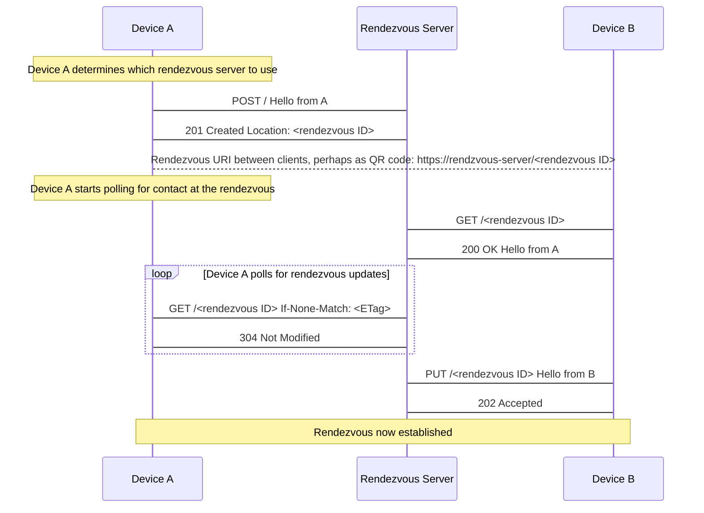

# MSC3886: Simple client rendezvous capability

In MSCyyyy a proposal is made to allow a user to login on a new device using an existing device by means of scanning a
QR code.

In order to facilitate this the two devices need some bi-directional communication channel which they can use to exchange
information such as:

- the homserver being used
- the user ID
- facilitation of issuing a new access token
- device ID for end-to-end encryption
- device keys for end-to-end encryption

To enable MSCyyyy and support any future proposals this MSC proposes a simple HTTP based protocol that can be used to
establish a direct communication channel between two IP connected devices.

It will work with devices behind NAT. It doesn't require homeserver administrators to deploy a separate server.

## Proposal

It is proposed that a general purpose HTTP based protocol be used to establish ephemeral bi-directional communication
channels over which arbitrary data can be exchanged.

A typical flow might look like this where device A is initiating the rendezvous with device B:



Please note that it is intentional that this protocol does nothing to ensure the integrity of the data exchanged at a rendezvous.

### Protocol

#### Create a new rendezvous point: `POST /`

HTTP request headers:

- `Content-Type` - optional, server should assume `application/octet-stream` if not specified

HTTP request body:

- any data up to maximum size allowed by the server

HTTP response codes:

- `201 Created` - rendezvous created
- `403 Forbidden` - forbidden by server policy
- `413 Payload Too Large` - the supplied payload is too large
- `429 Too Many Requests` - the request has been rate limited

HTTP response headers for `201 Created`:

- `Location` - required, the allocated rendezvous ID represented as a URI safe **relative path**. e.g. `Location: abc-def-1234`
- `X-Max-Bytes` - required, the maximum allowed bytes for the payload
- `ETag` - required, ETag for the current payload at the rendezvous point as per [RFC7232](https://httpwg.org/specs/rfc7232.html#header.etag)
- `Expires` - required, the expiry time of the rendezvous as per [RFC7233](https://httpwg.org/specs/rfc7234.html#header.expires)
- `Last-Modified` - required, the last modified date of the payload as per [RFC7232](https://httpwg.org/specs/rfc7232.html#header.last-modified)

Example response headers:

```http
Location: abcdEFG12345
X-Max-Bytes: 10240
ETag: VmbxF13QDusTgOCt8aoa0d2PQcnBOXeIxEqhw5aQ03o=
Expires: Wed, 07 Sep 2022 14:28:51 GMT
Last-Modified: Wed, 07 Sep 2022 14:27:51 GMT
```

#### Update payload at rendezvous point: `PUT /<rendezvous id>`

HTTP request headers:

- `Content-Type` - optional, server should assume `application/octet-stream` if not specified
- `If-Match` - optional, as per [RFC7232](https://httpwg.org/specs/rfc7232.html#header.if-match) server will assume `*`
if not specified

HTTP request body:

- any data up to maximum size allowed by the server

HTTP response codes:

- `202 Accepted` - payload updated
- `404 Not Found` - rendezvous ID is not valid (it could have expired)
- `413 Payload Too Large` - the supplied payload is too large
- `412 Precondition Failed` - when `If-Match` is supplied and the ETag does not match
- `429 Too Many Requests` - the request has been rate limited

HTTP response headers for `202 Accepted` and `412 Precondition Failed`:

- `ETag` - required, ETag for the current payload at the rendezvous point as per [RFC7232](https://httpwg.org/specs/rfc7232.html#header.etag)
- `Expires` - required, the expiry time of the rendezvous as per [RFC7233](https://httpwg.org/specs/rfc7234.html#header.expires)
- `Last-Modified` - required, the last modified date of the payload as per [RFC7232](https://httpwg.org/specs/rfc7232.html#header.last-modified)

#### Get payload from rendezvous point: `GET /<rendezvous id>`

HTTP request headers:

- `If-None-Match` - optional, as per [RFC7232](https://httpwg.org/specs/rfc7232.html#header.if-none-match) server will
only return data if given ETag does not match

HTTP response codes:

- `200 OK` - payload returned
- `404 Not Found` - rendezvous ID is not valid (it could have expired)
- `304 Not Modified` - when `If-None-Match` is supplied and the ETag does not match
- `429 Too Many Requests` - the request has been rate limited

HTTP response headers for `200 OK` and `304 Not Modified`:

- `ETag` - required, ETag for the current payload at the rendezvous point as per [RFC7232](https://httpwg.org/specs/rfc7232.html#header.etag)
- `Expires` - required, the expiry time of the rendezvous as per [RFC7233](https://httpwg.org/specs/rfc7234.html#header.expires)
- `Last-Modified` - required, the last modified date of the payload as per [RFC7232](https://httpwg.org/specs/rfc7232.html#header.last-modified)

- `Content-Type` - required for `200 OK`

#### Cancel a rendezvous: `DELETE /<rendezvous id>`

HTTP response codes:

- `204 No Content` - rendezvous cancelled
- `404 Not Found` - rendezvous ID is not valid (it could have expired)
- `429 Too Many Requests` - the request has been rate limited

### Maximum payload size

The server should enforce a maximum payload size for the payload size. It is recommended that this be no less than 10KB.

### Maximum duration of a rendezvous

The rendezvous only needs to persist for the duration of the handshake. So a timeout such as 30 seconds is adequate.

Clients should handle the case of the rendezvous being cancelled or timed out by the server.

### ETags

The ETag generated should be unique to the rendezvous point and the last modified time so that two clients can
distinguish between identical payloads sent by either client.

### CORS

To support usage from web browsers, the server should allow CORS requests from any origin and expose the `ETag` and
`Location` headers:

```http
Access-Control-Allow-Headers: Content-type
Access-Control-Allow-Methods: GET,PUT,POST,DELETE
Access-Control-Allow-Origin: *
Access-Control-Expose-Headers: ETag,Location
```

### Choice of server

Ultimately it will be up to the Matrix client implementation to decide which rendezvous server to use.

However, it is suggested that the following logic is used by the device/client to choose the rendezvous server in order
of preference:

1. If the client is already logged in: try and use current homeserver.
1. If the client is not logged in and it is known which homeserver the user wants to connect to: try and use that homeserver.
1. Otherwise use a default server.

## Potential issues

Because this is an entirely new set of functionality it should not cause issue with any existing Matrix functions or capabilities.

The proposed protocol requires the devices to have IP connectivity to the server which might not be the case in P2P scenarios.

## Alternatives

Try and do something with STUN or TURN or [COAP](http://coap.technology/).

Rather than requiring the devices to poll for updated "long-polling" could be used instead similar to `/sync`.

## Security considerations

### Confidentiality of data

Whilst the data transmitted can be encrypted in transit via HTTP/TLS the rendezvous server does have visibility over the
data and can also perform man in the middle attacks.

As such, for the purposes of authentication and end-to-end encryption the channel should be treated as untrusted and some
form of secure layer should be used on top of the channel such as a Diffie-Hellman key exchange.

### Denial of Service attack surface

Because the protocol allows for the creation of arbitrary channels and storage of arbitrary data, it is possible to use
it as a denial of service attack surface.

As such, the following standard mitigations such as the following may be deemed appropriate by homeserver implementations
and administrators:

- rate limiting of requests
- imposing a low maximum payload size (e.g. kilobytes not megabytes)
- limiting the number of concurrent channels

## Unstable prefix

None.

## Dependencies

None.

## Credits

This proposal was influenced by https://wiki.mozilla.org/Services/KeyExchange which also has some helpful discussion
around DoS mitigation.
