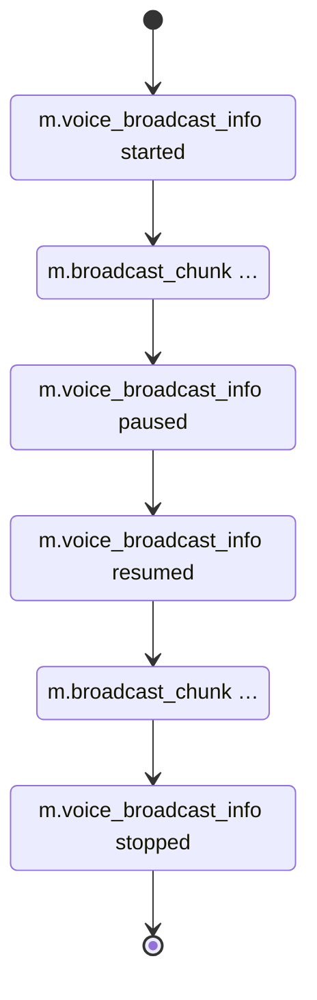
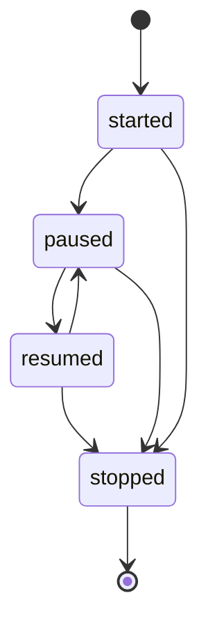

# MSC3888: Voice Broadcast

**Is your feature request related to a problem? Please describe.**

As a user I want to be able to send a voice broadcast to all users of a room, so that I can easily provide information by just talking. Compared to already existing voice messages it should be possible to listen to voice broadcast at the time they are being recorded. Think of this being a live-podcast over Matrix.

Some use-case scenarios for this feature can be to verbally provide updates, trainings, or talk to a large number of people.

**Describe the solution you'd like**

This issue proposes using a series of voice messages to implement the Voice Broadcast feature.

A new state event `m.voice_broadcast_info` will be introduced. This state event identifies a broadcast and provides its state, such as `started` or `paused`. In addition to that this proposal introduces new event type `m.voice_broadcast_chunk` with a relation to the state event to mark them as belonging to a specific voice broadcast.

The following diagram shows a typical event flow for a voice broadcast:



`m.voice_broadcast_info` event example:

```json
{
    "type": "m.voice_broadcast_info",
    "state_key": "@martin:example.com",
    "content": {
        "device_id": "ABCDEFG",
        "state": "started"
    },
    "…": "other state event fields"
}
```

`m.voice_broadcast_info` properties:

| Name | Required | Description |
| --- | --- | --- |
| `type` | yes | Must be `m.voice_broadcast_info` |
| `state_key` | yes | Must contain the broadcaster's MXID |
| `state` | yes | Must contain the broadcast state: <ul><li>`started` a new voice broadcast has been started and is currently being live</li><li>`paused` stands for a paused broadcast that may be resumed</li><li>`resumed` flags a voice broadcast previously paused as resumed</li><li>`stopped` marks a broadcast as finished</li></ul> |
| `device_id` | Only if `state` is `started` | Must contain the ID of device from which the broadcast has been started | 
| `m.relates_to` | Only if `state` is not `started` | [MSC3267][MSC3267] `m.reference` relation to the `started` `m.voice_broadcast_info` state event |
| `last_chunk_sequence` | Only if `state` is `paused` or `stopped` | Must be the sequence of the last sent chunk |

Every following `m.voice_broadcast_info` should have an [MSC3267][MSC3267] `m.reference` relation  to the `started` state event:

```json
{
    "type": "m.voice_broadcast_info",
    "state_key": "@martin:example.com",
    "content": {
        "device_id": "ABCDEFG",
        "state": "paused",
        "last_chunk_sequence": 5,
        "m.relates_to": {
            "rel_type": "m.reference",
            "event_id": "$voice_broadcast_info_started_event_id"
        }
    },
    "…": "other state event fields"
}
```

This diagram shows the possible `state` transitions:



:information_source: This proposal does not suggest to implement any server-side support to enforce the correct event order. Clients should be robust enough to handle any `state` transition and receive broadcast chunks in any state.

The message type of a voice broadcast chunk is `m.voice_broadcast_chunk`. The message content uses the `info`, `file` and `url` properties from [`m.audio` `m.room.message` events][m_audio].

`m.voice_broadcast_chunk` messages that belong to the broadcast will have an [MSC3267][MSC3267] `m.reference`
relation to the `started` `m.voice_broadcast_info` state event.

To inform clients without voice broadcast support that a broadcast will take place, the first chunk message should contain an [MSC1767][MSC1767] extensible event `m.text` block.

Example of a first broadcast chunk:

```json
{
   "type": "m.voice_broadcast_chunk",
    "content": {
        "m.text": [
            {
                "body": "Alice has started a voice broadcast. Unfortunately, your client does not seem to support playback of it."
            }
        ],
        "m.relates_to": {
            "rel_type": "m.reference",
            "event_id": "$voice_broadcast_info_started_event_id",
        },
        "info": {
          "duration": 2140786,
          "mimetype": "audio/mpeg",
          "size": 1563685
        },
        "url": "mxc://example.org/ffed755USFFxlgbQYZGtryd",
        "sequence": 1
    }
}
```

Example of a subsequent broadcast chunk:

```json
{
   "type": "m.voice_broadcast_chunk",
    "content": {
        "m.relates_to": {
            "rel_type": "m.reference",
            "event_id": "$voice_broadcast_info_started_event_id",
        },
        "info": {
          "duration": 2140786,
          "mimetype": "audio/mpeg",
          "size": 1563685
        },
        "url": "mxc://example.org/ffed755USFFxlgbQYZGtryd",
        "sequence": 23
    }
}
```

`m.voice_broadcast_chunk` properties:

| Name | Required | Description |
| --- | --- | --- |
| `m.relates_to` | yes | [MSC3267][MSC3267] `m.reference` relation to the `started` `m.voice_broadcast_info` state event |
| `info` | yes | [See `m.audio` ][m_audio] |
| `url`/`file` | yes | [See `m.audio` ][m_audio] |
| `sequence` | yes | The sequence number to determine the correct order of the chunks starting at `1` |

---

**Describe alternatives you've considered**

_Implementation based on [MSC3401: Native Group VoIP Signalling][MSC3401]_

- VoIP can’t do mix down while preserving E2EE without a high effort
- It would rely on a media-server SFU which doesn’t exist at the time writing this MSC

_Implementation based on [MSC4016: Streaming E2EE file transfers with random access][MSC4016]_

Streaming file transfer could be relatively easy on the server-side, given Glow exists and works (other than the operational unpleasantness of introducing an entirely new server), but client-side it requires major changes on all three platforms:

- Switch the whole file-upload/download pipeline to be streamed rather than in-memory blobs (desirable anyway for memory usage of clients, and ability to send > ~1.5GB files)
- Switch crypto to AES-GCM to solve hashing causality
- Switch to use async file uploads [MSC2246](https://github.com/matrix-org/matrix-spec-proposals/pull/2246) so you can send the event to reference the URL before finishing uploading the media
- Switch the whole voice message UI to calculate waveforms locally as the file is received (rescaling the waveform as more message is received!?), and to allow scrubbing within a file whose length is changing from under you
- Optional: random access to the download, letting the receiver jump to the end of the voice message without having to download the rest of the file first. (a 2 hour voice message is roughly 20MB, so it might not be a disaster to have to download the whole VM first rather than doing random access). This would mean:
- Change crypto to send in self-contained AES-GCM blocks (of 16KB or so), to support random access
- Support scrubbing into chunks of the file which haven’t been downloaded yet

**Unstable prefixes**

While this MSC is unstable, these event types should be used:

| Stable value | Unstable value |
| --- | --- |
| `m.voice_broadcast_info` | `org.matrix.msc3888.voice_broadcast_info` |
| `m.voice_broadcast_chunk` | `org.matrix.msc3888.voice_broadcast_chunk` |

**Additional context**

Clients could use [MSC3912: Relation-based redactions][MSC3912] to redact a voice broadcast and all related events.

:information_source:  This discussion describes an intermediate solution to implement voice broadcasts. The final solution will be described in [MSC3888][MSC3888].

[m_audio]: https://spec.matrix.org/v1.6/client-server-api/#maudio
[MSC1767]: https://github.com/matrix-org/matrix-spec-proposals/pull/1767
[MSC3245]: https://github.com/matrix-org/matrix-spec-proposals/blob/travis/msc/voice-messages/proposals/3245-voice-messages.md
[MSC3267]: https://github.com/matrix-org/matrix-spec-proposals/blob/aggregations-references/proposals/3267-reference-relations.md
[MSC3401]: https://github.com/matrix-org/matrix-spec-proposals/pull/3401
[MSC3489]: https://github.com/matrix-org/matrix-spec-proposals/blob/matthew/location-streaming/proposals/3489-location-streaming.md
[MSC3888]: https://github.com/matrix-org/matrix-spec-proposals/pull/3888
[MSC3912]: https://github.com/matrix-org/matrix-spec-proposals/pull/3912
[MSC4016]: https://github.com/matrix-org/matrix-spec-proposals/pull/4016
