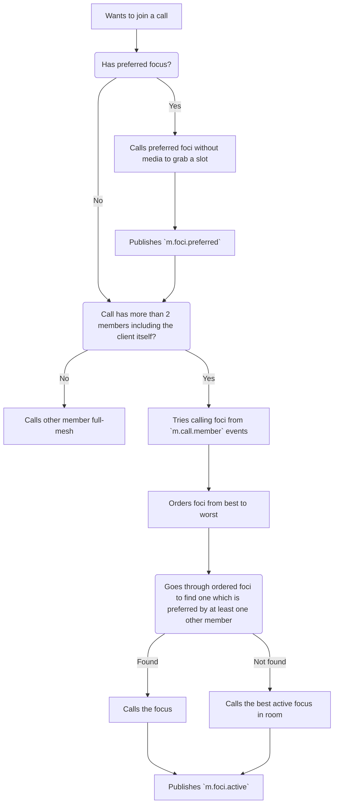

# MSC3898: Native Matrix VoIP signalling for cascaded SFUs

[MSC3401](https://github.com/matrix-org/matrix-spec-proposals/pull/3401)
specifies how full-mesh group calls work in Matrix. While that MSC works well
for small group calls, it does not work so well for large conferences due to
bandwidth (and other) issues.

Selective Forwarding Units (SFUs) - servers which forwarding WebRTC streams
between peers (which could be clients or SFUs or both). To make use of them
effectively, peers need to be able to tell the SFU which streams they want to
receive at what resolutions.

To solve the issue of centralization, the SFUs are also allowed to connect to
each other ("cascade") and therefore the peers also need a way to tell an SFU to
which other SFUs to connect.

## Proposal

- **TODO: spell out how this works with active speaker detection & associated
signalling**

### Diagrams

The diagrams of how this all looks can be found in
[MSC3401](https://github.com/matrix-org/matrix-spec-proposals/pull/3401).

### Additions to the `m.call.member` state event

This MSC proposes adding two _optional_ fields to the `m.call.member` state event:
`m.foci.preferred` and `m.foci.active`.

For instance:

```json
{
    "type": "m.call.member",
    "state_key": "@matthew:matrix.org",
    "content": {
        "m.calls": [
            {
                "m.call_id": "cvsiu2893",
                "m.devices": [{
                    "device_id": "U738KDF9WJ",
                    "m.foci.active": [
                        { "user_id": "@sfu-lon:matrix.org", "device_id": "FS5F589EF" }
                    ],
                    "m.foci.preferred": [
                        { "user_id": "@sfu-bon:matrix.org", "device_id": "3FSF589EF" },
                        { "user_id": "@sfu-mon:matrix.org", "device_id": "GFSDH93EF" },
                    ]
                }]
            }
        ],
        "m.expires_ts":  1654616071686
    }
}
```

#### `m.foci.active`

This field is a list of foci the user's device is publishing to. Usually, this
list will have a length of 1, yet a client might publish to multiple foci if
they are on different networks, for instance, or to simultaneously fan-out in
different directions from the client if there is no nearby focus. If the client
is participating full-mesh, it should either omit this field from the state
event or leave the list empty.

#### `m.foci.preferred`

This field is a list of foci the client would prefer to switch to from the
current active focus, if any other client also starts using the given focus. If
the client is already using one of its preferred foci, it should either omit
this field from the state event or leave the list empty.

### Choosing a focus

#### Discovering foci

- **TODO: How does a client discover foci? We could use well-known or a custom endpoint**

Foci are identified by a tuple of `user_id` and `device_id`.

#### Determining the best focus

There are many ways to determine the best focus; this MSC recommends the
following:

- Is the quickest to respond to `m.call.invite` with `m.call.answer`.
- Is the quickest to rapidly reject a spurious HTTPS request to a high-numbered
  port on the SFU's IP address, if the SFU exposes its IP somewhere - similar to
  the [apenwarr/blip](https://github.com/apenwarr/blip) trick, in order to
  measure media-path latency rather than signalling path latency.
- Has the best latency of data-channel traffic flows.
- Has the best latency and bandwidth determined by sending a small splurge of
  media down the pipe to probe.

#### Joining a call

The following diagram explains how a client chooses a focus when joining a call.



#### Mid-call changes

Once in a call, the client listens for changes to `m.call.member` state events
and if another member starts using one of the client's preferred foci, the client
switches to that focus.

### Initial offer/answer dance

During the initial offer/answer dance, the client establishes a data-channel
between itself and the SFU to use later for rapid signalling.

### Simulcast

#### RTP munging

#### vp8 munging

### RTCP re-transmission

### Data-channel messaging

The client uses the established data channel connection to the SFU to perform
low-latency signalling to rapidly (un)subscribe/(un)publish streams, send
keep-alive messages, metadata, cascade and perform re-negotiation.

See the section about the [rationale](#the-use-of-the-data-channels-for-signaling)
behind the use of the data channels for signaling.

- **TODO: It feels like these ought to be `m.` namespaced**
- **TODO: Why `op` instead of `type`?**
- **TODO: It feels like these ought to have `content` rather than being on the
  same layer**
- **TODO: Spell out how the DC traffic interacts with application-layer
traffic**

#### SDP Stream Metadata extension

The client will be receiving multiple streams from the SFU and it will need to
be able to distinguish them, this therefore build on
[MSC3077](https://github.com/matrix-org/matrix-spec-proposals/pull/3077) and
[MSC3291](https://github.com/matrix-org/matrix-spec-proposals/pull/3291) to
provide the client with the necessary metadata. Some of the data-channel events
include a `metadata` field including a description of the stream being sent
either from the SFU to the client or from the client to the SFU.

Other than mute information and stream purpose, the metadata includes video
track resolution. The SFU may not be able to determine the resolution of the
track itself but it does need to know for simulcast; therefore, we include this
in the metadata.

```json
{
    "streamId1": {
        "purpose": "m.usermedia",
        "audio_muted": false,
        "video_muted": true,
        "tracks": {
            "trackId1": {
                "width": 1920,
                "height": 1080
            },
            "trackId2": {}
        }
    }
}
```

#### Event types

##### Subscribe

This event is sent by the client to request a set of tracks. In the case of
video tracks the client can also request a specific resolution of a given a
track; this resolution is a resolution the client wishes to receive but the SFU
may send a lower one due to bandwidth etc.

If the user for example switches from "spotlight" (one large tile) to "grid"
(multiple small tiles) view, it should also send this request to let the SFU
know of the resolution change.

- **TODO: how do we prove to the SFU that we have the right to subscribe to
track?**

```json
{
    "op": "subscribe",
    "start": [
        "stream_id": "streamId1",
        "track_id": "trackId1",
        "width": 1920,
        "height": 1080
    ],
}
```

##### Unsubscribe

```json
{
    "op": "unsubscribe",
    "stop": [
        "stream_id": "streamId1",
        "track_id": "trackId1"
    ],
}
```

##### Publish

##### Unpublish

##### Offer

##### Answer

##### Metadata

```json
{
    "op": "metadata",
    "metadata": {...} // As specified in the Metadata section
}
```

##### Keep-alive

```json
{
    "op": "alive"
}
```

##### Connect

If a user is using their SFU in a call, it will need to know how to connect to
other SFUs present in order to participate in the full-mesh of SFU traffic (if
any). The client is responsible for doing this using the `connect` op.

```json
{
    "op": "connect"
    // TODO: How should this look?
}
```

### Encryption

When SFUs are on the media path, they will necessarily terminate the SRTP
traffic from the peer, breaking E2EE. To address this, we apply an additional
end-to-end layer of encryption to the media using [WebRTC Encoded
Transform](https://github.com/w3c/webrtc-encoded-transform/blob/main/explainer.md)
(formerly Insertable Streams) via
[SFrame](https://datatracker.ietf.org/doc/draft-omara-sframe/).

In order to provide PFS, The symmetric key used for these streams from a given
participating device is a megolm key. Unlike a normal megolm key, this is shared
via `m.room_key` over Olm to the devices participating in the conference
including an `m.call_id` and `m.room_id` field on the key to correlate it to the
conference traffic, rather than using the `session_id` event field to correlate
(given the encrypted traffic is SRTP rather than events, and we don't want to
have to send fake events from all senders every time the megolm session is
replaced).

The megolm key is ratcheted forward for every SFrame, and shared with new
participants at the current index via `m.room_key` over Olm as per above.  When
participants leave, a new megolm session is created and shared with all
participants over Olm.  The new session is only used once all participants have
received it.

### Notes

#### Hiding behind foci

We do not recommend that users utilise a focus to hide behind for privacy, but
instead use a TURN server, only providing relay candidates, rather than
consuming focus resources and unnecessarily mandating the presence of a focus.

## Potential issues

The SFUs participating in a conference end up in a full mesh. Rather than
inventing our own spanning-tree system for SFUs however, we should fix it for
Matrix as a whole (as is happening in the LB work) and use a Pinecone tree or
similar to decide what better-than-full-mesh topology to use. In practice, full
mesh cascade between SFUs is probably not that bad (especially if SFUs only
request the streams over the trunk their clients care about) - and on aggregate
will be less obnoxious than all the clients hitting a single SFU.

Too many foci will chew bandwidth due to full-mesh between them. In the worst
case, if every use is on their own HS and picks a different foci, it degenerates
to a full-mesh call (just server-side rather than client-side).  Hopefully this
shouldn't happen as you will converge on using a single SFU with the most
clients, but need to check how this works in practice.

SFrame mandates its own ratchet currently which is almost the same as megolm but
not quite.  Switching it out for megolm seems reasonable right now (at least
until MLS comes along)

## Alternatives

An option would be to treat 1:1 (and full mesh) entirely differently to SFU
based calling rather than trying to unify them. Also, it's debatable whether
supporting full mesh is useful at all. In the end, it feels like unifying 1:1
and SFU calling is for the best though, as it then gives you the ability to
trivially upgrade 1:1 calls to group calls and vice versa, and avoids
maintaining two separate hunks of spec.  It also forces 1:1 calls to take
multi-stream calls seriously, which is useful for more exotic capture devices
(stereo cameras; 3D cameras; surround sound; audio fields etc).

### The use of the data channels for signaling

The current specification assumes that signaling works over Matrix, but
side-chains to the data channel once the peer connection is established
in order to perform low-latency signaling.

In an ideal scenario the use of the data channels would not be required and
the usage of native Matrix signaling would be sufficient, however due to
the fact that regular Matrix signaling may need to traverse different
servers, e.g. `client <-> home server <-> home server <-> sfu`, our
signaling would not be quite as fast as we need it to be. The effect will
be even greater when coupled with the fact that certain protocols like
HTTP would not be as efficient for a real-time communication as e.g. WebRTC
data channels or WebSockets.

The problem would be solved if the clients could connect to the SFU
**directly** and communicate via Matrix for all signaling messages. This
would allow us to use a faster transport (WebSockets, QUIC etc) to transmit
signaling messages. However, this is *currently* not possible due to the fact
that it would require the support of the P2P Matrix that is still being under
development at the time of writing this MSC.

To read more about the problem and get more context, please refer to the
[discussion](https://github.com/matrix-org/matrix-spec-proposals/pull/3898#discussion_r1019098025).

### Cascading

One option here is for SFUs to act as an AS and sniff the `m.call.member`
traffic of their associated server, and automatically call any other `m.foci`
which appear.  (They don't need to make outbound calls to clients, as clients
always dial in).

## Security considerations

Malicious users could try to DoS SFUs by specifying them as their foci.

SFrame E2EE may go horribly wrong if we can't send the new megolm session fast
enough to all the participants when a participant leave (and meanwhile if we
keep using the old session, we're technically leaking call media to the parted
participant until we manage to rotate).

Need to ensure there's no scope for media forwarding loops through SFUs.

In order to authenticate that only legitimate users are allowed to subscribe to
a given `conf_id` on an SFU, it would make sense for the SFU to act as an AS and
sniff the `m.call` events on their associated server, and only act on to-device
`m.call.*` events which come from a user who is confirmed to be in the room for
that `m.call`. (In practice, if the conf is E2EE then it's of limited use to
connect to the SFU without having the keys to decrypt the traffic, but this
feature is desirable for non-E2EE confs and to stop bandwidth DoS)

## Unstable prefixes

We probably don't care for this for the data-channel?
