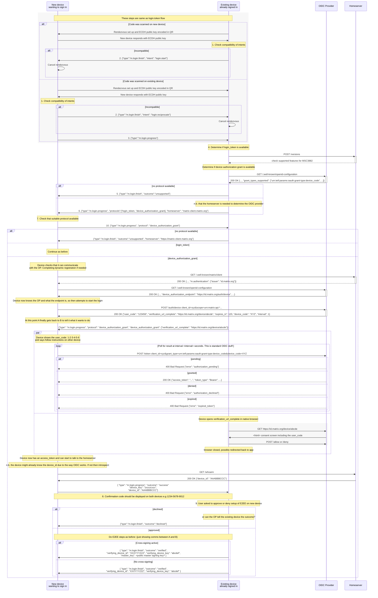

# MSC3906: Protocol to use an existing Matrix client session to complete login and setup of E2EE via QR code

This MSC proposes a method to allow an existing Matrix authenticated client/device to sign in a new device and handle
E2EE set up (mutual device verification; setup of cross-signing if used; connecting to room key backups if used).

There are currently two use cases for this proposal:

- allowing a user to login and setup E2EE on an additional Matrix client by means of scanning a QR code
- a mechanism to facilitate the launching of advanced E2EE aware "widgets" which are acting as full Matrix clients

## Secure channel prerequisite

This proposal relies on a secure "rendezvous" channel having been established between the two devices. (see dependencies
section)

The initiation of a secure channel could be via sharing a QR code or be through some other means.

By way of example this is what the QR for an X25519 based rendezvous via HTTP looks like in the Element Web
[prototype](https://pr9303--matrix-react-sdk.netlify.app/) where the code was generated on the new device:

```json
{
    "rendezvous": {
        "algorithm": "m.rendezvous.v1.curve25519-aes-sha256",
        "key": "2IZoarIZe3gOMAqdSiFHSAcA15KfOasxueUUNwJI7Ws=",
        "transport": {
            "type": "http.v1",
            "uri": "https://rendezvous.lab.element.dev/e8da6355-550b-4a32-a193-1619d9830668"
        }
    },
    "intent": "login.start"
}
```

This proposal should also work with a to_device based channel too.

Furthermore it should be adaptable to work with OIDC based authentication in future.

## Proposal

Once a secure channel is established the following protocol can be used. The initial steps of the secure channel setup are
only included for completeness:

```mermaid
sequenceDiagram
    participant A as New device wanting to sign in
    participant B as Existing device already signed in
    participant HS as Homeserver
Note over A,B: Devices establish secure rendezvous and derive<br> confirmation code from shared key. e.g. 1234-5678-9012<br>The intention of the initiator (generator of the scanned code) was encoded in the scanned code

    alt Code was scanned on new device
        rect rgb(240,240,240)
            Note over A,B: These are from MSC3886
            B->>A: Rendezvous set up and ECDH public key encoded in QR
            A->>B: New device responds with ECDH public key
        end
        Note over B: 1. Check compatibility of intents
        alt Incompatible
            B->>A: 2. {"type":"m.login.finish", "intent": "login.start"}
            A->>A: Cancel rendezvous
        end
    else Code was scanned on existing device
        rect rgb(240,240,240)
            Note over A,B: These are from MSC3886
            A->>B: Rendezvous set up and ECDH public key encoded in QR
            B->>A: New device responds with ECDH public key
        end
        Note over A: 1. Check compatibility of intents
        alt Incompatible
            A->>B: 2. {"type":"m.login.finish", "intent": "login.reciprocate"}
            B->>B: Cancel rendezvous
        end
        A->>B: 3. {"type":"m.login.progress"}
    end

    Note over B: 4. Determine if MSC3882 is available:
    B->>+HS: POST /versions
    HS-->>-B: supported features 
    alt no protocol available
        B->>A: 5. {"type":"m.login.finish", "outcome":"unsupported"}
    else
        B->>A: 6. {"type":"m.login.progress", "protocols":["login_token"]}
    end

    Note over A: 7. Check that suitable protocol available
    A->>B: 10. {"type":"m.login.progress", "protocol": "login_token"}

    Note over A,B: 8. Confirmation code should be displayed on both devices e.g 1234-5678-9012

    Note over B: 9. User asked to approve or deny login

    alt User declined
        B->>A: 10. {"type":"m.login.finish", "outcome":"declined"}
    else User approved

        B->>+HS: 11. POST /login/token
        HS-->>-B: {"login_token": "abcdefghijkl", "expires_in": 30}

        B->>A: 12. {"type": "m.login.progress", "login_token": "abcdefghijkl","homeserver": "https://matrix-client.matrix.org"}

        A->>+HS: 13. POST /login {"type": "m.login.token", "login_token": "abcdefghijkl"}
        HS-->>-A: {"access_token": "asdsad", "device_id": "AAABBBCCC"}

        alt no-E2EE
            A->>B: 14. {"type": "m.login.finish", "outcome": "success"}
        else E2EE

            Note over A: E2EE device keys generated and uploaded to HS as normal

            A->>B: 15. { "type": "m.login.progress", "outcome": "success" <br>"device_key": "zxcxzcxzc",<br>"device_id": "AAABBBCCC"}

            loop Timeout of 10 seconds
                B->>B: 16. Wait for new device to come online
            end

            Note over B: 17. check that device key from Homeserver vs received in 15 match
            B->>B: 18a. Mark new device (AAABBBCCC) as verified locally

            alt Cross-signing active
                B->>B: 18b. Sign new device
                B->>HS: 18b. Upload signature
                B->>A: 19a. { "type": "m.login.finish", "outcome": "verified", <br>"verifying_device_id": "XXXYYYZZZ", "verifying_device_key": "abcdef", <br>"master_key": <public master signing key> }
            else No cross-signing
                B->>A: 19b. { "type": "m.login.finish", "outcome": "verified", <br>"verifying_device_id": "XXXYYYZZZ", "verifying_device_key": "abcdef" }
            end

            Note over A: 20. Check that verifying_device_id and verifying_device_key match data from Homeserver
            A->>A: 21. Mark existing device (XXXYYYZZZ) as verified locally
            A->>A: 22. If master_key was received then mark as trusted
            alt Cross-signing active
                A->>HS: m.secret.request for MSK/USK/SSK private keys from existing device XXXYYYZZZ
                HS->>B: m.secret.request
                B->>HS: m.secret.send
                HS->>A: m.secret.send
                A->>A: Check and store received private keys locally
            end

            A->>HS: m.secret.request for m.megolm_backup.v1 key
            HS->>B: m.secret.request
            B->>HS: m.secret.send
            HS->>A: m.secret.send with key if known
            A->>A: Connect to key backup
        end
    end
```



1. The scanning device determines if the intents are compatible.

The `intent` is either:

- `login.start` - the device/client wishes to sign in
- `login.reciprocate` - the device/client wishes to sign in another device

2. If they are not compatible then the client sends a payload to indicate that it isn't compatible:

```json
{
    "type": "m.login.finish",
    "intent": "<intent type>"
}
```

Both side can then clean up the rendezvous and provide feedback to the user.

3. In the case that the new device scanned the code an empty progress payload is sent so that the the existing device
knows it can proceed

```json
{
    "type": "m.login.progress"
}
```

4. The existing device determines if the homeserver has sufficient capabilities to support the request (i.e. support for MSC3882).

5. If it doesn't then it responds with the following and closes the rendezvous:

```json
{
    "type": "m.login.finish",
    "outcome": "unsupported"
}
```

6. Otherwise, the existing device acknowledges the request and indicates the protocols available:

```json
{
    "type": "m.login.progress",
    "protocols": ["login_token"]
}
```

7. The new device can then choose whether to proceed with a protocol at this point. If so it sends:

```json
{
    "type": "m.login.progress",
    "protocol": "login_token"
}
```

It could decline with something like:

```json
{
    "type": "m.login.finish",
    "outcome": "unsupported"
}
```

8. A 12 numerical digit confirmation code derived from the shared key used by the rendezvous channel must be displayed
on both devices.

9. On the existing device the user must be prompted to approve the new login along with the confirmation code visible.

10. If the user declines the request:

```json
{
    "type": "m.login.finish",
    "outcome": "declined"
}
```

11. The existing device calls `POST /login/token` as per MSC3882 to obtain a `login_token`. n.b. If the homeserver
responds with UIA challenge then the existing device must complete UIA.

12. The existing device then sends the login token to the new device along with the homeserver to use it with:

```json
{
    "type": "m.login.progress",
    "login_token": "abcdefghijkl",
    "homeserver": "https://matrix-client.matrix.org"
}
```

13. New device calls `POST /login` to redeem the `login_token`.
e.g. `{ "type": "m.login.token", "login_token": <login token> }`

New device informs existing device of outcome and if E2EE is to be setup then includes device ID and keys:

14. No E2EE:

```json
{
    "type": "m.login.finish",
    "outcome": "success"
}
```

15. With E2EE:

```json
{
    "type": "m.login.progress",
    "outcome": "success",
    "device_id": "AAABBBCCC",
    "device_key": "zxcxzcxzc"
}
```

16. If doing E2EE then existing device then waits for up to X seconds for the `device_id` to become visible.

17. If the device is visible within the time period then the existing device must first check that the `device_id` and
`device_key` match those provided by the homeserver.

18a. Assuming they match then locally mark the device as verified.

18b. If cross signing is in use then cross-sign the new device and upload signature to Homeserver.

19. The existing device notified the new device that verification has been completed on its end:

```json
    "type": "m.login.finish",
    "outcome": "verified",
    "verifying_device_id": "XXXYYYZZZ",
    "verifying_device_key": "abcdefgh"
```

If cross-signing is in use then the public part of the master signing key `master_key` should be included:

```json
    "type": "m.login.finish",
    "outcome": "verified",
    "verifying_device_id": "XXXYYYZZZ",
    "verifying_device_key": "abcdefgh",
    "master_key": "mmmmmmmm"
```

20. The new device checks that `verifying_device_id` and `verifying_device_key` match those from the Homeserver

21. If they do match then locally mark the existing device as verified.

22. If the `master_key` was received then mark it as trusted

23. Request 4x secrets be gossiped from existing device and set them up as per normal verification

### Anticipated errors

- Neither device is already signed in
- Both devices are already signed in

### Cancellation

The new device could cancel the process at any time by sending:

```json
{
    "type": "m.login.finish",
    "outcome": "cancelled"
}
```

### OIDC variant

It is anticipated that a variant of this would work with OIDC in future identified by a different `protocol` value.

To be clear, it is not proposed that a OIDC protocol is defined at this time, but instead this is included here to help
get comfortable that this proposal is reasonably future proof.

Whilst not fully thought through it could work like this:



A UX complication here is that there are two codes that the user needs to see: the rendezvous checksum; the OIDC device
authorization grant code.

### Usage for launching a new client on a single device

There are two scenarios in mind:

1. Showing a "widget" within an existing Matrix client embedded as an iframe/WebView
2. "Popping out"/launching a new Matrix client from inside of an existing Matrix client

It could be that the two are go hand-in-hand: a widget could be visible in embedded mode and a button offered to "open
in new window". When clicked a new browser (or native?) window would be opened which would be signed in and set up for
E2EE as before.

## Potential issues

Please also refer to the dependent MSCs.

## Alternatives

Please also refer to the dependent MSCs.

## Security considerations

Please also refer to the dependent MSCs.

## Unstable prefix

It probably makes sense to use an unstable protocol name like `org.matrix.mscYYYY.login_token`.

## Dependencies

- [MSC3882](https://github.com/matrix-org/matrix-spec-proposals/pull/3882) to obtain a `m.login.token`
- A secure rendezvous channel such as:
  - [MSC3886](https://github.com/matrix-org/matrix-spec-proposals/pull/3886) + [MSC3903](https://github.com/matrix-org/matrix-spec-proposals/pull/3903) to do X25519 over HTTP
  - Or in future guest rendezvous via to_device messaging
