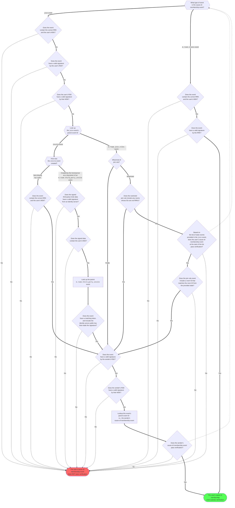
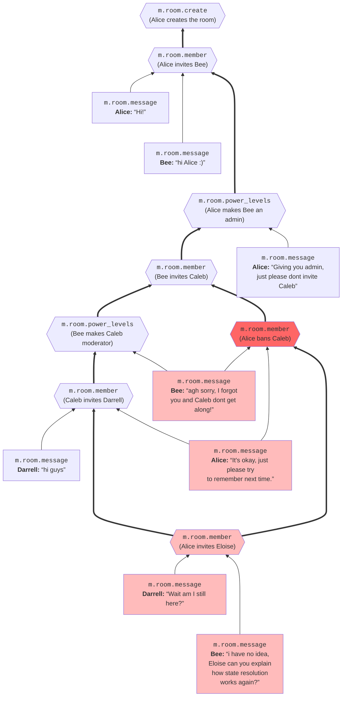

# MSC3917: Cryptographically Constrained Room Membership

In the current Matrix protocol, room membership events are not
cryptographically signed, except by homeservers during
federation. This means that a malicious homeserver can easily insert
additional members into an end-to-end encrypted room. The falsified
members will not receive keys for past messages, since those are only
shared by existing members when they invite new members, but the
falsified members will still be provided with keys for all new
messages. Although the new member joining the room will be visible to
all of the existing members, making it more difficult to perform such
an attack undetected, it would still be preferable to have a means for
clients to independently verify that a member actually belongs in a
room.

This proposal provides a method for clients to sign room membership
events such that the room memberships form a tree of signatures rooted
in the creation of the room, ensuring that every member belongs to a
chain of invitations that ultimately leads back to the room's
creator. This establishes a cryptographically verifiable bounding set
of possible members of a room, significantly raising the barrier for
homeservers to inject unauthorized members into the room.

In particular, this proposal provides the following security property:
**A user will only be verified as a possible room member if they
created the room, or if they joined the room with permission (explicit
or implicit) from another verified possible room member. As long as
state events are transmitted successfully, all such users will be
verified as possible room members.** In this context, a user is
defined as a Master Signing Key, and a set of devices with
Self-Signing Key signatures rooted in that MSK. A room is defined as a
Room Root Key, and a set of membership events with cryptographic
signatures rooted in that RRK.

## Proposal

### Rooms as Keys

This proposal associates each room with a public signing key, which
will be the root of a tree of signed state events related to user
memberships. This key is called the Room Root Key, and is generated by
the room's creator at creation.

In this proposal, the RRK will essentially become the cryptographic
identity of a room - being a member of the room, and being able to
verify others' membership in the room, requires knowing the RRK. Users
who disagree about a room's RRK are, for all intents and purposes, not
actually members of the same room. For this reason, we propose that
the RRK should *be* the room ID. Similar to
[MSC1228](https://github.com/matrix-org/matrix-spec-proposals/pull/1228),
the new format of a room ID will be `![unpadded urlsafe-base64ed
ed25519 public key]`,
e.g. `!Sr_Vj3FIqyQ2WjJ9fWpUXRdz6fX4oFAjKrDmu198PnI`. However, note
that unlike MSC1228, in this proposal the key is generated
*client-side* by the room's creator, and not shared with the server.

### Membership Event Signature Tree

In what follows, we define a *cause-of-membership event* to be a
`join` event or `m.room.create` event that made a user a purported
member of a room.

This proposal has each user generate a new cryptographic signing key
called the Room Signing Key, or RSK. The RSK is used for signing
certain types of room state events that the user sends (specifically,
invitations, joins, and join rule changes), so that other room members
can verify that the events were genuinely sent by that user. The RSK
should be signed by the Master Signing Key, and stored and retrieved
alongside the user's other signing keys.  This key will be identified
by the string `m.cross_signing.room_signing`, and will be published to
the `/keys/device_signing/upload` endpoint using the new optional
field `room_signing_key`, with usage `["room_signing"]`.

The proposal also adds additional fields to several room state events,
holding cryptographic signatures and related metadata:

- The `m.room.create` event should have the following new content
  fields:
  + `room_root_key`: An Ed25519 public key generated for this specific
    room by the room creator, henceforth called the Room Root Key
    (RRK), that will serve as the root of the room membership
    signature tree.
  + `creator_key`: The public part of the room creator's Master
    Signing Key.
  + `signatures`: A signature of the event's `content` by the Room
    Root Key, generated using the normal process for signing JSON
    objects. For this purpose, the entity performing the signature is
    the room ID, and the key identifier is `"rrk"`.

  Rooting room memberships in a Room Root Key, rather than directly in
  the creator's MSK, means that each room has a unique root key, and
  that as long as clients agree on the RRK, they will agree on the
  validity of the entire signature tree. Essentially, the RRK *is* the
  cryptographic identity of the room, just as an MSK is the
  cryptographic identity of a user.

<details>
<summary>Example event</summary>

```json
{
  "type": "m.room.create",
  "sender": "@alice:example.com",
  "content": {
    "room_version": "9",
    "creator": "@alice:example.com",
    "room_root_key" : "/ZK6paR+wBkKcazPx2xijn/0g+m2KCRqdCUZ6agzaaE",
    "creator_key" : "D67j2Q4RixFBAikBWXb7NjokkRgTDVyeHyEHjl8Ib9",
    "signatures" : {
        "@alice:example.com" : {
            "ed25519:rrk" : "iI98hykGBn0MuLopSysQYY/6bSaxuSZL05yRI+20P51RtfL3mwEHxSm7x6B3TMvAauxXX5hwohk8rqiWBDBWCQ"
        }
    }
  },
  "state_key": "",
  ...
  "event_id": "$OSorlEHbz-xyfIaoy200IxyJAI2oTdOYFubheGwNr7c",
  "room_id": "!_ZK6paR-wBkKcazPx2xijn_0g-m2KCRqdCUZ6agzaaE"
}
```

</details>

- The `m.room.member` event should have the following new content
  fields when the membership state is `invite` or `join`, *unless* it
  is an `invite` event created by the homeserver as a successor of an
  `m.room.third_party_invite` event:
  + `sender_key`: The sender's public Room Signing Key, signed by
    their Master Signing Key, in the same `CrossSigningKey` format
    used by the [`/keys/device_signing/upload`
    endpoint](https://spec.matrix.org/v1.3/client-server-api/#post_matrixclientv3keysdevice_signingupload).
    This field is provided in order to simplify the process of
    connecting the sender's MSK to their RSK, particularly in cases
    where the sender may no longer be in the room or may have even
    deactivated their account.
  + `parent_event_id`:
      * If this is an `invite` event sent directly by a user, the
        parent event is the inviter's cause-of-membership event.
      * If this is a `join` event, the parent event is the `invite`
        event or `m.room.join_rules` event that allowed this user to
        join.
  + `user_key`: The public MSK of the user whose membership is being
    affected.
  + `room_root_key`: The public RRK.
  + `signatures`: A signature of this event's content by the sender's
    RSK, generated using the normal process for signing JSON objects.
  + `unsigned`: If this is a `join` event for a restricted room based
    on membership in another room, and that other room has an RRK,
    then the unsigned data must include the following field:
    * `membership_events`: An array holding a chain of stripped state
      events proving the user's possible membership in the room
      specified in the join rule, starting with the
      cause-of-membership event, and following parent events back to
      the specified room's `m.room.create` event.

  The RRK is included in the signed data as a way of ensuring that
  every new member agrees with the existing members on the true
  RRK. If a member does not know the true RRK, they may later be
  tricked into falsely believing that another user is a member of the
  room, and share keys for their own messages with that user.

  If the `m.room.member` event *is* an `invite` event created as a
  successor of a third-party invite, it must instead include the
  following additional fields:
  + `parent_event_id`: The ID of the `m.room.third_party_invite`
    event.
  + `third_party_invite`:
    * `signed`:
      - `user_key`: The public MSK of the user being invited.

- The `m.room.join_rules` event should have the following new content
  fields when the join rule is `public` or `restricted`:
  + `sender_key`: The sender's public Room Signing Key, signed by
    their Master Signing Key, in the same `CrossSigningKey` format
    used by the [`/keys/device_signing/upload`
    endpoint](https://spec.matrix.org/v1.3/client-server-api/#post_matrixclientv3keysdevice_signingupload).
    This field is provided in order to simplify the process of
    connecting the sender's MSK to their RSK, particularly in cases
    where the sender may no longer be in the room or may have even
    deactivated their account.
  + `parent_event_id`: The ID of the sender's cause-of-membership
    event.
  + `signatures`: A signature of this event by the sender's RSK,
    generated using the normal process for signing JSON objects.

- The `m.room.third_party_invite` event should have the following new
  content fields:
  + `sender_key`: The sender's public Room Signing Key, signed by
    their Master Signing Key, in the same `CrossSigningKey` format
    used by the [`/keys/device_signing/upload`
    endpoint](https://spec.matrix.org/v1.3/client-server-api/#post_matrixclientv3keysdevice_signingupload).
    This field is provided in order to simplify the process of
    connecting the sender's MSK to their RSK, particularly in cases
    where the sender may no longer be in the room or may have even
    deactivated their account.
  + `parent_event_id`: The ID of the sender's cause-of-membership
    event.
  + `signatures`: A signature of this event's content by the sender's
    RSK, generated using the normal process for signing JSON objects.

Note that for these state events' content to be signed by clients, the
relevant client-server API endpoints will need to be updated so that
clients can submit complete signed event contents, rather than having
the homeserver generate the events from scratch:

- The `creation_content` request field for the `/createRoom` endpoint
  will now hold all signed content fields of the `m.room.create`
  event. This includes the public part of the Room Root Key, and the
  server *must* use the RRK as the room ID as described above. The
  server may not modify any of the content fields, and may not add any
  additional content fields except for data under `unsigned`. If the
  event content provided is unacceptable for any reason, the server
  should reject the request with a suitable error.
  
- The body of a `/rooms/{roomId}/invite` request or of a `/join`
  request will now hold all signed content fields of the
  `m.room.member` event or `m.room.third_party_invite` event.
  
For third-party invitations in particular, the client must now be the
one to communicate directly with the identity server and receive an
MXID to invite directly, or a token to publish in the
`m.room.third_party_invite` event. Furthermore, when the identity
server creates an identity mapping, it must learn the invited user's
public MSK, and include that in its signed data alongside the MXID and
token.

With these fields in place, a user's cause-of-membership event can be
cryptographically verified via the following procedure:



Note that this procedure specifically verifies that **a particular
MSK** may legitimately belong in the room. Devices that claim to
belong to a user, but are not signed by a Self-Signing Key signed by
that particular MSK, must not be treated as belonging in the room.

If clients are unable to verify a user's cause-of-membership event for
a room, they may refuse to share cryptographic material in that room
with that user.

As verification of the entire membership event chain *requires*
knowing the correct RRK for a room, it is critical that when joining a
new room, clients receive its RRK in a way that cannot easily be
falsified by the homeserver. In the case where a user is being
directly invited by an existing contact, they will receive an
`m.room.membership` invite event which contains the RRK and is signed
by the inviter; therefore, as long as they have the correct MSK for
their contact, they will have the correct RRK for the room. Simply
put, the authenticity of the room is exactly as strong as the
authenticity of communications with the inviter, which is an inherent
limit on any chat system.

To address situations where users join a room without being directly
invited, we make the following additional changes:

- The `m.space.child` event should have the following new content
  fields:
  + `sender_key`: The sender's public Room Signing Key, signed by
    their Master Signing Key, in the same `CrossSigningKey` format
    used by the [`/keys/device_signing/upload`
    endpoint](https://spec.matrix.org/v1.3/client-server-api/#post_matrixclientv3keysdevice_signingupload).
    This field is provided in order to simplify the process of
    connecting the sender's MSK to their RSK, particularly in cases
    where the sender may no longer be in the room or may have even
    deactivated their account.
  + `parent_event_id`: The ID of the sender's cause-of-membership
    event.
  + `room_root_key`: The RRK of the child room. This is already
    provided by the child room's ID, which is the state key of the
    event; however, it is duplicated here so that it will be included
    in the signed event content.
  + `signatures`: A signature of this event's content by the sender's
    RSK, generated using the normal process for signing JSON objects.

  When checking the list of child rooms of a space, clients should
  verify that `m.space.child` events are properly signed, and that the
  senders' cause-of-membership events pass validation.

- `matrix:` URIs and `matrix.to` URIs for room aliases should have an
  additional query parameter `room_root_key`, holding the
  base64-encoded RRK of the room. The authenticity of RRKs obtained
  from these URIs is thus as strong as the authenticity of whatever
  communications channel the URIs were sent through, which is again a
  fundamental limit.

## Potential issues

The protocol outlined here is necessary, but not sufficient, to
determine definitively whether a user is a room member. It provides a
bounding set of cryptographically verifiable possible room members,
defined by a tree of signed state events in which users authorize
other users to join. It *does not* cryptographically verify
that the senders of those state events had the required power levels
at the time they issued the events, or that they didn't leave or get
banned between joining and issuing the events.

Essentially, the primary goal of this proposal is to ensure that
attackers (including malicious homeservers) lose their ability to
*unilaterally* insert members into a room. In order to falsify room
membership, a malicious homeserver must collude with or compromise a
user who has been a legitimate member of the room at some point in
time; or tamper with communications between some existing room member
and a new member who they are inviting, and deceive the existing
member about the new member's MSK before they are invited. In a world
with ubiquitous TOFU via
[MSC3834](https://github.com/matrix-org/matrix-spec-proposals/pull/3834),
this deception must take place at the moment of first contact between
the existing member and the future new member, and they must never
attempt to verify each other out-of-band.

If a user resets their MSK for any reason, their membership in the
room can no longer be verified. They will need to submit a new join
event, possibly being re-invited or re-joining a room from a
restricted join rule, before they can continue to be trusted as a room
member. Again, this is a fundamental limitation: in a scenario where
homeservers are untrusted, a user's MSK *must* be the root of their
entire identity, and any change to the MSK requires manually
re-establishing any and all trust that has been extended to that
user. Ideally, this work should be coupled with work to provide users
with more easy and reliable backup and recovery options, making MSK
resets as rare as possible.

In order to participate in rooms belonging to the new room version in
this proposal, it is a hard requirement that clients support this
proposal at least well enough to add signatures and other required
fields to the state events they send, even if they are not interested
in verifying room membership themselves. It might be possible to allow
older clients to participate, but forbid them from inviting new users
or setting join rules; regardless, this presents an obstacle for
smoothly rolling out this proposal in Matrix's ecosystem.

## Alternatives

To obtain stronger cryptographic guarantees regarding room membership,
we could additionally mandate that *all* state events be signed
client-side, and that clients be given all the information they need
to perform their own state resolution without relying on the
server. This would allow clients to confirm that invitations were
issued by users with the correct power levels, among other
things. However, in order to prevent users who have left (or been
banned from) the room from colluding with the server to re-enter the
room or invite others, a more complex strategy is required. Even with
signatures on all state events, it is still easy for a server to
simply delete the membership event in which a user leaves or is
banned; likewise, the server can also delete state events where power
levels are changed to reduce a user's capabilities.

To prevent the server from hiding state events, one option would be to
not only sign state events, but to sign their causal relationships to
other state events. Essentially, state events are a *directed acyclic
graph*, with edges leading from a state event to various other state
events that are causally prior to it. Every time a new state event is
sent, it must be signed client-side by its sender (using RSKs in the
same manner as above), and must include the full list of event IDs of
*source* nodes (nodes with no incoming edges) in the currently-known
state DAG - i.e., a minimal list of prior state event IDs sufficient to
establish that the entire known state DAG is causally prior to the new
state event.

Now, in order for the server to discard a state event, it must also
discard *all* state events that are causally later than the discarded
state event, in perpetuity; at a bare minimum, all state events sent
by the sender of the discarded state event will need to be
discarded. However, if state events are only sent infrequently, it may
still be possible to perform this attack stealthily, without users
noticing that one of their members has stopped sending any state
events. For this reason, it would also be best to have all non-state
events include the list of source node event IDs in the
currently-known state DAG; in this case, rather than being signed by
RSKs, these lists would be protected by the authenticity guarantees of
the room's Megolm encryption. Now, in order to hide a single state
event, the server must permanently *silence* the sender entirely
within that room, as well as silencing any other users who have
received the state event. Note that non-state events do not become
*part of* the state DAG, and do not need to be linked-to in this way
by later events.

Here is an example of the event history of a room with this
alternative expanded proposal. In this diagram, every thick arrow
represents a backreference from a new state event to an old state
event, within the state event content signed by an RSK; every thin
arrow represents a backreference from a non-state event to a state
event, protected by Megolm's authenticity properties.



Now, in order for a server to delete the event in which Alice bans
Caleb (highlighted in red), it would also need to delete *all* events
with edges leading to that event (highlighted in pink), or else
clients would easily be able to tell that room history had been
tampered with.

In order to fully make use of this information, clients would also
need to be provided with all the information required to perform their
own state resolution independently of homeservers. Mainly, this would
be the `auth_events` and `origin_server_ts` fields of events in the
Server-Server API. Ideally, these would be signed client-side as well;
this is easy enough to do for `auth_events`, but ensuring that
`origin_server_ts` cannot be falsified (by clients or by servers) in
ways that would impact state resolution is a more complex problem. In
general, this alternative proposal has the potential to dovetail or
conflict with existing P2P Matrix work in complex ways, and would need
to be considered carefully in that light.

## Threat modeling

Here, we present a list of possible attacks, and how well these are
mitigated by this baseline proposal (of a membership signature tree);
by the expanded alternative version, with a full signed state DAG and
client-side state resolution; and by [Signal's system for managing
group memberships](https://eprint.iacr.org/2019/1416.pdf).

- ✅: Mitigated
- 🚧: Partially mitigated
- ❌: Not mitigated

| Attack | Membership tree | State DAG | Signal |
|---|---|---|---|
| Homeserver admin inserts a new member | ✅ | ✅ | ✅ |
| Homeserver admin re-inserts a banned member | ❌ | ✅ | ❌ |
| Banned member colludes with homeserver to insert a new member | ❌ | 🚧(1) | ❌ |
| Unprivileged member colludes with homeserver to insert a new member | ❌ | ✅(2) | ❌ |


1. Dependent on whether timestamps can be falsified to manipulate the
   precedence of causally-unconnected events during state resolution.
2. If the user had invitation privileges at some point in the past,
   this is only partially mitigated, as in the case of a banned member.

## Security considerations

If a room's join rule is ever set to `public`, or to `restricted`
based on a room with an older version that does not implement this
proposal, then all alleged room memberships will be accepted as
legitimate as long as the member signs their own join event and knows
the correct RRK. In the case of public rooms, this is not particularly
an issue, as verifying the membership of a public room is largely
meaningless to begin with. Allowing restricted rooms based on older
rooms is necessary for backwards compatibility, but since the
membership of these older rooms cannot be verified, there is no longer
a means of verifying the membership of a new room. Therefore,
particularly in the case of migrating from an old version to a new
version, room administrators will need to manually re-invite all
members they believe to be legitimate, rather than setting up a
restricted join rule.

Third-party invites still inherently require trusting an identity
server to sign identity mappings correctly. This proposal, by
requiring that the inviter sign the `m.room.third_party_invite` event
content, does provide the added protection that a legitimate room
member must designate a list of trusted identity server public keys,
rather than leaving the choice up to the homeserver. Short of manually
verifying a user's third-party identity out-of-band and directly
issuing an invite to their MXID, there is no real way to add further
authenticity guarantees to this process.

## Unstable prefix

Newly-added field names will be prefixed with
`org.matrix.msc3917.v1`. Test implementations can identify the RSK as
`org.matrix.msc3917.v1.cross_signing.room_signing`, use the optional
field `org.matrix.msc3917.v1.room_signing_key` for the
`/keys/device_signing/upload` endpoint, and use the newly-added state
event content fields (other than `signatures` and `unsigned`) prefixed
by `org.matrix.msc3917.v1`.

The updated endpoints for creating, inviting, and joining rooms will
all be prefixed with `/unstable/org.matrix.msc3917.v1/`.

## Dependencies

This MSC does not fundamentally require
[MSC3834](https://github.com/matrix-org/matrix-spec-proposals/pull/3834/)
(not yet accepted at the time of writing) in order to function, but
the security guarantees offered by this proposal are much stronger
when it is used in concert with TOFU.

The rooms-as-keys aspect of this proposal is modeled after
[MSC1228](https://github.com/matrix-org/matrix-spec-proposals/pull/1228). However,
this proposal conflicts with MSC1228 in that we require Room Root Keys
to be generated client-side by room creators.
