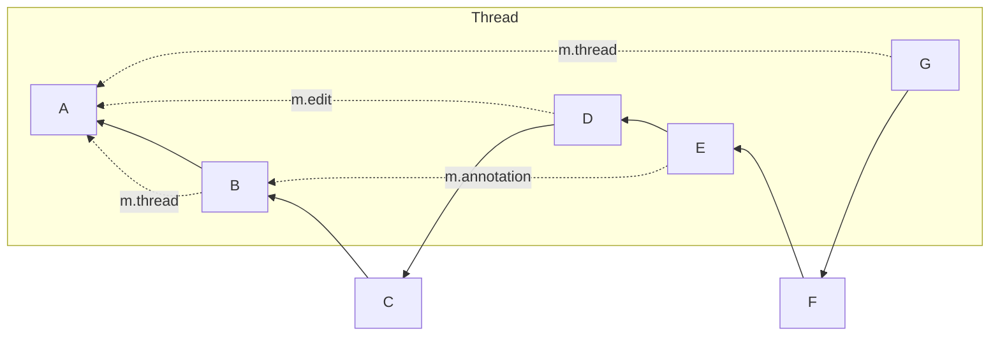

# MSC3981: `/relations` recursion

The [`/relations`] API allows clients to retrieve events which directly relate
to a given event.

This API has been used as basis of many other features and MSCs since then, 
including threads.

Threads was one of the first usages of this API that allowed nested relations -
an event may have an [`m.reaction`] or [`m.replace`] relation to another event, 
which in turn may have an `m.thread` relation to the thread root.

This forms a tree of relations, which can currently only be traversed 
efficiently in hierarchical, but not in chronological order. Yet, for some
functionality – e.g., to determine which event a read receipt should 
reference as per [MSC3771] – chronological order is necessary.

Previously, clients would be unable to obtain a consistent ordering of
events in threads or related to threads.  
Workarounds such as sending a separate `/relations` request per individual 
message in each thread are only able to approximate the actual ordering,
as they rely on timestamps.

## Proposal

It is proposed to add the `recurse` parameter to the `/relations` API, defined
as follows:

> Whether to include events which relate only indirectly to the given event.
> 
> If set to false, only events which have direct a relation with the given 
> event will be included.
> 
> If set to true, all events which relate to the given event, or relate to 
> events that relate to the given event, will be included.
>
> It is recommended that at least 3 levels of relationships are traversed. 
> Implementations should be careful to not infinitely recurse.
>
> One of: `[true false]`.

In order to be backwards compatible the `recurse` parameter must be
optional (defaulting to `false`).

In this situation, topological ordering is intended to refer to the same
ordering that would be applied to the events when requested via the `/messages`
api given the same `dir` parameter.

Regardless of the value of the `recurse` parameter, events will always be 
returned in topological ordering. Pagination and limiting shall also apply to 
topological ordering.

If the API call specifies an `event_type` or `rel_type`, this filter will be
applied to nested relations just as it is applied to direct relations.

## Potential issues

Naive implementations might be tempted to provide support for this parameter
through a thin shim which is functionally identical to the client doing 
separate recursive `/relations` requests itself. This is ill-advised.

Such an implementation would, given a specifically crafted set of events, 
allow a client to cause unreasonable load.

## Alternatives

1. Clients could fetch all relations recursively client-side, which would 
   increase network traffic and server load significantly.
2. A new, specialised endpoint could be created for threads, specifically 
   designed to present separate timelines that, in all other ways, would
   behave identically to `/messages`.
3. Twitter-style threads (see [MSC2836]).
4. Alternatively a `depth` parameter could have been specified, as in [MSC2836].  
   We believe that a customizable depth would add unnecessary constraints to 
   server implementers, as different server implementations may have different
   performance considerations and may choose different limits. Additionally,
   the maximum currently achievable depth is still low enough to avoid this
   becoming an issue.

## Security considerations

None.

## Examples

Given the following graph:

`/messages` with `dir=f` would 
return `[A, B, C, D, E, F, G]`.

`/relations` on event `A` with `rel_type=m.thread` and `dir=f` would 
return `[B, G]`. 

`/relations` on event `A` with `recurse=true` and `dir=f` would 
return `[B, D, E, G]`.

`/relations` on event `A` with `recurse=true`, `dir=b` and `limit=2` would
return `[G, E]`.

`/relations` on event `A` with `rel_type=m.annotation`, 
`event_type=m.reaction` and `recurse=true` would return `[G, E]`.

## Unstable prefix

Before standardization, `org.matrix.msc3981.recurse` should be used in place
of `recurse`.

[MSC2836]: https://github.com/matrix-org/matrix-spec-proposals/pull/2836
[MSC3771]: https://github.com/matrix-org/matrix-spec-proposals/pull/3771
[`/relations`]: https://spec.matrix.org/v1.6/client-server-api/#get_matrixclientv1roomsroomidrelationseventid
[`m.reaction`]: https://github.com/matrix-org/matrix-spec-proposals/pull/2677
[`m.replace`]: https://spec.matrix.org/v1.6/client-server-api/#event-replacements
