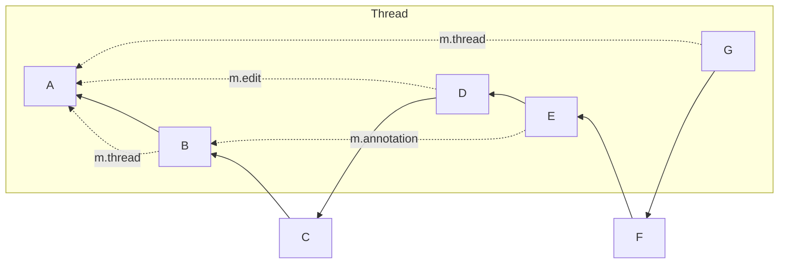

# MSC3981: `/relations` recursion

The [`/relations`] API allows clients to retrieve events which directly relate
to a given event.

This API has been used as basis of many other features and MSCs since then, 
including threads.

Threads was one of the first usages of this API that allowed nested relations -
an event may have an [`m.reaction`] or [`m.replace`] relation to another event, 
which in turn may have an `m.thread` relation to the thread root.

This forms a tree of relations. A client wanting to display a thread will want
to display reactions and edits to messages in the thread, and will therefore need
the second-order related events in addition to just the events with a direct thread
relation to the root.

Clients can recursively perform the /relations queries on each event but this is
very slow and does not give the client any information on how the events are ordered
for the purpose of sending read receipts.

## Proposal

It is proposed to add the `recurse` parameter to the `/relations` API, defined
as follows:

> Whether to additionally include events which only relate indirectly to the
> given event,
> ie. events related to the root events via one or more direct relationships.
> 
> If set to false, only events which have direct a relation with the given 
> event will be included.
> 
> If set to true, all events which relate to the given event, or relate to 
> events that relate to the given event, will be included.
>
> It is recommended that at least 3 levels of relationships are traversed. 
> Implementations may perform more but should be careful to not infinitely recurse.
>
> One of: `[true false]`.

In order to be backwards compatible the `recurse` parameter must be
optional (defaulting to `false`).

Regardless of the value of the `recurse` parameter, events will always be 
returned in topological ordering, ie. the same order in which the `/messages` API
would return them (given the same `dir` parameter).

Filters specified via `event_type` or `rel_type` will be applied to all events
returned, whether direct or indirect relations. Events that would match the filter,
but whose only relation to the original given event is through a non-matching
intermediate event, will not be included. This means that supplying a `rel_type`
parameter of `m.thread` is not appropriate for fetching all events in a thread since
relations to the threaded events would be filtered out. For this purpose, clients should
omit the `rel_type` parameter and perform any necessary filtering on the client side.

## Potential issues

Naive implementations might be tempted to provide support for this parameter
through a thin shim which is functionally identical to the client doing 
separate recursive `/relations` requests itself. However this would allow a
client to craft a set of events that would cause unreasonable load.

## Alternatives

1. Clients could fetch all relations recursively client-side, which would 
   increase network traffic and server load significantly.
2. A new, specialised endpoint could be created for threads, specifically 
   designed to present separate timelines that, in all other ways, would
   behave identically to `/messages`.
3. Twitter-style threads (see [MSC2836]).
4. Alternatively a `depth` parameter could have been specified, as in [MSC2836].  
   We believe that a customizable depth would add unnecessary constraints to 
   server implementers, as different server implementations may have different
   performance considerations and may choose different limits. Additionally,
   the maximum currently achievable depth is still low enough to avoid this
   becoming an issue.

## Security considerations

Security considerations are discussed inline throughout this proposal.

## Examples

Given the following graph:

`/messages` with `dir=f` would 
return `[A, B, C, D, E, F, G]`.

`/relations` on event `A` with `rel_type=m.thread` and `dir=f` would 
return `[B, G]`. 

`/relations` on event `A` with `recurse=true` and `dir=f` would 
return `[B, D, E, G]`.

`/relations` on event `A` with `recurse=true`, `dir=b` and `limit=2` would
return `[G, E]`.

`/relations` on event `A` with `rel_type=m.annotation`, 
`event_type=m.reaction` and `recurse=true` would return `[G, E]`.

## Unstable prefix

### While the MSC is not yet part of a spec version

During this period, to detect server support, clients should check for the
presence of the `org.matrix.msc3981` flag in the `unstable_features` map
on [`/versions`](https://spec.matrix.org/v1.7/client-server-api/#get_matrixclientversions).

Clients are also required to use `org.matrix.msc3981.recurse` in place
of `recurse` at this time.

### Once the MSC is in a spec version

Once this MSC becomes a part of a spec version, clients should rely on the
presence of the spec version that supports this MSC in the `/version` response
to determine support.

Servers are encouraged to keep the `org.matrix.msc3827` flag around for a 
reasonable amount of time to help smooth over the transition for clients.  
"Reasonable" is intentionally left as an implementation detail, however the MSC
process currently recommends at most 2 months from the date of spec release.

[MSC2836]: https://github.com/matrix-org/matrix-spec-proposals/pull/2836
[MSC3771]: https://github.com/matrix-org/matrix-spec-proposals/pull/3771
[`/relations`]: https://spec.matrix.org/v1.6/client-server-api/#get_matrixclientv1roomsroomidrelationseventid
[`m.reaction`]: https://github.com/matrix-org/matrix-spec-proposals/pull/2677
[`m.replace`]: https://spec.matrix.org/v1.6/client-server-api/#event-replacements
