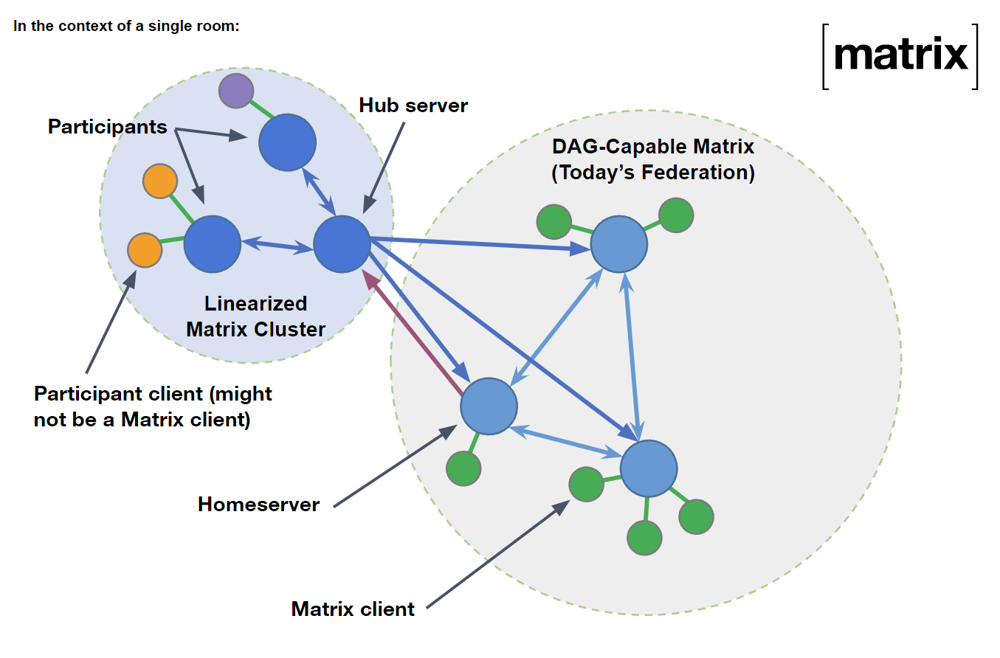
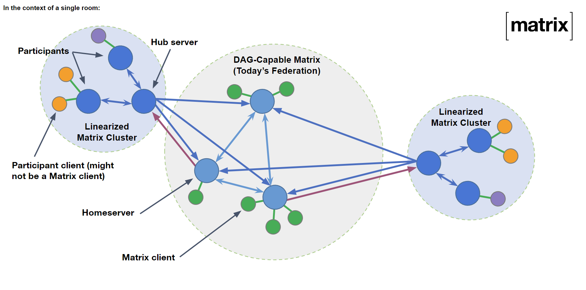
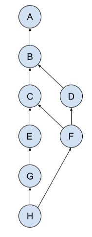

# MSC3995: Linearized Matrix

At the room level, Matrix currently operates with a [Directed Acyclic Graph](https://en.wikipedia.org/wiki/Directed_acyclic_graph)
(DAG) to persist messages. Servers wishing to contribute to the DAG broadcast their events (nodes) to
every other server participating in the room, which all then run the exact same set of rules on the
received message to ensure it is legal before appending it to their local copy of the DAG. Servers
missing events can self-heal by contacting other servers, validating the response, and inserting the
events appropriately.

This model provides fully decentralized communications as a feature to Matrix, a feature we'd like to keep,
however is complex when aiming to adopt Matrix as an interoperable chat protocol, such as with the emergence
of the European Union's Digital Markets Act (DMA). A summary of the DMA's impact and Matrix's involvement
up until now is available on the [matrix.org blog](https://matrix.org/blog/2023/03/15/the-dma-stakeholder-workshop-interoperability-between-messaging-services).

This proposal explores two primary concepts: an API surface on top of the existing room DAG which makes
interoperability easier to achieve (without sacrificing decentralization when desired), and an overall
cleanup of the existing protocol to make implementations clearer.

We call the new API surface "Linearized Matrix", as it uses a linked list to represent the room's
underlying DAG.

*Author's note*: Linearized Matrix is being discussed in multiple venues. Within the Matrix proposal
process, we need to describe the delta between the specification today and where we want to be (which
is what this MSC does), however other venues are more interested in the final state than how we get
there. This may result in some documents which on the surface appear to conflict with this MSC or the
overall project, but in practice are presenting the problem space from a different perspective. If you,
the reader, have questions or concerns about a particular document or venue Linearized Matrix is involved
in, please drop by the [#matrix-spec:matrix.org](https://matrix.to/#/#matrix-spec:matrix.org) room on
Matrix.

*Author's note*: This proposal describes Linearized Matrix v2. v1 never made it to an MSC because it
doesn't work for a variety of reasons. Additionally, v2.5 is already a work in progress (changing how
the hub's trust of the DAG server works).

## This MSC is going through extremely rapid iteration

As is implied throughout, this MSC is considered a work in progress and is subject to change wildly without
notice. Implementations are welcome, though the author notes that due to the highly dynamic nature of this
MSC's content it may be a frustrating experience. This notice will be removed when the MSC is stable enough
for a wider range of (unstable) implementations.

## Proposal

### Room structure

Linearized Matrix makes use of a room version to adjust a room's algorithmic behaviour, namely in terms
of signing and authorization rules. State resolution is not modified by this room version. The room
version is based upon [v10](https://spec.matrix.org/v1.6/rooms/v10).

Rooms are still represented by a DAG, with a hub server being responsible for maintaining a singly-linked
list representation of the room for other Linearized Matrix servers (known as "participant servers").
The hub server aggressively appends to its linked list, which in turn would be represented by a single
branch of the DAG.

This leads to the following roles for servers:

* **DAG-capable**: Every homeserver which already exists today. These servers do not need to change how
  they persist rooms (they continue using a DAG).

* **Hub**: A server which accesses the room using a linked list on behalf of other *participant* servers.
  This server can be DAG-capable, but does not need to be.

* **Participant**: A server which relies on a hub server to access the room. This server is not DAG-capable.

A "Linearized Matrix server" is one which can behave as both a hub and participant depending on the
situation, but does not need to become DAG-capable.

DAG-capable servers are able to become involved in the room at any point, including creating a room which
later has hubs and participants in it. Once a DAG-capable server is involved, hub servers will pick from
the DAG-capable servers to have them do linearization of the DAG on their behalf. The hub server, and thus
all the participant servers attached to it, will then only receive events created by DAG-capable servers
through the single selected server.

This architecture ends up looking something like this:

As shown, the participant servers use the hub server to reach the room. Only a single DAG-capable server,
chosen by the hub, is able to send events from the DAG-capable servers to the hub. The hub does fanout to
all other non-hub servers in the room, including DAG-capable ones.

The fanout is slightly confusing here to improve latency: the hub doesn't need to round trip every event
through the DAG server to participate on the DAG. Instead, the hub creates a DAG-capable PDU itself and
sends it. This might result in extremities on the DAG servers, however the DAG servers are significantly
more capable of healing those extremities on their own. The hub only needs to be aware of the DAG enough
to understand that `prev_events` will be an array with a single event ID in it (for events that it sends).

A room can have more than one hub server, leading to multiple "clusters" of participants running with
Linearized Matrix:

*Author's note*: This architecture doesn't currently exist and is a work in progress. The remainder of
the MSC may refer to a concept of a single hub for this reason, sorry.

Note that the two hub servers are not talking directly to each other: they ultimately end up "talking"
through their respective chosen DAG-capable servers. At least 1 DAG-capable server must be present in
the room to support multiple hubs, due to state resolution being needed for conflict handling. Note
that a hub can be DAG-capable itself, thus being able to serve another hub if needed.

### Identifying DAG-capable servers, hubs, and participants

*Author's note for unstable implementations*: This section is not what is implemented in practice. We
currently assume there's a single hub in the room and any `membership=join` events annotated with
`hub_server` (described later) are Linearized Matrix servers.

On the [`/_matrix/key/v2/server`](https://spec.matrix.org/v1.6/server-server-api/#get_matrixkeyv2server)
endpoint, servers which are *not* DAG-capable add a top level `"m.linearized": true` boolean flag. If
not present or `false`, the server is assumed to be DAG-capable.

Hubs generally make themselves known to DAG-capable servers upon picking them to linearize the DAG for
them. Participants can be identified by the domain implied by the event `sender` not matching the
top level `hub_server` field, described later.

### Event format

PDUs (containers for events over federation) [currently](https://spec.matrix.org/v1.6/rooms/v10/#event-format)
define 3 fields relevant for DAG representation of events:

* `auth_events`: The event IDs which prove the sender is allowed to send the event. Which events must
  be included here are [selected](https://spec.matrix.org/v1.6/server-server-api/#auth-events-selection).

* `prev_events`: The event IDs which precede this event. Typically will be forward extremities for the
  server.

* `depth`: The topological ordering of this event in the DAG.

Because the `depth` field is subject to [abuse](https://github.com/matrix-org/matrix-spec-proposals/issues/3802),
it is **removed** from the event format in this new room version. It serves no meaningful purpose in the
room algorithms currently, though some server implementations may be dependent on it for legacy reasons.
Dependent server implementations are encouraged to calculate depth rather than rely on it being populated
on PDUs, or just stop depending on it. A possible approach for dependent server implementations is described
by [gomatrixserverlib#187](https://github.com/matrix-org/gomatrixserverlib/issues/187).

Participant servers might not have full context on the conversation history. Instead of guessing previous/auth
events or forcing them to replicate the room history, the participants delegate to the hub to determine the
auth and prev events on their events. DAG-capable servers **DO NOT** delegate to the hub: they just produce
a PDU directly.

The participant's partial PDU (one lacking prev and auth events) is called a Linearized PDU, or LPDU. An
LPDU is identified by the presence of a top level `hub_server` field, denoting the domain of the hub server
at the time of the event. The hub server always references itself in this field. DAG-capable servers do not
populate this field when generating events.

The LPDU is signed by the originating server to ensure authenticity through the chain. When the hub server
is referencing itself in `hub_server` it can't sign both the LPDU and final PDU due to the signatures
structure not supporting such a concept. Instead, the hub server only signs the final PDU in this case,
losing the LPDU signatures in the process.

**TODO**: Figure out how content hashes work. Originally they were supposed to be populated by the origin
server, but the content hash also covers auth and prev events. This means a participant server can't currently
protect its event contents, which is a *very* bad thing.

### Topological ordering / linearization

To ensure the hub server can pick any DAG-capable server and end up with a consistent view of the room, a
standardized linearization algorithm is defined. This algorithm is heavily dependent on how
[state resolution](https://spec.matrix.org/v1.6/rooms/v10/#state-resolution) works.

Though the depth field is removed from the event format, the definition is still used for linearization.
After the DAG-capable server runs state resolution and accepts a PDU into the DAG, it calculates the maximum
depth of the new event(s). That depth is then used to create a series of linked list references for the
hub server to append/insert accordingly.

Note that the depth of an event is theoretically mutable, as delayed or newly-conflicting events can
have cascading effects. Changes to the linked list are communicated to the hub server, defined by the
transport section of this proposal.

A consequence of this approach is that nearly all events will have conflicting depth: a simple tie break
is done by ordering the lowest `origin_server_ts` ahead of other events, or the lexicographical ordering
of event IDs if the timestamps are identical.

As a worked example, consider the following DAG:

<!-- Author's note: my ascii diagram looked bad, so a drawing tool was used instead. Replacements welcome. -->

Here there is a clear "mainline" ordering for ABCEGH, but D and F are off doing their own thing. C and D
are at the same depth and would tie break. F is also at the same depth as E, despite the strange arrangement,
so would tie break accordingly. H is potentially at depth=5 or depth=6 depending on how you walk the tree.
Because we only consider maximum depth, H is at depth=6 (not 5) with no conflicts.

### State resolution

The hub server (or any participant server) does not need to do state resolution, however the DAG servers
might do state resolution and effectively rewrite history when dealing with state conflicts. The DAG
server will communicate to the hub server if any events are now "unlinked" from its linked list so the
hub knows to mark those events as "rejected" or "removed", as described by the transport section of this
proposal.

### Signing & event sending path

Participant servers (the non-DAG, non-hub servers in the room) generate a Linearized PDU which contains a
top level `hub_server` field denoting the current hub server. The LPDU is otherwise the same as a regular PDU,
minus the `hashes`, `auth_events` and `prev_events` fields, which are omitted.

**PROBLEM**: The LPDU has no hash on it, which means the hub can modify it. This is bad. The hash currently
covers `auth_events` and `prev_events` though, so it can't be added by the participant server.

The participant server signs the LPDU and sends it to the hub server for fanout/appending to the [linearized]
DAG. The hub will add the `hashes`, `auth_events` and `prev_events` fields, sign the resulting PDU, and fan
the PDU out to all servers in the room, including the original sender. This fanout includes all individual
DAG servers and participant servers.

The `prev_events` for a hub-created PDU will only ever have a single entry: the last event ID in linearized
DAG. The hub should apply locking mechanisms to ensure DAG-supplied or concurrent participant sending doesn't
cause conflicts.

**Rationale**: The hub appends the PDU fields because the participant servers would easily be able to cause a
conflict or manipulate the DAG in ways which are confusing for the hub/other servers. Instead, the hub is
responsible for ordering the events. Participant servers which are unable to trust a hub server should
implement the DAG approach instead for full control over how their events are sent in the room.

To sign a LPDU:
1. Redact the LPDU to the minimum schema (normal event redaction rules, but keep `hub_server` and omit
   `auth_events` and `prev_events`). **TODO**: an omit `hashes` for now.
2. Sign per normal (remove special-cased fields, canonicalize, sign, and append signature).

To sign a PDU:
1. Redact the PDU to the minimum schema (normal event redaction rules, but keep `hub_server`).
2. Sign per normal.

Note that the only difference is what is redacted. Validation is largely the reverse.

When the hub server is sending its own event, there will only be a single signature for the PDU. The LPDU
signature cannot be appended as the data structure for signatures does not allow for the same entity to
sign the object twice. During validation, if the domain implied by the `sender` matches the `hub_server`,
do not expect an LPDU signature.

### Redaction algorithm changes

The current redaction algorithm for v10 is described [here](https://spec.matrix.org/v1.6/rooms/v10/#redactions).
It is changed as follows:

* `depth` is no longer protected from redaction.
* `prev_state` is no longer protected from redaction, as per [MSC2176](https://github.com/matrix-org/matrix-spec-proposals/pull/2176).
* `origin` is no longer protected from redaction, as per [MSC3989](https://github.com/matrix-org/matrix-spec-proposals/pull/3989).
* `membership` (at the top level) is no longer protected from redaction, as per MSC2176.
* `m.room.create` no longer allows `creator` in the `content`, as per [MSC2175](https://github.com/matrix-org/matrix-spec-proposals/pull/2175),
  but does preserve all other fields as per MSC2176.
* `hub_server` at the top level is newly protected.

### Auth rule changes

The current auth rules for v10 are described [here](https://spec.matrix.org/v1.6/rooms/v10/#authorization-rules).
Linearized Matrix only adds to the rules, noting that both hub servers and DAG-capable servers are responsible
for running the full ruleset.

*Author's note for unstable implementations*: Some servers exclude Rule 4.4.1 and Rule 6 as it's expected that
a future change will introduce a different style of 3rd party invite. Clients and users of unstable Linearized
Matrix should avoid triggering Rule 4.4.1 or Rule 6.

The full set of changes are:

* Per [MSC2175](https://github.com/matrix-org/matrix-spec-proposals/pull/2175), Rule 1.4 is *removed*.

* Inserted after Rule 2 (after auth events check): If the event contains a `hub_server` field and it is not
  the *current room hub origin*, reject.

  * The *current room hub origin* is calculated as the domain implied by the `sender` of the `m.room.hub`
    state event (empty string state key), or if the state event is not present then the `sender` of the
    `m.room.create` state event (also empty string state key). Note that this means all servers implementing
    this room version *must* be capable of being a hub server, at least until they can transfer to another
    hub.

  * Note that "current state" can change depending on which step the server is on when
    [receiving a PDU](https://spec.matrix.org/v1.6/server-server-api/#checks-performed-on-receipt-of-a-pdu).

* Inserted after Rule 6 (before power levels check): If type is m.room.hub:

  * If the event is not signed by the *current room hub origin*, reject.

  * As covered well before the numbered auth rules begin, if the event is not signed by the implied domain
    from the event's `sender`, reject.

  * Otherwise, allow.

Note that a feature of these auth rules is being able to change the room hub, though that requires both the
current hub server and the new server to be online for the signing (or at least online enough to both sign
the event).

The [auth events selection algorithm](https://spec.matrix.org/v1.6/server-server-api/#auth-events-selection)
is additionally changed. Currently the selection algorithm is roughly the same for all room versions, but the
changes here will bring it formally into the room version specification. A new condition is added to state that
any event with a `hub_server` top level field must reference the `m.room.hub` state event (if any).

### Hub transfers

*Author's note*: As mentioned earlier in this proposal, we don't actually want to support an idea of a single
hub. This section is here to describe what the unstable implementations (roughly) do currently.

As mentioned by the new auth rules, hub transfers can be completed by having both the current hub server and
the new hub server sign an m.room.hub state event and send it to the room. It's left as a transport detail
for how to actually request the dual signing.

**PROBLEM**: Transferring the room to another hub is fraught with potential security issues. Namely:

1. Who signs the hub event first? If the current hub signs it first then it'll need to solicit a signature
   from the new hub - this is a good thing because it shows intent, but what's to prevent the current hub
   from just asking for signatures from everyone and caching those events? If the new hub signs the event
   first then the current hub could be inundated with participant-issued requests for transfer fairly easily.

2. Who actually sends the hub event? Per above, if the current hub were to sign the event and ask the new hub
   to sign it, the new hub could return an error on the signing request, sign the event anyways, and send the
   event to everyone besides the current hub server (if we allow the new hub to do the broadcast in the first
   place). However, if we require that the current hub send the hub change event then the current hub can go
   around collecting signatures on hub change events for much later usage. If both servers send the event for
   maximum resiliency, how does state resolution pick which hub is the new hub when the current hub contacts
   2 other potential hubs and picks only one of them?

3. Do we actually gain anything by having a single hub in the whole room, or can we create localized hub servers
   with suggestions on how to pick a canonical one? For example, maybe an agreement external to Matrix causes
   a participant server to always trust a different hub than the room's canonical hub - are there any risks with
   allowing multiple hubs?

*Author's note*: That very last question, "are there any risks with allowing multiple hubs?", has a believed
answer of "almost certainly not". Compared to the plethora of questions and concerns regarding single-hub
operation, it seems like a winning choice. We do want to prevent a participant from using multiple hubs
though, somehow.

### DAG usage attestation

Normally in Matrix it is highly possible for a server to accidentally or maliciously disconnect itself from
other servers in the room, though this usually only impacts users on that particular server. With Linearized
Matrix, the hub is responsible for any number of participant servers and their ability to communicate with
the rest of the room: if that hub decided to disconnect itself from the DAG then it's not just local users
which are impacted - it's potentially the rest of the room.

Similarly, if the hub picks a malicious DAG-capable server (one that stays connected enough for the hub to
believe it's receiving events, but it's not), then all of the hub's users & connected participant servers
are affected.

More dangerous, if either the hub or DAG server (effectively) disconnects itself from the other party then
the participant servers wouldn't notice. The DAG servers would just be quiet from the perspective of the
participant servers.

**TODO**: No suitable solution exists for this problem. Prior drafts of Linearized Matrix, including private
proto-MSC drafts, mention a shared-signed object reliant on persistent connectivity, but given that failed
horribly with groups/communities (pre-spaces room organization), we don't want to do that.

### Trusted DAG servers

*Author's note*: This idea has not been completely validated.

This MSC makes mention that a hub server "picks" a DAG-capable server, but doesn't mention how. Further, the
MSC assumes that the DAG-capable server will be in the room. If the hub server were to have a "trusted DAG
server", picked out of band from Matrix, then the room could be asked to send events to that server in addition
to the other servers in the room. That out of band (trusted) server would then linearize the DAG for the hub,
but not be responsible for sending events from the hub to the room still (that remains a responsibility of
the hub's fanout approach).

**TODO**: Validate this idea, and describe pros/cons. We might need to specify an interface for how the hub
receives events from the DAG server. The trusted DAG server should additionally only be involved when other
DAG servers are in the room (there's no point in involving it earlier than that).

### PROBLEM: Participants don't know what they don't know

As mentioned above regarding attestations, it's possible for the hub to not forward events from the DAG (or
really anywhere...) to some/all participants, thus leading them down a split brain. Because the hub gets to
pick which previous events to reference, it's very much possible for the hub to deliberately use events which
the participants will know about.

In this situation, the participant server has no idea that they're being lied to. Even if they validate the
linked list coming down the wire, the previous and auth events will reference a valid chain. They simply do
not know if they're missing out on events.

In a full mesh DAG it's harder to hide these details as eventually the DAG will converge when trying to heal
(it also requires all N-1 servers to agree to lie to a single server). The linked list though can easily live
on a branch of the DAG until the end of time without issue.

There are no current solutions to this problem. The best suggestion at the moment is to have the hub change
hands frequently to reduce the chances of landing on a malicious server. Eventually one of the other servers
will reveal that there's a gap and the participant servers can backfill.

### Other room version changes & dependencies

Linearized Matrix adopts the following MSCs on top of room version 10's existing algorithms:
* [MSC2176](https://github.com/matrix-org/matrix-spec-proposals/pull/2176): Update the redaction rules
* [MSC2175](https://github.com/matrix-org/matrix-spec-proposals/pull/2175): Remove the creator field from m.room.create events
* [MSC3989](https://github.com/matrix-org/matrix-spec-proposals/pull/3989): Redact origin field on events
* [MSC2174](https://github.com/matrix-org/matrix-spec-proposals/pull/2174): Move the redacts key to a sane place
* [MSC1767](https://github.com/matrix-org/matrix-spec-proposals/pull/1767): Extensible Events
* [MSC3821](https://github.com/matrix-org/matrix-spec-proposals/pull/3821): Update the redaction rules, again

### Transport

Linearized Matrix (and Matrix generally) can be put over nearly any transport, however for maximum compatibility
we use HTTPS+JSON. This means we use the same [TLS requirements](https://spec.matrix.org/v1.6/server-server-api/#tls),
[implied certificate names from discovery](https://spec.matrix.org/v1.6/server-server-api/#resolving-server-names),
[authentication](https://spec.matrix.org/v1.6/server-server-api/#authentication), and
[unsupported endpoints policy](https://spec.matrix.org/v1.6/server-server-api/#unsupported-endpoints) as Matrix
uses today over federation.

*Author's note for unstable implementations*: The demonstrative environment currently does not support TLS,
certificates of any kind, proper authentication, or even discovery. Approach with caution.

For even easier implementation, we also lift a number of API endpoints and processes to ensure Linearized Matrix
servers can communicate with DAG-capable servers:

* Server names are [resolved](https://spec.matrix.org/v1.6/server-server-api/#resolving-server-names) exactly the
  same way as federation today.

* The [verify/signing key APIs](https://spec.matrix.org/v1.6/server-server-api/#retrieving-server-keys) (both for
  the server's own keys and acting as a notary) are the same.

* Noting that some endpoints are best handled by DAG-capable servers and the hub (participants are not required to
  respond usefully to these endpoints), the following are also copied to Linearized Matrix's transport:

  * The [backfill API](https://spec.matrix.org/v1.6/server-server-api/#get_matrixfederationv1backfillroomid) is supported.
  * The [get event API](https://spec.matrix.org/v1.6/server-server-api/#get_matrixfederationv1eventeventid) is supported.
  * The [get state API](https://spec.matrix.org/v1.6/server-server-api/#get_matrixfederationv1stateroomid) and
    [state IDs API](https://spec.matrix.org/v1.6/server-server-api/#get_matrixfederationv1state_idsroomid) are supported.
  * The [event auth API](https://spec.matrix.org/v1.6/server-server-api/#get_matrixfederationv1event_authroomideventid) is
    supported.

* [Joins](https://spec.matrix.org/v1.6/server-server-api/#joining-rooms), [invites](https://spec.matrix.org/v1.6/server-server-api/#inviting-to-a-room),
  and [invite rejections](https://spec.matrix.org/v1.6/server-server-api/#leaving-rooms-rejecting-invites) are
  additionally all the same.

  * *Author's note for unstable implementations*: Joins are currently expected to have changes made to them.
    Specifically on `send_join` where the response format is very DAG-heavy at the moment. Note also that
    implementations currently *sometimes* dump the whole room into the `state` array rather than just state
    events - this is to account for an ordering issue not yet solved by this MSC.

* [Typing notifications](https://spec.matrix.org/v1.6/server-server-api/#typing-notifications),
  [receipts](https://spec.matrix.org/v1.6/server-server-api/#receipts), and
  [presence](https://spec.matrix.org/v1.6/server-server-api/#presence) are copied structurally as
  [EDUs](https://spec.matrix.org/v1.6/server-server-api/#edus) within Linearized Matrix.

* The [query API](https://spec.matrix.org/v1.6/server-server-api/#querying-for-information) is the same.

* The [device management API](https://spec.matrix.org/v1.6/server-server-api/#device-management),
  [to-device messaging API](https://spec.matrix.org/v1.6/server-server-api/#send-to-device-messaging),
  and other [end-to-end encryption APIs](https://spec.matrix.org/v1.6/server-server-api/#end-to-end-encryption)
  are additionally the same.

* The [content (media) repo API](https://spec.matrix.org/v1.6/server-server-api/#content-repository) is also
  the same.

* [Server ACLs](https://spec.matrix.org/v1.6/server-server-api/#server-access-control-lists-acls) are enforced.
  **TODO**: How!? Banning the hub means banning participants too, but maybe that's intended? Need to work out what
  "ACLs are enforced" actually means.

* The [send transaction API](https://spec.matrix.org/v1.6/server-server-api/#transactions) is used to communicate
  both in the DAG-to-hub direction but also the hub-to-anyone and participant-to-hub directions.

  * Servers should note that when a participant is calling the hub that the `pdus` array will actually be full of
    LPDUs. Note that the DAG-capable server does *not* echo PDUs back at the hub unless the linked list order
    changes.

**OPEN QUESTION**: Many of the above endpoints, such as the signing key API and query API, go directly to
the server instead of being routed through the hub. Is this a thing we want? It might be difficult to reason
that some endpoints go DAG >> hub >> participant but others go DAG >> participant or participant >> participant?
Routing through the hub to make it easier to reason about doesn't feel totally safe/fair to the hub - what
if the hub doesn't want to be DDoS'd with a whole room's worth of to-device messaging?

*Author's note*: The current belief is that we are okay with some APIs being full-mesh, even if harder
to reason about.

**TODO**: Under the banner of "cleaned-up interface", we probably want to kill the `origin` field on a
lot of those endpoints.

The following APIs are **not** currently supported by Linearized Matrix servers (either the hub or
participants) to reduce implementation complexity. They should still be implemented by DAG-capable servers.
A future proposal may adjust these considerations.

* Anything to do with [3rd party invites](https://spec.matrix.org/v1.6/server-server-api/#third-party-invites).
  We anticipate this API surface will be replaced by a different identity system.

* The [get missing events API](https://spec.matrix.org/v1.6/server-server-api/#post_matrixfederationv1get_missing_eventsroomid).
  Linearized Matrix servers cannot resolve the gap like this. Use backfill instead.

* The [public room directory](https://spec.matrix.org/v1.6/server-server-api/#public-room-directory).
  **OPEN QUESTION**: Do LM servers have room directories, or are LM servers specifically for interop use
  cases?

* The [timestamp to event resolution API](https://spec.matrix.org/v1.6/server-server-api/#get_matrixfederationv1timestamp_to_eventroomid).
  **OPEN QUESTION**: Do we want this on LM servers?

* Anything to do with [Spaces](https://spec.matrix.org/v1.6/server-server-api/#spaces).
  **OPEN QUESTION**: Like the public room directory, do LM servers have Spaces, or are they interop-specific?

* The [OpenID API](https://spec.matrix.org/v1.6/server-server-api/#openid). We anticipate OIDC authentication
  will replace this concept entirely.

The following APIs are introduced to facilitate Linearized Matrix specifically:

* **TODO**: An API for hub transfers, if needed
* **TODO**: An API for DAG usage attestations & picking a DAG server (if needed). For now we'll just assume
  there's 1 DAG server in the room and that it'll "linearize" for us.

#### Linked-list ordering

In terms of how the selected DAG server marks events for linearization for the hub server, the DAG server
appends an `insert_after` field (denoting the event ID which precedes the event) to the `unsigned` object
on all PDUs. This will be where the hub server should inject the event within its linked list, and will be
passed down to participant servers for their own validation. If the relative positioning changes due to
linearization or other algorithms affecting the order, the DAG server will send the PDU to the hub server
again with an updated `insert_after` value.

The hub is expected to deduplicate events with caution: if the server already knows about the event then
it should simply update the position rather than duplicate the event. If an event is or becomes rejected
on the DAG side, the `insert_after` value will be null. Hub servers should return an error if any PDU is
missing the `insert_after` value, or if a DAG server attempts to send events when not selected for linearization.

**TODO**: How does a LM server validate that `insert_after` is a realistic value? How does a participant
prove trust that the hub didn't modify it?

## Potential issues

Several issues are mentioned throughout this proposal's text.

## Alternatives

**TODO**: Complete this section.

## Security considerations

Security considerations are discussed throughout this proposal's text. The key constraint is that a
participant server should be able to verifiably trust the hub to be a proxy for events (without being
able to modify them).

## Unstable prefix

While this MSC is not considered stable, implementations should use `org.matrix.msc3995` as the room version,
using room version 10 as a base. Note that several layered MSCs are involved in this room version.

Unstable implementations should note that an undocumented variation of this proposal exists as the
`org.matrix.i-d.ralston-mimi-linearized-matrix.00` room version, also based on v10.
