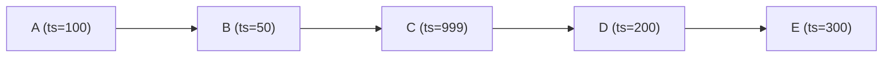

# MSC3999: Add causal parameter to `/timestamp_to_event`

Causality just means being able to know "A happened before B" or vice versa.

Because `origin_server_ts` on an event is untrusted and can be set to whatever value,
using `/timestamp_to_event` can give you rogue results or even make you paginate in
loops. `/timestamp_to_event` was originally introduced in
[MSC3030](https://github.com/matrix-org/matrix-spec-proposals/pull/3030/) where this
rogue result problem was first mentioned.

For example even in a simple good intentioned case, you create a new room which puts all
of the primordial creation events at time X. You then send some messages using timestamp
massaging (`/send?ts=123`) at a time before X (this is exactly what we did with the
Gitter historical import). The problem occurs when you use
`/timestamp_to_event?dir=f&ts=123` because you will end up looping back to the
`m.room.create` that comes after.

In less scrupulous scenarios or with bad intentioned actors, these timestamp loops can
occur throughout the room timeline.

These loops make it hard properly navigate from page to page in the [Matrix Public
Archive](https://github.com/matrix-org/matrix-public-archive) where you view a given
date in the room and use `/timestamp_to_event` to jump to the next page. 

## Proposal

Instead of only defining a timestamp, we add an optional `event_id` query parameter
which represents a topological spot in the DAG that we can easily determine what comes
before or after from (a casual relationship).

 - `/timestamp_to_event?dir=f&ts=123&event_id=$abc` means we find the closest event from
   `ts` looking forwards after `event_id`
 - `/timestamp_to_event?dir=B&ts=123&event_id=$abc` means we find the closest event from
   `ts` looking backwards before `event_id`

It essentially acts as a signal to keep progressing from this event regardless of what
timestamp shenanigans are going on.

### Further explanation/example

To explain how this new `event_id` causuality parameter helps, using the following
example DAG:

When looking forwards from event `$E`:

 - With `?event_id`: `/timestamp_to_event?dir=f&ts=500&event_id=$E` -> `404` `{ "errcode": "M_NOT_FOUND", "error":"Unable to find event
from 400 in direction f" }` end of the room as expected ✅
 - Without: `/timestamp_to_event?dir=f&ts=500` -> `{ "event_id": "$C", "origin_server_ts": 999 }` (we just looped back to the middle of the timeline 😵)

When looking backwards from event `$A`:

 - With `?event_id`: `/timestamp_to_event?dir=b&ts=100&event_id=$A` -> -> `404` `{ "errcode": "M_NOT_FOUND", "error":"Unable to find event
from 400 in direction f" }` before the start of the room as expected ✅
 - Without: `/timestamp_to_event?dir=b&ts=100` -> `{ "event_id": "$B", "origin_server_ts": 50 }` (we just looped back to the middle of the room 😵)

---

Random keyword: circular reference

### Client usage

Basic jump to date client usage will not need or want to use this new `event_id`
parameter as you're just jumping in blind to a certain spot in the timeline without
events to reference.

It's possible to add some client complexity to use their existing timeline of events and
add some `?event_id` that fits the bill to ensure they keep moving in the desired
direction. This is basically what Matrix Public Archive will probably do.

## Potential issues

While you can still receive a rogue out of place event using `/timestamp_to_event`, we
can at least guarantee that the event comes before or after the given `?event_id` casual
query parameter.

## Alternatives

For the good intention Gitter case explained in the intro where the only problem is
looping around to the `m.room.create` event, we can probably easily detect that type of
thing since `m.room.create` will always be the first event in the room and we can assume
that we reached the end of the room from our history messages. Which means we can go to
the replacement successor room instead of looping to the beginning of the room again.

But this problem is way broader in other rooms than just this case (a loop can occur
anywhere) so something like this MSC is still necessary.

## Security considerations

No extra data is exposed. It's just a new way to filter it down and sort through it all.

## Unstable prefix

While this feature is in development, the `event_id` querystring parameter can be used as
`org.matrix.msc3999.event_id`

### While the MSC is unstable

During this period, to detect server support clients should check for the presence of
the `org.matrix.msc3999` flag in `unstable_features` on `/versions`. Clients are also
required to use the unstable prefixes (see [unstable prefix](#unstable-prefix)) during
this time.

### Once the MSC is merged but not in a spec version

Once this MSC is merged, but is not yet part of the spec, clients should rely on the
presence of the `org.matrix.msc3999.stable` flag in `unstable_features` to determine
server support. If the flag is present, clients are required to use stable prefixes (see
[unstable prefix](#unstable-prefix)).

### Once the MSC is in a spec version

Once this MSC becomes a part of a spec version, clients should rely on the presence of
the spec version, that supports the MSC, in `versions` on `/versions`, to determine
support. Servers are encouraged to keep the `org.matrix.ms3999.stable` flag around for
a reasonable amount of time to help smooth over the transition for clients. "Reasonable"
is intentionally left as an implementation detail, however the MSC process currently
recommends *at most* 2 months from the date of spec release.
