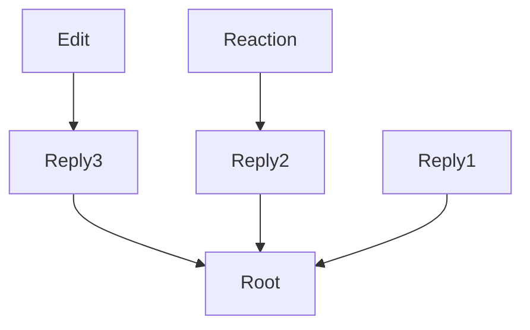

# MSC4023: Thread ID for 2nd order-relation

[MSC3981](https://github.com/matrix-org/matrix-spec-proposals/pull/3981) defines
a way to recursively load relations in a thread context. However this does not
let clients determine with certainty in what timeline an event coming from a `/sync`
should end up in.

If the related event is unknown to the client, the only way to partition things
correctly is to fetch the related event and confirm whether this event belongs to
a thread or not.

This proposal wants to reduce the amount of work required for clients to partition
events with certainty in a time efficient manner.

## Proposal

All 2nd order-relation in a thread should add a `m.thread_id` property in their
`unsigned` field definition, referencing the thread root, as defined in MSC3440.

```jsonc
{
  "m.thread_id": "$event_id"
}
```

Given the following diagram where `Reply1`, `Reply2` and `Reply3` are direct `m.thread`
relations. `Edit` and `Reaction` MUST include `m.thread_id` as defined in this
proposal.



## Potential issues

This could have performance implications on the server side, requiring more work
to be performed when fetching events in a room.

## Alternatives

If "[MSC3051: A scalable relation format](https://github.com/matrix-org/matrix-spec-proposals/pull/3051)"
was to be adopted, this MSC would be nulled.

## Security considerations

No security considerations

## Unstable prefix

While this MSC is not considered stable by the specification, implementations _must_ use
`org.matrix.msc4023.thread_id` in place of `m.thread_id`.

## Dependencies

This MSC does not have dependencies
