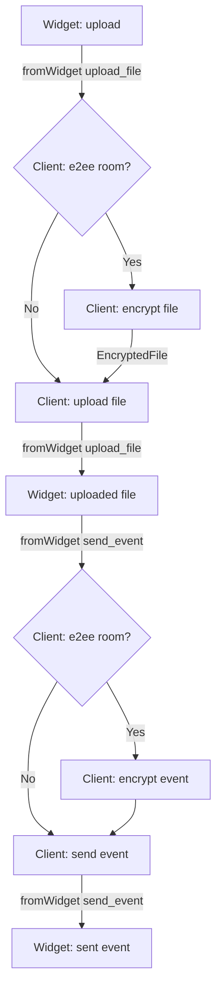
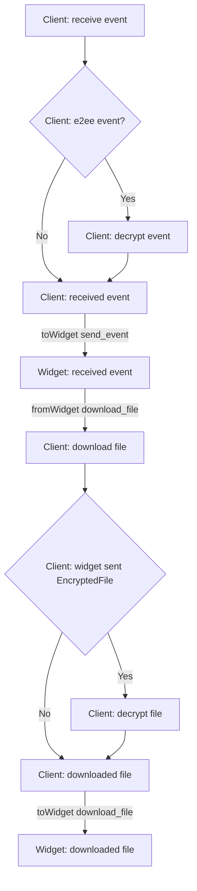

# MSC4039: Access the Content Repository With the Widget API

[MSC1236][MSC1236], [MSC2762][MSC2762], etc. specify a Widget API that is able to receive events from and write events
to the room that is loaded in the client. Besides sending pure text events, it is possible to attach media and other
files to events. The two concepts are consciously separated: Files are stored in a "[content repository][content]"
(usually attached to the homeserver) and are addressable through a "[Matrix Content (`mxc://`) URI][mxc]". This URI can
in turn be used in an event to reference a file.

While prior to [MSC3916][MSC3916] and deprecation in Matrix v1.11, widgets could already download media via the
unauthenticated download endpoint, provided they acquired the URL of the homeserver, the widget API does not currently
contain a way to authenticate with the upload and new download endpoints nor does it otherwise expose these functions
from the client hosting the widget to the widget itself. This would be useful to post images or attachments, but also to
upload larger data that can't easily be stored in a room event, like a whiteboard's content that can easily grow larger
than 64kb.

This proposal aims to bring the functionality of reading and writing files from and to the content repository into the
widget specification. Specifically, it should provide the equivalents of the ["Upload Content"][upload] and ["Download
Content"][download] endpoints of the Client-Server API, while also having the client handle as much of the end-to-end
encryption as possible.

## Proposal

---
TODO: remove?
TODO: remove from https://github.com/matrix-org/matrix-widget-api/blob/3c9543cbe4255869953d1b79d513de2eaf87033e/src/templating/url-template.ts#L48-L49

The widget API is extended with a new url parameter that can be requested and that will tell the
widget the URL of the homeserver API the user is currently using:

* `matrix_base_url`: The URL of the homeserver API.
---

The widget API is extended with three new interfaces to access the content repository. The
user must manually approve the following capabilities before the actions can be used:

- `m.upload_file`: Let the widget upload files.
- `m.download_file`: Let the widget download files.

Uploading to and downloading from the content repository is separated from the events referencing these files as
explained above. This gives Matrix applications dealing with referenced files great flexibility, for example it would be
possible to reference multiple files from a single event. It is also not an issue for clients to deal with end-to-end
encrypted files, as they can easily reference the `key` and `iv` required for decryption through the
[`EncryptedFile`][encryptedfile] metadata in the referencing event. [MSC2762][MSC2762] defines the client as responsible
for handling encryption.

As a consequence of the three factors separation, keeping to standard Matrix file encryption (i.e. `EncryptedFile`), and
implementing the en/decryption in the client follows, that the widget must be responsible for attaching the
`EncryptedFile` metadata to any event it sends. For otherwise already standardised events, this means following their
[standardised scheme for encrypted variants][encryptedfile], but custom formats for custom events are possible, as long
as the widget can provide the required data again when requesting decryption from the client. The `EncryptedFile` object
used in the definitions below is a JSON object simply containing all the information required for encrypted
attachments as already defined by the Matrix specification with their usual keys and values, i.e. for v1.11:

```json
{
  "v": "v2",
  "key": {
    "alg": "A256CTR",
    "ext": true,
    "k": "aWF6-32KGYaC3A_FEUCk1Bt0JA37zP0wrStgmdCaW-0",
    "key_ops": ["encrypt","decrypt"],
    "kty": "oct"
  },
  "iv": "w+sE15fzSc0AAAAAAAAAAA",
  "hashes": {
    "sha256": "fdSLu/YkRx3Wyh3KQabP3rd6+SFiKg5lsJZQHtkSAYA"
  }
}
```

### Get configuration

To trigger the action to get the configuration, widgets will use a new `fromWidget` request with the
action `get_media_config` which takes the following shape:

```json
{
  "api": "fromWidget",
  "widgetId": "20200827_WidgetExample",
  "requestid": "generated-id-1234",
  "action": "get_media_config",
  "data": {}
}
```

If the widget did not get approved for the capability required to send the event, the client MUST
send an error response (as required currently by the capabilities system for widgets).

If the event is successfully sent by the client, the client sends the following response:

```json
{
  "api": "fromWidget",
  "widgetId": "20200827_WidgetExample",
  "requestid": "generated-id-1234",
  "action": "get_media_config",
  "data": {},
  "response": {
    "m.upload.size": 1000,
  }
}
```

The `response` is a mirrored representation of the original [content repository configuration][config] API.

### Upload file



To trigger the action to upload a file, widgets will use a new `fromWidget` request with the action
`upload_file` which takes the following shape:

```json
{
  "api": "fromWidget",
  "widgetId": "20200827_WidgetExample",
  "requestid": "generated-id-1234",
  "action": "upload_file",
  "data": {
    "file": "some-content"
  }
}
```

`data.file` is a `XMLHttpRequestBodyInit` that is supported as a data type in the `postMessage` API.

If the widget did not get approved for the capability required to send the event, the client MUST
send an error response (as required currently by the capabilities system for widgets).

TODO: error response if uploading fails? if encrypting fails?

#### Response (Unencrypted)

The client SHOULD NOT modify the data of the request in unencrypted rooms.

If the file is successfully uploaded by the client, the client sends the following response (mirroring the [Client-Server upload][upload] API):

```json
{
  "api": "fromWidget",
  "widgetId": "20200827_WidgetExample",
  "requestid": "generated-id-1234",
  "action": "upload_file",
  "data": {
    "file": "some-content"
  },
  "response": {
    "content_uri": "mxc://..."
  }
}
```

#### Response (Encrypted)

If the room is end-to-end encrypted, the client SHOULD encrypt the data before uploading, generating the usual required
[`EncryptedFile`][encryptedfile] metadata. If sending is successful, the client adds the `EncryptedFile` to the
response, resulting in:

```json
{
  "api": "fromWidget",
  "widgetId": "20200827_WidgetExample",
  "requestid": "generated-id-1234",
  "action": "upload_file",
  "data": {
    "file": "some-content"
  },
  "response": {
    "content_uri": "mxc://...",
    "encryption": EncryptedFile
  }
}
```

### Download file



To trigger the action to download a file, widgets will use a new `fromWidget` request with the action `download_file`.

#### Request (Unencrypted)

```json
{
  "api": "fromWidget",
  "widgetId": "20200827_WidgetExample",
  "requestid": "generated-id-1234",
  "action": "download_file",
  "data": {
    "content_uri": "mxc://..."
  }
}
```

The client SHOULD NOT modify the received file from the content repository before responding to the widget in
unencrypted rooms.

#### Request (Encrypted)

It is the widget's responsibility to know if the file is encrypted, e.g. by checking if the
[`EncryptedFile`][encryptedfile] metadata is stored next to the `mxc:` URI. If so, it must be provided in the request to
the client alongside it.

```json
{
  "api": "fromWidget",
  "widgetId": "20200827_WidgetExample",
  "requestid": "generated-id-1234",
  "action": "download_file",
  "data": {
    "content_uri": "mxc://...",
    "encryption": EncryptedFile
  }
}
```

#### Response

```json
{
  "api": "fromWidget",
  "widgetId": "20200827_WidgetExample",
  "requestid": "generated-id-1234",
  "action": "download_file",
  "data": <see above>,
  "response": {
    "file": "some-content"
  }
}
```

`response.file` mirrors `data.file` of the `upload_file` action and is a `XMLHttpRequestBodyInit` that is supported as a data type in the `postMessage` API.

If the widget did not get approved for the capability required to send the event, the client MUST
send an error response (as required currently by the capabilities system for widgets).

TODO: error response if downloading fails? if decrypting fails?

## Potential issues

[MSC3916][MSC3916] plans to add authentication for media access. This would require the Widget API to receive an
additional extension to be able to access stored media. It is assumed that a successor of the current widget api (like
[MSC3008]) will replace this need in the future.

[MSC2246][MSC2246] splits the interface of the media upload into a “create the mxc-id” and a “upload the file for the
mxc-id” stage. It is assumed that the new API can be transparently implemented in the client so the widget could still
use the old API definition.

TODO: [MSC3911][MSC3911] linking media to events

## Alternatives

It would be preferable if the widget would not need to pass the actual data to the client over the Widget API, but if it
could acquire an authenticated upload URL that it can use to upload the file directly to the homeserver without the need
of an authentication token. [MSC2246][MSC2246] goes into this direction, however, it still requires that the upload is
authenticated.

TODO: "proxy" the mxcs and have the client bookkeep the e2ee data?

TODO: e2ee in the widget, contrary to [MSC2762][MSC2762]

TODO: follow the C-S download API format for download_file. but our way alleviates the parsing from the widget to the
client which already can parse them.

## Security considerations

The same considerations as in [MSC2762][MSC2762] apply. This feature will allow the widget to be able to upload data
into the media repository. This could potentially be used to upload malicious content. However, the access will only be
possible when the user accepts the capability and grant access if the widget is trusted by the user.

## Unstable prefix

While this MSC is not present in the spec, clients and widgets should:

- Use `org.matrix.msc4039.` in place of `m.` in all new identifiers of this MSC.
- TODO: remove? Use `org.matrix.msc4039.matrix_base_url` in place of `matrix_base_url` for the url parameter.
- Use `org.matrix.msc4039.get_media_config` in place of `get_media_config` for the action type in the
  `fromWidget` requests.
- Use `org.matrix.msc4039.upload_file` in place of `upload_file` for the action type in the
  `fromWidget` requests.
- Use `org.matrix.msc4039.download_file` in place of `download_file` for the action type in the
  `fromWidget` requests.
- Only call/support the `action`s if an API version of `org.matrix.msc4039` is advertised.

[MSC1236]: https://github.com/matrix-org/matrix-spec-proposals/pull/1236
[MSC2246]: https://github.com/matrix-org/matrix-spec-proposals/pull/2246
[MSC2762]: https://github.com/matrix-org/matrix-spec-proposals/pull/2762
[MSC3911]: https://github.com/matrix-org/matrix-spec-proposals/pull/3911
[MSC3916]: https://github.com/matrix-org/matrix-spec-proposals/pull/3916
[content]: https://spec.matrix.org/v1.11/client-server-api/#content-repository
[mxc]: https://spec.matrix.org/v1.11/client-server-api/#matrix-content-mxc-uris
[config]: https://spec.matrix.org/v1.11/client-server-api/#get_matrixclientv1mediaconfig
[upload]: https://spec.matrix.org/v1.11/client-server-api/#post_matrixmediav3upload
[download]: https://spec.matrix.org/v1.11/client-server-api/#get_matrixclientv1mediadownloadservernamemediaid
[encryptedfile]: https://spec.matrix.org/v1.11/client-server-api/#extensions-to-mroommessage-msgtypes

TODO: review wrt. actual current implementation
