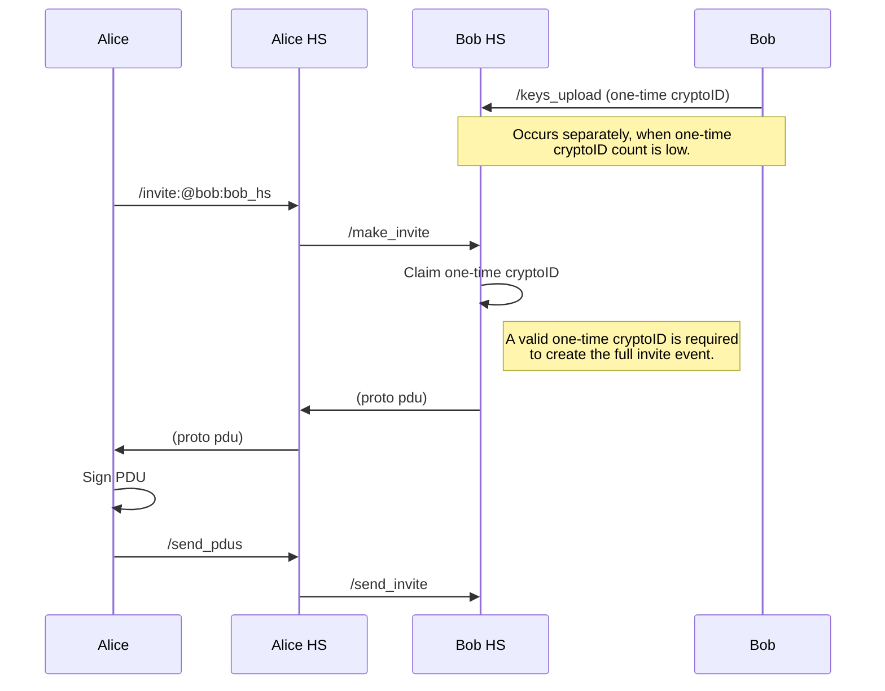

# MSC4080: Cryptographic Identities (Client-Owned Identities)
**THIS MSC IS IN PROGRESS AND WILL CHANGE AS IMPLEMENTATIONS LAND**

Today’s Matrix does not allow users to move their account between homeservers. It would be beneficial to be able 
to move a user account from one homeserver to another while allowing that user to maintain their existing room 
memberships, power levels in those rooms, message history, account data and end-to-end encrypted sessions.

With Pseudonymous Identities (pseudoIDs) we have decoupled a user’s mxid from the identity used to track room 
membership. The new pseudoIDs (also known as user_room_keys/senderids) are both created and managed 
entirely by the homeserver. PseudoIDs was the first step towards having portable accounts in Matrix.

With Cryptographic Identities we aim to take portable accounts one step further by moving the Pseudonymous 
Identities off the server and onto the client in order for the client to have full ownership over their identity.
Clients are then responsible for performing full event signing on a per-event basis. This step brings us closer to
portable accounts primarily in two ways.

1.  Users now fully own their identity in the Matrix ecosystem and have the control to move their identity.
2.  It improves the security of the Matrix ecosystem by making it more difficult for a homeserver to act maliciously
on a client’s behalf. This is particularly important once accounts are portable in order to prevent a homeserver from
being able to continue operating on a user’s behalf after that user has moved their account off the homeserver.

Cryptographic Identities does not get us all the way to having account portability. Further MSC/s will be required to
create the appropriate endpoints and other changes in order to successfully port a user’s account from one homeserver
to another.

## Proposal

CryptoIDs are generated and stored by the client. When joining a room for the first time, a cryptoID should be
generated for that room. All events are signed by the client using their cryptoID and are no longer signed by the
user’s homeserver with the exception of the mxid_mapping in the m.room.member event.

### Event Signing

Events are required to be signed by the cryptoID. In order for this to work with client-owned keys, clients need to
obtain the full version of events before they can be signed. This proposal introduces a few changes to the C-S API
endpoints used to send events between the client and the server. Any C-S API endpoint which previously was used to
send events, now returns the fully formed version of those event/s to the client (minus the signatures block). The
event/s are no longer processed by the server while handling these endpoints. The client then signs the event/s and
forwards them to the server via a new `/send_pdus` endpoint. When handling events sent to this new endpoint the server
should process the event/s like normal by adding them to their respective rooms.

A homeserver should avoid processing room events from the client until they have been sent via the `/send_pdus`
endpoint to ensure the client actually signs the event so it can be successfully sent into the room.

### Endpoint Additions

##### POST /_matrix/client/v1/send_pdus/{txnId}

**Rate-limited**: Yes
**Requires authentication**: Yes

Fully formed PDUs are sent to this endpoint to be committed to a room DAG. Clients are expected to have signed the
events sent to this endpoint. Homeservers should reject any event which isn’t properly signed by the client.

Events sent to this endpoint are processed in the order they are received. A homeserver should check the validity of
each event before sending it to the room. This includes verifying the signature of the event matches the cryptoID
found in the `sender` field of the event. If the event is for a `remote` invite or join, the relevant `/send_invite`
or `/send_join` over federation should be performed prior to adding the event to the room.

If any event is invalid all events are rejected by the homeserver. Invalid events include those that are not correctly
signed, whose event fields are invalid (such as a state event missing a `state_key` field), or the homeserver deems
the event invalid for some other reason. This approach is taken because this failure mode is most likely due to a
programming error. Failures of this nature result in a HTTP status 400. A [standard error response](https://spec.matrix.org/v1.8/client-server-api/#standard-error-response)
will be returned. As well as the normal common error codes, other reasons for rejection include:

-   M_DUPLICATE_ANNOTATION: The request is an attempt to send a [duplicate annotation](https://spec.matrix.org/v1.8/client-server-api/#avoiding-duplicate-annotations).

A homeserver should also protect against clients who modify events sent by the homeserver before signing them. If a 
client modifies an event, such as changing `prev_events` to force costly state resolution, then we should reject that 
event. A homeserver can do this by storing the hash of the proto event in a database, and then on `/send_pdus`, remove 
the `signatures` key and check if the hash exists in the DB (i.e the homeserver sent the client this exact proto event). 
The homeserver can also then expire the proto event in a timely manner which helps alleviate issues of costly state
resolution due to the likelihood of `prev_events` changing as time passes. Any kind of client event signing is going to 
add latency to creating events, which is going to increase the chance of increasing the number of forward extremities.

A `txn_id` is added to the request parameters. Clients should generate an ID unique across requests with the same
access token; it will be used by the server to ensure idempotency of requests.

Request:
```
{
    pdus:  [
        PDUInfo    
    ]
}
```

PDUInfo:
```
{
    room_version:  string,
    via_server:  string,  //  optional
    pdu: PDU  //  signed  PDU
}
```

### Endpoint Changes

Effected endpoint versions all need to be bumped since the underlying behaviour is changed with this proposal. When
hitting any of these endpoints the resulting events are no longer immediately added to the room. Instead the client
is required to send the returned event/s to the `/send_pdus` endpoint after signing them in order for the event/s to
be added to the room DAG.

##### POST /_matrix/client/v4/createRoom

Room creation adds a new `cryptoid` field to the request body. The `cryptoid` must be valid [Unpadded Base64](https://spec.matrix.org/v1.8/appendices/#unpadded-base64)
and 32 bytes in size in order to be a valid ed25519 public key. This field is used for the homeserver to be able to
fully create all the necessary room creation events on behalf of the client. Since this is a new room the homeserver
needs to be told which cryptoID to correlate to this room for this user.

The response includes the new fields: `room_version` and `pdus`.

Request:
```
{
    ...,
    cryptoid: string
}
```

200 OK Response:
```
{
    room_id: string,
    room_version: string,
    pdus:  [  PDU ]
}
```

##### POST /_matrix/client/v4/rooms/{roomId}/invite

Inviting users to a room has a number of changes in order to make it work. First, since the cryptoID for a given user
and room needs to be created by the client, we cannot rely on the existing invite sequence which relies on the invited
user’s homeserver to fully populate the invite event. Instead we need a way for the invited user to be part of the
loop and provide a cryptoID in order to finalize the event. It would not be acceptable to require the invited client
to be available at all times in order to respond to an invite request in real time. Matrix does not currently have a
requirement that client communications be synchronous and this proposal seeks to preserve asynchronous communications
when participants are unreachable. Instead, this proposal introduces the concept of one-time cryptoIDs.

One-time cryptoIDs are uploaded to the user’s homeserver so that they can be claimed and used whenever that user
receives a room invite. In order for a user to be available for invite, one-time cryptoIDs should be created and
uploaded to a user’s current homeserver. This should take the same shape as one-time keys for encryption do today.
The one-time cryptoIDs should be signed by the device’s ed25519 key to verify they were created by that device.

When a client wants to invite a new user to a room for the first time, they need to query the invited user’s
homeserver for one of the invited user’s one-time cryptoIDs. They can then use that cryptoID to create an invite
event for the user.

The invite response includes a new `pdu` field.

Two new endpoints are also added to the S-S API: `/make_invite` & `/send_invite`. These endpoints are required in
order to split out generating an invite event, and having the inviting client sign that event, from actually sending
the event to the invited user’s homeserver.

**TODO**: document /make_invite & /send_invite endpoints



200 OK Response:
```
{
    pdu:  PDU
}
```

##### POST /_matrix/client/v4/join/{roomIdOrAlias} && POST /_matrix/client/v4/rooms/{roomId}/join

A number of fields are added to the response of the `/join` endpoints: `room_version`, `via_server`, and `pdu`.
These are added to help the client when sending the join event to the `/send_pdus` endpoint. The `via_server` is the
server chosen by the homeserver to perform the join via. The `via_server` should be passed along to the `/send_pdus`
endpoint with the fully signed version of this event.

Room joining adds a new `cryptoid` field to the request body. The `cryptoid` must be valid [Unpadded Base64](https://spec.matrix.org/v1.8/appendices/#unpadded-base64)
and 32 bytes in size in order to be a valid ed25519 public key. This field is used for the homeserver to be able to
create the join event on behalf of the client and for the homeserver to validate the user is joining with the 
correct cryptoID if the join follows an invite event. If this is a join without a matching invite, the homeserver
needs to be told which cryptoID to correlate to this room for this user.

Request:
```
{
    ...,
    cryptoid: string
}
```

200 OK Response:
```
{
    room_id: string,
    room_version: string,
    via_server: string,
    pdu:  PDU
}
```

##### POST /_matrix/client/v4/rooms/{roomId}/leave

The leave endpoint is extended to return a `pdu` for the client to sign.

200 OK Response:
```
{
    pdu:  PDU 
}
```

##### PUT /_matrix/client/v4/rooms/{roomId}/send/{eventType}/{txnId} && PUT /_matrix/client/v4/rooms/{roomId}/state/{eventType}/{stateKey}

The `/send` & `/state` endpoints are extended to return the `pdu` in the response for the client to sign.

200 OK Response:
```
{
    event_id: string,
    pdu:  PDU
}
```

##### POST /_matrix/client/v4/keys/upload

A `one_time_cryptoids` field is added to the `/keys/upload` endpoint in order to upload new `one_time_cryptoids` for
the purposes of inviting the user to new rooms.

Request:
```
{
    ...,
    one_time_cryptoids: map[string]OneTimeCryptoID
}
```

200 OK Response:
```
{
    ...,
    one_time_cryptoid_counts: map[string]int
}
```

OneTimeCryptoID: 
```
“algorithm:KeyID”: {
    “key”: ”base64_bytes”
}
```

##### GET /_matrix/client/v4/sync

The `/sync` endpoint will need to be extended to report the one-time cryptoID count. In the response, a
`one_time_cryptoids_count` field is added. This is a mapping of cryptoID algorithm (ie. ed25519) to the count of
`one_time_cryptoids` for that algorithm.

200 OK Response:
```
{
    ...,
    one_time_cryptoids_count: map[string]int
}
```

The `/sync` endpoint also requires an extension of the `InvitedRoom` parameter to include a `one_time_cryptoid` field
which is the cryptoID that was selected by the user’s homeserver when creating the invite event. This field is
necessary in order to inform the client which cryptoID was used to create the invite event since homeservers translate
all cryptoIDs to regular mxids when sending events to the client. Then the client can track this association
internally in order to correctly sign future events sent to the room.

200 OK Response (InvitedRoom JSON Object):
```
{
    invite_state:  InviteState,
    one_time_cryptoid: string
}
```

##### POST /_matrix/client/v4/rooms/{roomId}/kick

The kick endpoint is extended to return a `pdu` for the client to sign.

200 OK Response:
```
{
    pdu:  PDU 
}
```

**TODO: How to handle external users**

##### POST /_matrix/client/v4/rooms/{roomId}/ban

The ban endpoint is extended to return a `pdu` for the client to sign.

200 OK Response:
```
{
    pdu:  PDU 
}
```

**TODO: How to handle external users**

##### POST /_matrix/client/v4/rooms/{roomId}/unban

The unban endpoint is extended to return a `pdu` for the client to sign.

200 OK Response:
```
{
    pdu:  PDU 
}
```

##### PUT /_matrix/client/v4/rooms/{roomId}/redact/{eventId}/{txnId}

**TODO**

##### POST /_matrix/client/v4/rooms/{roomId}/upgrade

**TODO**

  

**TODO**: look into the following:
-   Room directory
-   Peek & unpeek
-   sendToDevice
-   What to do with EDUs?
	-   Read_markers
	-   Presence
	-   VOIP stuff
	-   Typing
	-   Locations? EDU/State?
    

### Auth Rules

A new room version will be required to account for the modifications to the auth rules.

Invite events no longer require a signature from the invited user’s homeserver. This signature requirement does not
appear to have an obvious benefit and would make invite events overly onerous with the new room invite process.

### Redaction Rules

A new room version will be required to account for the modifications to the redaction rules.

The `m.room.member` event content object allows the `mxid_mapping` key.

### User Attestation (Optional)

To attest that a cryptoID belongs to a specific user, the client `master_signing_key` could sign the join event
containing their generated  cryptoID, verifying they are that identity, to prevent a server from spoofing a user
joining a new room by having the malicious server generate a cryptoID themselves to create & sign events with.

Linking the cryptoID with the `master_signing_key` will remove the deniability aspect of messages since you are now
cryptographically linking your `master_signing_key` which is synonymous with a user’s identity, with each cryptoID.

This extension is effectively what is proposed in [MSC3917 - Cryptographic Room Memberships](https://github.com/matrix-org/matrix-spec-proposals/pull/3917).

An alternative to using the `master_signing_key` would be to use some other client generated key & include that in
the attestation of the cryptoID. A client could choose whether to use different room signing keys per room (the
benefit of doing this would be to ensure that knowing a user’s identity in one room did not lead to knowing that
same user’s identity in another room), or use the same room signing key for all rooms. Then at a later time clients
could use some out of band attestation mechanism to “cross-sign” in order to verify the user/s are who they say they
are. This has the additional benefit of not needing to enter the user’s recovery passphrase to provide the attestation
as clients could store these room signing keys.

### Identity Sharing Between Devices

The cryptoIDs of a user are shared between devices using secret storage similar to the way encryption keys are shared.
This leverages server-side key backups for key recovery. 

#### Server-Side Key Backups

**TODO**: detail this section

## Potential Issues

### Recovery Passphrase Entry

Requiring the `master_signing_key` to sign a join event in order to attest a user is who they claim to be would
typically require the user to enter their recovery passphrase every time they join a room. This is because clients
do not usually store this key. This would lead to a large burden on users and would be best to avoid if at all 
possible.

### Additional Attack Vectors

Clients can modify events prior to signing them and sending them to the server for processing. This can lead to
issues if the client were to change something such as the `prev_events` which could lead to further problems. 
In order to mitigate this, a server should perform validation of each event being received from the `/send_pdus`
endpoint. A homeserver could do this by storing the hash of an event prior to sending it to a client, then ensure
any event received by the `/send_pdus` endpoint has a matching hash to one stored previously.

A homeserver can run out of one-time cryptoIDs used during invites. Homeservers should protect against this by
attempting to detect malicious activity which seeks to deplete the one-time cryptoID reserves for a user. An
alternative would be to have a fallback one-time cryptoID. The issue with relying on this mitigation is that it
could quickly become the case that a client ends up with the same cryptoID in many rooms. This is not necessarily an
issue unless that user wants to keep their cryptoIDs separate in order to maintain the pseudonymity they provide.

### Identity/Key Migration

This MSC currently does not account for the possibility of either changing a cryptoID key, or of changing the cryptoID
key algorithm. This would potentially involve some manner of distinguishing the cryptoID algorithm in use and of being 
able to change a user's associated cryptoID key in a room. Both use cases are important in their own right and need 
further consideration before this MSC can be considered for acceptance.

## Alternatives

### Clients delegate event signing on a per-event basis

In this alternative, all events would add a field to event `content` specifying the event signing delegate (such as the
user's homeserver). All events would be expected to be signed by this delegate.

**Advantages**: This has the advantage of avoiding a second round trip for normal messaging.

**Disadvantages**: This has the disadvantage of the added complexity of trying to protect event content such that 
only a client is allowed to specify a signing delegate. This ends up leading to a number of issues where homeservers 
could be able to replay events on a client's behalf, thus minimizing the benefits of cryptographic identities.

This also increases the size of every single event due to the addition of required `content` fields.

#### Details

##### Event Signing

In order to ensure the `allowed_signing_keys` was actually specified by the client, clients now sign the `content` 
section of all events. Events are modified to add `nonce`, `allowed_signing_keys`, `hash` and `signatures` fields. These 
fields are used to prevent malicious homeservers from spoofing events on a client’s behalf. The signature is created 
by signing the combination of `type`, `state_key` and redacted `content`. Signing the `room_id` is not required since 
cryptoIDs are already unique per room but could be added if necessary. The `nonce` value should be generated as a 
random 128-bit integer (or UUIDv4?), encoded as unpadded base64 (or hex for UUID?). It is especially important for 
the `nonce` to be unique for each `type` and `state_key` pairing in order to ensure events cannot be replayed by a 
malicious homeserver. The hash is the sha-256 hash, encoded as unpadded base64, of the `content` fields before 
`signatures` have been added (including the new `nonce`, and `allowed_signing_keys` fields). The `hash` is required in 
order to be able to verify the event `signature` if the event `content` is ever redacted.

All events are now required to possess the above mentioned fields inside of `content`.

An example event would look like:

```json
{
  "msgtype": "m.text",
  "body": "hello world!",
  "m.client_signatures": {
    "nonce": "random_number",
    "allowed_signing_keys": {
      "ed25519":"some+server+key"
    },
    "hash": "hash_of_content_without_signatures",
    "signatures": {
      "ed25519:base64+cryptoid": "signature+of+cryptoid"
    }
  }
}
```

##### Auth Rules

Both clients and servers should now check the `content` signatures to validate whether the `type` + `state_key` + 
redacted `content` was signed by the `sender`. Only the redacted `content` needs to be signed since that will contain 
a `hash` of the full contents that can be used to verify the full event. Signing the redacted `content` instead 
of just the `hash` allows for further field validation (ie. fields from `m.room.member`, `m.room.join_rules`, and 
`m.room.power_levels` to name a few). If a server detects the `signature` is wrong it should reject the event. If a 
client detects the `signature` is wrong it should alert the user who can then decide what further action to take, if 
any. A client detecting an invalid `signature` means their homeserver either didn’t check the `signature` or did 
check the `signature` and didn’t reject the event.

Servers should also check that the full event was signed by one of the keys present in the `allowed_signing_keys` 
field, or by the cryptoID itself. If the event was not signed by one of these keys, the server should reject the 
event. Allowing events to be signed by the cryptoID keeps the possibility of clients to perform state resolution 
and generate full events if they should choose to do so. 

To further validate the event, new rules need to be added to verify the `nonce` field. Homeservers should ensure 
that the `nonce` is unique for events from that user in this room. It is most important to ensure that the `nonce` 
value is unique per `type` and `state_key` pairing. Duplicate `nonce` values that are used for different rooms or 
`type`/`state_key` pairings aren’t an issue since the event signatures protect against replay attacks where these 
values have been modified. If a homeserver receives an event with a `nonce` that is identical to another event with 
the same `type` and `state_key`, that event should be rejected. Clients have the option to also perform `nonce` 
validation in this way if the possibility of colluding homeservers is suspected. When sending an event via the C-S 
API, a homeserver should verify that the `nonce` of the new event is unique or reject the event from the client. 
If the event is rejected in this way, the homeserver should return a response status of 400 with an errcode of 
`M_DUPLICATE_NONCE`.

**Problem**: How can a client generate a usable nonce? 

**Problem**: How could a homeserver validate a nonce as being unique without requiring them to know the entire room DAG?

##### Redaction Rules

The following fields should be preserved during redaction for all event types:
- `nonce`
- `allowed_signing_key`
- `hash`
- `signature`

##### Replay Attacks

Clients are now responsible for signing the `content` field of events but they don’t sign the full event. This means 
that a malicious homeserver could take the contents of an existing room event and replace everything else in the 
event without anyone knowing. This could include fields such as `type`, `state_key`, `prev_events`, and `room_id`. 
In order to minimize the effects of a replay attack, the client should sign the combination of `type`, `state_key`, 
and `content`. Signing `type` prevents reusing the contents in an event of another event `type`. Signing `state_key` 
prevents attacks such as changing the `membership` state of another user. Signing `content` prevents a malicious 
homeserver from generating arbitrary `content` on behalf of a client. 

Even with the above mitigation, a malicious homeserver could still replay an event in the same room, with the same 
`content`, `type` and `state_key` at a different location in the DAG. That is to say, a homeserver can replay the 
same event with different values for `prev_events` and `auth_events`. An example of this could take the form of 
changing the power levels earlier or later in time.

A further mitigation could be to use the make/send event, double round trip, approach where a client first requests 
the full event from their homeserver, then signs the full event before sending that into the room. This could be 
done only for state events since the effects of replay attacks on state events is much more devastating to a room 
and state events occur infrequently. This would add an additional level of security while keeping the normal event 
sending flow fast since non-state events wouldn’t have the additional client-server round trip.

### Clients sign full events via room extremity tracking

In this model the client would be responsible for creating a full event (including `prev_events` and `auth_events`) 
by tracking and resolving the room’s state.

**Advantages**: This has the advantage of events being fully signed by the cryptoID and avoiding a second round trip.

**Disadvantages**: This has the disadvantage of requiring clients to do state resolution which cannot reasonably be
done by clients due to `/sync` not returning information in such a way that forward extremities can be properly 
tracked.

### Clients delegate event signing in their m.room.member event

In this model the client would add a `allowed_signing_keys` field to their `m.room.member event` in order to delegate 
event signing to another party. Homeservers still have full authority over a client’s events in this scenario since 
the client doesn’t sign any part of each event to verify they are the sender.

**Advantages**: This has the advantage of not adding additional size to each event.

**Disadvantages**: This has the disadvantage of giving over full event control to the delegated homeserver. It also has 
the disadvantage of trying to resolve `allowed_signing_keys` if a client wants to remove authority from a homeserver 
or there are conflicts in the room DAG. Revocation of a delegated key is known to be extremely problematic.

## Unstable prefix

While this proposal is not considered stable, the `org.matrix.msc4080` unstable prefix should be used on
all new or changed endpoints.

| Stable | Unstable |
|-|-|
| `POST /_matrix/client/v1/send_pdus/{txnId}` | `POST /_matrix/client/unstable/org.matrix.msc4080/send_pdus/{txnId}` |
| `POST /_matrix/client/v4/createRoom` | `POST /_matrix/client/unstable/org.matrix.msc4080/createRoom` |
| `POST /_matrix/client/v4/rooms/{roomId}/invite` | `POST /_matrix/client/unstable/org.matrix.msc4080/rooms/{roomId}/invite` |
| `POST /_matrix/client/v4/join/{roomIdOrAlias}` | `POST /_matrix/client/unstable/org.matrix.msc4080/join/{roomIdOrAlias}` |
| `POST /_matrix/client/v4/rooms/{roomId}/join` | `POST /_matrix/client/unstable/org.matrix.msc4080/rooms/{roomId}/join` |
| `POST /_matrix/client/v4/rooms/{roomId}/leave` | `POST /_matrix/client/unstable/org.matrix.msc4080/rooms/{roomId}/leave` |
| `PUT /_matrix/client/v4/rooms/{roomId}/send/{eventType}/{txnId}` | `PUT /_matrix/client/unstable/org.matrix.msc4080/rooms/{roomId}/send/{eventType}/{txnId}` |
| `PUT /_matrix/client/v4/rooms/{roomId}/state/{eventType}/{stateKey}` | `PUT /_matrix/client/unstable/org.matrix.msc4080/rooms/{roomId}/state/{eventType}/{stateKey}` |
| `POST /_matrix/client/v4/keys/upload` | `POST /_matrix/client/unstable/org.matrix.msc4080/keys/upload` |
| `GET /_matrix/client/v4/sync` | `GET /_matrix/client/unstable/org.matrix.msc4080/sync` |
| `POST /_matrix/client/v4/rooms/{roomId}/kick` | `POST /_matrix/client/unstable/org.matrix.msc4080/rooms/{roomId}/kick` |
| `POST /_matrix/client/v4/rooms/{roomId}/ban` | `POST /_matrix/client/unstable/org.matrix.msc4080/rooms/{roomId}/ban` |
| `POST /_matrix/client/v4/rooms/{roomId}/unban` | `POST /_matrix/client/unstable/org.matrix.msc4080/rooms/{roomId}/unban` |
| `PUT /_matrix/client/v4/rooms/{roomId}/redact/{eventId}/{txnId}` | `PUT /_matrix/client/unstable/org.matrix.msc4080/rooms/{roomId}/redact/{eventId}/{txnId}` |
| `POST /_matrix/client/v4/rooms/{roomId}/upgrade` | `POST /_matrix/client/unstable/org.matrix.msc4080/rooms/{roomId}/upgrade` |


## Dependencies

[MSC4014 - Pseudonymous Identities](https://github.com/matrix-org/matrix-spec-proposals/pull/4014)

