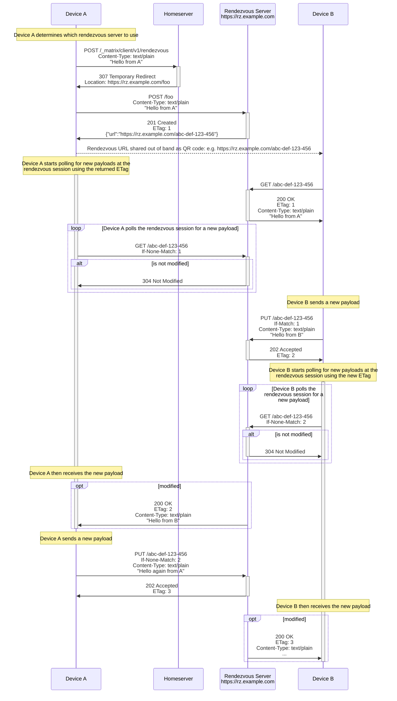
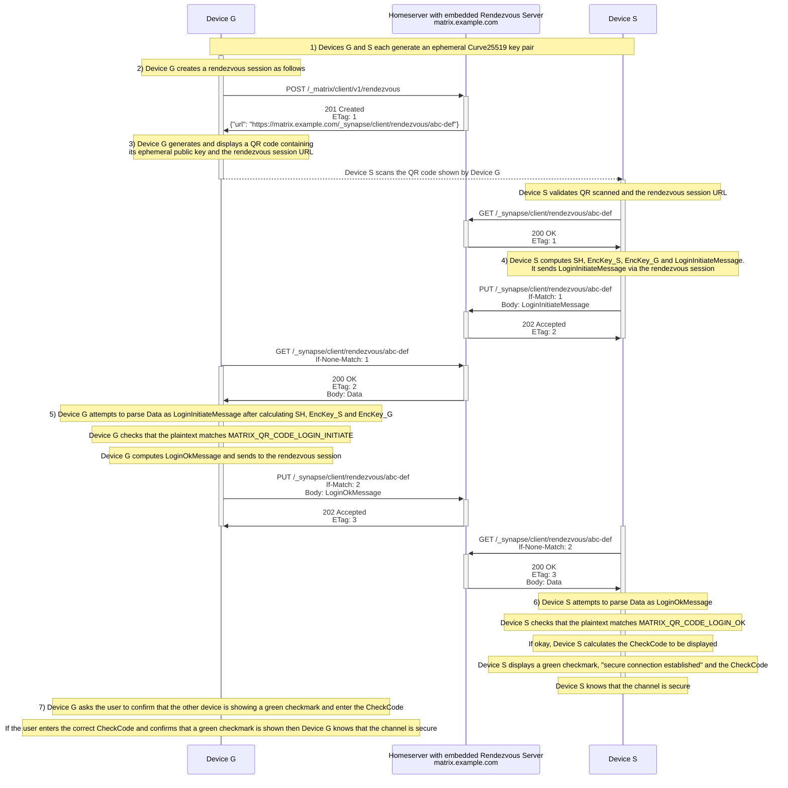
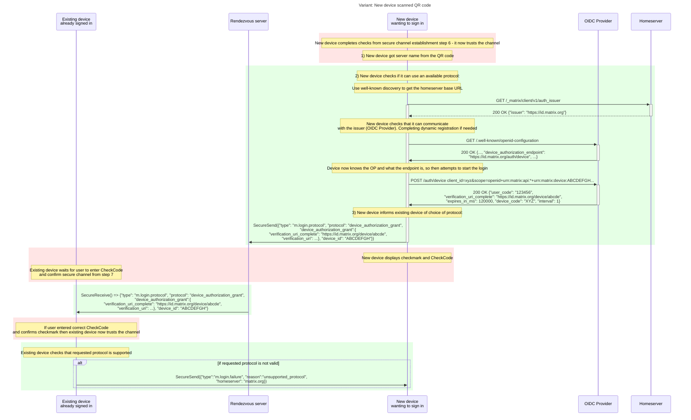
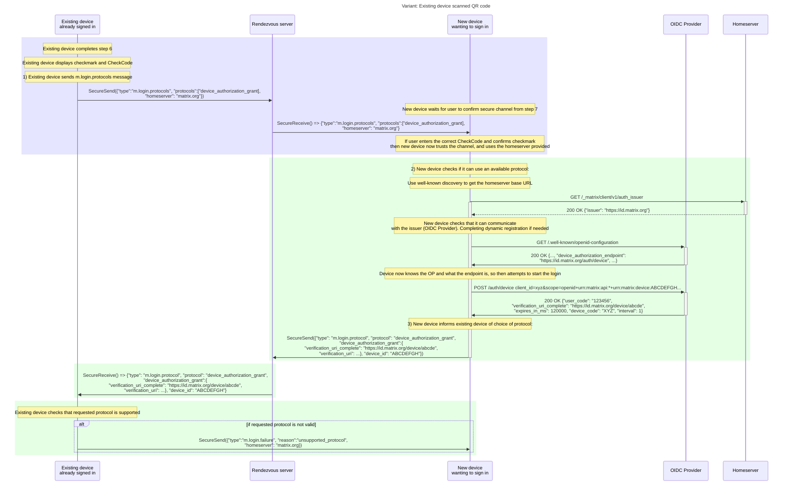
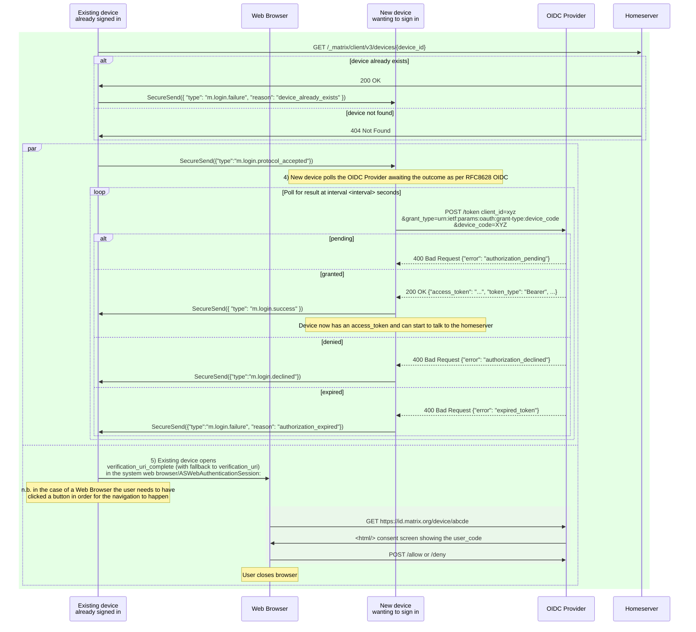
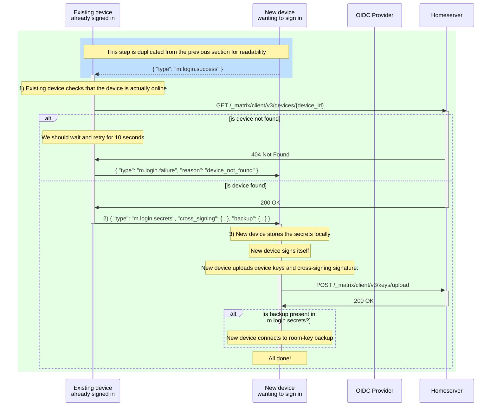

# MSC4108: Mechanism to allow OIDC sign in and E2EE set up via QR code

We propose a method to allow an existing authenticated Matrix client to sign in a new client by scanning a QR code. The
new client will be a fully bootstrapped Matrix cryptographic device, possessing all the necessary secrets, namely the
cryptographic user identity ("cross-signing") and the server-side key backup decryption key (if used).

This MSC supersedes [MSC3906](https://github.com/matrix-org/matrix-spec-proposals/pull/3906),
[MSC3903](https://github.com/matrix-org/matrix-spec-proposals/pull/3903) and
[MSC3886](https://github.com/matrix-org/matrix-spec-proposals/pull/3886) which achieved a similar feature but did not
work with a homeserver using the delegated OIDC mechanism proposed by [MSC3861](https://github.com/matrix-org/matrix-spec-proposals/pull/3861).

## Proposal

Depending on the pair of devices used, it may be preferable to scan the QR code on either the new or existing device,
based on the availability of a camera. As such, this proposal allows for the generation of the QR on either device.

In order for the new device to be fully set up, it needs to exchange information with an existing device such that:

- The new device knows which homeserver to use
- The existing device can facilitate the new device in getting an access token
- The existing device shares the secrets necessary to set up end-to-end encryption

This proposal is split into three parts:

1. An insecure rendezvous session API to allow the two devices to exchange the necessary data
2. A secure channel to protect the data exchanged over the rendezvous session
3. The OIDC login part and set up of E2EE

### Insecure rendezvous session

It is proposed that an HTTP-based protocol be used to establish an ephemeral bi-directional communication session over
which the two devices can exchange the necessary data. This session is described as "insecure" as it provides no
end-to-end confidentiality nor authenticity by itself---these are layered on top of it.

#### High-level description

Suppose that Device A wants to establish communications with Device B. Device A can do so by creating a
_rendezvous session_ via a `POST /_matrix/client/v1/rendezvous` call to an appropriate homeserver. Its response includes
an HTTP _rendezvous URL_ which should be shared out-of-band with Device B. (This URL may be located on a different
domain to the initial `POST`.)

The rendezvous URL points to an arbitrary data resource (the "payload"), which is initially populated using data from
A's initial `POST` request. There are no restrictions on the payload itself, but the rendezvous server SHOULD impose a
maximum size limit.

Anyone who is able to reach the rendezvous URL - including: Device A; Device B; or a third party; - can then "receive"
the payload by polling via a `GET` request, and "send" a new a new payload by making a `PUT` request.

In this way, Device A and Device B can communicate by repeatedly inspecting and updating the payload at the rendezvous URL.

#### The send mechanism

Every send request MUST include an `If-Match` header whose value is the `ETag` header in the last `GET`
response seen by the requester. (The initiating device may also use the `ETag` supplied in the initial `POST` response
to immediately update the payload.) Sends will succeed only if the supplied `ETag` matches the server's current
revision of the payload. This prevents concurrent writes to the payload.

The `ETag` header is standard, described by [RFC9110](https://www.rfc-editor.org/rfc/rfc9110.html#name-etag). In this
proposal we only accept strong, single-valued `ETag` values; anything else constitutes a malformed request.

n.b. Once a new payload has been sent there is no mechanism to retrieve previous payloads.

#### Expiry

The rendezvous session (i.e. the payload) SHOULD expire after a period of time communicated to clients via the `Expires`
header. After this point, any further attempts to query or update the payload MUST fail. The rendezvous session can be
manually expired with a `DELETE` call to the rendezvous session.

####  API

##### Common HTTP response headers

- `ETag` - required, ETag for the current payload at the rendezvous session as per [RFC7232](https://httpwg.org/specs/rfc7232.html#header.etag)
- `Expires` - required, the expiry time of the rendezvous as per [RFC7234](https://httpwg.org/specs/rfc7234.html#header.expires)
- `Last-Modified` - required, the last modified date of the payload as per [RFC7232](https://httpwg.org/specs/rfc7232.html#header.last-modified)
- `Cache-Control` - required, `no-store` as per [RFC7234](https://httpwg.org/specs/rfc7234.html#header.cache-control)
- `Pragma` - required, `no-cache` as per [RFC7234](https://httpwg.org/specs/rfc7234.html#header.pragma)

##### Create a rendezvous session and send initial payload: `POST /_matrix/client/v1/rendezvous`

This would be part of the Client-Server API.

HTTP request headers:

- `Content-Length` - required
- `Content-Type` - required, must be `text/plain`

HTTP request body:

- any data up to maximum size allowed by the server

HTTP response codes, and Matrix error codes:

- `201 Created` - rendezvous session created
- `400 Bad Request` (``M_MISSING_PARAM``) - either `Content-Length` and/or `Content-Type` was not provided.
- `400 Bad Request` (`M_INVALID_PARAM`) - an invalid `Content-Type` was given.
- `403 Forbidden` (``M_FORBIDDEN``) - forbidden by server policy
- `413 Payload Too Large` (``M_TOO_LARGE``) - the supplied payload is too large
- `429 Too Many Requests` (``M_UNKNOWN``) - the request has been rate limited
- `307 Temporary Redirect` - if the request should be served from somewhere else specified in the `Location` response header

n.b. the [`307 Temporary Redirect`](https://developer.mozilla.org/en-US/docs/Web/HTTP/Status/307) response code has been
chosen explicitly for the behaviour of ensuring that the method and body will not change whilst the user-agent follows
the redirect. For this reason, no other `30x` response codes are allowed.

HTTP response headers for `201 Created`:

- `Content-Type`- required, application/json
- common headers as defined above

HTTP response body for `201 Created`:

- a JSON object with a single key `url` whose value is the absolute URL of the rendezvous session

Example response:

```http
HTTP 201 Created
Content-Type: application/json
ETag: VmbxF13QDusTgOCt8aoa0d2PQcnBOXeIxEqhw5aQ03o=
Expires: Wed, 07 Sep 2022 14:28:51 GMT
Last-Modified: Wed, 07 Sep 2022 14:27:51 GMT
Cache-Control: no-store
Pragma: no-cache

{
    "url": "http://example.org/abcdEFG12345"
}
```

##### Send a payload to the rendezvous session: `PUT <rendezvous session URL>`

HTTP request headers:

- `Content-Length` - required
- `Content-Type` - required, must be `text/plain`
- `If-Match` - required. The ETag of the last payload seen by the requesting device.

HTTP request body:

- any data up to maximum size allowed by the server

HTTP response codes, and Matrix error codes:

- `202 Accepted` - payload updated
- `400 Bad Request` (`M_MISSING_PARAM`) - a required header was not provided.
- `400 Bad Request` (`M_INVALID_PARAM`) - a malformed 
[`ETag`](https://github.com/matrix-org/matrix-spec-proposals/blob/hughns/simple-rendezvous-capability/proposals/3886-simple-rendezvous-capability.md#the-update-mechanism)
header was provided or invalid `Content-Type`.
- `404 Not Found` (`M_NOT_FOUND`) - rendezvous session URL is not valid (it could have expired)
- `412 Precondition Failed` (`M_CONCURRENT_WRITE`, a new error code) - when the ETag does not match
- `413 Payload Too Large` (`M_TOO_LARGE`) - the supplied payload is too large
- `429 Too Many Requests` (`M_UNKNOWN`) - the request has been rate limited

HTTP response headers for `202 Accepted` and `412 Precondition Failed`:

- common headers as defined above

##### Receive a payload from the rendezvous session: `GET <rendezvous session URL>`

HTTP request headers:

- `If-None-Match` - optional, as per [RFC7232](https://httpwg.org/specs/rfc7232.html#header.if-none-match) server will
only return data if given ETag does not match

HTTP response codes, and Matrix error codes:

- `200 OK` - payload returned
- `304 Not Modified` - when `If-None-Match` is supplied and the ETag matched the existing payload
- `404 Not Found` (`M_NOT_FOUND`) - rendezvous session URL is not valid (it could have expired)
- `429 Too Many Requests` (`M_UNKNOWN`) - the request has been rate limited

HTTP response headers for `200 OK`:

- `Content-Type` - required, `text/plain`
- common headers as defined above

HTTP response headers for `304 Not Modified`:

- common headers as defined above

HTTP response body for `200 OK`::

- The payload last set for this rendezvous session, either via the creation POST request or a subsequent PUT request, up
to the maximum size allowed by the server.

Example responses:

```http
HTTP 200 OK
Content-Type: text/plain
ETag: VmbxF13QDusTgOCt8aoa0d2PQcnBOXeIxEqhw5aQ03o=
Expires: Wed, 07 Sep 2022 14:28:51 GMT
Last-Modified: Wed, 07 Sep 2022 14:27:51 GMT
Cache-Control: no-store
Pragma: no-cache

foo
```

```http
HTTP 304 Not Modified
ETag: VmbxF13QDusTgOCt8aoa0d2PQcnBOXeIxEqhw5aQ03o=
Expires: Wed, 07 Sep 2022 14:28:51 GMT
Last-Modified: Wed, 07 Sep 2022 14:27:51 GMT
Cache-Control: no-store
Pragma: no-cache
```

##### Cancel a rendezvous session: `DELETE <rendezvous session URL>`

HTTP response codes:

- `204 No Content` - rendezvous session cancelled
- `404 Not Found` (`M_NOT_FOUND`) - rendezvous session URL is not valid (it could have expired)
- `429 Too Many Requests` (`M_UNKNOWN`) - the request has been rate limited

##### Authentication

These API endpoints do not require authentication because trust is established at the secure channel layer which is
described later.

##### Maximum payload size

The server enforce a maximum payload size of 4KB.

###### Maximum duration of a rendezvous

The rendezvous session needs to persist for the duration of the login. So a timeout such as 60 seconds should be adequate.

It does need to allow the user another time to confirm that the secure channel has been established and complete any extra
OIDC Provider mandated login steps such as MFA.

Clients should handle the case of the rendezvous session being cancelled or timed out by the server.

###### ETags

The ETag generated should be unique to the rendezvous session and the last modified time so that two clients can 
distinguish between identical payloads sent by either client.

In order to make sure that no intermediate caches manipulate the ETags, the rendezvous server MUST include the HTTP
`Cache-Control` response header with a value of `no-store` and  `Pragma` response header with a value of `no-cache`.

###### CORS

For the `POST /_matrix/client/v1/rendezvous` API endpoint, in addition to the standard Client-Server API [CORS](https://spec.matrix.org/v1.4/client-server-api/#web-browser-clients)
headers, the ETag response header should also be allowed by exposing the following CORS header:

```http
Access-Control-Expose-Headers: ETag
```

To support usage from web browsers the rendezvous URLs should allow CORS requests from any origin and expose the headers
which aren't on the CORS [request header](https://developer.mozilla.org/en-US/docs/Glossary/CORS-safelisted_request_header) and 
[response header](https://developer.mozilla.org/en-US/docs/Glossary/CORS-safelisted_response_header) safelists:

```http
Access-Control-Allow-Headers: If-Match,If-None-Match
Access-Control-Allow-Methods: GET, PUT, DELETE
Access-Control-Allow-Origin: *
Access-Control-Expose-Headers: ETag
```

##### Choice of server

Ultimately it will be up to the Matrix client implementation to decide which rendezvous server to use.

However, it is suggested that the following logic is used by the device/client to choose the rendezvous server in order
of preference:

1. If the client is already logged in: try and use the current homeserver.
1. If the client is not logged in and it is known which homeserver the user wants to connect to: try and use that homeserver.
1. Otherwise use a default server.

#### Example API usage

n.b. This example demonstrates how the 307 response can be used to delegate the rendezvous session to a different server.



#### Threat analysis

##### Denial of Service attack surface

Because the rendezvous session protocol allows for the creation of arbitrary channels and storage of arbitrary data, it
is possible to use it as a denial of service attack surface.

As such, the following standard mitigations such as the following may be deemed appropriate by homeserver
implementations and administrators:

- rate limiting of requests
- imposing a low maximum payload size (e.g. kilobytes not megabytes)
- limiting the number of concurrent sessions

##### Data exfiltration

Because the rendezvous session protocol allows for the storage of arbitrary data, it
is possible to use it to circumvent firewalls and other network security measures.

Implementation may want to block their production IP addresses from being able to make requests to the rendezvous
endpoints in order to avoid attackers using it as a dead-drop for exfiltrating data.

##### Unsafe content

Because the rendezvous session is not authenticated, it is possible for an attacker to use it to distribute malicious
content.

This could lead to a reputational problem for the homeserver domain or IPs, as well as potentially causing harm to users.

Mitigations that are included in this proposal:

- the low maximum payload size
- restricted allowed content type
- the rendezvous session should be short-lived
- the ability for the rendezvous session to be hosted on a different domain to the homeserver (via
the `307 Temporary Redirect` response behaviour)

### Secure channel

The above rendezvous session is insecure, providing no confidentiality nor authenticity against the rendezvous server or
even arbitrary network participants which possess the rendezvous session URL. To provide a secure channel on
top of this insecure rendezvous session transport, we propose the following scheme.

This scheme is essentially [ECIES](https://en.wikipedia.org/wiki/Integrated_Encryption_Scheme#Formal_description_of_ECIES)
instantiated with X25519, HKDF-SHA256 for the KDF and ChaCha20-Poly1305 (as specified by
[RFC8439](https://datatracker.ietf.org/doc/html/rfc8439#section-2.8)) for the authenticated encryption. Therefore,
existing security analyses of ECIES are applicable in this setting too. Nevertheless we include below a short
description of our instantiation of ECIES and discuss some potential pitfalls and attacks.

The primary limitation of ECIES is that there is no authentication for the initiating party (the one to send the first
payload; Device S in the text below). Thus the recipient party (the one to receive the first payload; Device G in the
text below) has no assurance as to who actually sent the payload. In QR code login, we work around this problem by
exploiting the fact that both of these devices are physically present during the exchange and offloading the check that
they are both in the correct state to the user performing the QR code login process.

#### Establishment

Participants:

- Device G (the device generating the QR code)
- Device S (the device scanning the QR code)

Regardless of which device generates the QR code, either device can be the existing (already signed in) device. The
other device is then the new device (one seeking to be signed in).

Symmetric encryption uses a separate encryption key for each sender, both derived from a shared secret using HKDF. A
separate deterministic, monotonically-incrementing nonce is used for each sender. Devices initially set both nonces to
`0` and increment the corresponding nonce by `1` for each message sent and received.

1. **Ephemeral key pair generation**

  Both devices generate an _ephemeral_ Curve25519 key pair:

- Device G generates **(Gp, Gs)**, where **Gp** is its public key and **Gs** the private (secret) key.
- Device S generates **(Sp, Ss)**, where **Sp** is its public key and **Ss** the private (secret) key.

2. **Create rendezvous session**

Device G creates a rendezvous session by making a `POST` request (as described previously) to the nominated homeserver
with an empty payload. It parses the **url** received.

3. **Initial key exchange**

Device G displays a QR code containing:

- Its public key **Gp**
- The insecure rendezvous session **URL**
- An indicator (the **intent**) to say if this is a new device which wishes to "initiate" a login, or an existing device
that wishes to "reciprocate" a login
- If the intent is to reciprocate a login, then the Matrix homeserver **[server name](https://spec.matrix.org/v1.10/appendices/#server-name)**

To get a good trade-off between visual compactness and high level of error correction we use a binary mode QR with a
similar structure to that of the existing Device Verification QR code encoding described in [Client-Server
API](https://spec.matrix.org/v1.9/client-server-api/#qr-code-format).

This is defined in detail in a separate section of this proposal.

Device S scans and parses the QR code to obtain **Gp**, the rendezvous session **URL**, **intent** and optionally the Matrix homeserver
**[server name](https://spec.matrix.org/v1.10/appendices/#server-name)**.

At this point Device S should check that the received intent matches what the user has asked to do on the device.

4. **Device S sends the initial payload**

Device S computes a shared secret **SH** by performing ECDH between **Ss** and **Gp**. It then discards **Ss** and
derives two 32-byte symmetric encryption keys from **SH** using HKDF-SHA256. One of those keys, **EncKey_S** is
used for messages encrypted by device S, while the other, **EncKey_G** is used for encryption by device G.

The keys are generated with the following HKDF parameters:

**EncKey_S**

- `MATRIX_QR_CODE_LOGIN_ENCKEY_S|Gp|Sp` as the info, where **Gp** and **Sp** stand for the generating
  device's and the scanning device's ephemeral public keys, encoded as unpadded base64.
- An all-zero salt.

**EncKey_G**

- `MATRIX_QR_CODE_LOGIN_ENCKEY_G|Gp|Sp` as the info, where **Gp** and **Sp** stand for the generating
  device's and the scanning device's ephemeral public keys, encoded as unpadded base64.
- An all-zero salt.

With this, Device S has established its side of the secure channel. Device S then derives a confirmation payload that
Device G can use to confirm that the channel is secure. It contains:

- The string `MATRIX_QR_CODE_LOGIN_ENCKEY_S`, encrypted and authenticated with ChaCha20-Poly1305.
- Its public ephemeral key **Sp**.

```
Nonce_S := 0
SH := ECDH(Ss, Gp)
EncKey_S := HKDF_SHA256(SH, "MATRIX_QR_CODE_LOGIN_ENCKEY_S|" || Gp || "|" || Sp, salt=0, size=32)

// Stored, but not yet used
EncKey_G := HKDF_SHA256(SH, "MATRIX_QR_CODE_LOGIN_ENCKEY_G|" || Gp || "|" || Sp, salt=0, size=32)

NonceBytes_S := ToLowEndianBytes(Nonce_S)[..12]
TaggedCiphertext := ChaCha20Poly1305_Encrypt(EncKey_S, NonceBytes_S, "MATRIX_QR_CODE_LOGIN_INITIATE")
Nonce_S := Nonce_S + 1
LoginInitiateMessage := UnpaddedBase64(TaggedCiphertext) || "|" || UnpaddedBase64(Sp)
```

Device S then sends the **LoginInitiateMessage** as the payload to the rendezvous session using a `PUT` request with
`Content-Type` header set to `text/plain`.

5. **Device G confirms**

Device G receives **LoginInitiateMessage** (potentially coming from Device S) from the insecure rendezvous session by
polling with `GET` requests.

It then does the reverse of the previous step, obtaining **Sp**, deriving the shared secret using **Gs** and **Sp**,
discarding **Gs**, deriving the two symmetric encryption keys **EncKey_S** and **EncKey_G**, then finally
decrypting (and authenticating) the **TaggedCiphertext** using **EncKey_S**, obtaining a plaintext.

It checks that the plaintext matches the string `MATRIX_QR_CODE_LOGIN_INITIATE`, failing and aborting if not.

It then responds with a dummy payload containing the string `MATRIX_QR_CODE_LOGIN_OK` encrypted with **SH** calculated
as follows:

```
Nonce_G := 1
NonceBytes_G := ToLowEndianBytes(Nonce_G)[..12]
TaggedCiphertext := ChaCha20Poly1305_Encrypt(EncKey_G, NonceBytes_G, "MATRIX_QR_CODE_LOGIN_OK")
Nonce_G := Nonce_G + 1
LoginOkMessage := UnpaddedBase64Encode(TaggedCiphertext)
```

Device G sends **LoginOkMessage** as the payload via `PUT` request with `Content-Type` header set to `text/plain` to the
insecure rendezvous session.

6. **Verification by Device S**

Device S receives a response over the insecure rendezvous session by polling with `GET` requests, potentially from
Device G.

It decrypts (and authenticates) it using the previously computed encryption key, which will succeed provided the payload
was indeed sent by Device G. It then verifies the plaintext matches `MATRIX_QR_CODE_LOGIN_OK`, failing otherwise.

```
Nonce_G := 1
(TaggedCiphertext, Sp) := Unpack(Message)
NonceBytes := ToLowEndianBytes(Nonce)[..12]
Plaintext := ChaCha20Poly1305_Decrypt(EncKey_G, NonceBytes, TaggedCiphertext)
Nonce_G := Nonce_G + 1

unless Plaintext == "MATRIX_QR_CODE_LOGIN_OK":
     FAIL
```

If the above was successful, Device S then calculates a two digit **CheckCode** code derived from **SH**, **Gp** and
**Sp**:

```
CheckBytes := HKDF_SHA256(SH, "MATRIX_QR_CODE_LOGIN_CHECKCODE|" || Gp "|" || Sp , salt=0, size=2)
CheckCode := NumToString(CheckBytes[0] % 10) || NumToString(CheckBytes[1] % 10)
```

Device S then displays an indicator to the user that the secure channel has been established and that the **CheckCode**
should be entered on the other device when prompted. Example wording could say "Secure connection established. Enter the
code XY on your other device."

7. **Out-of-band confirmation**

**Warning**: *This step is crucial for the security of the scheme since it overcomes the aforementioned limitation of
ECIES.*

Device G asks the user to enter the **CheckCode** that is being displayed on Device S.

The purpose of the code being entered is to ensure that the user has actually checked their other device rather than
just pressing "continue", and that the Device S has been able to determine that the channel is secure.

Device G compares the code that the user has entered with the **CheckCode** that it calculates using the same mechanism
as before:

```
CheckBytes := HKDF_SHA256(SH, "MATRIX_QR_CODE_LOGIN_CHECKCODE|" || Gp "|" || Sp , salt=0, size=2)
CheckCode := NumToString(CheckBytes[0] % 10) || NumToString(CheckBytes[1] % 10)
```

If the code that the user enters matches then the secure channel is established.

Subsequent payloads sent from G should be encrypted using **EncKey_G**, while payloads sent from S should be
encrypted with **EncKey_S**, incrementing the corresponding nonce for each message sent/received.

#### Sequence diagram

The sequence diagram for the above is as follows:



#### Secure operations

Conceptually, once established, the secure channel offers two operations, `SecureSend` and `SecureReceive`, which wrap
the `Send` and `Receive` operations offered by the rendezvous session API to securely send and receive data between two devices.

At the end of the establishment phase, the next nonce for each device should be `1`.

Device G sets:

```
Nonce_G := 1
Nonce_S := 1
```

Device S sets:

```
Nonce_G := 1
Nonce_S := 1
```

#### Threat analysis

In an attack scenario, we add a participant called Specter with the following capabilities:

- Specter is present for QR code generation/scanning ("shoulder-surfing") and can scan the code themselves.
- Specter has full control over the network (in a Dolev-Yao sense), being able to observe and modify all traffic.
- Specter controls both the homeserver and the rendezvous server.

##### Replay protection

Due to use of ephemeral key pairs which are immediately discarded after use, each QR code login session derives a unique
secret so payloads from earlier sessions cannot be replayed. Each payload in the session is unique and expected only
once. Finally, the use of deterministic nonces prevents any possibility of replay.

##### Pure Dolev-Yao attacker

An attacker with control over the network but _not_ present for the QR code scanning cannot thwart the process since
they are unable to obtain the ephemeral key **Gp** of Device G.

##### Shoulder-surfing attacker (Specter)

Since Device G has no way of authenticating Device S, an attacker present for the QR code scanning can learn **Gp** and
attempt to mimic Device S in order to get their Device S signed in instead.

- In step 3, Specter can shoulder surf the QR code scanning to obtain **Gp**.
- In step 4, Specter can intercept S's payload and replace it with a payload of their own, replacing  **Sp** with its
own key.
- The attack is only thwarted in step 7, because Device S won't ever display the indicator of success to the user. The
user then must cancel the process on Device G, preventing it from sharing any sensitive material.

### The OIDC login part and set up of E2EE

Once the secure channel has been established, the two devices can then communicate securely.

#### Login via OIDC Device Authorization Grant

In this section the sequence of steps depends on whether the new device generated or scanned the QR code.

For example, in the case that the new device scanned the QR code it is the first to do a `SecureSend` whereas if the new
device generated the QR then the existing device is the first to do a `SecureSend`.

This can make it hard to read what is going on.

1. **Homeserver discovery**

The new device needs to know which homeserver it will be authenticating with.

In the case that the new device scanned the QR code then the [server name](https://spec.matrix.org/v1.10/appendices/#server-name) of the Matrix homeserver can be taken from the QR code and the
new device proceeds to step 2 immediately.

Otherwise the new device waits to be informed by receiving an `m.login.protocols` message from the existing device.

The existing device would need to determine which "protocols" are available for the new device to use.

Currently this could only be device_authorization_grant meaning the OIDC Provider supports the
`urn:ietf:params:oauth:grant-type:device_code` grant type.

If it is available then the existing device informs the new device by sending the `m.login.protocols` message with the
homeserver specified:

*Existing device => New device via secure channel*

```json
{
    "type": "m.login.protocols",
    "protocols": ["device_authorization_grant"],
    "homeserver": "synapse-oidc.lab.element.dev"
}
```

2. **New device checks if it can use an available protocol**

Once the existing device has determined the server name it then undertakes steps to determine if it is able to work with the homeserver.

The steps are as follows:

- use [Server Discovery](https://spec.matrix.org/v1.10/client-server-api/#server-discovery) to determine the `base_url` from the well-known URI
- checks that the homeserver is using delegated OIDC by calling `GET /_matrix/client/v1/auth_issuer` from [MSC2965](https://github.com/matrix-org/matrix-spec-proposals/pull/2965):

*New device => Homeserver via HTTP*

```http
GET /_matrix/client/v1/auth_issuer HTTP/1.1
Host: synapse-oidc.lab.element.dev
Accept: application/json
```

With response like:

```http
200 OK
Content-Type: application/json

{
    "issuer": "https://auth-oidc.lab.element.dev/"
}
```

- parses the OIDC Provider (`issuer`) from the response
- fetches the OIDC Provider metadata as per [MSC2965](https://github.com/matrix-org/matrix-spec-proposals/pull/2965):

*New device => OIDC Provider via HTTP*

```http
GET /.well-known/openid-configuration HTTP/1.1
Host: auth-oidc.lab.element.dev
Accept: application/json
```

With response like:

```http
200 OK
Content-Type: application/json

{
    "issuer": "https://auth-oidc.lab.element.dev/",
    "authorization_endpoint": "https://auth-oidc.lab.element.dev/authorize",
    "token_endpoint": "https://auth-oidc.lab.element.dev/oauth2/token",
    "jwks_uri": "https://auth-oidc.lab.element.dev/oauth2/keys.json",
    "registration_endpoint": "https://auth-oidc.lab.element.dev/oauth2/registration",
    "scopes_supported": ["openid", "email"],
    "response_types_supported": [...],
    "response_modes_supported": [...],
    "grant_types_supported": [
        "authorization_code",
        "refresh_token",
        "client_credentials",
        "urn:ietf:params:oauth:grant-type:device_code"
    ],
    ...
    "device_authorization_endpoint": "https://auth-oidc.lab.element.dev/oauth2/device"
}
```

- either does Dynamic Client Registration as per [MSC2966](https://github.com/matrix-org/matrix-spec-proposals/pull/2966)
or uses a static OIDC client_id. We will use `my_client_id` as an example `client_id`.

- sends a [RFC8628 Device Authorization Request](https://datatracker.ietf.org/doc/html/rfc8628#section-3.1) to the OIDC
Provider using the `device_authorization_endpoint`:

*New device => OIDC Provider via HTTP*

```http
POST /oauth2/device HTTP/1.1
Host: auth-oidc.lab.element.dev
Content-Type: application/x-www-form-urlencoded

client_id=my_client_id&scope=openid%20urn%3Amatrix%3Aclient%3Aapi%3A%2A%20urn%3Amatrix%3Aclient%3Adevice%3AABCDEGH
```

With response like:

```http
200 OK
Content-Type: application/json

{
    "device_code": "GmRhmhcxhwAzkoEqiMEg_DnyEysNkuNhszIySk9eS",
    "user_code": "123456",
    "verification_uri": "https://auth-oidc.lab.element.dev/link",
    "verification_uri_complete": "https://auth-oidc.lab.element.dev/link?code=123456",
    "expires_in": 1800,
    "interval": 5
}
```

- parses the [Device Authorization Response](https://datatracker.ietf.org/doc/html/rfc8628#section-3.2) above

At this point the new device knows that, subject to the user consenting, it should be able to complete the login

3. **New device informs existing device that it wants to use the `device_authorization_grant`**

The new device send the `verification_uri` and, if present, the `verification_uri_complete` over to the existing device and
indicates that want to use protocol `device_authorization_grant` along with the `device_id` that will be used:

*New device => Existing device via secure channel*

```json
{
    "type": "m.login.protocol",
    "protocol": "device_authorization_grant",
    "device_authorization_grant": {
        "verification_uri": "https://auth-oidc.lab.element.dev/link",
        "verification_uri_complete": "https://auth-oidc.lab.element.dev/link?code=123456"
    },
    "device_id": "ABCDEFGH"
}
```

The sequence for steps 1 to 3 is as follows: (the sequence depending on which device  has scanned the code varies for readability)

_New device scanned QR code:_



_Existing device scanned QR code:_



Then we continue with the actual login:

4. **New device waits for approval from OIDC Provider**

On receipt of the `m.login.protocol_accepted` message:

- In accordance with [RFC8628](https://datatracker.ietf.org/doc/html/rfc8628#section-3.3.1) the new device must display
the `user_code` in order that the user can confirm it on the OIDC Provider if required.
- The new device then starts to poll the OIDC Provider by making
[Device Access Token Requests](https://datatracker.ietf.org/doc/html/rfc8628#section-3.4) using the interval and bounded
by `expires_in`.

*New device => OIDC Provider via HTTP*

```http
POST /oauth2/token HTTP/1.1
Host: auth-oidc.lab.element.dev
Content-Type: application/x-www-form-urlencoded

grant_type=urn%3Aietf%3Aparams%3Aoauth%3Agrant-type%3Adevice_code
      &device_code=GmRhmhcxhwAzkoEqiMEg_DnyEysNkuNhszIySk9eS
      &client_id=my_client_id
```

- It then parses the [Device Access Token Response](https://datatracker.ietf.org/doc/html/rfc8628#section-3.5) and
handles the different responses
- If the user consents in the next step then the new device will receive an `access_token` and `refresh_token` etc. as
normal for OIDC with MSC3861.

5. **User is asked by OIDC Provider to consent on existing device**

On receipt of the `m.login.protocol` message above, and having completed step 7 of the secure channel establishment, the
existing device then asserts that there is no existing device corresponding to the `device_id` from the
`m.login.protocol` message.

It does so by calling [GET /_matrix/client/v3/devices/<device_id>](https://spec.matrix.org/v1.9/client-server-api/#get_matrixclientv3devicesdeviceid)
and expecting to receive an HTTP 404 response.

If the device already exists then the login request should be rejected with an `m.login.failure` and reason `device_already_exists`.

If no existing device was found then the existing device opens the `verification_uri_complete` - falling back to the
`verification_uri`, if `verification_uri_complete` isn't present - in a system browser.

Ideally this is in a trusted/secure environment where the cookie jar and password manager features are available. e.g.
on iOS this could be a `ASWebAuthenticationSession`

The existing device then sends an acknowledgement message to let the other device know that the consent process is in progress:

*Existing device => New device via secure channel*

```json
{
    "type": "m.login.protocol_accepted"
}
```

The user is then prompted to consent by the OIDC Provider. They may be prompted to undertake additional actions by the
OIDC Provider such as 2FA, but this is all handled within the browser.

Note that the existing device does not see the new access token. This is one of the benefits of the OIDC architecture.

The sequence diagram for steps 4 and 5 is as follows:



#### Secret sharing and device verification

Once the new device has logged in and obtained an access token it will want to obtain the secrets necessary to set up
end-to-end encryption on the device and make itself cross-signed.

Before sharing the end-to-end encryption secrets the existing device should validate that the new device has
successfully obtained an access token from the OIDC Provider. The purpose of this is so that, if the user or OIDC
Provider has disallowed the login, the secrets are not leaked.

If checked successfully then the existing device sends the following secrets to the new device:

- The private cross-signing key triplet: MSK, SSK, USK
- The backup recovery key and the currently used backup version.

This is achieved as following:

1. **Existing device confirms that the new device has indeed logged in successfully**

On receipt of an `m.login.success` message the existing device queries the homeserver to check that the is a device online
with the corresponding device_id (from the `m.login.protocol` message).

It does so by calling [GET /_matrix/client/v3/devices/<device_id>](https://spec.matrix.org/v1.9/client-server-api/#get_matrixclientv3devicesdeviceid)
and expecting to receive an HTTP 200 response.

If the device isn't immediately visible it can repeat the `GET` request for up to, say, 10 seconds to allow for any latency.

If no device is found then the process should be stopped.

2. **Existing device shares secrets with new device**

The existing device sends a `m.login.secrets` message via the secure channel:

```json
{
    "type": "m.login.secrets",
    "cross_signing": {
        "master_key": "$base64_of_the_key",
        "self_signing_key": "$base64_of_the_key",
        "user_signing_key": "$base64_of_the_key"
    },
    "backup": {
        "algorithm": "foobar",
        "key": "$base64_of_the_backup_recovery_key",
        "backup_version": "version_string"
    }
}
```

3. **New device cross-signs itself and uploads device keys**

On receipt of the `m.login.secrets` message the new device can store the secrets locally

The new device can then generate the cross-signing signature for itself.

It can then use a single request to upload the device keys and cross signing signature. This removes the chance of other
devices seeing the new device as unverified, incorrectly prompting the user to verify the already verified device.

The request would look just like any other `/keys/upload` request, it would just include one additional signature, the
one from the self-signing key. The request would look like follows:

```http
POST /_matrix/client/v3/keys/upload HTTP/1.1
Host: synapse-oidc.lab.element.dev
Content-Type: application/json

{
    "device_keys": {
        "algorithms": [
            "m.olm.v1.curve25519-aes-sha2",
            "m.megolm.v1.aes-sha2"
        ],
        "device_id": "SGKMSRAGBF",
        "keys": {
            "curve25519:SGKMSRAGBF": "I11VOe5quKuH/YjdOqn5VcW06fvPIJQ9JX8ryj6ario",
            "ed25519:SGKMSRAGBF": "b8gROFh+UIHLD/obY0+IlxoWiGtYVhKdqixvw4QHcN8"
        },
        "signatures": {
            "@testing_35:morpheus.localhost": {
                "ed25519:SGKMSRAGBF": "ziHEUIsHnrYBH4CqYpN1JC/ex3t4VG3zvo16D8ORqN6yAErpsKsnd/5LDdZERIOB1MGffKGfCL6ny5V7rT9FCQ",
                "ed25519:bkYgAVUNqvuyy8b1w09utJNJxBvK3hZB65xxoLPVzFol": "p257k0tfPF98OIDuXnFSJS2DmVlxO4sgTHdF41DTdZBCpTZfPwok6iASo3xMRKdyy3WMEgkQ6lzhEyRKKZBGBQ"
            }
        },
        "user_id": "@testing_35:morpheus.localhost"
    }
}
```

The sequence diagram for this would look as follows:



#### Message reference

These are the messages that are exchanged between the devices via the secure channel to negotiate the sign in and set up
of E2EE.

##### `m.login.protocols`

Sent by: existing device

Purpose: to state the available protocols for signing in. At the moment only "`device_authorization_grant` is supported

Fields:

|Field|Type||
|--- |--- |--- |
|`type`|required `string`|`m.login.protocols`|
|`protocols`|required `string[]`|Array of: one of: `device_authorization_grant` |
|`homeserver`|required `string`|The [server name](https://spec.matrix.org/v1.10/appendices/#server-name) of the Matrix homeserver|

```json
{
    "type": "m.login.protocols",
    "protocols": ["device_authorization_grant"],
    "homeserver": "matrix.org"
}
```

##### `m.login.protocol`

Sent by: new device

Purpose: the new device sends this to indicate which protocol it intends to use

Fields:

|Field|Type||
|--- |--- |--- |
|`type`|required `string`|`m.login.protocol`|
|`protocol`|required `string`|One of: `device_authorization_grant`|
|`device_authorization_grant`|Required `object` where `protocol` is `device_authorization_grant`|These values are taken from the RFC8628 Device Authorization Response that the new device received from the OIDC Provider: <table> <tr> <td><strong>Field</strong> </td> <td><strong>Type</strong> </td> </tr> <tr> <td><code>verification_uri</code> </td> <td>required <code>string</code> </td> </tr> <tr> <td><code>verification_uri_complete</code> </td> <td><code>string</code> </td> </tr></table>|
|`device_id`|required `string`|The device ID that the new device will use|

Example:

```json
{
    "type": "m.login.protocol",
    "protocol": "device_authorization_grant",
    "device_authorization_grant": {
        "verification_uri_complete": "https://id.matrix.org/device/abcde",
        "verification_uri": "..."
    },
    "device_id": "ABCDEFGH"
}
```

##### `m.login.protocol_accepted`

Sent by: existing device

Purpose: Indicates that the existing device has accepted the protocol request and will open the `verification_uri` (or
`verification_uri_complete`) for the user to grant consent

Example:

```json
{
    "type":"m.login.protocol_accepted"
}
```

##### `m.login.failure`

Sent by: either device

Purpose: used to indicate a failure

Fields:

|Field|Type||
|--- |--- |--- |
|`type`|required `string`|`m.login.failure`|
|`reason`|required `string`| One of: <table> <tr> <td><strong>Value</strong> </td> <td><strong>Description</strong> </td> </tr><tr> <td><code>authorization_expired</code> </td> <td>The Device Authorization Grant expired</td> </tr> <tr> <td><code>device_already_exists</code> </td> <td>The device ID specified by the new client already exists in the Homeserver provided device list</td> </tr><tr><td><code>device_not_found</code></td><td>The new device is not present in the device list as returned by the Homeserver</td></tr><tr><td><code>unexpected_message_received</code></td><td>Sent by either device to indicate that they received a message of a type that they weren't expecting</td></tr><tr><td><code>unsupported_protocol</code></td><td>Sent by a device where no suitable protocol is available or the requested protocol requested is not supported</td></tr><tr><td><code>user_cancelled</code></td><td>Sent by either new or existing device to indicate that the user has cancelled the login</td></tr></table>|
|`homeserver`|`string`| When the existing device is sending this it can include the [server name](https://spec.matrix.org/v1.10/appendices/#server-name) of the Matrix homeserver so that the new device can at least save the user the hassle of typing it in|

Example:

```json
{
    "type":"m.login.failure",
    "reason": "unsupported_protocol",
    "homeserver": "matrix.org"
}
```

##### `m.login.declined`

Sent by: new device

Purpose: Indicates that the user declined the request

Fields:

|Field|Type||
|--- |--- |--- |
|`type`|required `string`|`m.login.declined`|

Example:

```json
{
    "type":"m.login.declined"
}
```

##### `m.login.success`

Sent by: new device

Purpose: to inform the existing device that it has successfully obtained an access token.

Fields:

|Field|Type||
|--- |--- |--- |
|`type`|required `string`|`m.login.success`|

Example:

```json
{
    "type": "m.login.success"
}
```

##### `m.login.secrets`

Sent by: existing device

Purpose: Shares the secrets used for cross-signing and room key backups

Fields:

|Field|Type||
|--- |--- |--- |
|`type`|required `string`|`m.login.secrets`|
|`cross_signing`|required `object`|<table> <tr> <td><strong>Field</strong> </td> <td><strong>Type</strong> </td> <td> </td> </tr> <tr> <td><code>master_key</code></td> <td>required <code>string</code></td> <td>Unpadded base64 encoded private key </td> </tr> <tr> <td><code>self_signing_key</code></td> <td>required <code>string</code></td> <td>Unpadded base64 encoded private key </td> </tr> <tr> <td><code>user_signing_key</code></td> <td>required <code>string</code></td> <td>Unpadded base64 encoded private key </td> </tr></table>|
|`backup`|`object`|<table> <tr> <td>Field </td> <td>Type </td> <td> </td> </tr> <tr> <td><code>algorithm</code></td> <td>required <code>string</code></td> <td>One of the algorithms listed at <a href="https://spec.matrix.org/v1.9/client-server-api/#server-side-key-backups">https://spec.matrix.org/v1.9/client-server-api/#server-side-key-backups</a> </td> </tr> <tr> <td><code>key</code></td> <td>required <code>string</code></td> <td>Unpadded base64 encoded private/secret key</td> </tr> <tr> <td><code>backup_version</code></td> <td>required <code>string</code></td> <td>The backup version as returned by [`POST /_matrix/client/v3/room_keys/version`](https://spec.matrix.org/v1.10/client-server-api/#post_matrixclientv3room_keysversion)</td> </tr></table>|

Example:

```json
{
    "type": "m.login.secrets",
    "cross_signing": {
        "master_key": "$base64_of_the_key",
        "self_signing_key": "$base64_of_the_key",
        "user_signing_key": "$base64_of_the_key"
    },
    "backup": {
        "algorithm": "foobar",
        "key": "$base64_of_the_backup_recovery_key",
        "backup_version": "version_string"
    }
}
```

### QR code format

The proposed format of the QR code intends to be similar to that which is already described in the Client-Server API for
[device verification](https://spec.matrix.org/v1.9/client-server-api/#qr-code-format).

Additional modes are added to the byte used for "QR code verification mode" to allow for the two login intents: initiate
on a new device; reciprocate on an existing device;

The QR codes to be displayed and scanned using this format will encode binary strings in the general form:

- the ASCII string `MATRIX`
- one byte indicating the QR code version (must be `0x02`)
- one byte indicating the QR code intent/mode. Should be one of the following values:
  - `0x03` a new device wishing to initiate a login and self-verify
  - `0x04` an existing device wishing to reciprocate the login of a new device and self-verify that other device
- the ephemeral Curve25519 public key, as 32 bytes
- the rendezvous session URL encoded as:
  - two bytes in network byte order (big-endian) indicating the length in bytes of the rendezvous session URL as a UTF-8
  string
  - the rendezvous session URL as a UTF-8 string
- If the QR code intent/mode is `0x04` then the [server name](https://spec.matrix.org/v1.10/appendices/#server-name) of the homeserver encoded as:
  - two bytes in network byte order (big-endian) indicating the length in bytes of the server name as a UTF-8 string
  - the server name as a UTF-8 string

For example, if Alice displays a QR code encoding the following binary string:

This indicates that Alice is a new device that wishes to initiate a login using her ephemeral public key of 
`0001020304050607...` (which is `AAECAwQFBg…` in base64), via the rendezvous session at URL `https:/…`.

#### Example for QR code generated on new device

A full example for a new device using ephemeral public key `2IZoarIZe3gOMAqdSiFHSAcA15KfOasxueUUNwJI7Ws` (base64
encoded) at rendezvous session `https://rendezvous.lab.element.dev/e8da6355-550b-4a32-a193-1619d9830668` is as follows: 
(Whitespace is for readability only)

```
4D 41 54 52 49 58 02  03
d8 86 68 6a b2 19 7b 78 0e 30 0a 9d 4a 21 47 48 07 00 d7 92 9f 39 ab 31 b9 e5 14 37 02 48 ed 6b
00 47
68 74 74 70 73 3a 2f 2f 72 65 6e 64 65 7a 76 6f 75 73 2e 6c 61 62 2e 65 6c 65 6d 65 6e 74 2e 64 65 76 2f 65 38 64 61 36 33 35 35 2d 35 35 30 62 2d 34 61 33 32 2d 61 31 39 33 2d 31 36 31 39 64 39 38 33 30 36 36 38
```

Which looks as follows as a QR with error correction level Q:


#### Example for QR code generated on existing device

A full example for an existing device using ephemeral public key `2IZoarIZe3gOMAqdSiFHSAcA15KfOasxueUUNwJI7Ws` (base64
encoded), at rendezvous session `https://rendezvous.lab.element.dev/e8da6355-550b-4a32-a193-1619d9830668` on homeserver
`matrix.org` is as follows: (Whitespace is for readability only)

```
4D 41 54 52 49 58 02  04
d8 86 68 6a b2 19 7b 78 0e 30 0a 9d 4a 21 47 48 07 00 d7 92 9f 39 ab 31 b9 e5 14 37 02 48 ed 6b
00 47
68 74 74 70 73 3a 2f 2f 72 65 6e 64 65 7a 76 6f 75 73 2e 6c 61 62 2e 65 6c 65 6d 65 6e 74 2e 64 65 76 2f 65 38 64 61 36 33 35 35 2d 35 35 30 62 2d 34 61 33 32 2d 61 31 39 33 2d 31 36 31 39 64 39 38 33 30 36 36 38
00 0A
6d 61 74 72 69 78 2e 6f 72 67
```

Which looks as follows as a QR with error correction level Q:


### Discoverability of the capability

Before offering this capability it would make sense that the device can check the availability of the feature.

Where the homeserver is known:

1. Check if the homeserver has a rendezvous session API available (/versions) from this MSC
1. Check that the homeserver is using the OIDC architecture (/auth_issuer) from MSC2965
1. Check that the Device Authorization Grant is available on the OIDC Provider from MSC2965

For a new device it would need to know the homeserver ahead of time in order to do these checks.

Additionally the new device needs to either have an existing (i.e. static) OIDC client registered with the OIDC Provider
already, or the OIDC Provider must support and allow dynamic client registration as described in [MSC2966](https://github.com/matrix-org/matrix-spec-proposals/pull/2966).

The feature is also only available where a user has cross-signing set up and the existing device to be used has the
Master Signing Key, Self Signing Key and User Signing Key stored locally so that they can be shared with the new device.

## Potential issues

Because this is an entirely new set of functionality it should not cause issue with any existing Matrix functions or capabilities.

The proposed protocol requires the devices to have IP connectivity to the server which might not be the case in P2P scenarios.

## Alternatives

### Alternative to the rendezvous session protocol

#### Send-to-Device messaging

If you squint then this proposal looks similar in some regards to the existing
[Send-to-device messaging](https://spec.matrix.org/v1.9/client-server-api/#send-to-device-messaging) capability.

Whilst to-device messaging already provides a mechanism for secure communication between two Matrix clients/devices, a
key consideration for the anticipated login with QR capability is that one of the clients is not yet authenticated with
a homeserver.

Furthermore the client might not know which homeserver the user wishes to connect to.

Conceptually, one could create a new type of "guest" login that would allow the unauthenticated client to connect to a
homeserver for the purposes of communicating with an existing authenticated client via to-device messages.

Some considerations for this:

Where the "actual" homeserver is not known then the "guest" homeserver nominated by the new client would need to be
federated with the "actual" homeserver.

The "guest" homeserver would probably want to automatically clean up the "guest" accounts after a short period of time.

The "actual" homeserver operator might not want to open up full "guest" access so a second type of "guest" account might
be required.

Does the new device/client need to accept the T&Cs of the "guest" homeserver?

#### Other existing protocols

One could try and do something with STUN or TURN or [COAP](https://datatracker.ietf.org/doc/html/rfc7252).

#### Implementation details

Rather than requiring the devices to poll for updates, "long-polling" could be used instead similar to `/sync`. Or WebSockets.

### Alternative method of secret sharing

Instead of the existing device sharing the secrets bundle instead the existing device could cross-sign the new device
and then use to-device messaging for sharing the secrets.

For:

- You re-use existing secret sharing

Against:

- The existing device needs to wait for the new device to upload the device keys for it to sign the new device.
- Takes several round-trips for the secrets to be be shared which will add latency to the overall flow
- The backup cannot be immediately enabled since we received the backup version as well, something the `m.secret.send`
mechanism does not offer.
- The new device cannot upload the cross-signing signature with the device keys in a single request. This introduces a
chance of other devices seeing the new device as unverified, incorrectly prompting the user to verify the device that
will soon be verified.

## Security considerations

This proposed mechanism has been designed to protects users and their devices from the following threats:

- A malicious actor who is able to scan the QR code generated by the legitimate user.
- A malicious actor who can intercept and modify traffic on the application layer, even if protected by encryption like TLS.
- Both of the above at the same time.

Additionally, the OIDC Provider is able to define and enforce policies that can prevent a sign in on a new device.
Such policies depend on the OIDC Provider in use and could include, but are not limited to, time of day, day of the week,
source IP address and geolocation.

A threat analysis has been done within each of the key layers in the proposal above.

## Unstable prefix

While this feature is in development the new `POST` endpoint should be exposed using the following unstable prefix:

- `/_matrix/client/unstable/org.matrix.msc4108/rendezvous`

Additionally, the feature is to be advertised as unstable feature in the GET /_matrix/client/versions response, with the
key org.matrix.msc4108 set to true. So, the response could look then as following:

```json
{
    "versions": ["..."],
    "unstable_features": {
        "org.matrix.msc4108": true
    }
}
```

Furthermore, where a new `errcode` is being introduced the existing `M_UNKNOWN` code should be used instead, with the new
code placed in a `org.matrix.msc4108.errcode` field instead. For example, instead of:

```json
{
    "errcode": "M_CONCURRENT_WRITE",
    "error": "Data was modified"
}
```

The server should send:

```json
{
    "errcode": "M_UNKNOWN",
    "org.matrix.msc4108.errcode": "M_CONCURRENT_WRITE",
    "error": "Data was modified"
}
```

## Dependencies

This MSC builds on [MSC3861](https://github.com/matrix-org/matrix-spec-proposals/pull/3861) (and its dependencies) which
proposes the adoption of OIDC for authentication in Matrix.
