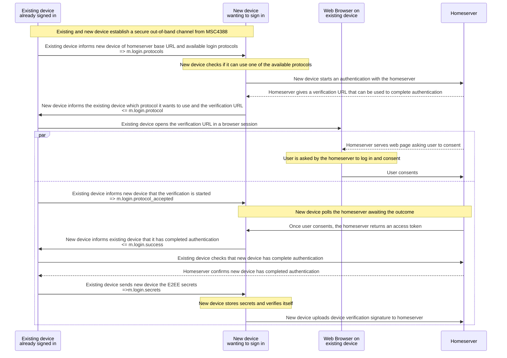
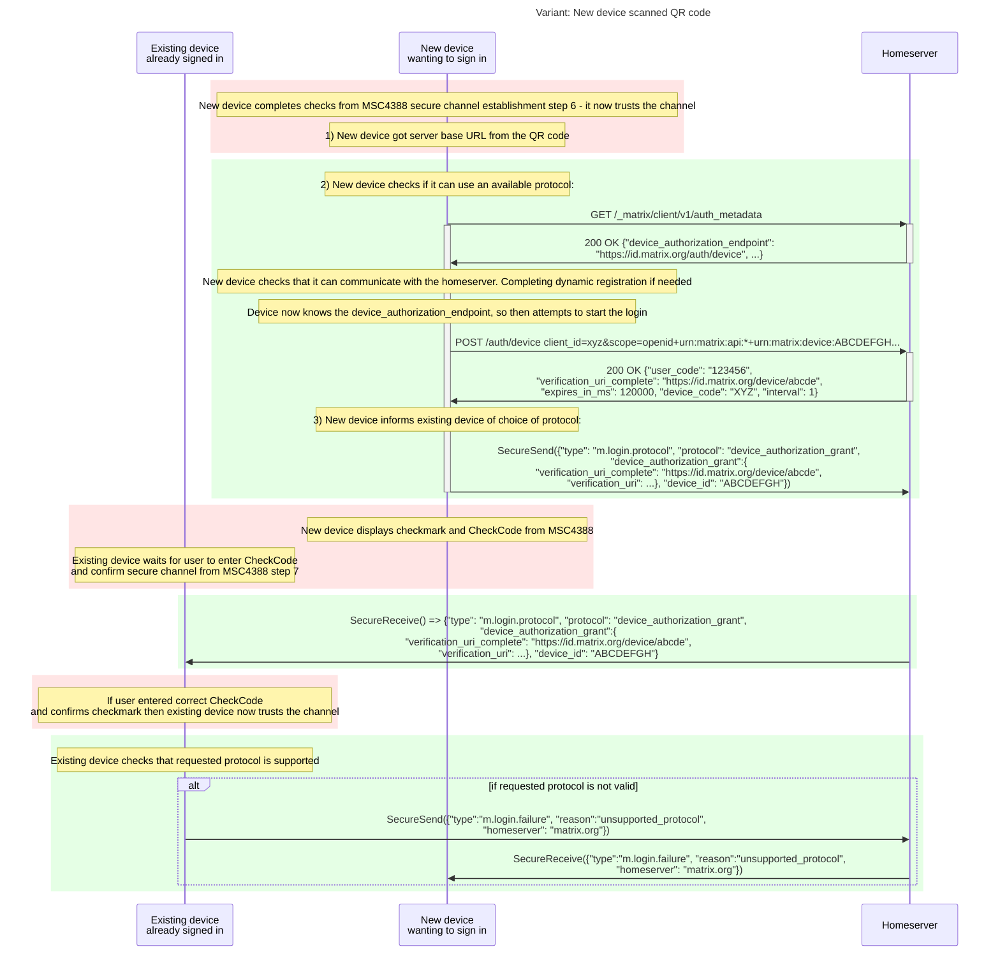
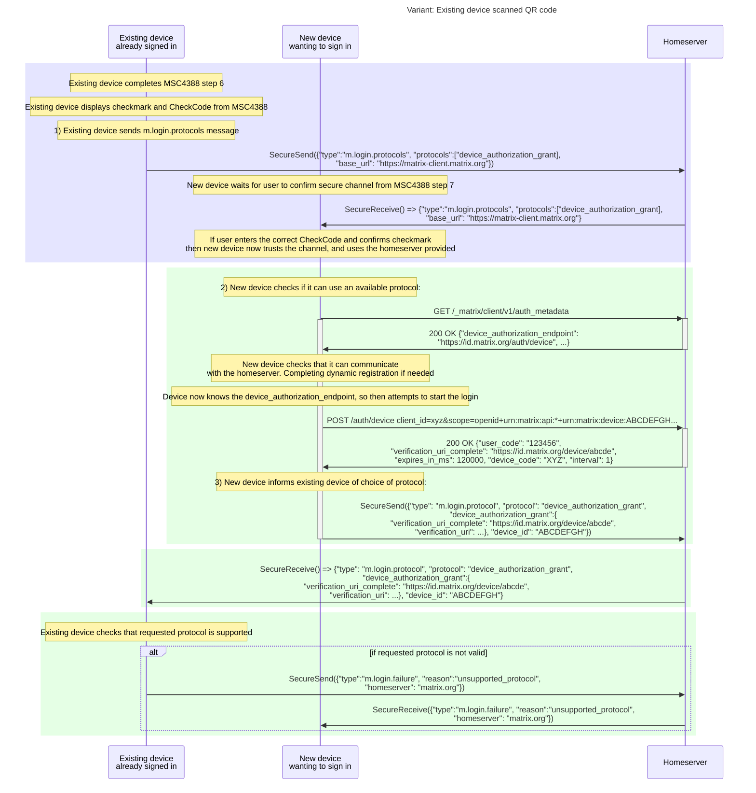
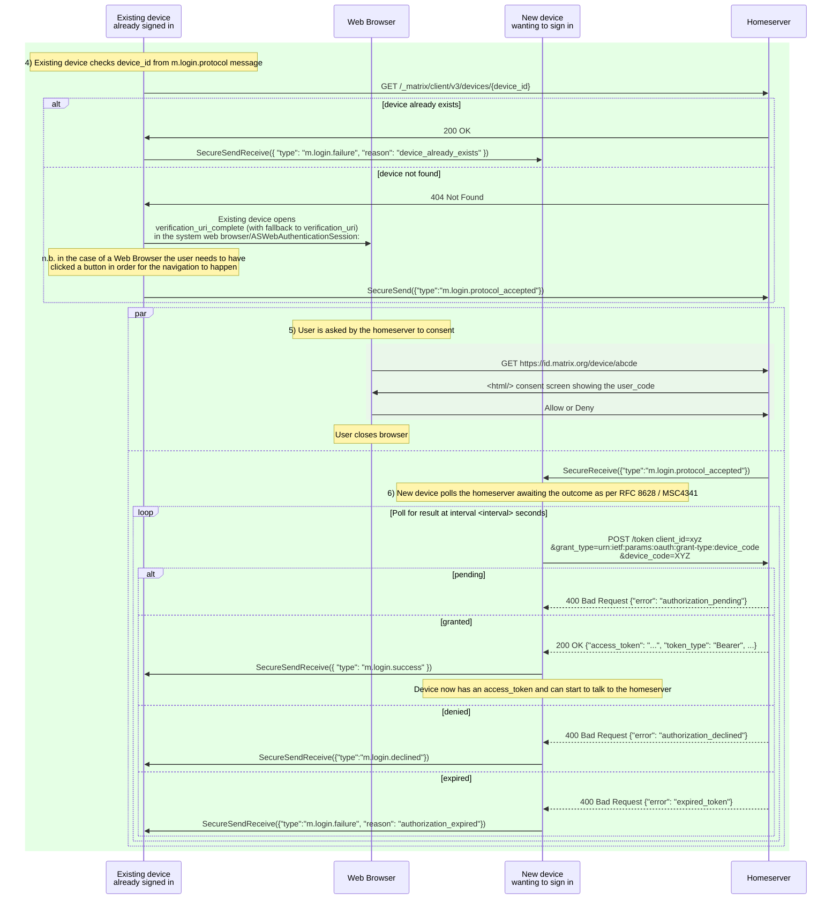
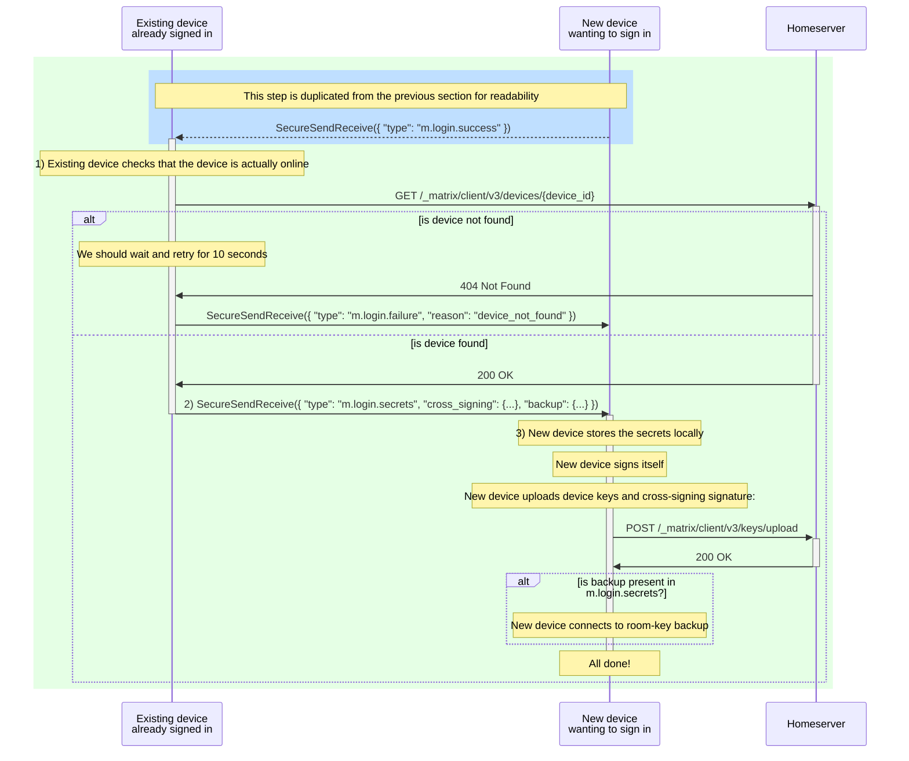

# MSC4108: Mechanism to allow OAuth 2.0 API sign in and E2EE set up via QR code

We propose a method to allow an existing authenticated Matrix client to sign in a new client by scanning a QR code. The
new client will be a fully bootstrapped Matrix cryptographic device, possessing all the necessary secrets, namely the
cryptographic user identity ("cross-signing") and the server-side key backup decryption key (if used).

This MSC supersedes [MSC3906](https://github.com/matrix-org/matrix-spec-proposals/pull/3906),
[MSC3903](https://github.com/matrix-org/matrix-spec-proposals/pull/3903) and
[MSC3886](https://github.com/matrix-org/matrix-spec-proposals/pull/3886) which achieved a similar feature but did not
work with a homeserver using [OAuth 2.0 API](https://spec.matrix.org/v1.15/client-server-api/#oauth-20-api).

Table of contents:

- [Proposal](#proposal)
- [Message reference](#message-reference)
- [Discoverability of the capability](#discoverability-of-the-capability)
- [Potential issues](#potential-issues)
- [Alternatives](#alternatives)
- [Security considerations](#security-considerations)
- [Unstable prefix](#unstable-prefix)
- [Dependencies](#dependencies)

## Proposal

We rely on the mechanisms described in [MSC4388] to establish a secure out-of-band channel between
the new and existing device over which we can pass messages.

In order for the new device to be fully set up, it needs to exchange information with an existing device such that:

- The new device knows which homeserver to use
- The existing device can facilitate the new device in getting an access token
- The existing device shares the secrets necessary to set up end-to-end encryption

At a high-level the process works as follows:



### Login via OAuth 2.0 Device Authorization Grant from MSC4341

In this section the sequence of steps depends on whether the new device generated or scanned the QR code from [MSC4388].

For example, in the case that the new device scanned the QR code it is the first to do a `SecureSend` whereas if the new
device generated the QR then the existing device is the first to do a `SecureSend`.

Unfortunately, this can make it hard to read what is going on. Sequence diagrams are included for both variants after
the steps are described.

We use the `SecureSend` and `SecureReceive` operations from [MSC4388] which are sent via the out-of-band channel.

1. **Homeserver discovery**

The new device needs to know which homeserver it will be authenticating with.

In the case that the new device scanned the QR code then the [base URL]
of the Matrix homeserver can be taken from the QR code and the new device proceeds to step 2 immediately.

Otherwise the new device waits to be informed by receiving an `m.login.protocols` message from the existing device.

The existing device would need to determine which "protocols" are available for the new device to use.

Currently this could only be `device_authorization_grant` meaning the homeserver supports the
`urn:ietf:params:oauth:grant-type:device_code` grant type.

If it is available then the existing device informs the new device by sending the `m.login.protocols` message with the
homeserver specified:

*Existing device => New device via secure channel*

```json
{
    "type": "m.login.protocols",
    "protocols": ["device_authorization_grant"],
    "base_url": "https://synapse-oidc.lab.element.dev"
}
```

2. **New device checks if it can use an available protocol**

The existing device then undertakes steps to determine if it is able to work with the homeserver.

The steps are as follows:

- checks that the homeserver has the OAuth 2.0 API available by [`GET /_matrix/client/v1/auth_metadata`](https://spec.matrix.org/v1.15/client-server-api/#server-metadata-discovery) on the homeserver [base URL]

*New device => Homeserver via HTTP*

```http
GET /_matrix/client/v1/auth_metadata HTTP/1.1
Host: synapse-oidc.lab.element.dev
Accept: application/json
```

With response like:

```http
200 OK
Content-Type: application/json

{
    "issuer": "https://auth-oidc.lab.element.dev/",
    "authorization_endpoint": "https://auth-oidc.lab.element.dev/authorize",
    "token_endpoint": "https://auth-oidc.lab.element.dev/oauth2/token",
    "jwks_uri": "https://auth-oidc.lab.element.dev/oauth2/keys.json",
    "registration_endpoint": "https://auth-oidc.lab.element.dev/oauth2/registration",
    "scopes_supported": ["openid", "email"],
    "response_types_supported": [...],
    "response_modes_supported": [...],
    "grant_types_supported": [
        "authorization_code",
        "refresh_token",
        "client_credentials",
        "urn:ietf:params:oauth:grant-type:device_code"
    ],
    ...
    "device_authorization_endpoint": "https://auth-oidc.lab.element.dev/oauth2/device"
}
```

- either does Dynamic Client Registration as per the existing [spec](https://spec.matrix.org/v1.15/client-server-api/#client-registration)
or uses a static `client_id`. We will use `my_client_id` as an example `client_id`.

- sends a [RFC8628 Device Authorization Request](https://datatracker.ietf.org/doc/html/rfc8628#section-3.1) to the homeserver
using the `device_authorization_endpoint` as described by [MSC4341]:

*New device => Homeserver via HTTP*

```http
POST /oauth2/device HTTP/1.1
Host: auth-oidc.lab.element.dev
Content-Type: application/x-www-form-urlencoded

client_id=my_client_id&scope=openid%20urn%3Amatrix%3Aclient%3Aapi%3A%2A%20urn%3Amatrix%3Aclient%3Adevice%3AABCDEGH
```

With response like:

```http
200 OK
Content-Type: application/json

{
    "device_code": "GmRhmhcxhwAzkoEqiMEg_DnyEysNkuNhszIySk9eS",
    "user_code": "123456",
    "verification_uri": "https://auth-oidc.lab.element.dev/link",
    "verification_uri_complete": "https://auth-oidc.lab.element.dev/link?code=123456",
    "expires_in": 1800,
    "interval": 5
}
```

- parses the [Device Authorization Response](https://datatracker.ietf.org/doc/html/rfc8628#section-3.2) above

At this point the new device knows that, subject to the user consenting, it should be able to complete the login

3. **New device informs existing device that it wants to use the `device_authorization_grant`**

The new device sends the `verification_uri` and, if present, the `verification_uri_complete` over to the existing device and
indicates that it wants to use protocol `device_authorization_grant` and that it will be authenticating as the Matrix
device with ID `device_id` (i.e. it will be requesting the [OAuth 2.0 API scope](https://spec.matrix.org/v1.16/client-server-api/#login-flow)
containing the specified device ID):

*New device => Existing device via secure channel*

```json
{
    "type": "m.login.protocol",
    "protocol": "device_authorization_grant",
    "device_authorization_grant": {
        "verification_uri": "https://auth-oidc.lab.element.dev/link",
        "verification_uri_complete": "https://auth-oidc.lab.element.dev/link?code=123456"
    },
    "device_id": "ABCDEFGH"
}
```

The sequence for steps 1 to 3 is as follows: (the sequence depending on which device  has scanned the code varies for readability)

_New device scanned QR code:_



_Existing device scanned QR code:_



Then we continue with the actual login:

4. **Existing device checks device_id and accepts protocol to use**

On receipt of the `m.login.protocol` message above, and having completed step 7 of the secure channel establishment, the
existing device then asserts that there is no existing device corresponding to the `device_id` from the
`m.login.protocol` message.

It does so by calling [GET /_matrix/client/v3/devices/<device_id>](https://spec.matrix.org/v1.9/client-server-api/#get_matrixclientv3devicesdeviceid)
and expecting to receive an HTTP 404 response.

If the device already exists then the login request should be rejected with an `m.login.failure` and reason `device_already_exists`:

*Existing device => New device via secure channel*

```json
{
    "type": "m.login.failure",
    "reason": "device_already_exists"
}
```

If no existing device was found then the existing device opens the `verification_uri_complete` - falling back to the
`verification_uri`, if `verification_uri_complete` isn't present - in a system browser.

Ideally this is in a trusted/secure environment where the cookie jar and password manager features are available. e.g.
on iOS this could be a `ASWebAuthenticationSession`

The existing device then sends an acknowledgement message to let the other device know that the consent process is in progress:

*Existing device => New device via secure channel*

```json
{
    "type": "m.login.protocol_accepted"
}
```

5. **User is asked by homeserver to consent on existing device**

The user is then prompted to consent by the homeserver. They may be prompted to undertake additional actions by the
homeserver such as 2FA, but this is all handled within the browser.

Note that the existing device does not see the new access token. This is one of the benefits of the OAuth 2.0 API.

6. **New device waits for approval from homeserver**

In parallel to step 5, on receipt of the `m.login.protocol_accepted` message the new device:

- In accordance with [RFC8628](https://datatracker.ietf.org/doc/html/rfc8628#section-3.3.1) the new device must display
the `user_code` in order that the user can confirm it on the homeserver if required.
- The new device then starts to poll the homeserver by making
[Device Access Token Requests](https://datatracker.ietf.org/doc/html/rfc8628#section-3.4) using the interval and bounded
by `expires_in`.

The above is as per [MSC4341].

*New device => Homeserver via HTTP*

```http
POST /oauth2/token HTTP/1.1
Host: auth-oidc.lab.element.dev
Content-Type: application/x-www-form-urlencoded

grant_type=urn%3Aietf%3Aparams%3Aoauth%3Agrant-type%3Adevice_code
      &device_code=GmRhmhcxhwAzkoEqiMEg_DnyEysNkuNhszIySk9eS
      &client_id=my_client_id
```

- It then parses the [Device Access Token Response](https://datatracker.ietf.org/doc/html/rfc8628#section-3.5) and
handles the different responses
- If the user consents in the next step then the new device will receive an `access_token` and `refresh_token` etc. as
normal as per [MSC4341].

The sequence diagram for steps 4, 5 and 6 is as follows:

(for readability a pair of `SecureSend,SecureReceive` operations via the Homeserver is represented by a single
`SecureSendReceive` between the two devices)



### Secret sharing and device verification

Once the new device has logged in and obtained an access token it will want to obtain the secrets necessary to set up
end-to-end encryption on the device and make itself cross-signed.

Before sharing the end-to-end encryption secrets the existing device should validate that the new device has
successfully obtained an access token from the homeserver. The purpose of this is so that, if the user or homeserver
has disallowed the login, the secrets are not leaked.

If checked successfully then the existing device sends the following secrets to the new device:

- The private cross-signing key triplet: MSK, SSK, USK
- The backup recovery key and the currently used backup version.

This is achieved as following:

1. **Existing device confirms that the new device has indeed logged in successfully**

On receipt of an `m.login.success` message the existing device queries the homeserver to check that there is a device online

with the corresponding device_id (from the `m.login.protocol` message).

It does so by calling [GET /_matrix/client/v3/devices/<device_id>](https://spec.matrix.org/v1.9/client-server-api/#get_matrixclientv3devicesdeviceid)
and expecting to receive an HTTP 200 response.

If the device isn't immediately visible it can repeat the `GET` request for up to, say, 10 seconds to allow for any latency.

If no device is found then the process should be stopped.

2. **Existing device shares secrets with new device**

The existing device sends a `m.login.secrets` message via the secure channel:

```json
{
    "type": "m.login.secrets",
    "cross_signing": {
        "master_key": "$base64_of_the_key",
        "self_signing_key": "$base64_of_the_key",
        "user_signing_key": "$base64_of_the_key"
    },
    "backup": {
        "algorithm": "foobar",
        "key": "$base64_of_the_backup_recovery_key",
        "backup_version": "version_string"
    }
}
```

3. **New device cross-signs itself and uploads device keys**

On receipt of the `m.login.secrets` message the new device can store the secrets locally

The new device can then generate the cross-signing signature for itself.

It can then use a single request to upload the device keys and cross signing signature. This removes the chance of other
devices seeing the new device as unverified, incorrectly prompting the user to verify the already verified device.

The request would look just like any other `/keys/upload` request, it would just include one additional signature, the
one from the self-signing key. The request would look like follows:

```http
POST /_matrix/client/v3/keys/upload HTTP/1.1
Host: synapse-oidc.lab.element.dev
Content-Type: application/json

{
    "device_keys": {
        "algorithms": [
            "m.olm.v1.curve25519-aes-sha2",
            "m.megolm.v1.aes-sha2"
        ],
        "device_id": "SGKMSRAGBF",
        "keys": {
            "curve25519:SGKMSRAGBF": "I11VOe5quKuH/YjdOqn5VcW06fvPIJQ9JX8ryj6ario",
            "ed25519:SGKMSRAGBF": "b8gROFh+UIHLD/obY0+IlxoWiGtYVhKdqixvw4QHcN8"
        },
        "signatures": {
            "@testing_35:morpheus.localhost": {
                "ed25519:SGKMSRAGBF": "ziHEUIsHnrYBH4CqYpN1JC/ex3t4VG3zvo16D8ORqN6yAErpsKsnd/5LDdZERIOB1MGffKGfCL6ny5V7rT9FCQ",
                "ed25519:bkYgAVUNqvuyy8b1w09utJNJxBvK3hZB65xxoLPVzFol": "p257k0tfPF98OIDuXnFSJS2DmVlxO4sgTHdF41DTdZBCpTZfPwok6iASo3xMRKdyy3WMEgkQ6lzhEyRKKZBGBQ"
            }
        },
        "user_id": "@testing_35:morpheus.localhost"
    }
}
```

The sequence diagram for this would look as follows:

(for readability a pair of `SecureSend,SecureReceive` operations via the Homeserver is represented by a single
`SecureSendReceive` between the two devices)



## Message reference

These are the messages that are exchanged between the devices via the secure channel to negotiate the sign in and set up
of E2EE.

### `m.login.protocols`

- Sent by: existing device
- Purpose: to state the available protocols for signing in. At the moment only `device_authorization_grant` is supported

Fields:

|Field|Type||
|--- |--- |--- |
|`type`|required `string`|`m.login.protocols`|
|`protocols`|required `string[]`|Array of: one of: `device_authorization_grant` |
|`base_url`|required `string`|The [base URL] of the Matrix homeserver for client-server connections|

```json
{
    "type": "m.login.protocols",
    "protocols": ["device_authorization_grant"],
    "base_url": "https://matrix-client.matrix.org"
}
```

### `m.login.protocol`

- Sent by: new device
- Purpose: the new device sends this to indicate which protocol it intends to use

Fields:

|Field|Type||
|--- |--- |--- |
|`type`|required `string`|`m.login.protocol`|
|`protocol`|required `string`|One of: `device_authorization_grant`|
|`device_authorization_grant`|Required `object` where `protocol` is `device_authorization_grant`|These values are taken from the RFC8628 Device Authorization Response that the new device received from the homeserver: <table> <tr> <td><strong>Field</strong> </td> <td><strong>Type</strong> </td> </tr> <tr> <td><code>verification_uri</code> </td> <td>required <code>string</code> </td> </tr> <tr> <td><code>verification_uri_complete</code> </td> <td><code>string</code> </td> </tr></table>|
|`device_id`|required `string`|The device ID that the new device will use|

Example:

```json
{
    "type": "m.login.protocol",
    "protocol": "device_authorization_grant",
    "device_authorization_grant": {
        "verification_uri_complete": "https://id.matrix.org/device/abcde",
        "verification_uri": "..."
    },
    "device_id": "ABCDEFGH"
}
```

### `m.login.protocol_accepted`

- Sent by: existing device
- Purpose: Indicates that the existing device has accepted the protocol request and will open the `verification_uri` (or
  `verification_uri_complete`) for the user to grant consent

Example:

```json
{
    "type":"m.login.protocol_accepted"
}
```

### `m.login.failure`

- Sent by: either device
- Purpose: used to indicate a failure

Fields:

|Field|Type||
|--- |--- |--- |
|`type`|required `string`|`m.login.failure`|
|`reason`|required `string`| One of: <table> <tr> <td><strong>Value</strong> </td> <td><strong>Description</strong> </td> </tr><tr> <td><code>authorization_expired</code> </td> <td>The Device Authorization Grant expired</td> </tr> <tr> <td><code>device_already_exists</code> </td> <td>The device ID specified by the new client already exists in the Homeserver provided device list</td> </tr><tr><td><code>device_not_found</code></td><td>The new device is not present in the device list as returned by the Homeserver</td></tr><tr><td><code>unexpected_message_received</code></td><td>Sent by either device to indicate that they received a message of a type that they weren't expecting</td></tr><tr><td><code>unsupported_protocol</code></td><td>Sent by a device where no suitable protocol is available or the requested protocol requested is not supported</td></tr><tr><td><code>user_cancelled</code></td><td>Sent by either new or existing device to indicate that the user has cancelled the login</td></tr></table>|
|`homeserver`|`string`| When the existing device is sending this it can include the [server name] of the Matrix homeserver so that the new device can at least save the user the hassle of typing it in|

Example:

```json
{
    "type":"m.login.failure",
    "reason": "unsupported_protocol",
    "homeserver": "matrix.org"
}
```

### `m.login.declined`

- Sent by: new device
- Purpose: Indicates that the user declined the request

Fields:

|Field|Type||
|--- |--- |--- |
|`type`|required `string`|`m.login.declined`|

Example:

```json
{
    "type":"m.login.declined"
}
```

### `m.login.success`

- Sent by: new device
- Purpose: to inform the existing device that it has successfully obtained an access token.

Fields:

|Field|Type||
|--- |--- |--- |
|`type`|required `string`|`m.login.success`|

Example:

```json
{
    "type": "m.login.success"
}
```

### `m.login.secrets`

- Sent by: existing device
- Purpose: Shares the secrets used for cross-signing and room key backups

Fields:

|Field|Type||
|--- |--- |--- |
|`type`|required `string`|`m.login.secrets`|
|`cross_signing`|required `object`|<table> <tr> <td><strong>Field</strong> </td> <td><strong>Type</strong> </td> <td> </td> </tr> <tr> <td><code>master_key</code></td> <td>required <code>string</code></td> <td>Unpadded base64 encoded private key </td> </tr> <tr> <td><code>self_signing_key</code></td> <td>required <code>string</code></td> <td>Unpadded base64 encoded private key </td> </tr> <tr> <td><code>user_signing_key</code></td> <td>required <code>string</code></td> <td>Unpadded base64 encoded private key </td> </tr></table>|
|`backup`|`object`|<table> <tr> <td>Field </td> <td>Type </td> <td> </td> </tr> <tr> <td><code>algorithm</code></td> <td>required <code>string</code></td> <td>One of the algorithms listed at <a href="https://spec.matrix.org/v1.9/client-server-api/#server-side-key-backups">https://spec.matrix.org/v1.9/client-server-api/#server-side-key-backups</a> </td> </tr> <tr> <td><code>key</code></td> <td>required <code>string</code></td> <td>Unpadded base64 encoded private/secret key</td> </tr> <tr> <td><code>backup_version</code></td> <td>required <code>string</code></td> <td>The backup version as returned by [`POST /_matrix/client/v3/room_keys/version`](https://spec.matrix.org/v1.15/client-server-api/#post_matrixclientv3room_keysversion)</td> </tr></table>|

Example:

```json
{
    "type": "m.login.secrets",
    "cross_signing": {
        "master_key": "$base64_of_the_key",
        "self_signing_key": "$base64_of_the_key",
        "user_signing_key": "$base64_of_the_key"
    },
    "backup": {
        "algorithm": "foobar",
        "key": "$base64_of_the_backup_recovery_key",
        "backup_version": "version_string"
    }
}
```

## Discoverability of the capability

Before offering this capability it would make sense that the device can check the availability of the feature.

Where the homeserver is known:

1. Check that the homeserver is using the OAuth 2.0 API using [server metadata discovery](https://spec.matrix.org/v1.15/client-server-api/#server-metadata-discovery)
1. Check that the Device Authorization Grant is available as per [MSC4341]
1. Check if the homeserver has a rendezvous session API available by attempting a POST to the create rendezvous endpoint
   from [MSC4388].

For a new device it would need to know the homeserver ahead of time in order to do these checks.

Additionally the new device needs to either have an existing (i.e. static) OAuth 2.0 client registered with the homeserver
already, or the homeserver must support and allow dynamic client registration as described in the [spec](https://spec.matrix.org/v1.15/client-server-api/#client-registration).

The feature is also only available where a user has cross-signing set up and the existing device to be used has the
Master Signing Key, Self Signing Key and User Signing Key stored locally so that they can be shared with the new device.

## Potential issues

TODO

## Alternatives

### Alternative method of secret sharing

Instead of the existing device sharing the secrets bundle instead the existing device could cross-sign the new device
and then use to-device messaging for sharing the secrets.

For:

- You re-use existing secret sharing

Against:

- The existing device needs to wait for the new device to upload the device keys for it to sign the new device.
- Takes several round-trips for the secrets to be be shared which will add latency to the overall flow
- The backup cannot be immediately enabled since we received the backup version as well, something the `m.secret.send`
mechanism does not offer.
- The new device cannot upload the cross-signing signature with the device keys in a single request. This introduces a
chance of other devices seeing the new device as unverified, incorrectly prompting the user to verify the device that
will soon be verified.

## Security considerations

### Malicious session spawning

This mechanism could be used by an attacker who has gained temporary access to a client to escalate the attack to creation
of a new client session that has ongoing access.

For example, if you leave your phone unlocked briefly someone could quickly use QR code login to sign in on their device
as you.

It also makes it easier to get the private keys of the user from an unlocked client, as you can login with a new device,
extract the keys from that, and logout again to cover your tracks.

Sophisticated attackers can today already use specialist equipment to extract private keys and access tokens from the memory
of a process. However: a) that is a much higher bar for attack; and b) cloning an access token will quickly be detected via
refresh tokens.

Recommendations to mitigate this are:

- Before the login on the existing device, native clients SHOULD gate QR code login behind some form of extra protection,
  e.g. biometrics on mobile apps. These should be minimally invasive though as otherwise it heavily erodes the benefit of
  using QR code login in the first place. We don't necessarily think this protection is worth while on web clients, as it is
  trivial to access the devtools to extract the secrets directly and/or bypass any extra protections.
- During the login, servers MAY require additional factors of authentication (e.g. biometrics or smart card).
- After the login, servers SHOULD send new device login notifications to the user (this could be to other Matrix devices or
  out of band such as by email).

## Unstable prefix

n.b. the [2024 version](https://github.com/matrix-org/matrix-spec-proposals/blob/87f8317a902cd7bc5c2d2d225f71021b3a509e2d/proposals/4108-oidc-qr-login.md#unstable-prefix)
of this proposal used a different set of unstable prefixes.

This proposal does not have an unstable prefix itself, but instead relies on the unstable names from MSC4388.

## Dependencies

This MSC builds on:

- [MSC4388] which provides the secure out-of-band channel for the devices to communicate via.
- [MSC4341] which proposes support for RFC 8628 Device Authorization Grant in Matrix.

[MSC4341]: https://github.com/matrix-org/matrix-spec-proposals/pull/4341 "MSC4341 Support for RFC 8628 Device Authorization Grant"
[server name]: https://spec.matrix.org/v1.16/appendices/#server-name
[base URL]: https://spec.matrix.org/v1.16/client-server-api/#getwell-knownmatrixclient
[MSC4388]: https://github.com/matrix-org/matrix-spec-proposals/pull/4338 "MSC4388 Secure out-of-band channel for sign in with QR"
