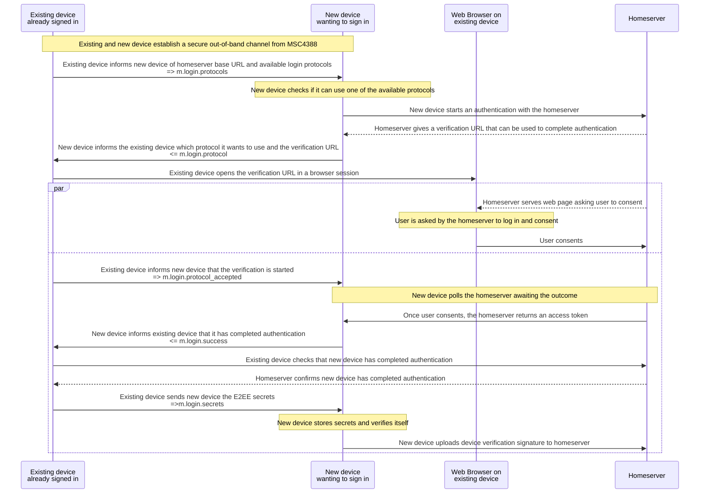
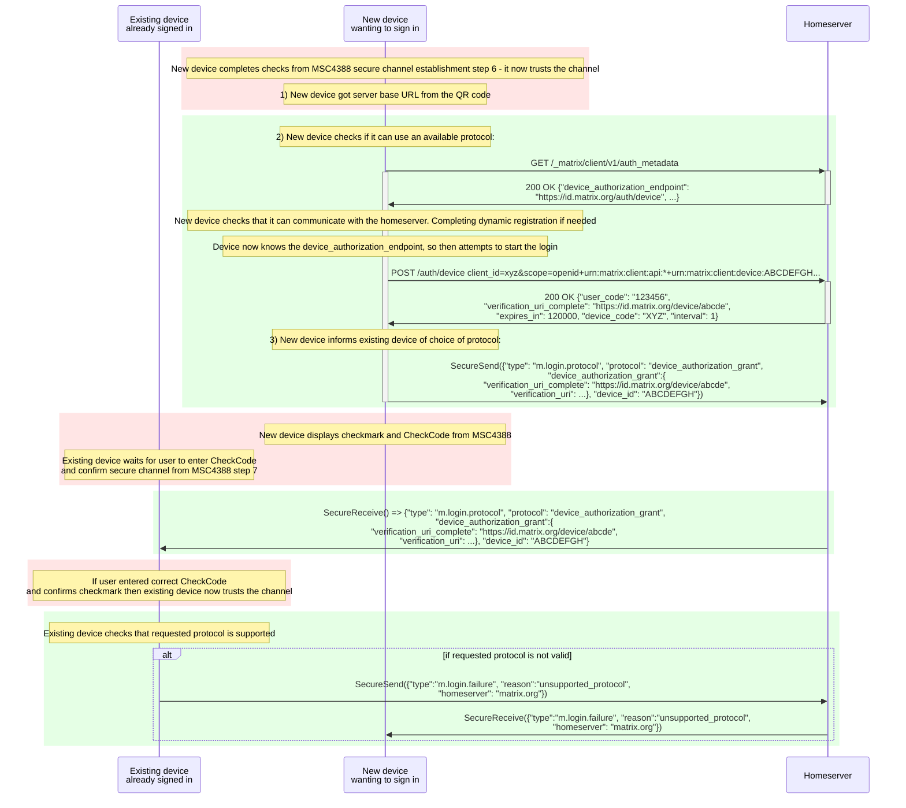
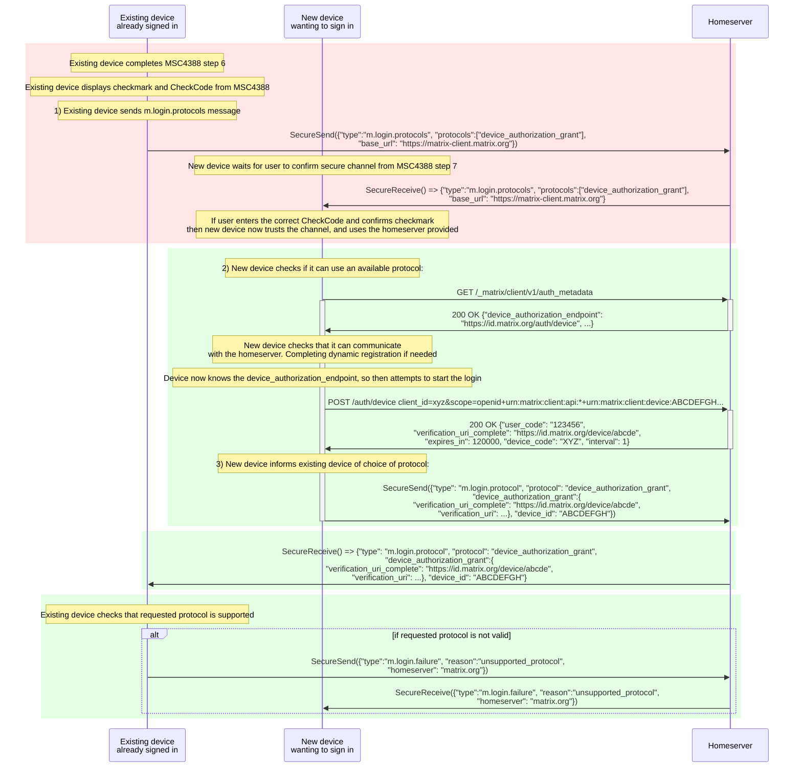
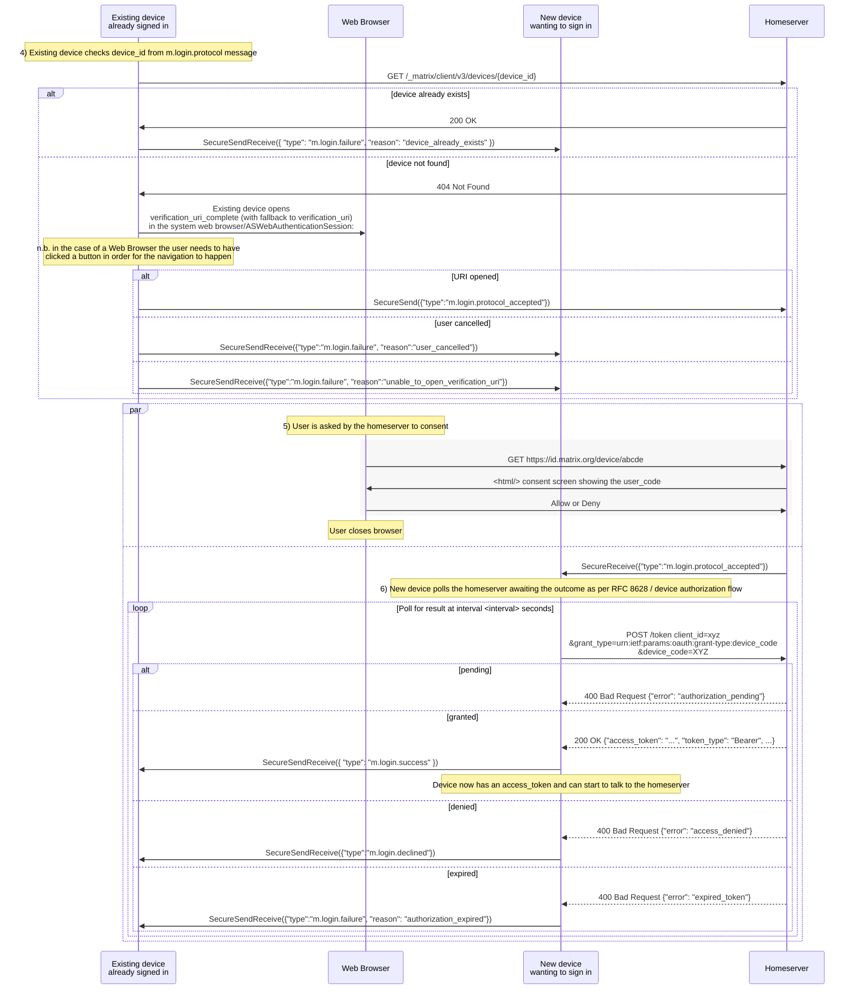
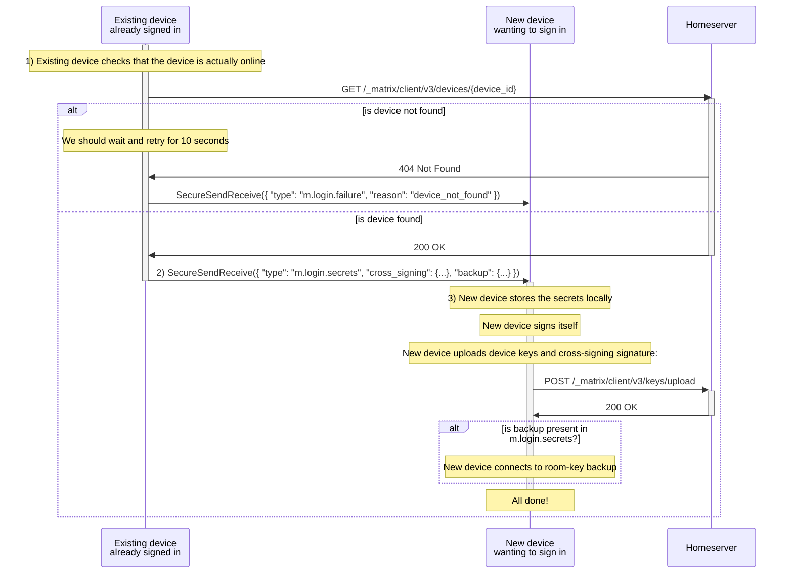

# MSC4108: Mechanism to allow OAuth 2.0 API sign in and E2EE set up via QR code

We propose a method to allow an existing authenticated Matrix client to sign in a new client by scanning a QR code. The
new client will be a fully bootstrapped Matrix cryptographic device, possessing all the necessary secrets, namely the
cryptographic user identity ("cross-signing") and the server-side key backup decryption key (if used).

This MSC supersedes [MSC3906](https://github.com/matrix-org/matrix-spec-proposals/pull/3906),
[MSC3903](https://github.com/matrix-org/matrix-spec-proposals/pull/3903) and
[MSC3886](https://github.com/matrix-org/matrix-spec-proposals/pull/3886) which achieved a similar feature but did not
work with a homeserver using [OAuth 2.0 API](https://spec.matrix.org/v1.15/client-server-api/#oauth-20-api).

Table of contents:

- [Proposal](#proposal)
- [Message reference](#message-reference)
- [Potential issues](#potential-issues)
- [Alternatives](#alternatives)
- [Security considerations](#security-considerations)
- [Threat modelling](#threat-modelling)
- [Unstable prefix](#unstable-prefix)
- [Dependencies](#dependencies)

## Proposal

We rely on the mechanisms described in [MSC4388] to establish a secure out-of-band channel between
the new and existing device over which we can pass messages.

In order for the new device to be fully set up, it needs to exchange information with an existing device such that:

- The new device knows which homeserver to use
- The existing device can facilitate the new device in getting an access token
- The existing device shares the secrets necessary to set up end-to-end encryption

At a high-level the process works as follows:


```mermaid
sequenceDiagram
    participant E as Existing device <br>already signed in
    participant N as New device <br>wanting to sign in
    participant UA as Web Browser on<br>existing device
    participant HS as Homeserver

    note over N,E: Existing and new device establish a secure out-of-band channel from MSC4388

    E->>N: Existing device informs new device of homeserver base URL and available login protocols<br>=> m.login.protocols

    note over N: New device checks if it can use one of the available protocols

    N->>HS: New device starts an authentication with the homeserver

    HS-->>N: Homeserver gives a verification URL that can be used to complete authentication

    N->>E: New device informs the existing device which protocol it wants to use and the verification URL<br><= m.login.protocol

    E->>UA: Existing device opens the verification URL in a browser session

    par
        HS-->>UA: Homeserver serves web page asking user to consent

        note over UA: User is asked by the homeserver to log in and consent
        UA->>HS: User consents
    and
        E->>N: Existing device informs new device that the verification is started<br>=> m.login.protocol_accepted

        note over N, HS: New device polls the homeserver awaiting the outcome
    

        HS->>N: Once user consents, the homeserver returns an access token
        N->>E: New device informs existing device that it has completed authentication<br><= m.login.success
        E->>HS: Existing device checks that new device has completed authentication
        HS-->>E: Homeserver confirms new device has completed authentication
        E->>N: Existing device sends new device the E2EE secrets<br>=>m.login.secrets

        note over N: New device stores secrets and verifies itself
        N->>HS: New device uploads device verification signature to homeserver
    end
```

### Discoverability of the capability

Before offering this feature to a user, the devices should check that the feature is available to use. If it isn't
available then it is recommended that the client "fails fast" and informs the user sooner rather than later.

The checks that can be done vary depending on which device is generating the QR as follows:

#### Existing device scanning the QR code

The existing device can perform these checks:

1. That the homeserver is using the OAuth 2.0 API using [server metadata
discovery](https://spec.matrix.org/v1.15/client-server-api/#server-metadata-discovery)
1. That the Device Authorization Grant is available as per [device authorization flow] for the new device to use
1. That the user has [end-to-end encryption](https://spec.matrix.org/v1.18/client-server-api/#end-to-end-encryption)
   cross-signing set up and the existing device has the Master Signing Key, Self Signing Key, and User Signing Key
   stored locally so that they can be shared with the new device.

Note that the we do not check for the availability of the rendezvous session API because the new device will be choosing
the homeserver for the rendezvous which might be different from the actual homeserver.

#### Existing device generating the QR code

The three checks from above are performed, along with an additional check:

4. That the homeserver has a rendezvous session API available by attempting a POST to the create rendezvous endpoint
   from [MSC4388].

#### New device generating the QR code

Since the homeserver is not yet known at QR generation time, the only check the new device can perform ahead of time is
confirming that the rendezvous server is available by attempting a POST to the create rendezvous endpoint from
[MSC4388].

#### New device scanning the QR code

The homeserver URL is encoded in the QR code, so the new device can do these checks after scanning:

1. That the homeserver is using the OAuth 2.0 API using [server metadata
   discovery](https://spec.matrix.org/v1.15/client-server-api/#server-metadata-discovery)
1. That the Device Authorization Grant is available as per [device authorization flow] for the new device to use
1. That the device either has a static OAuth 2.0 `client_id` or [dynamic client registration] is supported by the
   homeserver.

### Login via OAuth 2.0 device authorization flow

In this section the sequence of steps depends on whether the new device generated or scanned the QR code from [MSC4388].

For example, in the case that the new device scanned the QR code it is the first to do a `SecureSend` whereas if the new
device generated the QR then the existing device is the first to do a `SecureSend`.

Unfortunately, this can make it hard to read what is going on. Sequence diagrams are included for both variants after
the steps are described.

We use the `SecureSend` and `SecureReceive` operations from [MSC4388] which are sent via the out-of-band channel.

#### 1. Homeserver discovery

The new device needs to know which homeserver it will be authenticating with. If the new device scanned the QR code,
the [base URL] of the Matrix homeserver can be taken from the QR code and the new device proceeds to step 2
immediately. Otherwise, the new device waits to receive an `m.login.protocols` message from the existing device.

The existing device determines which "login protocols" are available for the new device to use. Currently this can
only be `device_authorization_grant`, meaning the homeserver supports the
`urn:ietf:params:oauth:grant-type:device_code` grant type.

If that grant type is available, then the existing device informs the new device by sending the `m.login.protocols` message with the
homeserver specified:

*Existing device => New device via secure channel*

```json
{
    "type": "m.login.protocols",
    "protocols": ["device_authorization_grant"],
    "base_url": "https://synapse-oidc.lab.element.dev"
}
```

If that grant type is not supported then the existing device can inform the new device as follows:

*Existing device => New device via secure channel*

```json
{
    "type": "m.login.protocols",
    "protocols": [],
    "base_url": "https://synapse-oidc.lab.element.dev"
}
```

However, it is recommended that the existing device check for the availability of the grant type ahead of time so that
it can inform the user that the feature is not available before any QR is generated/scanned.

#### 2. New device checks if it can use an available protocol

The new device then undertakes steps to determine if it is able to work with the homeserver.

The steps are as follows:

- checks that the homeserver has the OAuth 2.0 API available by [`GET /_matrix/client/v1/auth_metadata`](https://spec.matrix.org/v1.15/client-server-api/#server-metadata-discovery) on the homeserver [base URL]

  *New device => Homeserver via HTTP*

  ```http
  GET /_matrix/client/v1/auth_metadata HTTP/1.1
  Host: synapse-oidc.lab.element.dev
  Accept: application/json
  ```

  With response like:

  ```http
  200 OK
  Content-Type: application/json
  
  {
    "issuer": "https://auth-oidc.lab.element.dev/",
    "authorization_endpoint": "https://auth-oidc.lab.element.dev/authorize",
    "token_endpoint": "https://auth-oidc.lab.element.dev/oauth2/token",
    "jwks_uri": "https://auth-oidc.lab.element.dev/oauth2/keys.json",
    "registration_endpoint": "https://auth-oidc.lab.element.dev/oauth2/registration",
    "scopes_supported": ["openid", "email"],
    "response_types_supported": [...],
    "response_modes_supported": [...],
    "grant_types_supported": [
        "authorization_code",
        "refresh_token",
        "client_credentials",
        "urn:ietf:params:oauth:grant-type:device_code"
    ],
    ...
    "device_authorization_endpoint": "https://auth-oidc.lab.element.dev/oauth2/device"
  }
  ```

- either does [dynamic client registration] or uses a static `client_id`. We will use `my_client_id`
  as an example `client_id`.

- sends a [RFC8628 Device Authorization Request](https://datatracker.ietf.org/doc/html/rfc8628#section-3.1) to the homeserver
  using the `device_authorization_endpoint` as described by the [device authorization flow]:

  *New device => Homeserver via HTTP*

  ```http
  POST /oauth2/device HTTP/1.1
  Host: auth-oidc.lab.element.dev
  Content-Type: application/x-www-form-urlencoded
  
  client_id=my_client_id&scope=openid%20urn%3Amatrix%3Aclient%3Aapi%3A%2A%20urn%3Amatrix%3Aclient%3Adevice%3AABCDEFGH
  ```

  With response like:
  ```http
  200 OK
  Content-Type: application/json

  {
      "device_code": "GmRhmhcxhwAzkoEqiMEg_DnyEysNkuNhszIySk9eS",
      "user_code": "123456",
      "verification_uri": "https://auth-oidc.lab.element.dev/link",
      "verification_uri_complete": "https://auth-oidc.lab.element.dev/link?code=123456",
      "expires_in": 1800,
      "interval": 5
  }
  ```

- parses the [Device Authorization Response] above

At this point the new device knows that, subject to the user consenting, it should be able to complete the login.

#### 3. New device informs existing device that it wants to use the `device_authorization_grant`

The new device sends the `verification_uri` and, if present, the `verification_uri_complete` over to the existing device and
indicates that it wants to use protocol `device_authorization_grant` and that it will be authenticating as the Matrix
device with ID `device_id` (i.e. it will be requesting the [OAuth 2.0 API scope](https://spec.matrix.org/v1.16/client-server-api/#login-flow)
containing the specified device ID):

*New device => Existing device via secure channel*

```json
{
    "type": "m.login.protocol",
    "protocol": "device_authorization_grant",
    "device_authorization_grant": {
        "verification_uri": "https://auth-oidc.lab.element.dev/link",
        "verification_uri_complete": "https://auth-oidc.lab.element.dev/link?code=123456"
    },
    "device_id": "ABCDEFGH"
}
```

The sequence for steps 1 to 3 depends on which device scanned the QR code, so we have a diagram for each of the two
variants: (The steps that are the same between the two variants have a green background, the steps that are different
have a red background)

_New device scanned QR code:_


```mermaid
sequenceDiagram
    participant E as Existing device <br>already signed in
    participant N as New device <br>wanting to sign in
    participant HS as Homeserver


    rect rgba(255,0,0, 0.1)
    #alt if New device scanned QR code
        note over N: New device completes checks from MSC4388 secure channel establishment step 6 - it now trusts the channel
        note over N: 1) New device got server base URL from the QR code

    #else if Existing device scanned QR code
    #    note over E: Existing device completes step 6
    #    note over E: Existing device displays checkmark and CheckCode
    #    note over E: 1) Existing device sends m.login.protocols message
    #    E->>HS: SecureSend({"type":"m.login.protocols", "protocols":["device_authorization_grant"],<br> "base_url": "http://matrix-client.matrix.org"})
    #    note over N: New device waits for user to confirm secure channel from step 7
    #    HS->>N: SecureReceive() => {"type":"m.login.protocols", "protocols":["device_authorization_grant"],<br> "base_url": "https://matrix-client.matrix.org"}
    #    note over N: If user enters the correct CheckCode and confirms checkmark<br>then new device now trusts the channel, and uses the homeserver provided
    end


    rect rgba(0,255,0, 0.1)
    note over N: 2) New device checks if it can use an available protocol:
        N->>+HS: GET /_matrix/client/v1/auth_metadata
    activate N
        HS->>-N: 200 OK {"device_authorization_endpoint":<br> "https://id.matrix.org/auth/device", ...}
        Note over N: New device checks that it can communicate with the homeserver. Completing dynamic registration if needed
        Note over N: Device now knows the device_authorization_endpoint, so then attempts to start the login
        N->>+HS: POST /auth/device client_id=xyz&scope=openid+urn:matrix:client:api:*+urn:matrix:client:device:ABCDEFGH...
        HS->>-N: 200 OK {"user_code": "123456",<br>"verification_uri_complete": "https://id.matrix.org/device/abcde",<br>"expires_in": 120000, "device_code": "XYZ", "interval": 1}
        note over N: 3) New device informs existing device of choice of protocol:
        N->>HS: SecureSend({"type": "m.login.protocol", "protocol": "device_authorization_grant",<br> "device_authorization_grant":{<br>"verification_uri_complete": "https://id.matrix.org/device/abcde",<br>"verification_uri": ...}, "device_id": "ABCDEFGH"})

    deactivate N
    end

    rect rgba(255,0,0, 0.1)
    # alt if New device scanned QR code
        note over N: New device displays checkmark and CheckCode from MSC4388
        note over E: Existing device waits for user to enter CheckCode<br>and confirm secure channel from MSC4388 step 7
    end

    rect rgba(0,255,0, 0.1)
        HS->>E: SecureReceive() => {"type": "m.login.protocol", "protocol": "device_authorization_grant",<br> "device_authorization_grant":{<br>"verification_uri_complete": "https://id.matrix.org/device/abcde",<br>"verification_uri": ...}, "device_id": "ABCDEFGH"}
    end

    rect rgba(255,0,0, 0.1)
    # alt if New device scanned QR code
        note over E: If user entered correct CheckCode<br>and confirms checkmark then existing device now trusts the channel
    end


    rect rgba(0,255,0, 0.1)
    note over E: Existing device checks that requested protocol is supported

    alt if requested protocol is not valid
        E->>HS: SecureSend({"type":"m.login.failure", "reason":"unsupported_protocol",<br>"homeserver": "matrix.org"})
        HS->>N: SecureReceive({"type":"m.login.failure", "reason":"unsupported_protocol",<br>"homeserver": "matrix.org"})
    end
    end
```

_Existing device scanned QR code:_


```mermaid
sequenceDiagram
    participant E as Existing device <br>already signed in
    participant N as New device <br>wanting to sign in
    participant HS as Homeserver


    #alt if New device scanned QR code
    #    note over N: New device completes checks from secure channel establishment step 6 - it now trusts the channel
    #    note over N: 1) New device got server base URL from the QR code

    rect rgba(255,0,0, 0.1)
    #else if Existing device scanned QR code
        note over E: Existing device completes MSC4388 step 6
        note over E: Existing device displays checkmark and CheckCode from MSC4388
        note over E: 1) Existing device sends m.login.protocols message
        E->>HS: SecureSend({"type":"m.login.protocols", "protocols":["device_authorization_grant"],<br> "base_url": "https://matrix-client.matrix.org"})
        note over N: New device waits for user to confirm secure channel from MSC4388 step 7
        HS->>N: SecureReceive() => {"type":"m.login.protocols", "protocols":["device_authorization_grant"],<br> "base_url": "https://matrix-client.matrix.org"}
        note over N: If user enters the correct CheckCode and confirms checkmark<br>then new device now trusts the channel, and uses the homeserver provided
    end


    rect rgba(0,255,0, 0.1)
    note over N: 2) New device checks if it can use an available protocol:
        N->>+HS: GET /_matrix/client/v1/auth_metadata
    activate N
        HS->>-N: 200 OK {"device_authorization_endpoint":<br> "https://id.matrix.org/auth/device", ...}
        Note over N: New device checks that it can communicate<br> with the homeserver. Completing dynamic registration if needed
        Note over N: Device now knows the device_authorization_endpoint, so then attempts to start the login
        N->>+HS: POST /auth/device client_id=xyz&scope=openid+urn:matrix:client:api:*+urn:matrix:client:device:ABCDEFGH...
        HS->>-N: 200 OK {"user_code": "123456",<br>"verification_uri_complete": "https://id.matrix.org/device/abcde",<br>"expires_in": 120000, "device_code": "XYZ", "interval": 1}
        note over N: 3) New device informs existing device of choice of protocol:
        N->>HS: SecureSend({"type": "m.login.protocol", "protocol": "device_authorization_grant",<br> "device_authorization_grant":{<br>"verification_uri_complete": "https://id.matrix.org/device/abcde",<br>"verification_uri": ...}, "device_id": "ABCDEFGH"})

    deactivate N
    end

    # alt if New device scanned QR code
    #    note over N: New device displays checkmark and CheckCode
    #    note over E: Existing device waits for user to enter CheckCode<br>and confirm secure channel from step 7
    #end

    rect rgba(0,255,0, 0.1)
        HS->>E: SecureReceive() => {"type": "m.login.protocol", "protocol": "device_authorization_grant",<br> "device_authorization_grant":{<br>"verification_uri_complete": "https://id.matrix.org/device/abcde",<br>"verification_uri": ...}, "device_id": "ABCDEFGH"}
    end

    # alt if New device scanned QR code
    #    note over E: If user entered correct CheckCode<br>and confirms checkmark then existing device now trusts the channel
    #end


    rect rgba(0,255,0, 0.1)
    note over E: Existing device checks that requested protocol is supported

    alt if requested protocol is not valid
        E->>HS: SecureSend({"type":"m.login.failure", "reason":"unsupported_protocol",<br>"homeserver": "matrix.org"})
        HS->>N: SecureReceive({"type":"m.login.failure", "reason":"unsupported_protocol",<br>"homeserver": "matrix.org"})
    end
    end
```

Then we continue with the actual login:

#### 4. Existing device checks device_id and accepts protocol to use

On receipt of the `m.login.protocol` message, and having completed step 7 of the secure channel establishment, the
existing device asserts that there is no existing device corresponding to the `device_id` from the
`m.login.protocol` message. It does so by calling
[GET /_matrix/client/v3/devices/<device_id>](https://spec.matrix.org/v1.9/client-server-api/#get_matrixclientv3devicesdeviceid)
and expecting to receive an HTTP 404 response.

If the device already exists then the login request should be rejected with an `m.login.failure` with reason
`device_already_exists`:

*Existing device => New device via secure channel*

```json
{
    "type": "m.login.failure",
    "reason": "device_already_exists"
}
```

If no existing device was found, the existing device opens the `verification_uri_complete` — falling back to
`verification_uri` if `verification_uri_complete` isn't present — in a system browser. Ideally this is in a
trusted/secure environment where the cookie jar and password manager features are available (e.g. on iOS this could
be an `ASWebAuthenticationSession`). The existing device then sends an acknowledgement message to let the other
device know that the consent process is in progress:

*Existing device => New device via secure channel*

```json
{
    "type": "m.login.protocol_accepted"
}
```

If the URI could not be opened (e.g. unsupported URI scheme, no browser available) then the existing device sends an
`m.login.failure` with reason `unable_to_open_verification_uri`:

*Existing device => New device via secure channel*

```json
{
    "type": "m.login.failure",
    "reason": "unable_to_open_verification_uri"
}
```

If the user denies permission to open the browser then the existing device sends an `m.login.failure` with reason
`user_cancelled`:

*Existing device => New device via secure channel*

```json
{
    "type": "m.login.failure",
    "reason": "user_cancelled"
}
```

#### 5. User is asked by homeserver to consent on existing device

The user is then prompted to consent by the homeserver; they may be prompted to undertake additional actions such as
2FA, but this is all handled within the browser. Note that the existing device does not see the new access token —
this is one of the benefits of the OAuth 2.0 API.

#### 6. New device waits for approval from homeserver

In parallel to step 5, on receipt of the `m.login.protocol_accepted` message the new device:

- In accordance with [RFC8628](https://datatracker.ietf.org/doc/html/rfc8628#section-3.3.1) the new device must display
  the `user_code` (from the [Device Authorization Response]) in order that the user can confirm it on the homeserver if required.
- The new device then starts to poll the homeserver by making
  [Device Access Token Requests](https://datatracker.ietf.org/doc/html/rfc8628#section-3.4) using the `interval` and bounded
  by `expires_in` (both taken from the [Device Authorization Response]).

  The above is as per [device authorization flow].

  *New device => Homeserver via HTTP*

  ```http
  POST /oauth2/token HTTP/1.1
  Host: auth-oidc.lab.element.dev
  Content-Type: application/x-www-form-urlencoded
  
  grant_type=urn%3Aietf%3Aparams%3Aoauth%3Agrant-type%3Adevice_code
        &device_code=GmRhmhcxhwAzkoEqiMEg_DnyEysNkuNhszIySk9eS
        &client_id=my_client_id
  ```

- It then parses the [Device Access Token Response](https://datatracker.ietf.org/doc/html/rfc8628#section-3.5) and
handles the different responses
- If the user consents in the next step then the new device will receive an `access_token` and `refresh_token` etc. as
normal as per [device authorization flow].

The sequence diagram for steps 4, 5 and 6 is as follows:

(for readability a pair of `SecureSend,SecureReceive` operations via the Homeserver is represented by a single
`SecureSendReceive` between the two devices)


```mermaid
sequenceDiagram
    participant E as Existing device <br>already signed in
    participant UA as Web Browser
    participant N as New device <br>wanting to sign in
    participant HS as Homeserver

        note over E: 4) Existing device checks device_id from m.login.protocol message
        E->>HS: GET /_matrix/client/v3/devices/{device_id}
        alt device already exists
            HS->>E: 200 OK
            E->>N: SecureSendReceive({ "type": "m.login.failure", "reason": "device_already_exists" })
        else device not found
            HS->>E: 404 Not Found
            E->>UA: Existing device opens <br>verification_uri_complete (with fallback to verification_uri)<br> in the system web browser/ASWebAuthenticationSession:
            Note over E: n.b. in the case of a Web Browser the user needs to have<br> clicked a button in order for the navigation to happen
            alt URI opened
                E->>HS: SecureSend({"type":"m.login.protocol_accepted"})
            else user cancelled
                E->>N: SecureSendReceive({"type":"m.login.failure", "reason":"user_cancelled"})
            else
                E->>N: SecureSendReceive({"type":"m.login.failure", "reason":"unable_to_open_verification_uri"})
            end
        end
        par
            Note over UA: 5) User is asked by the homeserver to consent
            rect rgba(240,240,240,0.5)
                UA->>HS: GET https://id.matrix.org/device/abcde
                HS->>UA: <html/> consent screen showing the user_code
                UA->>HS: Allow or Deny
            end
            Note over UA: User closes browser
        and
            HS->>N: SecureReceive({"type":"m.login.protocol_accepted"})
        note over N: 6) New device polls the homeserver awaiting the outcome as per RFC 8628 / device authorization flow
            loop Poll for result at interval <interval> seconds
                N->>HS: POST /token client_id=xyz<br>&grant_type=urn:ietf:params:oauth:grant-type:device_code<br>&device_code=XYZ
                alt pending
                    HS-->>N: 400 Bad Request {"error": "authorization_pending"}
                else granted
                    HS-->>N: 200 OK {"access_token": "...", "token_type": "Bearer", ...}
                    N->>E: SecureSendReceive({ "type": "m.login.success" })
                    Note over N: Device now has an access_token and can start to talk to the homeserver
                else denied
                    HS-->>N: 400 Bad Request {"error": "access_denied"}
                    N->>E: SecureSendReceive({"type":"m.login.declined"})
                else expired
                    HS-->>N: 400 Bad Request {"error": "expired_token"}
                    N->>E: SecureSendReceive({"type":"m.login.failure", "reason": "authorization_expired"})
                end
            end
        end
```

### Secret sharing and device verification

Once the new device has logged in and obtained an access token, it will want to obtain the secrets necessary to set
up end-to-end encryption and make itself cross-signed. Before sharing these secrets, the existing device should
validate that the new device has successfully obtained an access token from the homeserver, so that secrets are not
leaked if the login was disallowed by the user or homeserver.

If the check succeeds, the existing device sends the following secrets to the new device:

- The private cross-signing key triplet: MSK, SSK, USK
- The backup recovery key and the currently used backup version.

This is achieved as follows:

#### 1. Existing device confirms that the new device has indeed logged in successfully

On receipt of an `m.login.success` message, the existing device queries the homeserver to check that there is a
device online with the corresponding `device_id` (from the `m.login.protocol` message). It does so by calling
[GET /_matrix/client/v3/devices/<device_id>](https://spec.matrix.org/v1.9/client-server-api/#get_matrixclientv3devicesdeviceid)
and expecting to receive an HTTP 200 response. If the device isn't immediately visible, it can repeat the `GET`
request for up to 10 seconds to allow for any latency, and if no device is found the process should be stopped.

#### 2. Existing device shares secrets with new device

The existing device sends a `m.login.secrets` message via the secure channel:

```json
{
    "type": "m.login.secrets",
    "cross_signing": {
        "master_key": "$base64_of_the_key",
        "self_signing_key": "$base64_of_the_key",
        "user_signing_key": "$base64_of_the_key"
    },
    "backup": {
        "algorithm": "foobar",
        "key": "$base64_of_the_backup_decryption_key",
        "backup_version": "version_string"
    }
}
```

#### 3. New device cross-signs itself and uploads device keys

On receipt of the `m.login.secrets` message, the new device stores the secrets locally and generates the
cross-signing signature for itself. It then uses a single request to upload the device keys and cross-signing
signature together, which avoids other devices seeing the new device as unverified and incorrectly prompting the
user to verify it.

The request looks just like any other `/keys/upload` request, but with one additional signature from the self-signing
key, as follows:

```http
POST /_matrix/client/v3/keys/upload HTTP/1.1
Host: synapse-oidc.lab.element.dev
Content-Type: application/json

{
    "device_keys": {
        "algorithms": [
            "m.olm.v1.curve25519-aes-sha2",
            "m.megolm.v1.aes-sha2"
        ],
        "device_id": "SGKMSRAGBF",
        "keys": {
            "curve25519:SGKMSRAGBF": "I11VOe5quKuH/YjdOqn5VcW06fvPIJQ9JX8ryj6ario",
            "ed25519:SGKMSRAGBF": "b8gROFh+UIHLD/obY0+IlxoWiGtYVhKdqixvw4QHcN8"
        },
        "signatures": {
            "@testing_35:morpheus.localhost": {
                "ed25519:SGKMSRAGBF": "ziHEUIsHnrYBH4CqYpN1JC/ex3t4VG3zvo16D8ORqN6yAErpsKsnd/5LDdZERIOB1MGffKGfCL6ny5V7rT9FCQ",
                "ed25519:bkYgAVUNqvuyy8b1w09utJNJxBvK3hZB65xxoLPVzFol": "p257k0tfPF98OIDuXnFSJS2DmVlxO4sgTHdF41DTdZBCpTZfPwok6iASo3xMRKdyy3WMEgkQ6lzhEyRKKZBGBQ"
            }
        },
        "user_id": "@testing_35:morpheus.localhost"
    }
}
```

The sequence diagram for this would look as follows:

(for readability a pair of `SecureSend,SecureReceive` operations via the Homeserver is represented by a single
`SecureSendReceive` between the two devices)


```mermaid
sequenceDiagram
    participant E as Existing device <br>already signed in
    participant N as New device <br>wanting to sign in
    participant HS as Homeserver

    activate E
            Note over E: 1) Existing device checks that the device is actually online
            E->>HS: GET /_matrix/client/v3/devices/{device_id}
activate HS

            alt is device not found
              note over E: We should wait and retry for 10 seconds
              HS->>E: 404 Not Found
              E->>N: SecureSendReceive({ "type": "m.login.failure", "reason": "device_not_found" })
            else is device found
              HS->>E: 200 OK
deactivate HS

              E->>-N: 2) SecureSendReceive({ "type": "m.login.secrets", "cross_signing": {...}, "backup": {...} })

              activate N
              note over N: 3) New device stores the secrets locally

note over N: New device signs itself
              note over N: New device uploads device keys and cross-signing signature:
              N->>+HS: POST /_matrix/client/v3/keys/upload
              HS->>-N: 200 OK

alt is backup present in m.login.secrets?
              note over N: New device connects to room-key backup
end

note over N: All done!
              deactivate N
            end
```

## Message reference

These are the messages that are exchanged between the devices via the secure channel to negotiate the sign in and set up
of E2EE.

### `m.login.protocols`

- Sent by: existing device
- Purpose: to state the available protocols for signing in. At the moment only `device_authorization_grant` is supported

Fields:

|Field|Type||
|--- |--- |--- |
|`type`|required `string`|`m.login.protocols`|
|`protocols`|required `string[]`|Array of: one of: `device_authorization_grant` |
|`base_url`|required `string`|The [base URL] of the Matrix homeserver for client-server connections|

Example:

```json
{
    "type": "m.login.protocols",
    "protocols": ["device_authorization_grant"],
    "base_url": "https://matrix-client.matrix.org"
}
```

### `m.login.protocol`

- Sent by: new device
- Purpose: the new device sends this to indicate which protocol it intends to use

Fields:

|Field|Type||
|--- |--- |--- |
|`type`|required `string`|`m.login.protocol`|
|`protocol`|required `string`|One of: `device_authorization_grant`|
|`device_authorization_grant`|Required `object` where `protocol` is `device_authorization_grant`|These values are taken from the RFC8628 Device Authorization Response that the new device received from the homeserver: <table> <tr> <td><strong>Field</strong> </td> <td><strong>Type</strong> </td> </tr> <tr> <td><code>verification_uri</code> </td> <td>required <code>string</code> </td> </tr> <tr> <td><code>verification_uri_complete</code> </td> <td><code>string</code> </td> </tr></table>|
|`device_id`|required `string`|The device ID that the new device will use|

Example:

```json
{
    "type": "m.login.protocol",
    "protocol": "device_authorization_grant",
    "device_authorization_grant": {
        "verification_uri_complete": "https://id.matrix.org/device/abcde",
        "verification_uri": "..."
    },
    "device_id": "ABCDEFGH"
}
```

### `m.login.protocol_accepted`

- Sent by: existing device
- Purpose: Indicates that the existing device has accepted the protocol request and will open the `verification_uri` (or
  `verification_uri_complete`) for the user to grant consent

Example:

```json
{
    "type":"m.login.protocol_accepted"
}
```

### `m.login.failure`

- Sent by: either device
- Purpose: used to indicate a failure

Fields:

|Field|Type||
|--- |--- |--- |
|`type`|required `string`|`m.login.failure`|
|`reason`|required `string`| One of: <table> <tr> <td><strong>Value</strong> </td> <td><strong>Description</strong> </td> </tr><tr> <td><code>authorization_expired</code> </td> <td>The Device Authorization Grant expired</td> </tr> <tr> <td><code>device_already_exists</code> </td> <td>The device ID specified by the new client already exists in the Homeserver provided device list</td> </tr><tr><td><code>device_not_found</code></td><td>The new device is not present in the device list as returned by the Homeserver</td></tr><tr><td><code>unexpected_message_received</code></td><td>Sent by either device to indicate that they received a message of a type that they weren't expecting</td></tr><tr><td><code>unsupported_protocol</code></td><td>Sent by a device where no suitable protocol is available or the requested protocol is not supported</td></tr><tr><td><code>user_cancelled</code></td><td>Sent by either new or existing device to indicate that the user has cancelled the login</td></tr><tr><td><code>unable_to_open_verification_uri</code></td><td>Sent by existing device to indicate that it was unable to open the `verification_uri_complete` (or `verification_uri`)</td></tr></table>|
|`homeserver`|`string`| When the existing device is sending this it can include the [server name] of the Matrix homeserver so that the new device can at least save the user the hassle of typing it in|

Example:

```json
{
    "type":"m.login.failure",
    "reason": "unsupported_protocol",
    "homeserver": "matrix.org"
}
```

### `m.login.declined`

- Sent by: new device
- Purpose: Indicates that the user declined the request

Fields:

|Field|Type||
|--- |--- |--- |
|`type`|required `string`|`m.login.declined`|

Example:

```json
{
    "type":"m.login.declined"
}
```

### `m.login.success`

- Sent by: new device
- Purpose: to inform the existing device that it has successfully obtained an access token.

Fields:

|Field|Type||
|--- |--- |--- |
|`type`|required `string`|`m.login.success`|

Example:

```json
{
    "type": "m.login.success"
}
```

### `m.login.secrets`

- Sent by: existing device
- Purpose: Shares the secrets used for cross-signing and room key backups

Fields:

|Field|Type||
|--- |--- |--- |
|`type`|required `string`|`m.login.secrets`|
|`cross_signing`|required `object`|<table> <tr> <td><strong>Field</strong> </td> <td><strong>Type</strong> </td> <td> </td> </tr> <tr> <td><code>master_key</code></td> <td>required <code>string</code></td> <td>Unpadded base64 encoded private key </td> </tr> <tr> <td><code>self_signing_key</code></td> <td>required <code>string</code></td> <td>Unpadded base64 encoded private key </td> </tr> <tr> <td><code>user_signing_key</code></td> <td>required <code>string</code></td> <td>Unpadded base64 encoded private key </td> </tr></table>|
|`backup`|`object`|<table> <tr> <td>Field </td> <td>Type </td> <td> </td> </tr> <tr> <td><code>algorithm</code></td> <td>required <code>string</code></td> <td>One of the algorithms listed at <a href="https://spec.matrix.org/v1.9/client-server-api/#server-side-key-backups">https://spec.matrix.org/v1.9/client-server-api/#server-side-key-backups</a> </td> </tr> <tr> <td><code>key</code></td> <td>required <code>string</code></td> <td>Unpadded base64 encoded private/secret key</td> </tr> <tr> <td><code>backup_version</code></td> <td>required <code>string</code></td> <td>The backup version as returned by [`POST /_matrix/client/v3/room_keys/version`](https://spec.matrix.org/v1.15/client-server-api/#post_matrixclientv3room_keysversion) or [`GET /_matrix/client/v3/room_keys/version`](https://spec.matrix.org/v1.15/client-server-api/#get_matrixclientv3room_keysversion)</td> </tr></table>|

Example:

```json
{
    "type": "m.login.secrets",
    "cross_signing": {
        "master_key": "$base64_of_the_key",
        "self_signing_key": "$base64_of_the_key",
        "user_signing_key": "$base64_of_the_key"
    },
    "backup": {
        "algorithm": "foobar",
        "key": "$base64_of_the_backup_recovery_key",
        "backup_version": "version_string"
    }
}
```

## Potential issues

This proposal adds new functionality and is not anticipated to conflict with other existing features. Although it
provides a new authentication mechanism, it builds on the well-established OAuth Device Authorization Grant.

Because the cryptographic identity used for end-to-end encryption is being shared, it is particularly important to
ensure that new attack vectors are not opened up. A possible source of issues is the size and complexity of the
proposal. Please also see the potential issues from the dependent MSCs.

## Alternatives

### Use the Authorization Code Grant instead of the Device Authorization Grant

Instead of the [RFC8628](https://datatracker.ietf.org/doc/html/rfc8628) Device Authorization Grant, the new device
could use the [RFC6749](https://datatracker.ietf.org/doc/html/rfc6749#section-4.1) Authorization Code Grant (with
PKCE), the grant already used for a regular sign in with the OAuth 2.0 API. This could take one of three shapes:

1. **New device authorizes in its own browser.** The new device is the OAuth 2.0 client and opens the authorization
   URL locally; the redirect returns to it as in a regular same-device sign in, and the existing device is not involved
   in the grant.
2. **Existing device as OAuth 2.0 client.** The existing device runs the whole grant in its browser and passes the
   resulting tokens to the new device over the secure channel.
3. **New device authorizes on existing device.** The new device is the OAuth 2.0 client but sends its authorization URL
   over the secure channel for the existing device to open; the authorization code must then be relayed back to the new
   device, which completes the token exchange with its PKCE `code_verifier`.

For:

- Availability: the `authorization_code` grant type is mandatory in the
  [OAuth 2.0 API](https://spec.matrix.org/v1.15/client-server-api/#oauth-20-api), whereas the
  [device authorization flow] is optional, so this would work with every OAuth-capable homeserver.
- No polling and no `user_code` display: the new device gets the outcome directly rather than polling the token
  endpoint at the RFC8628 `interval` and prompting the user to confirm a `user_code`.
- Shape 1 is a plain same-device sign in, so nothing crosses the secure channel for the grant and the existing device
  opens no URL, removing the [Malicious client sends arbitrary verification URI](#malicious-client-sends-arbitrary-verification-uri)
  concern and resisting [remote phishing](#social-engineering-sign-in-with-qr-remote-phishing) (an attacker only wins
  if the victim authenticates on the attacker's own device).
- In shape 3 the existing device can validate the authorization URL against the `authorization_endpoint` in the
  homeserver's metadata, which is not possible for an RFC8628 `verification_uri`.

Against:

- Shape 1 forfeits the main benefit of QR login: the new device's browser has no session with the authorization
  server, so the user must always authenticate from scratch there — reducing this to "sign in normally, then set up
  E2EE via QR" rather than "sign in via QR".
- Shape 2 gives the existing device the new session's access and refresh tokens, losing the property that it never
  handles those credentials, and needs the authorization server to issue tokens for one client on behalf of another.
- Shape 3 assumes the authorizing browser and the client receiving the code are co-located, which is false here: the
  redirect lands in the existing device's browser but targets the new client's `redirect_uri`, and there is no
  portable way for the existing device to capture it (custom schemes/app links aren't claimable across clients — never
  by a web client — and loopback redirects have nothing listening). Any workaround re-invents the cross-device
  delivery RFC8628 already standardizes, and the code transits the existing device (though PKCE keeps it unusable
  without the new device's `code_verifier`).
- With the Device Authorization Grant the `verification_uri`/`user_code` are not bound to any user agent, so consent
  can fall back to whichever browser or device still holds a session. Shapes 2 and 3 pin consent to a specific browser
  on the existing device; if it has no session there, re-authenticating in place is the only option.
- The homeserver loses the cross-device signal: a Device Authorization Request is distinguishable from a normal sign
  in, letting the consent screen state that *another* device is being signed in — a mitigation relied upon in
  [Sign in with QR remote phishing](#social-engineering-sign-in-with-qr-remote-phishing).

Of the three shapes outlined here, the first one appears to be most sensible with the main trade-off being that the user
may need to re-authenticate on the new device.

Note that this proposal already includes the `m.login.protocols` negotiation step, so the mechanism is extensible: a
future MSC could add an Authorization Code Grant protocol (in whichever shape proves most useful) alongside
`device_authorization_grant` without a breaking change. There is therefore no need to choose between the grants now.

### Alternative method of secret sharing

Instead of sharing a secrets bundle directly, the existing device could cross-sign the new device and then use
to-device messaging for sharing the secrets.

For:

- You re-use existing secret sharing

Against:

- The existing device needs to wait for the new device to upload the device keys for it to sign the new device.
- Takes several round-trips for the secrets to be shared which will add latency to the overall flow.
- Key backup upload cannot be enabled until we make a `GET /room_keys` request to the homeserver, in order to receive
  the key backup version (though the `m.secret.send` mechanism could potentially be modified to provide this information).
- The new device cannot upload the cross-signing signature with the device keys in a single request. This introduces a
  chance of other devices seeing the new device as unverified, incorrectly prompting the user to verify the device that
  will soon be verified.

### Proof of possession of the new device's key

As described under [Device ID confusion](#device-id-confusion), the existing device's checks bind the shared secrets to
a `device_id` that comes online during the flow, but not to the peer it is talking to on the secure channel. A stronger
binding could be obtained by requiring the new device to prove possession of the private key associated with the
`device_id` it claims.

Concretely, before sharing secrets the existing device would require the peer to demonstrate that it controls the
Ed25519 device signing key (`ed25519:D`) that the homeserver publishes for device `D`:

- The new device signs a value that is bound to *this* secure channel — for example the secure channel transcript hash
  or session key from [MSC4388], or the existing device's public key — with its Ed25519 device key, and sends the
  signature over the secure channel. Binding to the channel prevents an attacker from relaying a proof that the victim's
  genuine device produced on a different channel.
- Before sharing secrets, the existing device fetches the new device's published keys (e.g. via
  [`POST /_matrix/client/v3/keys/query`](https://spec.matrix.org/v1.15/client-server-api/#post_matrixclientv3keysquery))
  for `device_id` `D`, and confirms both that the returned `ed25519:D` matches the key used to produce the signature and
  that the signature verifies. Verifying a bare signature is not sufficient on its own, because an attacker could
  present a freshly generated key pair; the proof must be anchored to the key the homeserver holds for `D`.

This defeats both variants of the device ID confusion attack: a peer that free-rides on the victim's concurrent login
holds no private key for `D`, and a peer that claims a device ID belonging to another of the victim's devices cannot
produce a signature valid for that device's published key.

For:

- Cryptographically binds the secure channel peer to the device the secrets are shared with, closing the device ID
  confusion gap rather than relying on the unpredictability of the device ID.

Against:

- The new device's device keys must be published on the homeserver *before* secrets are shared, so that the existing
  device can query them. This conflicts with the single `/keys/upload` request described in
  [Secret sharing and device verification](#secret-sharing-and-device-verification), where the device keys and
  cross-signing signature are uploaded together specifically to avoid the new device being transiently visible as
  unverified. Splitting the upload reintroduces that window, or an extra round-trip is needed. This is the same
  trade-off weighed in [Alternative method of secret sharing](#alternative-method-of-secret-sharing).
- Adds protocol complexity and an additional homeserver round-trip to an already large proposal, to mitigate a threat
  whose preconditions are contrived.

### Support users without cross-signing set up

The proposal is opinionated that the user must have end-to-end encryption cross-signing set up before they can use this
feature.

The motivation for this is to focus on tackling the UX pain point around device verification, and not expanding the
scope of this MSC. It is already very big.

A future MSC could propose a "login protocol" variant that works without secret sharing. For example a
`device_authorization_grant_without_secrets` protocol being offered in `m.login.protocols`.

## Security considerations

### Malicious session spawning

This mechanism could be used by an attacker who has gained temporary access to a client to escalate the attack to creation
of a new client session that has ongoing access.

For example, if you leave your phone unlocked briefly someone could quickly use QR code login to sign in on their device
as you.

It also makes it easier to get the private keys of the user from an unlocked client, as you can login with a new device,
extract the keys from that, and logout again to cover your tracks.

Sophisticated attackers can today already use specialist equipment to extract private keys and access tokens from the memory
of a process. However: a) that is a much higher bar for attack; and b) cloning an access token will quickly be detected via
refresh tokens.

Recommendations to mitigate this are:

- Before the login on the existing device, native clients SHOULD gate QR code login behind some form of extra protection,
  e.g. biometrics on mobile apps. These should be minimally invasive though as otherwise it heavily erodes the benefit of
  using QR code login in the first place. We don't necessarily think this protection is worthwhile on web clients, as it is
  trivial to access the devtools to extract the secrets directly and/or bypass any extra protections.
- During the login, servers MAY require additional factors of authentication (e.g. biometrics or smart card).
- After the login, servers SHOULD send new device login notifications to the user (this could be to other Matrix devices or
  out of band such as by email).

### Shoulder-surfing to sign in to attacker account

Scenario:

- The victim wants to sign in a new device.
- The attacker is present for QR code generation/scanning ("shoulder-surfing") and can scan the code themselves.
- The victim's new device generates and displays a QR.
- The attacker scans the QR code and completes the login before the victim's existing device.

Result:

- The victim is now signed in to the attacker's account, not their own.
- If the victim sends new messages then they are exposed to the attacker.

Mitigations:

- The secure channel establishment is designed so that the victim's new device MUST require the two digit check code
  from their existing device to be entered before proceeding. The existing device MUST only show the check code after it
  completes the secure channel establishment itself. If the attacker's device has already completed secure channel
  establishment then the victim's existing device will fail to complete the establishment steps and so will not show the
  code.
- After the new device gets the access token it calls the `whoami` endpoint to determine what user was authenticated.
  The new device MAY then prompt the user to confirm that they wish to proceed before proceeding.

### Social Engineering: Sign in with QR remote phishing

Scenario:

An attacker has an out-of-band channel (e.g. email) through which they can communicate with a victim (a legitimate user
of a homeserver). The attacker starts the QR sign-in process as described in this MSC on a remote client that they
control. The attacker generate a QR code using the device under their control. The attacker then uses the out-of-band
channel to trick the victim into scanning the QR code with their existing Matrix client and completing the sign-in.

A variant of this (which is referred to as "remote client + malicious homeserver") is where the homeserver is also under
active control of the attacker. In this case the attacker can bypass any server-side measures (such as showing a consent
screen to the user) to complete the attack more easily.

Result:

- The attacker has the victim's end-to-end encryption secrets on the device under their control.
- The attacker has an access token for the victim's account.
  (n.b. in the case of the homeserver being under control of the attacker then the attacker can create a valid access
  token without requiring any action of the victim)
  
Mitigations:

|Mitigation|Applicable to remote client scenario|Applicable to remote client + malicious homeserver variant|
|-|-|-|
|The consent screen shown by the homeserver during the Device Authorization Grant SHOULD make it explicit that the user is signing in another device (as opposed to the device that they are currently using).|Yes|No - as homeserver under control of attacker|
|Because the data in the QR code is a Matrix-specific binary format, system provided QR scanners can not be used to initiate an attack. This means that the client can control the UI shown to the user prior to scanning a QR code.|Yes|Yes|
|Before scanning a QR code an existing client SHOULD warn the user in the UI about the dangers of scanning a QR from an untrusted source.|Yes|Yes|
|If an existing client provides a mechanism to initiate the scanning of a QR (e.g. via a deep-link) then it MUST not bypass any warnings that are implemented.|Yes|Yes|

### Malicious client sends arbitrary verification URI

Scenario:

- The attacker convinces the victim to complete the secure channel establishment, including the check code step, with a
  new client under the attacker's control (as in the remote phishing scenario above).
- Because this MSC places no restrictions on the `verification_uri` and `verification_uri_complete` fields of the
  `m.login.protocol` message, the malicious client sends an arbitrary URL in place of one from a genuine
  [Device Authorization Response].
- The victim's existing client automatically opens the attacker's URL in a trusted browser environment (e.g. an
  `ASWebAuthenticationSession` on iOS where the cookie jar and password manager features are available) at a point where
  the user is expecting to authenticate.

Result:

- The victim's trusted client opens an attacker-controlled URL. For example, this could be a spoofed consent/login page
  attempting to capture the user's homeserver credentials, or a URI with a non-`https` scheme that deep-links into
  another application.

Mitigations:

- The prerequisites are the same as for the
  [remote phishing](#social-engineering-sign-in-with-qr-remote-phishing) scenario above, so the same UX mitigations
  (warnings before scanning a QR code from an untrusted source) apply. An attacker in this position could instead
  complete the full sign in and obtain an access token and the end-to-end encryption secrets, which is a strictly more
  valuable outcome, and in any case there are much simpler ways of attempting to get a victim to open an arbitrary URL.
  As such, no protocol-level mitigation is proposed.
- Clients MAY choose to only open URIs with an `https` scheme, or to warn the user before opening a URI with an
  unusual scheme.

Note that it is not possible for the existing client to validate the `verification_uri` against the homeserver's
advertised authorization server metadata: [RFC8628](https://datatracker.ietf.org/doc/html/rfc8628#section-3.2) does not
require the `verification_uri` to be hosted on the same server as the authorization server itself (for example, a
vanity short URL such as `https://example.com/devicelogin` is used with an issuer of
`https://login.example.com`).

### Device ID confusion

Scenario:

- The victim's existing device establishes a secure channel with a device under the attacker's control (for example as
  in the [remote phishing](#social-engineering-sign-in-with-qr-remote-phishing) scenario above), including completing
  the check code step.
- The attacker's device sends an `m.login.protocol` message claiming a `device_id` of `D`, where `D` is the device ID
  that a genuine new device belonging to the victim is (or will shortly be) using in a separate, legitimate login that
  the victim is performing at the same time.
- The existing device's checks are satisfied without the attacker's device ever authenticating: at step 4 the device
  `D` is not yet present (`404`), and by the time the existing device performs its liveness check before sharing
  secrets (`GET /_matrix/client/v3/devices/D`), device `D` has come online — created by the victim's *genuine* new
  device, not the attacker's.

Result:

- The existing device shares the cross-signing secrets and backup decryption key with the attacker's device, which has
  authenticated to nothing. The attacker obtains the victim's end-to-end encryption secrets.

The root of the weakness is that the existing device treats "a device with ID `D` exists on the homeserver" as proof
that "the peer I am talking to on the secure channel is the device that logged in as `D`". These are not equivalent: the
liveness check can be satisfied by *any* concurrent login that happens to use the same device ID, including one
performed by a different party.

Mitigations:

- The `device_id` is chosen by the new device and is not otherwise predictable, so mounting this attack requires the
  attacker to know or force the device ID that the victim's genuine new device will use, concurrently with the phishing
  flow. This makes the attack contrived, but does not close the underlying gap.
- The existing device already asserts that `D` was absent at step 4 and present before secret sharing. This binds the
  secrets to a device ID that came online during the flow, but — as noted above — not to the secure channel peer.
- A stronger, cryptographic mitigation is described under [Proof of possession of the new device's key](#proof-of-possession-of-the-new-devices-key)
  in the alternatives section , which binds the secure channel peer to the device keys published for `D` on the
  homeserver.

## Threat modelling

During the design of this proposal various security threats have been identified and considered. The details of these
are in the relevant security considerations section of the MSCs.

The following table is intended to provide an overview with links into the details.

|Threat|Summary|Impacted layers|Types of mitigations|MSC section(s)|
|-|-|-|-|-|
|**Unattended devices**|The Sign in with QR mechanism could be used by an attacker who has gained temporary access to a client to escalate the attack to creation of a new client session that has ongoing access|login protocol; grant|biometrics; server policies|[MSC4108 Malicious session spawning](#malicious-session-spawning)|
|**Social engineering: Sign in with QR remote phishing (remote client)**|Attacker tricks a legitimate user into scanning a QR code (generated on an attacker controlled remote client) with their existing client and completing the sign in, resulting in disclosure of access token and end-to-end encryption secrets|login protocol; grant|UX|[MSC4108 Social Engineering: Sign in with QR remote phishing](#social-engineering-sign-in-with-qr-remote-phishing)|
|**Social engineering: Sign in with QR remote phishing (remote client + malicious homeserver)**|Similar to remote client phishing, but homeserver is under active control of the attacker and wants to compromise the victim's end-to-end encryption|login protocol|UX|[MSC4108 Social Engineering: Sign in with QR remote phishing](#social-engineering-sign-in-with-qr-remote-phishing)|
|**Malicious client sends arbitrary verification URI**|A malicious new client sends an arbitrary URL in the `m.login.protocol` message which the victim's existing client then opens in a trusted browser environment|login protocol|UX|[MSC4108 Malicious client sends arbitrary verification URI](#malicious-client-sends-arbitrary-verification-uri)|
|**Device ID confusion**|A malicious device on the secure channel claims a `device_id` that the victim's genuine new device is bringing online concurrently, causing the existing device's liveness check to pass and secrets to be shared with the attacker without it authenticating|login protocol|device ID checks|[MSC4108 Device ID confusion](#device-id-confusion)|
|**Shoulder-surfing attacker (Specter)**|Attacker has control of homeserver and network and is present for QR scanning and attempts to steal end-to-end encryption secrets|secure channel|cryptographic|[MSC4388 Shoulder-surfing attacker (Specter)](https://github.com/matrix-org/matrix-spec-proposals/blob/element-hq/oidc-qr-secure-channel/proposals/4388-secure-qr-channel.md#shoulder-surfing-attacker-specter)|
|**Pure Dolev-Yao attacker**|Attacker has control of the network but isn't present for QR scanning|secure channel|cryptographic|[MSC4388 Pure Dolev-Yao attacker](https://github.com/matrix-org/matrix-spec-proposals/blob/element-hq/oidc-qr-secure-channel/proposals/4388-secure-qr-channel.md#pure-dolev-yao-attacker)|
|**Shoulder-surfing to sign in to attacker account**|Victim is signing in a new device. Attacker is present for QR code display/scanning. Victim's new device could be signed in as attacker|login protocol; secure channel|cryptographic; UX|[MSC4108 Shoulder-surfing to sign in to attacker account](#shoulder-surfing-to-sign-in-to-attacker-account)|
|**Protocol confusion**|An attacker may attempt to use the secure channel for some other purpose|secure channel; rendezvous|binding of layers; protocol intent is explicit|[MSC4388 Choice of message prefix](https://github.com/matrix-org/matrix-spec-proposals/blob/element-hq/oidc-qr-secure-channel/proposals/4388-secure-qr-channel.md#choice-of-message-prefix); [MSC4388 Additional Authentication Data](https://github.com/matrix-org/matrix-spec-proposals/blob/element-hq/oidc-qr-secure-channel/proposals/4388-secure-qr-channel.md#secure-channel)|
|**Replay attacks**|An attacker has visibility of the QR code and attempts to complete sign in on their own device. Or an attacker with visibility of the data sent via the rendezvous session could also attempt replay of the data|secure channel; rendezvous|cryptographic; per message binding to rendezvous|[MSC4388 Replay protection](https://github.com/matrix-org/matrix-spec-proposals/blob/element-hq/oidc-qr-secure-channel/proposals/4388-secure-qr-channel.md#replay-protection)|
|**Rendezvous sessions as Denial of Service attack surface**|Because the rendezvous API may allow for the creation of arbitrary channels and storage of arbitrary data, it is possible to use it as a denial of service attack surface|rendezvous|operational limits|[MSC4388 Denial of Service attack surface](https://github.com/matrix-org/matrix-spec-proposals/blob/element-hq/oidc-qr-secure-channel/proposals/4388-secure-qr-channel.md#denial-of-service-attack-surface)|
|**Data exfiltration via rendezvous session**|The rendezvous session protocol allows for the storage of arbitrary string data, it is possible to use it to circumvent firewalls and other network security measures|rendezvous|network access control|[MSC4388 Data exfiltration](https://github.com/matrix-org/matrix-spec-proposals/blob/element-hq/oidc-qr-secure-channel/proposals/4388-secure-qr-channel.md#data-exfiltration)|
|**Unsafe content**|Access to the rendezvous session may not be authenticated therefore it may be possible for an attacker to use it to distribute malicious content|rendezvous|content restrictions|[MSC4388 Unsafe content](https://github.com/matrix-org/matrix-spec-proposals/blob/element-hq/oidc-qr-secure-channel/proposals/4388-secure-qr-channel.md#unsafe-content)|

The layers referred to are:

- **login protocol**: the [Login via OAuth 2.0 device authorization flow](#login-via-oauth-20-device-authorization-flow) from this MSC
- **grant**: the [device authorization flow] from the Matrix spec
- **secure channel**: the [Secure channel](https://github.com/matrix-org/matrix-spec-proposals/blob/element-hq/oidc-qr-secure-channel/proposals/4388-secure-qr-channel.md#secure-channel) from [MSC4388]
- **rendezvous**: the [Insecure rendezvous session](https://github.com/matrix-org/matrix-spec-proposals/blob/element-hq/oidc-qr-secure-channel/proposals/4388-secure-qr-channel.md#insecure-rendezvous-session) from [MSC4388]

## Unstable prefix

n.b. the [2024 version](https://github.com/matrix-org/matrix-spec-proposals/blob/87f8317a902cd7bc5c2d2d225f71021b3a509e2d/proposals/4108-oidc-qr-login.md#unstable-prefix)
of this proposal used a different set of unstable prefixes.

This proposal does not have an unstable prefix itself, but instead relies on the unstable names from MSC4388.

## Dependencies

This MSC builds on:

- [MSC4388] which provides the secure out-of-band channel for the devices to communicate via.

[device authorization flow]: https://spec.matrix.org/v1.18/client-server-api/#device-authorization-flow
[server name]: https://spec.matrix.org/v1.16/appendices/#server-name
[base URL]: https://spec.matrix.org/v1.16/client-server-api/#getwell-knownmatrixclient
[MSC4388]: https://github.com/matrix-org/matrix-spec-proposals/pull/4388 "MSC4388 Secure out-of-band channel for sign in with QR"
[Device Authorization Response]: https://datatracker.ietf.org/doc/html/rfc8628#section-3.2
[dynamic client registration]: https://spec.matrix.org/v1.15/client-server-api/#client-registration
