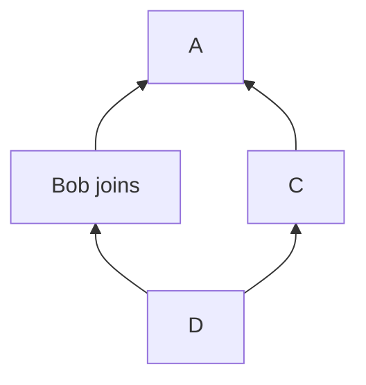

# MSC4115: membership metadata on events

## Background

Consider the following Event DAG:



Bob has joined a room, but at the same time, another user has sent a message
`C`.

Depending on the configuration of the room, Bob's server may serve the event
`C` to Bob's client. However, if the room is encrypted, Bob will not be on the
recipient list for `C` and the sender will not share the message key with Bob,
even though, in an absolute time reference, `C` may have been sent at a later
timestamp than Bob's join.

Unfortunately, there is no way for Bob's client to reliably distinguish events
such as `A` and `C` that were sent "before" he joined (and he should therefore
not expect to decrypt) from those such as `D` that were sent later.

(Aside: there are two parts to a complete resolution of this "forked-DAG"
problem. The first part is making sure that the *sender* of an encrypted event
has a clear idea of who was a member at the point of the event; the second part
is making sure that the *recipient* knows whether or not they were a member at
the point of the event and should therefore expect to receive keys for it. This
MSC deals only with the second part. The whole situation is discussed in more
detail at https://github.com/element-hq/element-meta/issues/2268.)

A similar scenario can arise even in the absence of a forked DAG: clients
see events sent when the user was not in the room if the room has [History
Visibility](https://spec.matrix.org/v1.10/client-server-api/#room-history-visibility)
set to `shared`. (This is fairly common even in encrypted rooms, partly because
that is the default state for new rooms even using the `private_chat` preset
for the [`/createRoom`](https://spec.matrix.org/v1.10/client-server-api/#post_matrixclientv3createroom)
request, and also because history-sharing solutions such as
[MSC3061](https://github.com/matrix-org/matrix-spec-proposals/pull/3061) rely
on it.)

As a partial solution to the forked-DAG problem, which will also solve the
problem of historical message visibility, we propose a mechanism for servers to
inform clients of their room membership at each event.

## Proposal

The `unsigned` structure contains data added to an event by a homeserver when
serving an event over the client-server API.  (See
[specification](https://spec.matrix.org/v1.9/client-server-api/#definition-clientevent)).

We propose adding a new optional property, `membership`. If returned by the
server, it MUST contain the membership of the user making the request,
according to the state of the room at the time of the event being returned. If
the user had no membership at that point (ie, they had yet to join or be
invited), `membership` is set to `leave`.  Any changes caused by the event
itself (ie, if the event itself is a `m.room.member` event for the requesting
user) are *included*.

In other words: servers MUST follow the following algorithm when populating
the `unsigned.membership` property on an event E and serving it to a user Alice:

1. Consider the room state just *after* event E landed (accounting for E
   itself, but not any other events in the DAG which are not ancestors of E).
2. Within the state, find the event M with type `m.room.member` and `state_key`
   set to Alice's user ID.
3. * If no such event exists, set `membership` to `leave`.
   * Otherwise, set `membership` to the value of the `membership` property of
     the content of M.

It is recommended that homeservers SHOULD populate the new property wherever
practical, but they MAY omit it if necessary (for example, if calculating the
value is expensive, servers might choose to only implement it in encrypted
rooms). Clients MUST in any case treat the new property as optional.

For the avoidance of doubt, the new `membership` property is added to all
Client-Server API endpoints that return events, including, but not limited to,
[`/sync`](https://spec.matrix.org/v1.9/client-server-api/#get_matrixclientv3sync),
[`/messages`](https://spec.matrix.org/v1.9/client-server-api/#get_matrixclientv3roomsroomidmessages),
[`/state`](https://spec.matrix.org/v1.9/client-server-api/#get_matrixclientv3roomsroomidstate),
and deprecated endpoints such as
[`/events`](https://spec.matrix.org/v1.9/client-server-api/#get_matrixclientv3events)
and
[`/initialSync`](https://spec.matrix.org/v1.9/client-server-api/#get_matrixclientv3events).


Example event including the new property, as seen in the response to a request made by `@user:example.org`:

```json5
{
  "content": {
    "membership": "join"
  },
  "event_id": "$26RqwJMLw-yds1GAH_QxjHRC1Da9oasK0e5VLnck_45",
  "origin_server_ts": 1632489532305,
  "room_id": "!jEsUZKDJdhlrceRyVU:example.org",
  "sender": "@example:example.org",
  "state_key": "@example:example.org",
  "type": "m.room.member",
  "unsigned": {
    "age": 1567437,
    // @user:example.org's membership at the time this event was sent 
    "membership": "leave",
    "redacted_because": {
      "content": {
        "reason": "spam"
      },
      "event_id": "$Nhl3rsgHMjk-DjMJANawr9HHAhLg4GcoTYrSiYYGqEE",
      "origin_server_ts": 1632491098485,
      "redacts": "$26RqwJMLw-yds1GAH_QxjHRC1Da9oasK0e5VLnck_45",
      "room_id": "!jEsUZKDJdhlrceRyVU:example.org",
      "sender": "@moderator:example.org",
      "type": "m.room.redaction",
      "unsigned": {
        // @user:example.org's membership at the time the redaction was sent
        "membership": "join",
        "age": 1257
      }
    }
  }
}
```

## Potential issues

None foreseen.

## Alternatives

1. https://github.com/element-hq/element-meta/issues/2268#issuecomment-1904069895
   proposes use of a Bloom filter — or possibly several Bloom filters — to
   mitigate this problem in a more general way. It is the opinion of the author of
   this MSC that there is room for both approaches.

2. We could attempt to calculate the membership state on the client side. This
   might help in a majority of cases, but it will be unreliable in the presence
   of forked DAGs. It would require clients to implement the [state resolution
   algorithm](https://spec.matrix.org/v1.10/rooms/v11/#state-resolution), which
   would be prohibitively complicated for most clients.

## Security considerations

None foreseen.

## Unstable prefix

While this proposal is in development, the name `io.element.msc4115.membership`
MUST be used in place of `membership`.

## Dependencies

None.
