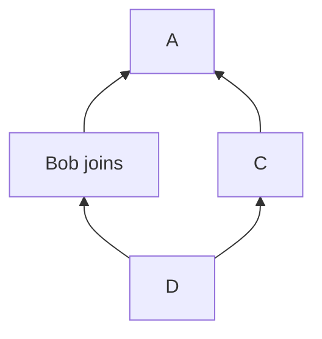

# MSC4115: membership metadata on events

## Background

Consider the following Event DAG:



Bob has joined a room, but at the same time, another user has sent a message
`C`.

Depending on the configuration of the room, Bob's server may serve the event
`C` to Bob's client. However, if the room is encrypted, Bob will not be on the
recipient list for `C` and the sender will not share the message key with Bob,
even though, in an absolute time reference, `C` may have been sent at a later
timestamp than Bob's join.

Unfortunately, there is no way for Bob's client to reliably distinguish events
such as `A` and `C` that were sent "before" he joined (and he should therefore
not expect to decrypt) from those such as `D` that were sent later.

This issue is discussed in more detail at
https://github.com/element-hq/element-meta/issues/2268.

As a partial solution to this problem, we propose a mechanism for servers to
inform clients of room membership at each event.

## Proposal

The `unsigned` structure contains data added to an event by a homeserver when
serving an event over the client-server API.  (See
[specification](https://spec.matrix.org/v1.9/client-server-api/#definition-clientevent)).

We propose adding a new property, `membership`, which should contain the
membership of the user making the request, according to the state of the room
at the time of the event being returned. If the user had no membership at that
point (ie, they had yet to join or be invited), `membership` is set to `leave`.
Any changes caused by the event itself (ie, if the event itself is a
`m.room.member` event for the requesting user) are *excluded*.

In other words: servers should follow the following algorithm when serving an
event E to a user Alice:

1. Consider the room state just *before* event E landed (accounting for state
   resolution accross E's `prev_events`, but not E itself).
2. Within the state, find the event M with type `m.room.member` and `state_key`
   set to Alice's user ID.
3. * If no such event exists, set `membership` to `leave`.
   * Otherwise, set `membership` to the value of the `membership` property of
     the content of M.

The new property should be *required* for all servers implementing a version of
the spec that includes this MSC. However, clients needing to maintain
compatibility with earlier versions of the spec will need to consider it as
optional.

For the avoidance of doubt, the new `membership` property is added to all
Client-Server API endpoints that return events, including
[`/sync`](https://spec.matrix.org/v1.9/client-server-api/#get_matrixclientv3sync),
[`/messages`](https://spec.matrix.org/v1.9/client-server-api/#get_matrixclientv3roomsroomidmessages),
[`/state`](https://spec.matrix.org/v1.9/client-server-api/#get_matrixclientv3roomsroomidstate),
and deprecated endpoints such as
[`/events`](https://spec.matrix.org/v1.9/client-server-api/#get_matrixclientv3events)
and
[`/initialSync`](https://spec.matrix.org/v1.9/client-server-api/#get_matrixclientv3events).


Example event including the new property:

```json
{
  "content": {
    "membership": "join"
  },
  "event_id": "$26RqwJMLw-yds1GAH_QxjHRC1Da9oasK0e5VLnck_45",
  "origin_server_ts": 1632489532305,
  "room_id": "!jEsUZKDJdhlrceRyVU:example.org",
  "sender": "@example:example.org",
  "state_key": "@user:example.org",
  "type": "m.room.member",
  "unsigned": {
    "age": 1567437,
    "membership": "leave",
    "redacted_because": {
      "content": {
        "reason": "spam"
      },
      "event_id": "$Nhl3rsgHMjk-DjMJANawr9HHAhLg4GcoTYrSiYYGqEE",
      "origin_server_ts": 1632491098485,
      "redacts": "$26RqwJMLw-yds1GAH_QxjHRC1Da9oasK0e5VLnck_45",
      "room_id": "!jEsUZKDJdhlrceRyVU:example.org",
      "sender": "@moderator:example.org",
      "type": "m.room.redaction",
      "unsigned": {
        "membership": "leave",
        "age": 1257
      }
    }
  }
}
```

## Potential issues

 * Depending on server implementation, it may be expensive or difficult to
   implement? Feedback welcome from HS authors on this point.

## Alternatives

https://github.com/element-hq/element-meta/issues/2268#issuecomment-1904069895
proposes use of a Bloom filter — or possibly several Bloom filters — to
mitigate this problem in a more general way. It is the opinion of the author of
this MSC that there is room for both approaches.

## Security considerations

None foreseen.

## Unstable prefix

While this proposal is in development, the name `io.element.msc4115.membership`
should be used in place of `membership`.

## Dependencies

None.
