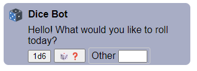

# MSC4139: Bot buttons & conversations

Nearly all bots and bridges in the Matrix ecosystem use a text-based interface to support their
operations. These interfaces are typically highly structured commands and require the user to know
the entire incantation for the action they want to invoke, making them feel like "power user"
features.

Further, interacting with bots today is extremely transactional: the user sends a command and the
bot performs the action as-is or spews errors back at the user due to a typo. If an error was
returned, the entire command needs to be re-run.

A more user-friendly approach is to have the user provide the bot with information as needed,
without having to guess at the bot's current state. This proposal calls such an approach a
"conversation" with the bot - the user does something to "start" the conversation, and the bot
provides a limited set of prompts to continue the conversation. This repeats until the conversation
ends (usually by the bot saying so explicitly). Users may hold multiple concurrent conversations
with bots. Conversation starters are deliberately left as a bot implementation detail in this
proposal to allow the ecosystem to explore this new interaction technique. Examples may include the
user opening a DM with the bot, sending a `!command` message, or, in future, sending a slash command
like `/start`.

This conversation approach is heavily inspired by platforms like Telegram.

## Proposal

A new `m.prompts` [mixin](https://github.com/matrix-org/matrix-spec-proposals/blob/main/proposals/1767-extensible-events.md#mixins-specifically-allowed)
is specified which describes actions another user in the room can take to further the conversation.

The `m.prompts` mixin contains some scoping parameters, rendering hints, and the actual prompts
themselves. For example, when applied to an `m.message` event, the `m.prompts` may look like the
following:

*Note*: The JSON comments are normative, and irrelevant fields are not shown.

```jsonc
{
  "type": "m.message",
  "sender": "@bot:example.org",
  "content": {
    "m.text": [
      {"body": "Hello! Say <code>!roll [dice]</code> to roll some dice.", "mimetype": "text/html"},
      {"body": "Hello! Say `!roll [dice]` to get started."}
    ],
    "m.prompts": {
      // Clients which recognize `m.prompts` would use `intro` to render the event instead. This
      // allows the remainder of the event to be a fallback for unsupported clients.
      "intro": {
        "type": "m.message",
        "content": {
          "m.text": [
            {"body": "Hello! What would you like to roll today?"}
          ]
        }
      },
      // These are the users who should see the `prompts`. Other users may see something like "you
      // do not have permission to reply to this message" instead of prompts. `scope` is optional:
      // when not supplied, all users who can see the message can respond. When an empty array, no
      // one can respond. Clients SHOULD NOT show prompts to users who are descoped.
      "scope": [
        "@alice:example.org",
        "@bob:example.org",
      ],
      // These are the options a user has. Note the 2 distinct types and 3 label approaches.
      "prompts": [
        {
          // `type` is the prompt type: "preset" (show a button) or "input" (shown below)
          "type": "preset",
          // `id` is used by the bot to figure out what prompt the user picked. It is an opaque ID.
          "id": "1d6",
          // `label` is an extensible event with deliberately no `type`.
          "label": {
            "m.text": [{"body": "1 six sided die"}]
          }
        }, {
          "type": "preset",
          "id": "surprise",
          "label": {
            // This should render as an image event, hopefully
            // Requires https://github.com/matrix-org/matrix-spec-proposals/pull/3552
            "m.text": [{"body": "🎲❓"}], // fallback
            "m.file": {
              "url": "mxc://example.org/abc123"
            },
            "m.image_details": {
              // Clients should impose maximums and minimums here.
              "width": 16,
              "height": 16
            },
            "m.alt_text": {
              "m.text": [{"body": "An image of a 6 sided die with a red question mark over it"}]
            }
          }
        }, {
          "type": "input",
          "id": "custom",
          // Regex the client can use to test input locally. Optional - if not provided the client
          // should accept *any* input, including an empty string.
          "validator": "[0-9]+d[0-9]+", // `2d20`, etc
          "label": {
            "m.text": [{"body": "Other"}]
          }
        }
      ]
    }
  }
}
```

In this example, clients which don't support the mixin will see the old-style `!roll 2d6` help text,
allowing the user to continue interacting if needed. Over time, bots may wish to drop this fallback
style and instead use a message like `Hello! Your client doesn't support talking to me :(`.

Clients which do support `m.prompts` will instead render the `intro` object as the event. It's not
required that the `intro.type` matches the top level event `type`, though it is considered good
practice to do so. The `intro` block is primarily intended to allow senders to tailor their message
for supported clients, as the intent for this proposal is to discourage commands like `!roll` where
possible.

Prompts SHOULD be rendered in order of the array, and appear below the `intro` rendering. Buttons
SHOULD be used for `preset` prompts, using the provided `label`, and text inputs with `label` as a
prefix or placeholder, and validation per `validator`, SHOULD be used for `input` prompts. For
example:



[Codepen](https://codepen.io/turt2live/pen/gOyVvaY) (note: doesn't do validation)

The user is then able to click on one of the buttons or submit text through the `input` option. That
reply looks as follows:

```jsonc
{
  "type": "m.conversation.reply",
  "sender": "@alice:example.org",
  "content": {
    "m.in_reply_to": { // TODO: Change to match Extensible Event replies
      "event_id": "$previousMessage",
      "rel_type": "m.thread" // yes, we use threads!
    },
    // Whichever option the user clicked is described here in a new content block.
    "m.used_prompt": {
      "id": "surprise"
    },
    // We then add all the fallback representations. For `preset` prompts, this is typically just
    // the `label` verbatim. `input` prompts may require some creative editing, like "Other: 2d20".
    "m.text": [{"body": "🎲❓"}], // fallback for the image
    "m.file": {
      "url": "mxc://example.org/abc123"
    },
    "m.image_details": {
      "width": 16,
      "height": 16
    },
    "m.alt_text": {
      "m.text": [{"body": "An image of a 6 sided die with a red question mark over it"}]
    }
  }
}
```

The bot can then process this and continue the conversation as needed, using more `m.prompts` mixins
to get the information it needs from the user. If the bot considers the conversation/thread to be
complete, it sends an event with no `m.prompts` mixin to the thread. In our example of a dice bot,
this could be the result of the roll.

Once a user has picked (and sent) a prompt, the client SHOULD disable the user's ability to send
another. This could be done by hiding all options, or using the HTML `disabled` attribute.

The example dice bot would then start a new conversation by sending a new welcome message, likely
with different text to feel less mechanical. For example: "What are we rolling next? [1d6] [...]".

It is left as a bot implementation detail to handle multiple responses, responses from descoped
users, and invalid input. Typically this would be handled by the bot using a threaded reply to the
sender saying "sorry, you don't have permission to interact here" or "sorry, I didn't catch that.
[same prompts as original message]".

## Potential issues

TODO

## Alternatives

[MSC3006](https://github.com/matrix-org/matrix-spec-proposals/pull/3006) is very similar to this
proposal. Instead of starting per-message threads, it defines interactions via a state event. This
makes MSC3006 more akin to a "conversation starter" replacement, to use this MSC's terminology.

## Security considerations

TODO

## Unstable prefix

While this proposal is not considered stable, clients should use `org.matrix.msc4139.` in place of
`m.` in all identifiers.

TODO: Language to support usage in room versions without Extensible Events support, similar to
[MSC3381: Polls](https://github.com/matrix-org/matrix-spec-proposals/blob/main/proposals/3381-polls.md).

## Dependencies

This MSC has no direct dependencies.
