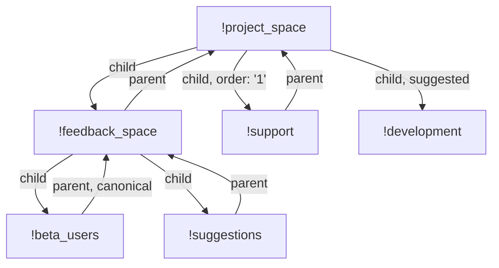

# MSC4168: Update `m.space.*` state on room upgrade

When a [room upgrade](https://spec.matrix.org/v1.11/client-server-api/#room-upgrades) is performed,
many state events are copied over to the new room, to minimize the amount of work the user has to do
after the upgrade. However, the spec doesn't currently recommend that `m.space.child` or `m.space.parent`
be copied over, as well as these events being updated in other rooms.

## Proposal

In the following sentences, "relevant space state events" refer to `m.space.parent` events for all
room types, in addition to `m.space.child` events for rooms with a type of
[`m.space`](https://spec.matrix.org/v1.16/client-server-api/#types).

Additionally, for both event types, homeserver implementations MAY remove the `via` field of the
event pointing to the previous room, to signal to clients that they shouldn't join the upgraded
room.

When a room upgrade is performed, servers SHOULD copy relevant space state events from the old room
to the new room. The sender field in the new event should be set to the user who performed the
upgrade.

In addition, servers SHOULD create new relevant space state events pointing to the upgraded room in
rooms that reference the old room (in their `state_key` field). In practice, this means:
- For `m.space.child` events, a new `m.space.child` event with `state_key` set to the new room's ID
  should be sent, copying the `order` and `suggested` field from the `content` of the
  `m.space.child` with `state_key` of the previous room ID.
- For `m.space.parent` events, a new `m.space.parent` event with `state_key` set to the new room's
  ID should be sent. If the space event pointing to the room to be upgraded has `canonical` set to
  `true` in `content`, homeservers SHOULD update that space event to set `canonical` to `false`,
  while setting it to   `true` in the space event pointing to the new room.

Note that this will only be possible in rooms where the upgrading
user (or any other user on the same homeserver, if the implementation decides to use any user it
can) has the power to do so.

The `via` field of each new relevant space state event pointing to the upgraded room SHOULD only
contain the server name of the server doing the upgrade, regardless of its previous content. This is
because the server's listed in the previous `via` field may not have joined the upgraded room yet,
and thus servers may not be able to join through them.

### Examples
Given the following initial rooms:


Here is the changed & new state after (assuming a user on `example.org` is upgrading the following rooms):
### Upgrading `!project_space` to `!upgraded_project_space`

#### `!upgraded_project_space`:
```diff
+{
+    "type": "m.space.child",
+    "state_key": "!feedback_space",
+    "content": {
+        "via": ["example.org", "another.domain", "yet-another.domain"]
+    }
+}
+{
+    "type": "m.space.child",
+    "state_key": "!support",
+    "order": "1",
+    "content": {
+        "via": ["example.org", "another.domain", "yet-another.domain"]
+    }
+}
+{
+    "type": "m.space.child",
+    "state_key": "!development",
+    "suggested": true,
+    "content": {
+        "via": ["example.org", "another.domain", "yet-another.domain"]
+    }
+}
```

#### `!feedback_space` & `!support`:
```diff
+{
+    "type": "m.space.parent",
+    "state_key": "!upgraded_project_space",
+    "content": {
+        "via": ["example.org"]
+    }
+}
```

Additionally, if the server implementation decides to remove the previous space's `via`:

```diff
 {
     "type": "m.space.parent",
     "state_key": "!project_space",
-    "content": {
-        "via": ["example.org", "another.domain", "yet-another.domain"]
-    }
+    "content": {}
 }
```

### Upgrading `!support` to `!upgraded_support`

#### `!upgraded_support`:
```diff
+{
+    "type": "m.space.parent",
+    "state_key": "!project_space",
+    "content": {
+        "via": ["example.org", "another.domain", "yet-another.domain"]
+    }
+}
```

#### `!project_space`:
```diff
+{
+    "type": "m.space.child",
+    "state_key": "!upgraded_support",
+    "order": "1",
+    "content": {
+        "via": ["example.org"]
+    }
+}
```

Additionally, if the server implementation decides to remove the previous room's `via`:

```diff
 {
     "type": "m.space.child",
     "state_key": "!support",
     "order": "1",
-    "content": {
-        "via": ["example.org", "another.domain", "yet-another.domain"]
-    }
+    "content": {}
 }
```

### Upgrading `!feedback_space` to `!upgraded_feedback_space`

#### `!project_space`:
```diff
+{
+    "type": "m.space.child",
+    "state_key": "!upgraded_feedback_space",
+    "content": {
+        "via": ["example.org"]
+    }
+}
```

Additionally, if the server implementation decides to remove the previous space's `via`:

```diff
 {
     "type": "m.space.child",
     "state_key": "!feedback_space",
-    "content": {
-        "via": ["example.org", "another.domain", "yet-another.domain"]
-    }
+    "content": {}
 }
```

#### `!upgraded_feedback_space`:
```diff
+{
+    "type": "m.space.child",
+    "state_key": "!beta_users",
+    "content": {
+        "via": ["example.org", "another.domain", "yet-another.domain"]
+    }
+}
+{
+    "type": "m.space.child",
+    "state_key": "!suggestions",
+    "content": {
+        "via": ["example.org", "another.domain", "yet-another.domain"]
+    }
+}
+{
+    "type": "m.space.parent",
+    "state_key": "!project_space",
+    "content": {
+        "via": ["example.org", "another.domain", "yet-another.domain"]
+    }
+}
```

#### `!beta_users`:
```diff
+{
+    "type": "m.space.parent",
+    "state_key": "!upgraded_feedback_space",
+    "canonical": true,
+    "content": {
+        "via": ["example.org"]
+    }
+}
 {
     "type": "m.space.parent",
     "state_key": "!feedback_space",
-    "canonical": true,
     "content": {
         "via": ["example.org", "another.domain", "yet-another.domain"]
     }
 }
```

Additionally, if the server implementation decides to remove the previous space's `via`:

```diff
 {
     "type": "m.space.parent",
     "state_key": "!feedback_space",
-    "content": {
-        "via": ["example.org", "another.domain", "yet-another.domain"]
-    }
+    "content": {}
 }
```

#### `!suggestions`:
```diff
+{
+    "type": "m.space.parent",
+    "state_key": "!upgraded_feedback_space",
+    "content": {
+        "via": ["example.org"]
+    }
+}
```

Additionally, if the server implementation decides to remove the previous space's `via`:

```diff
 {
     "type": "m.space.parent",
     "state_key": "!feedback_space",
-    "content": {
-        "via": ["example.org", "another.domain", "yet-another.domain"]
-    }
+    "content": {}
 }
```

## Potential issues

This proposal does not attempt to update `m.space.*` state in rooms where the user upgrading the room
is not able to update them, as this not only likely requires something like
[MSC4049](https://github.com/matrix-org/matrix-spec-proposals/pull/4049), but also adds other additional
complications (e.g. which server should update the state?).

Users may also not want to update events in other rooms. Hopefully this proposal can be used to determine
if there is a use-case for not updating events in other rooms. If there is one, then a query parameter can
be added to toggle this feature.

## Alternatives

As above, utilizing [MSC4049](https://github.com/matrix-org/matrix-spec-proposals/pull/4049) to update
`m.space.*` events in other rooms could be an alternative, but due to additional complications in addition
to requiring this MSC to be merged, it is deemed as not the best solution (for now).

## Security considerations

None considered.

## Unstable prefix

None required, as currently no new endpoints or fields are being proposed.

## Dependencies

None.
