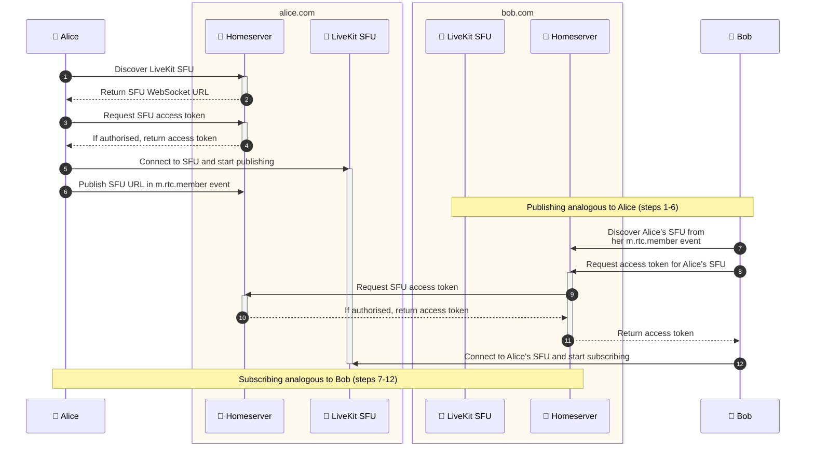
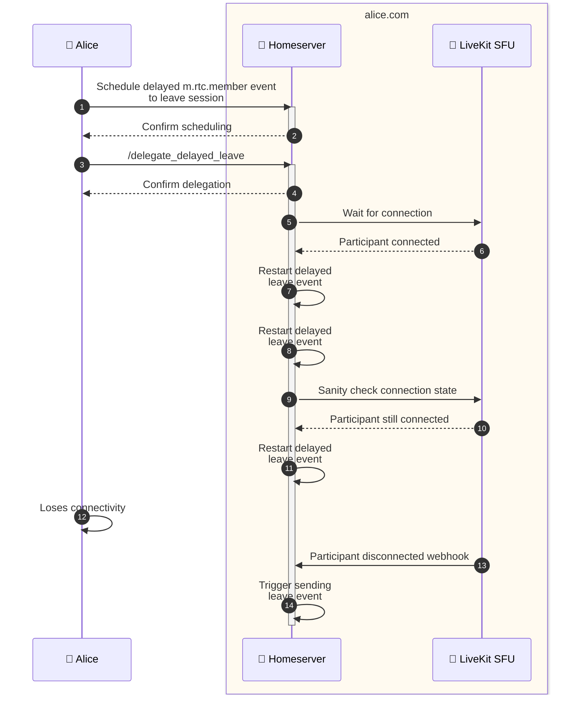

# MSC4195: LiveKit transport for MatrixRTC

[MSC4143] introduces MatrixRTC as an extensible framework for real-time communication in Matrix.
MatrixRTC uses so called transports to transfer the actual RTC data between RTC members. This
proposal introduces an OPTIONAL transport based on the [LiveKit] Selective Forwarding Unit (SFU).
The SFU intelligently relays RTC data between members without them having to connect to each other
directly.

The LiveKit SFU is integrated into Matrix in a multi-SFU configuration. In this setup, a homeserver
may operate one or more SFUs. RTC members always publish their RTC data to a local SFU managed by
their homeserver and announce their SFU choice via their `m.rtc.member` event. Other members then
subscribe to the RTC data on the publishing member's SFU – which might be different from the SFU
they're publishing on themselves. The homeserver provides mechanisms for discovering local SFUs
and for acquiring access tokens for both local and remote SFUs. This approach removes the need for
an SFU election process and allows servers to guard access to their SFUs.

The example below illustrates how two members from different homeservers A and B publish and
subscribe to each other's RTC streams.

```
                  ┌─────────────────────────────────┐
          ┌───────┤            Client A             │◀──────┐
          │       └──┬──────────────────────────────┘       │
          │          │                                      │
  publish │          │ discover SFU                         │ subscribe
          │          │ get SFU authorisation                │
          │          │                                      │
          ▼          ▼                                      │
      ┌───────┐ ┌──────────┐   federation  ┌──────────┐ ┌───┴───┐
      │ SFU A │ │ Server A │◀─────────────▶│ Server B │ │ SFU B │
      └───┬───┘ └──────────┘               └──────────┘ └───────┘
          │                                      ▲          ▲
          │                                      │          │
subscribe │                         discover SFU │          │ publish
          │                get SFU authorisation │          │
          │                                      │          │
          │       ┌──────────────────────────────┴──┐       │
          └──────▶│            Client B             ├───────┘
                  └─────────────────────────────────┘
```

[MSC4143]: https://github.com/matrix-org/matrix-spec-proposals/pull/4143
[LiveKit]: https://github.com/livekit/livekit

## Proposal

### Discovering and announcing transports

A new transport type `m.livekit` is introduced. Homeservers that support this transport announce it
to clients by including a dedicated object in the response of the `/_matrix/client/v1/rtc/transports`
endpoint from [MSC4143]. The object has the following schema:

- `type` (required, string): The transport's type identifier. MUST be `m.livekit`.
- `url` (required, string): The SFU's WebSocket URL. Clients use this URL to connect to the SFU
  via one of LiveKit's [client SDKs].

Below is an example of a response from `/_matrix/client/v1/rtc/transports`:

```json5
{
  "transports": [{
    "type": "m.livekit",
    "url": "wss://livekit.example.com"
  }]
}
```

Once a client decides to publish media under a discovered transport, it includes the same object
in the `transports.published` array of its respective `m.rtc.member` event. This gives other clients
in the same RTC slot, the information required to subscribe to the published media.

Below is an example of an appropriate membership event:

```json5
{
  "type": "m.rtc.member",
  "sender": "@alice:alice.com",
  "content": {
    "slot_id": "the_id",
    "member": {
      "id": "xyzABCDEF10123",
      "membership": "join"
    },
    "application": {
      ...
    },
    "transports": {
      "published": [{
        "type": "m.livekit",
        "url": "wss://livekit.example.com"
      }],
      "can_subscribe": [ "m.livekit" ]
    },
    "sticky_key": "xyzABCDEF10123"
  },
  ...
}
```

[client SDKs]: https://docs.livekit.io/transport/sdk-platforms/

### Mapping MatrixRTC members to LiveKit

LiveKit encapsulates RTC sessions in so-called [LiveKit rooms]. Within a LiveKit room,
[LiveKit participants] use a WebSocket signaling connection that is guarded with an
access token. Publishing and subscribing to RTC streams then happens over WebRTC (see
[here] for further details). A LiveKit room is identified by a unique room "name" string
while a LiveKit participant is identified by a unique "identity" string. These LiveKit
primitives need to be mapped to the `m.rtc.member` events for MatrixRTC members from
[MSC4143].

#### LiveKit room names

LiveKit room names are derived by homeservers and shared with clients as part of the
LiveKit access token issued by the homeserver (see [below]). To ensure a baseline of
pseudonymity and avoid exposing unnecessary metadata to the SFU, the derivation is
performed using the following steps:

1. Construct a JSON array containing the `room_id` and `slot_id` of the `m.rtc.member`
   event (in that precise order).
1. Perform a [Canonical JSON] serialization of the array.
1. Take the UTF-8 encoding of the canonicalization output and hash it with SHA-256.
1. Encode the result using [unpadded base64].

```
livekit_room_name = Base64( SHA256( Canonicalize( [ room_id, slot_id ] ) ) )
```

This procedure ensures that each MatrixRTC slot unambiguously maps to one LiveKit room on
each involved SFU. As a result, the number of connections (WebSocket + WebRTC) required to
participate in an RTC session scales with the number of participating SFUs which should
commonly mean the number of participating homeservers. This is much more efficient for
clients compared to using separate LiveKit rooms per MatrixRTC member where the number
of required connections would scale with the number of session members.

For improved metadata protection, servers MAY add a `salt` generated from a cryptographically
secure random number generator to the input JSON array when deriving LiveKit room names.

```
livekit_room_name = Base64( SHA256( Canonicalize( [ room_id, slot_id, salt ] ) ) )
```

The value of `salt` MUST be persisted on the server and SHOULD be rotated once all
LiveKit participants have left the LiveKit room. This ensures that a different LiveKit
room is used for the next MatrixRTC session in the same slot and further reduces the
amount of metadata exposed to the SFU.

#### LiveKit participant identities

LiveKit participant identities are derived by both homeservers and clients. Homeservers require
the identity to generate LiveKit access tokens (see [below]). Clients use the identity to map
MXIDs to LiveKit participants. To avoid exposing unnecessary metadata to the SFU, the derivation
process uses the following steps:

1. Construct a JSON array containing the `sender` and `member.id` properties from the `m.rtc.member`
   event (in that precise order).
1. Perform a [Canonical JSON] serialization of the array.
1. Take the UTF-8 encoding of the canonicalization output and hash it with SHA-256.
1. Encode the result using [unpadded base64].

```
livekit_participant_identity = Base64( SHA256( Canonicalize( [ sender, member.id ] ) ) )
```

Note that `sender` is included here because according to [MSC4143], member IDs are unique per
member and session for a single user only. Due to these uniqueness properties, additional salting
is not required here.

[LiveKit rooms]: https://docs.livekit.io/intro/basics/rooms-participants-tracks/rooms/
[LiveKit participants]: https://docs.livekit.io/intro/basics/rooms-participants-tracks/participants/
[below]: #acquiring-livekit-access-tokens
[Canonical JSON]: https://spec.matrix.org/v1.19/appendices/#canonical-json
[unpadded base64]: https://spec.matrix.org/v1.19/appendices/#unpadded-base64

### Acquiring LiveKit access tokens

As mentioned above, WebSocket connections to LiveKit rooms are needed for publishing and subscribing
to RTC streams. The LiveKit SFU requires an access token in the form of a JWT for these connections.
In order to enable additional access control checks, responsibility for issuing these tokens is
assigned to home servers.

Servers can [generate] the tokens by using one of the LiveKit SDKs and inputting a set of parameters
including the LiveKit room name and the LiveKit participant identifier. The procedure also requires
secrets agreed upon between the homeserver and the respective SFU. This means homeservers can
only generate tokens for their own SFUs. To allow clients to request tokens for both local and
remote SFUs, a new pair of authenticated Client-Server and Server-Server endpoints is introduced:

- `POST /_matrix/client/v1/rtc/livekit/get_token`
- `POST /_matrix/federation/v1/rtc/livekit/get_token`

The server SHOULD apply rate limiting to both of these endpoints.

To request a token, a client `POST`s to the `/get_token` client endpoint including in the body a JSON object with the
following schema:

- `server_name` (string): The [server name](https://spec.matrix.org/v1.19/appendices/#server-name)
  for which a token is requested. Defaults to the server's own server name if omitted.
- `url` (required, string): The WebSocket URL of the LiveKit SFU for which a token is requested.
- `room_id` (required, string): The ID of the room in which the associated MatrixRTC session is
  taking place.
- `slot_id` (required, string): The ID of the slot in which the associated MatrixRTC session is
  taking place.
- `member_id` (required, string): The `member.id` property of the requesting user's own `m.rtc.member`
  event.

As mentioned before, clients always publish RTC media on a local SFU. Consequently, when requesting
a token for publishing, the client uses its own server name for `server_name` and the WebSocket URL
discovered from `/_matrix/client/v1/rtc/transports` for `url`.

For subscribing to RTC media, clients need to connect to the publisher's chosen local SFU – which
might be on a different server. In this case, the subscribing client derives the `server_name` and
`url` parameters needed in the token request from the publisher's `m.rtc.member` event. In particular,
`server_name` is obtained by parsing the event's `sender` and `url` is taken from the respective
`transports` array element in the event.

Note that as explained [later], tokens always include the grant required for subscribing. This means
that a token obtained for publishing on a local SFU also allows the bearer to subscribe to RTC streams
in the same LiveKit room on that SFU. As a result, clients only need to issue one token request per
SFU involved in the session.

Below is an example of a token request for the `m.rtc.member` example given further up.

```http
POST /_matrix/client/v1/rtc/livekit/get_token

{
  "server_name": "example.com",
  "url": "wss://livekit.example.com",
  "room_id": "!tDLCaLXijNtYcJZEey:example.com",
  "slot_id": "the_id",
  "member_id": "xyzABCDEF10123"
}
```

Upon receiving the request, the server verifies that the requesting user is joined to the room
identified by `room_id`. If the user is not joined, or the server doesn't know the room, the request
MUST be rejected with HTTP 403 / `M_FORBIDDEN`.

If `server_name` is the server's own name and `url` does not match one of the server's own SFUs,
the request is rejected with HTTP 400 / `M_INVALID_PARAM`.

If `server_name` is the server's own name and `url` matches one of the server's own SFUs, the server
derives the associated LiveKit room name and ensures that the room exists, [creating] it if needed.
This is REQUIRED because otherwise clients won't be able to connect to the room. The server then
generates a token for the SFU and responds with HTTP 200 and a JSON object with a single required
property `jwt` holding the token.

```http
200 OK

{
  "jwt": "thejwt"
}
```

If, conversely, `server_name` points to a remote server, the server triggers a `POST` request to
the `/get_token` federation endpoint on that server. The body of the request contains the same JSON
object received in the client request with the following differences:

- `server_name` is omitted since it is equal to the receiving server's own server name.
- An additional REQUIRED property `user_id` is included and holds the requesting user's Matrix ID.

An example of the request is given below:

```http
POST /_matrix/federation/v1/rtc/livekit/get_token

{
  "user_id": "@alice:alice.com",
  "url": "wss://livekit.example.com",
  "room_id": "!tDLCaLXijNtYcJZEey:example.com",
  "slot_id": "the_id",
  "member_id": "xyzABCDEF10123"
}
```

Upon receiving the request, the remote server verifies that `user_id` belongs to the origin server and
that the user is joined to the room identified by `room_id`. If the user is from another server or not
not joined to the room or if the remote server doesn't know the room, the request MUST be rejected with
HTTP 403 / `M_FORBIDDEN`.

If `url` does not match one of the remote server's own SFUs, the request is rejected with
HTTP 400 / `M_INVALID_PARAM`.

HTTP 403 / `M_FORBIDDEN` and HTTP 400 / `M_INVALID_PARAM` errors from the remote server MUST be relayed
back to the client by the origin server. Any other error MUST result in HTTP 502 / `M_UNKNOWN` in
the client response.

If no errors occurred, the remote server ensures the room exists and generates a token for its SFU,
returning it in the same response format used for the Client-Server endpoint.

```http
200 OK

{
  "jwt": "thejwt"
}
```

The origin server then forwards the token to its client as above.

The sequence chart below illustrates how two users from different homeservers discover SFUs and obtain
tokens for both publishing and subscribing to RTC streams.


```mermaid
sequenceDiagram
    autonumber

    participant U as 🧑 Alice

    box floralwhite alice.com
        participant H as 🏢 Homeserver
        participant L as 📡 LiveKit SFU
    end

    box floralwhite bob.com
        participant L1 as 📡 LiveKit SFU
        participant H1 as 🏢 Homeserver
    end

    participant U1 as 👨 Bob

    U->>H: Discover LiveKit SFU
    activate H
    H-->>U: Return SFU WebSocket URL
    deactivate H

    U->>H: Request SFU access token
    activate H
    H-->>U: If authorised, return access token
    deactivate H

    U->>L: Connect to SFU and start publishing
    activate L

    U->>H: Publish SFU URL in m.rtc.member event

    Note over U1,L1: Publishing analogous to Alice (steps 1-6)

    U1->>H1: Discover Alice's SFU from<br/>her m.rtc.member event

    U1->>H1: Request access token for Alice's SFU
    activate H1
    H1->>H: Request SFU access token
    activate H
    H-->>H1: If authorised, return access token
    deactivate H
    H1-->>U1: Return access token
    deactivate H1

    U1->>L: Connect to Alice's SFU and start subscribing
    deactivate L

    Note over U,H1: Subscribing analogous to Bob (steps 7-12)
```

#### Access token properties

Different properties and grants can be applied when generating tokens using LiveKit's SDKs. Servers need
to ensure these are set appropriately so that clients can connect correctly and securely. In particular,
servers MUST apply the following settings:

- `sub`: The LiveKit participant identity of the user that requested the token, derived as described above.
- `exp`: When using a self-hosted LiveKit SFU, servers SHOULD use a sufficiently short expiration time (`exp`)
  because [token revocation] is a LiveKit Cloud feature only. Otherwise, the expiration time is less
  significant because the SFU [proactively refreshes tokens] via a client's WebSocket signalling connection.
- `nbf`: The current time. This is required because LiveKit Cloud uses the token's not-before (`nbf`)
  timestamp in [token revocation].
- `video.room`: The LiveKit room name, derived as described above.
- `video.roomCreate`: Always `false`. This grant, somewhat [counterintuitively], also allows the token
  holder to delete the LiveKit room which includes kicking all joined participants. Since this is a possible
  denial-of-service vector, room creation is exclusively and preemptively performed by the homeserver as
  described above.
- `video.roomJoin`: Always `true`. This enables clients to join the LiveKit room if it exists.
- `video.canPublish`: `true` if the token was requested by a local user. `false` otherwise. This enforces
  the multi-SFU configuration and ensures clients can only publish RTC data on a local SFU.
- `video.canSubscribe`: Always `true`. This lets clients subscribe to RTC data on both local and
  remote SFUs.
- `video.canUpdateOwnMetadata`: Always `true`. This lets clients update their own metadata. The latter is
  a single string that can store any data.

Below is an example of a LiveKit JWT for a local user:

```json5
{
  "exp": 1726764439,
  "iss": "API2bYPYMoVqjcE",
  "nbf": 1726760839,
  "sub": "{livekit_participant_identity}",
  "video": {
    "room": "{livekit_room_name}",
    "roomCreate": true,
    "roomJoin": true,
    "canPublish": true,
    "canSubscribe": true,
    "canUpdateOwnMetadata": true
  }
}
```

#### Kicking users from the SFU on room leave/ban

A MatrixRTC session is tied to exactly one Matrix room and exactly one LiveKit room per SFU involved
in the session. Access to LiveKit rooms is guarded by LiveKit access tokens. This means that it would
be desirable to couple the lifetime of LiveKit tokens to the period of room membership. This is important
because a malicious user being kicked from a Matrix room could otherwise continue to be connected to an
ongoing RTC session related to the room. To prevent this, servers SHOULD remove any associated LiveKit
participant identities from the related LiveKit rooms when a user leaves or is banned from a Matrix room.
Note that this doesn't obsolete the recommendation to use sufficiently short-lived access tokens in
self-hosted LiveKit deployments given in the previous section.

[generate]: https://docs.livekit.io/frontends/build/authentication/custom/
[later]: #access-token-properties
[creating]: https://docs.livekit.io/reference/other/roomservice-api/#createroom
[token revocation]: https://docs.livekit.io/frontends/reference/tokens-grants/#token-revocation
[proactively refreshes tokens]: https://docs.livekit.io/frontends/reference/tokens-grants/#token-refresh
[counterintuitively]: https://docs.livekit.io/frontends/reference/tokens-grants/#video-grant

### Optional delegated delayed leave events

As described in [MSC4143], clients SHOULD use delayed events as per [MSC4140] to implement a
"deadman switch" for precise MatrixRTC membership tracking. This involves scheduling a delayed
leave event and periodically restarting it. If the client unexpectedly loses connectivity, the
server triggers the sending of the leave event once the delay expires. However, relying on clients
to restart the delayed event can be error-prone in adverse network conditions, particularly due
to TCP connection instability.

The LiveKit SFU, on the other hand, maintains authoritative knowledge of each member's real-time
connection state through its WebSocket connections. Additionally, the SFU is able to trigger
[webhooks] upon connection state changes. These features can be used to create a delegation
mechanism for delayed leave events on the homeserver. A client first schedules its delayed leave
event and then delegates management of the event to its homeserver. The homeserver keeps restarting
the event while the participant is connected to the SFU and triggers sending the event once it finds the
participant disconnected from the SFU. This mechanism allows for higher reliability and accuracy
when compared to client-maintained delayed leave events.

The following sequence diagram illustrates the conceptual procedure which is described in more detail
below.


```mermaid
sequenceDiagram
    autonumber

    participant U as 🧑 Alice

    box floralwhite alice.com
        participant H as 🏢 Homeserver
        participant L as 📡 LiveKit SFU
    end

    U->>H: Schedule delayed m.rtc.member event<br>to leave session
    activate H
    H-->>U: Confirm scheduling
    deactivate H
  
    U->>H: /delegate_delayed_leave
    activate H
    H-->>U: Confirm delegation

    H->>L: Wait for connection
    L-->>H: Participant connected
    
    H->>H: Restart delayed<br>leave event
    H->>H: Restart delayed<br>leave event

    H->>L: Sanity check connection state
    L-->>H: Participant still connected

    H->>H: Restart delayed<br>leave event
  
    U->>U: Loses connectivity
  
    L->>H: Participant disconnected webhook
    H->>H: Trigger sending<br>leave event
    deactivate H
```

Clients delegate delayed leave events to their homeserver by `POST`ing to a new authenticated endpoint
`/_matrix/client/v1/rtc/livekit/delegate_delayed_leave`. The body of the request contains a JSON
object with the following schema:

- `room_id` (required, `string`): The room ID in which the delayed `m.rtc.member` event was scheduled.
- `slot_id` (required, `string`): The contents of the `slot_id` property of the `m.rtc.member` event.
- `member_id` (required, `string`): The `member.id` property of the `m.rtc.member` event.
- `delay_id` (required, `string`): The delayed event ID obtained when scheduling the `m.rtc.member` event.

Below is an example of a request:

```http
POST /_matrix/client/v1/rtc/livekit/delegate_delayed_leave

{
  "room_id": "!tDLCaLXijNtYcJZEey:example.com",
  "slot_id": "the_id",
  "member_id": "id",
  "delay_id": "1234567890"
}
```

When scheduling delayed events that are meant to be delegated, clients SHOULD use a delay of at least
1 hour. This avoids unnecessarily frequent restarts of the delayed event. Servers MAY reject delegation
requests with HTTP 400 / `M_INVALID_PARAM` when the delegated event has a lower timeout.

If the server cannot find the delayed event based on the `delay_id` or if it can find the delayed event
but it belongs to another room or user, the delegation request MUST be rejected with HTTP 400 / `M_INVALID_PARAM`.

Otherwise, the server responds with HTTP 200 and an empty JSON object to confirm the delegation.

```http
200 OK

{}
```

The server then takes the user's Matrix ID (as resolved from the request's access token) as well as the
`room_id`, `slot_id` and `member_id` parameters from the request body to derive the LiveKit room alias
and LiveKit participant identity. The procedure for this was given [earlier].

Following that, the server waits for the participant to connect to the room on the SFU. How long the
server waits before giving up is left as an implementation detail. If the waiting duration exceeds the
delegated event's delay, the server MUST restart the event periodically and with sufficient headroom to
the expiration time.

Once the server observes the LiveKit participant's connection on the SFU, it MUST begin (or continue)
restarting the delayed event periodically – again, with sufficient headroom. The server then continues
to monitor the participant's connection state. Once the server detects that the participant has
disconnected, it MUST trigger the sending of the delegated leave event.

For maximum reliability, it is RECOMMENDED to use a combination of polling and listening to SFU [webhooks]
to monitor for SFU (dis)connections.

The server MUST only maintain a single delegated event per `room_id`, `slot_id`, `member_id` and MXID.
Requests to delegate a different `delay_id` MUST invalidate earlier delegations for the same parameters.

It is RECOMMENDED that servers apply rate limiting to the delegation endpoint.

[MSC4140]: https://github.com/matrix-org/matrix-spec-proposals/pull/4140
[earlier]: #mapping-matrixrtc-members-to-livekit
[webhooks]: https://docs.livekit.io/intro/basics/rooms-participants-tracks/webhooks-events/


### End-to-end encryption

[MSC4143] introduced the `m.per_member` mechanism for letting clients generate a generic per-member secret
that is distributed to other clients via `m.rtc.encryption_key` to-device messages.

```json5
{
  "room_id": "{room_id}",
  "member_id": "{member_id}",
  "media_key": {
    "index": <index>,
    "key": "{encoded_key}",
    "format": "m.base64"
  }
}
```

To map this secret into LiveKit's frame-level [encryption] mechanism, clients use LiveKit's SDKs to implement
a [custom key provider]. The secret in `media_key.key` is then used as the raw byte input to LiveKit's HKDF-based
key derivation function, keyed by `media_key.index` and associated with the respective LiveKit participant identity
derived as described [above].

Clients MUST use a keyring size of 256 when initialising the custom key provider to align with the [0, 255] range
of `media_key.index` as per [MSC4143].

[encryption]: https://docs.livekit.io/transport/encryption/
[custom key provider]: https://docs.livekit.io/transport/encryption/start/#custom-key-provider
[above]: #livekit-participant-identities

## Potential issues

### Client-provided salts for LiveKit room names

The method for mapping MatrixRTC sessions to [LiveKit room names] includes an optional server-side
salt. Instead of doing this on the server, clients could generate this salt to reduce metadata  
shared with the server. This is complicated, however, because it would require clients to coordinate
in order to agree on the same salt. A natural place to maintain the salt with little to no client
coordination is the `m.rtc.slot` state event. While state events are not encryptable, this still
shares the salt with the homeserver, however. Maintaining the salt on the homeserver is a compromise
that leaks some metadata to the homeserver but still hides it from the SFU.

[LiveKit room names]: #livekit-room-names

### Lack of HKDF support in some LiveKit client SDKs

Some LiveKit SDKs currently only support PBKDF2 but don't allow using HKDF. One example of this is
the Flutter SDK (see [livekit/client-sdk-flutter#974](https://github.com/livekit/client-sdk-flutter/issues/974)).
Upstream implementation efforts such as [livekit/rust-sdks#796](https://github.com/livekit/rust-sdks/issues/796)
will be required to close these gaps.

### Lack of per-sender authentication

LiveKit's frame-level encryption is based on [SFrame], which by design does not authenticate the
sender of individual frames. A participant who has obtained another member's current `media_key` —
including a colluding SFU operator — could therefore forge frames that appear to originate from that
member. This is an inherent limitation of SFrame rather than something introduced by this proposal.
Its practical impact is reduced by [MSC4143]'s requirement that clients rotate the key whenever the
set of members joined to a slot changes, which follows the SFrame specification's [own recommendation]
for achieving forward secrecy.

[SFrame]: https://www.ietf.org/archive/id/draft-ietf-sframe-enc-04.html
[not authenticate]: https://www.ietf.org/archive/id/draft-ietf-sframe-enc-04.html#name-no-per-sender-authentication
[own recommendation]: https://www.ietf.org/archive/id/draft-ietf-sframe-enc-04.html#name-key-management-2

### Reliance on the LiveKit protocol implementations

While being open source, LiveKit is developed and maintained by a commercial entity and is not an
open standard. As a result, future development or licensing changes by LiveKit, Inc. could diverge
from Matrix’s goals or limit interoperability. This is mitigated by the following factors:

- Protocol openness: The LiveKit protocol and reference implementation are released under the
  [Apache 2.0 License] which allows for forking and independent evolution. If LiveKit’s direction
  or license were to change, Matrix could adopt the current protocol version and evolve it
  independently under an open governance model.
- No lock-in at the Matrix level: As per [MSC4143], transports in MatrixRTC are a generic abstraction
  that allows defining additional or alternative transport types in the future without breaking
  compatibility.
- Extensibility: Because the LiveKit protocol is open source, nothing prevents the Matrix community
  from implementing additional functionality (such as cascading SFUs or other federation-oriented
  features) on top of the existing protocol if required. While this has been discussed with the
  LiveKit team and they did not object in principle, such extensions are not expected to depend on
  their involvement.
- Implementation pragmatism: The choice of LiveKit is pragmatic and helps accelerate development
  and deployment of a functioning multi-SFU solution without necessarily establishing a permanent
  dependency. The current multi-SFU model also reduces the importance of features such as cascading
  SFUs that might otherwise require protocol changes.

To further reduce the risk and as already mentioned at the beginning of this proposal, the `m.livekit`
transport is made OPTIONAL for implementations. Given that as of writing this is the only available
transport for MatrixRTC, users of implementations that don't implement `m.livekit` will not be able
to use MatrixRTC for now.

[Apache 2.0 License]: https://github.com/livekit/livekit/blob/master/LICENSE

## Alternatives

### Canonical JSON variations

The procedures for deriving LiveKit room names and LiveKit participant identities involve [Canonical JSON].
As an alternative, the hashing inputs could be concatenated with a suitable delimiter such as `|`. This
is prone to delimiter injection, however. As an example, the inputs `("a|b", "c")` and `("a", "b|c")`
both produce the concatenation `"a|b|c"` and, hence, the same hash. Using JSON arrays and Canonical JSON
avoids this problem. Since the Canonical JSON serialisation of string arrays is trivial, this also doesn't
meaningfully increase implementation complexity.

Furthermore, instead of JSON arrays, JSON objects could be used for the hashing inputs. This would reduce
the chances of accidentally using the wrong order of array elements. On the downside, however, the
Canonical JSON serialisation for objects is significantly more complex than for arrays. Overall, this
would likely result in a higher chance of implementation errors.

## Security considerations

### Resource abuse

Homeservers preemptively create LiveKit rooms when SFU tokens are requested by both local and remote
users. Thus, any Matrix room member is able to trigger the creation of an associated LiveKit room.
LiveKit rooms themselves are lightweight, however, and applying rate limiting on the `/get_token`
endpoints further mitigates this problem.

Users publishing and subscribing to RTC data within LiveKit rooms has a larger resource impact
though. Any Matrix room member is able to connect to an associated LiveKit room and subscribe to media
streams. Local room members can also publish media. Again, rate limiting the `/get_token` endpoints
mitigates this concern. Servers MAY apply additional countermeasures such as limiting the maximum
allowed lifetime of LiveKit rooms or restricting SFU access to trusted users and/or servers.

### Reducing metadata leakage to the SFU

With SFUs always being tied to homeservers under this proposal, two principal deployment models exist
on the server side. On the one hand, the SFU can be self-hosted. This means the homeserver operator is
also the SFU operator and hiding metadata known to the homeserver from the SFU has limited value. On
the other hand, the LiveKit deployment can also be outsourced, for instance, by using [LiveKit Cloud].
This introduces another entity with access to only the SFU into the threat model. In order to handle
the latter case, this proposal takes steps to hide metadata known to the homeserver from the SFU where
possible.

For one thing, [LiveKit room names] are pseudonymised which prevents the SFU from learning about room
or slot IDs. If the same slot is used repeatedly for a meeting, the SFU could still apply heuristics to
establish a connection between RTC sessions and the room. The addition of the server-side salt described
above, eliminates this leak, too.

For another, [LiveKit participant identities] are pseudonymised as well which prevents the SFU from
correlating SFU participants with Matrix users. The identity derivation process involves the value of
`member.id` which, as per [MSC4143], is non-deterministic and changed every time a client joins a slot.
As a result, the SFU is unable to track Matrix users across different calls and no further salting is
required.

The LiveKit SFU and the homeserver necessarily form a high trust relationship. In order for the homeserver
to extend SFU access tokens, secrets need to be agreed upon between the homeserver and the SFU. This
is a one-time configuration step, however. No networking is required between the homeserver and the
SFU to generate access tokens.

Apart from this the homeserver relies on the SFU to truthfully respond to connection status checks
and to carry out on-demand room removals. A malicious SFU operator could fake these. Due to the
pseudonymization described above, they would not be able to relate RTC data to Matrix rooms or users,
however. In unencrypted RTC sessions, the SFU operator of course has full access to the RTC streams.

[LiveKit Cloud]: https://cloud.livekit.io
[LiveKit participant identities]: #liveKit-participant-identities

### Side stepping MatrixRTC membership

Given that `m.rtc.member` events are encrypted, the homeserver has no way to verify whether a user
requesting an SFU token has actually joined the slot with the claimed `member_id`. As a result,
room members could subscribe to RTC streams even without sending an RTC member event.

In encrypted rooms, they wouldn't receive the keys needed to decrypt the streams but could still
access metadata. This includes whether participants are publishing audio, video or a screenshare
and whether they are currently speaking (both exposed unencrypted over LiveKit's WebSocket signalling
connection).

In unencrypted rooms, in turn, the published media is accessible directly given that it isn't encrypted.

As a mitigation, [MSC4143] already [includes] a RECOMMENDATION for clients to notify their users
about RTC streams or identities that cannot be mapped to RTC members. For the `m.livekit` transport
this means that clients SHOULD notify users when they observe LiveKit participants for which no
corresponding `m.rtc.member` event exists.

[includes]: https://github.com/matrix-org/matrix-spec-proposals/blob/toger5/matrixRTC/proposals/4143-matrix-rtc.md#unmappable-rtc-streams

### Error handling and information disclosure

Implementations of the `/get_token` endpoint SHOULD take care not to disclose sensitive internal
details through error messages.

Error responses should use generic `errcode` values and short, human-readable `error`
descriptions that are suitable for client display or logging. Specifically:

- Validation or authorisation failures MUST NOT reveal information about whether a particular Matrix
  user, device, or room exists.
- Server-side or federation validation errors SHOULD be reported as `M_UNAUTHORIZED` or `M_FORBIDDEN`
  without including internal validation results or upstream responses.
- Detailed diagnostic information (e.g., reasons for policy rejection, internal stack traces, or
  upstream HTTP responses) MUST NOT be exposed to clients, but MAY be logged on the server side for
  audit and debugging purposes.
- If rate limiting is applied, the inclusion of a numeric `retry_after_ms` value is acceptable, but
  other details of rate limiting policy SHOULD NOT be exposed.

This ensures that error responses remain useful for clients while preventing potential metadata
leakage about users, rooms, or federation trust relationships.

## Unstable prefix

Assuming that this proposal is accepted at the same time as [MSC4143] no unstable prefix is
required for the `m.livekit` type identifier as it will only be accessed via some other unstable
prefix.

Apart from this, the endpoints introduced above should be referred to as follows:

- `/_matrix/client/v1/rtc/livekit/get_token` -> `/_matrix/client/unstable/io.element.msc4195/rtc/livekit/get_token`
- `/_matrix/federation/v1/rtc/livekit/get_token` -> `/_matrix/federation/unstable/io.element.msc4195/rtc/livekit/get_token`
- `/_matrix/client/v1/rtc/livekit/delegate_delayed_leave` -> `/_matrix/client/unstable/io.element.msc4195/rtc/livekit/delegate_delayed_leave`

## Dependencies

This proposal depends on [MSC4143].

## Appendix: hash derivation test vectors

Below are provided verified test vectors for the LiveKit room name and LiveKit participant identity, derived as
described above. Further test vectors can be obtained with the following shell commands.

```sh
printf '%s' "${CANONICAL_JSON}" | openssl dgst -sha256 # SHA-256 (hex)
printf '%s' "${CANONICAL_JSON}" | openssl dgst -sha256 -binary | openssl base64 -A | tr -d '=' # Base64 (unpadded)
```

| Case | Input (logical) | Canonical JSON | SHA-256 (hex) | Base64 (unpadded) |
|------|-----------------|----------------|---------------|-------------------|
| LiveKit room alias (no random bits) | `["!roomid:example.com", "slot1234"]` | `["!roomid:example.com","slot1234"]` | `3bce37ed6dfe8e6ccc563a083f7b4dc1b9be5f11d093688aa4e03b6aac37a927` | `O8437W3+jmzMVjoIP3tNwbm+XxHQk2iKpOA7aqw3qSc` |
| LiveKit room alias (with random bits) | `["!roomid:example.com", "slot123", "random123"]` | `["!roomid:example.com","slot123","random123"]` | `20c78377e2b7308a894c8db4117048adea4a92184e46f7f7abc7f1deb96b8539` | `IMeDd+K3MIqJTI20EXBIrepKkhhORvf3q8fx3rlrhTk` |
| LiveKit participant identity | `["@alice:example.com", "memberABC"]` | `["@alice:example.com","memberABC"]` | `337567b0b5eb91bc480c83573bae2ef0f6731720fd6581624142d1d9db21598b` | `M3VnsLXrkbxIDINXO64u8PZzFyD9ZYFiQULR2dshWYs` |
