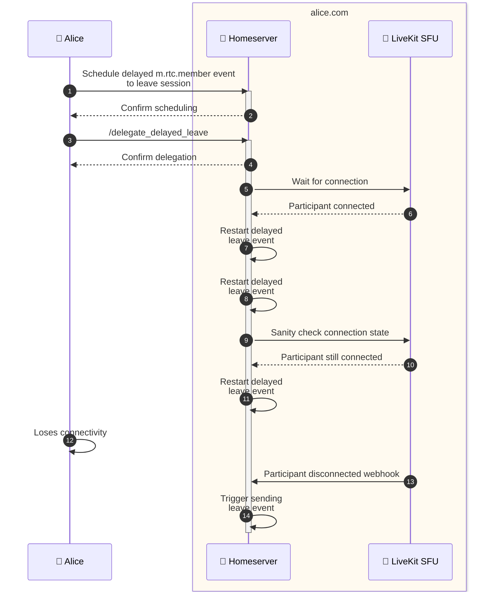

# MSC4195: LiveKit transport for MatrixRTC

[MSC4143] introduces MatrixRTC as an extensible framework for real-time communication in Matrix.
MatrixRTC uses so called transports to transfer the actual RTC data between RTC members. This
proposal introduces a transport based on the [LiveKit] Selective Forwarding Unit (SFU). The SFU
intelligently relays RTC data between members without them having to connect to each other directly.

The LiveKit SFU is integrated into Matrix in a multi-SFU configuration. In this setup, a homeserver
may operate one or more SFUs. RTC members always publish their RTC data to a local SFU and announce
their SFU choice via their `m.rtc.member` event. Other members then subscribe to the RTC data on the
publishing member's SFU – which might be different from the SFU they're publishing on themselves.
The homeserver provides mechanisms for discovering local SFUs and for acquiring access tokens for
both local and remote SFUs. This approach removes the need for an SFU election process and allows
servers to guard access to their SFUs.

The example below illustrates how two members from different homeservers A and B publish and
subscribe to each other's RTC streams.

```
                  ┌─────────────────────────────────┐
          ┌───────┤            Client A             │◀──────┐
          │       └──┬──────────────────────────────┘       │
          │          │                                      │
  publish │          │ discover SFU                         │ subscribe
          │          │ get SFU authorisation                │
          │          │                                      │
          ▼          ▼                                      │
      ┌───────┐ ┌──────────┐   federation  ┌──────────┐ ┌───┴───┐
      │ SFU A │ │ Server A │◀─────────────▶│ Server B │ │ SFU B │
      └───┬───┘ └──────────┘               └──────────┘ └───────┘
          │                                      ▲          ▲
          │                                      │          │
subscribe │                         discover SFU │          │ publish
          │                get SFU authorisation │          │
          │                                      │          │
          │       ┌──────────────────────────────┴──┐       │
          └──────▶│            Client B             ├───────┘
                  └─────────────────────────────────┘
```

[MSC4143]: https://github.com/matrix-org/matrix-spec-proposals/pull/4143
[LiveKit]: https://github.com/livekit/livekit

## Proposal

### Discovering and announcing transports

A new transport type `m.livekit` is introduced. Homeservers that support this transport announce it
to clients by including a dedicated object in the response of the`/_matrix/client/v1/rtc/transports`
endpoint from [MSC4519]. The object has the following schema:

- `type` (required, string): The transport's type identifier. MUST be `m.livekit`.
- `url` (required, string): The SFU's WebSocket URL. This allows differentiating SFUs when the
  server operates more than one SFU.

Below is an example of a response from `/_matrix/client/v1/rtc/transports`:

```json5
{
  "transports": [{
    "type": "m.livekit",
    "url": "ws://livekit.example.com"
  }]
}
```

Once a client decides to publish media under a discovered transport, it includes the same object
in the `transports` array of its respective `m.rtc.member` event. This gives other clients in the
same RTC slot, the information required to subscribe to the published media.

Below is an example of an appropriate membership event:

```json5
{
  "type": "m.rtc.member",
  "content": {
    "slot_id": "the_id",
    "member": {
      "id": "xyzABCDEF10123",
      "membership": "join"
    },
    "application": {
      ...
    },
    "transports": {
      "published": [{
        "type": "m.livekit",
        "url": "ws://livekit.example.com"
      }],
      "can_subscribe": [ "m.livekit" ]
    },
    "sticky_key": "xyzABCDEF10123"
  },
  ...
}
```

[MSC4519]: https://github.com/matrix-org/matrix-spec-proposals/pull/4519

### Mapping MatrixRTC members to LiveKit

LiveKit encapsulates RTC sessions in so called [LiveKit rooms]. Within a LiveKit room,
[LiveKit participants] can publish and subscribe to RTC data streams through a WebSocket
connection that is guarded with an access token. A LiveKit room is identified by a unique
room "name" string while a LiveKit participant is identified by a unique "identity" string.
These LiveKit primitives need to be mapped to the `m.rtc.member` events for MatrixRTC members
from [MSC4143].

#### LiveKit room names

LiveKit room names are derived by homeservers and shared with clients as part of the
LiveKit access token issued by the homeserver (see [below]). To ensures a baseline of
pseudonymity and avoid exposing unnecessary metadata to the SFU, the derivation is
performed using the following steps:

1. Construct a JSON array containing the `room_id` and `slot_id` of the `m.rtc.member`
   event (in that precise order).
1. Perform a [Canonical JSON] serialization of the array.
1. Take the UTF-8 encoding of the canonicalization output and hash it with SHA-256.
1. Encode the result using [unpadded base64].

```
livekit_room_name = Base64( SHA256( Canonicalize( [ room_id, slot_id ] ) ) )
```

This procedure ensures that each MatrixRTC slot unambiguously maps to one LiveKit room on
each involved SFU. As a result, the number of WebSocket connections required to participate
in an RTC session scales with the number of participating SFUs which should commonly mean
the number of participating homeservers. This is much more efficient for clients compared to
using separate LiveKit rooms per MatrixRTC member where the number of required WebSocket
connections would scale with the number of session members.

For improved metadata protection, servers MAY add a `salt` generated from a cryptographically
secure random number generator to the input JSON array when deriving LiveKit room names.

```
livekit_room_name = Base64( SHA256( Canonicalize( [ room_id, slot_id, salt ] ) ) )
```

The value of `salt` MUST be persisted on the server and SHOULD be rotated once all
LiveKit participants have left the LiveKit room. This ensures that a different LiveKit
room is used for the next MatrixRTC session in the same slot and further reduces the
amount of metadata exposed to the SFU.

### LiveKit participant identities

LiveKit participant identities are derived by both homeservers and clients. Homeservers require
the identity to generate LiveKit access tokens (see [below]). Clients use the identity to map
MXIDs to LiveKit participants, for instance, to display a user name and avatar on a video stream.
To avoid exposing unnecessary metadata to the SFU, the derivation process uses the following steps:

1. Construct a JSON array containing the `sender` and `member.id` properties from the `m.rtc.member`
   event (in that precise order).
1. Perform a [Canonical JSON] serialization of the array.
1. Take the UTF-8 encoding of the canonicalization output and hash it with SHA-256.
1. Encode the result using [unpadded base64].

```
livekit_participant_identity = Base64( SHA256( Canonicalize( [ sender, member.id ] ) ) )
```

Note that `sender` is included here because according to [MSC4143], member IDs are unique per
member and session for a single user only. Due to these uniqueness properties, additional salting
is not required here.

[LiveKit rooms]: https://docs.livekit.io/intro/basics/rooms-participants-tracks/rooms/
[LiveKit participants]: https://docs.livekit.io/intro/basics/rooms-participants-tracks/participants/
[below]: #acquiring-livekit-access-tokens
[Canonical JSON]: (https://spec.matrix.org/v1.18/appendices/#canonical-json)
[unpadded base64]: https://spec.matrix.org/v1.17/appendices/#unpadded-base64

### Acquiring LiveKit access tokens

As mentioned above, [WebSocket] connections to LiveKit rooms are needed for publishing and subscribing
to RTC streams. The LiveKit SFU requires an access token in the form of a JWT for these connections.
In order to enable additional access control checks, responsibility for issuing these tokens is
assigned to home servers.

Servers can [generate] the tokens by using one of the LiveKit SDKs and inputting a set of parameters
including the LiveKit room name and the LiveKit participant identifier. The procedure also requires
secrets agreed upon between the homeserver and the respective SFU. This means homeservers can
only generate tokens for their own SFUs. To allow clients to request tokens for both local and
remote SFUs, a new pair of authenticated Client-Server and Server-Server endpoints is introduced:

- `POST /_matrix/client/v1/rtc/livekit/get_token`
- `POST /_matrix/federation/v1/rtc/livekit/get_token`

To request a token, a client `POST`s to `/get_token` including in the body a JSON object with the
following schema:

- `server_name` (string): The [server name](https://spec.matrix.org/v1.19/appendices/#server-name)
  for which a token is requested. Defaults to the server's own server name if omitted.
- `url` (required, string): The WebSocket URL of the LiveKit SFU for which a token is requested.
- `room_id` (required, string): The room ID where the associated `m.rtc.member` event (see below) was sent.
- `slot_id` (required, string): The contents of the `slot_id` property of the associated `m.rtc.member` event.
- `member_id` (required, string): The `member.id` property of the associated `m.rtc.member` event.

When requesting a token for publishing, the associated `m.rtc.member` event is the member's own event.
The client uses its own server name for `server_name` and the WebSocket URL discovered from
`/_matrix/client/v1/rtc/transports` for `url`.

If, on the other hand, the token is requested for subscribing, the associated `m.rtc.member` event is
another member's event. In this case, the client derives the value for `server_name` from the `sender`
of that event and takes `url` from the respective `transports` array element in the event.

Below is an example of a token request for the `m.rtc.membership` example given further up.

```http
POST /_matrix/client/v1/rtc/livekit/get_token

{
  "server_name": "example.com",
  "url": "ws://livekit.example.com,
  "room_id": "!tDLCaLXijNtYcJZEey:example.com",
  "slot_id": "the_id",
  "member_id": "xyzABCDEF10123"
}
```

Upon receiving the request, the server verifies that the requesting user is joined to the room
identified by `room_id`. If the user is not joined, the request MUST be rejected with HTTP 403 /
`M_FORBIDDEN`.

If `server_name` is the server's own name and `url` does not match one of the server's own SFUs,
the request is rejected with HTTP 400 / `M_INVALID_PARAM`.

If `server_name` is the server's own name and `url` matches one of the server's own SFUs, the server
generates a token for the SFU and responds with HTTP 200 and a JSON object with a single required
property `jwt` holding the token.

```http
200 OK

{
  "jwt": "thejwt"
}
```

If, converserly, `server_name` points to a remote server, the server triggers a `POST` request to
the `/get_token` federation endpoint on that server. The body of the request contains the same JSON
object received in the client request but with `server_name` omitted. An example is given below:

```http
POST /_matrix/federation/v1/rtc/livekit/get_token

{
  "url": "ws://livekit.example.com,
  "room_id": "!tDLCaLXijNtYcJZEey:example.com",
  "slot_id": "the_id",
  "member_id": "xyzABCDEF10123"
}
```

Upon receiving the request, the remote server verifies that the origin server is joined to the room
identified by `room_id`. If the origin server is not joined or the remote server doesn't know the room,
the request MUST be rejected with HTTP 403 / `M_FORBIDDEN`.

If `url` does not match one of the receiving server's own SFUs, the request is rejected with
HTTP 400 / `M_INVALID_PARAM`.

Otherwise, the remote server generates a token for its SFU and returns it in the same response format
used for the Client-Server endpoint.

```http
200 OK

{
  "jwt": "thejwt"
}
```

The origin server then forwards the token to its client as above.

#### Access token properties

Different properties and grants can be applied when generating tokens using LiveKit's SDKs. Servers need
to ensure these are set appropriately so that clients can connect correctly and securely. In particular,
servers MUST apply the following settings:

- `sub`: The LiveKit participant identity, derived as described above.
- `video.room`: The LiveKit room name, derived as described above.
- `video.roomCreate`: Always `true`. This allows clients to create the LiveKit room if it doesn't yet
  exist on the SFU.
- `video.roomJoin`: Always `true`. This enables clients to join the LiveKit room if it exists.
- `video.canPublish`: `true` if the token was requested by a local user. `false` otherwise. This enforces
  the multi-SFU configuration and ensures clients can only publish RTC data on a local SFU.
- `video.canSubscribe`: Always `true`. This lets clients subscribe to RTC data on both local and
  remote SFUs.
- `video.canUpdateOwnMetadata`: Always `true`. This lets clients update their own metadata. The latter is
  a single string that can store any data.

Below is an example of a LiveKit JWT for a local user:

```json5
{
  "exp": 1726764439,
  "iss": "API2bYPYMoVqjcE",
  "nbf": 1726760839,
  "sub": "{livekit_participant_identity}",
  "video": {
    "room": "{livekit_room_name}",
    "roomCreate": true,
    "roomJoin": true,
    "canPublish": true,
    "canSubscribe": true,
    "canUpdateOwnMetadata": true
  }
}
```

[generate]: https://docs.livekit.io/frontends/build/authentication/custom/

### Optional delegated delayed leave events

As described in [MSC4143], clients SHOULD use delayed events to implement a "deadman switch"
for precise MatrixRTC membership tracking. This involves scheduling a delayed leave event and
periodically restarting it. If the client unexpectedly loses connectivity, the server triggers
the sending of the leave event once the delay expires. However, relying on clients to restart
the delayed event can be error-prone in adverse network conditions, particularly due to TCP
connection instability.

The LiveKit SFU, on the other hand, maintains authoritative knowledge of each member's real-time
connection state through its WebSocket connections. Additionally, the SFU is able to trigger
[webhooks] upon connection state changes. These features can be used to create a delegation
mechanism for delayed leave events on the homeserver. A client first schedules its delayed leave
event and then delegates management of the event to its homeserver. The homeserver keeps restarting
the event while the participant is connected to the SFU and triggers sending the event once it finds the
participant disconnected from the SFU. This mechanism allows for higher reliability and accuracy
when compared to client-maintained delayed leave events.

The following sequence diagram illustrates the conceptual procedure which is described in more detail
below.


```mermaid
sequenceDiagram
    autonumber

    participant U as 🧑 Alice

    box floralwhite alice.com
        participant H as 🏢 Homeserver
        participant L as 📡 LiveKit SFU
    end

    U->>H: Schedule delayed m.rtc.member event<br>to leave session
    activate H
    H-->>U: ​Confirm scheduling
    deactivate H
  
    U->>H: /delegate_delayed_leave
    activate H
    H-->>U: Confirm delegation

    H->>L: Wait for connection
    L-->>H: Participant connected
    
    H->>H: Restart delayed<br>leave event
    H->>H: Restart delayed<br>leave event

    H->>L: Sanity check connection state
    L-->>H: Participant still connected

    H->>H: Restart delayed<br>leave event
  
    U->>U: Loses connectivity
  
    L->>H: Participant disconnected webhook
    H->>H: Trigger sending<br>leave event
    deactivate H
```

Clients delegate delayed leave events to their homeserver by `POST`ing to a new authenticated endpoint
`/_matrix/client/v1/rtc/livekit/delegate_delayed_leave`. The body of the request contains a JSON
object with the following schema:

- `room_id` (required, `string`): The room ID in which the delayed `m.rtc.member` event was scheduled.
- `slot_id` (required, `string`): The contents of the `slot_id` property of the `m.rtc.member` event.
- `member_id` (required, `string`): The `member.id` property of the `m.rtc.member` event.
- `delay_id` (required, `string`): The delayed event ID obtained when scheduling the `m.rtc.member` event.

Below is an example of a request:

```http
POST /_matrix/client/v1/rtc/livekit/delegate_delayed_leave

{
  "room_id": "!tDLCaLXijNtYcJZEey:example.com",
  "slot_id": "the_id",
  "member_id": "id",
  "delay_id": "1234567890"
}
```

When scheduling delayed events that are meant to be delegated, clients SHOULD use a `delay_timeout` of
at least 1 hour. This avoids unnecessarily frequent restarts of the delayed event. Servers MAY reject
delegation requests with HTTP 400 / `M_INVALID_PARAM` when the delegated event has a lower timeout.

Otherwise, if the request parameters are valid, the server responds with HTTP 200 and an empty JSON
object to confirm the delegation.

```http
200 OK

{}
```

The server then derives the LiveKit room alias and LiveKit participant identity from the `room_id`,
`slot_id` and `member_id` parameters as well as the request's authorization as described above. The
server then waits for the participant to connect to the SFU. How long the server waits before giving
up is left as an implementation detail. If it waits longer than the delegated event's `delay_timeout`,
it MUST restart the event periodically and with sufficient headroom to the expiration time.

Once the server observes the LiveKit participant's connection on the SFU, it MUST begin (or continue)
restarting the delayed event periodically – again, with sufficient headroom. The server then continues
to monitor the participants connection state. Once the server detects that the participant has
disconnected, it MUST trigger the sending of the delegated leave event.

For maximum reliability, it is RECOMMENDED to use a combination of polling and listening to SFU [webhooks]
to monitor for SFU (dis)connections.

The server MUST only maintain a single delegated event per `room_id`, `slot_id`, `member` and MXID.
Requests to delegate a different `delay_id` MUST invalidate earlier delegations for the same parameters.

[webhooks]: https://docs.livekit.io/intro/basics/rooms-participants-tracks/webhooks-events/


### End-to-end encryption

End-to-end encryption is mapped into the LiveKit frame level encryption mechanism described
[here](https://github.com/livekit/livekit/issues/1035).

Where a shared password is used by the application it is used as the `string` input to the LiveKit
key derivation function (which uses PBKDF2) and all participants use the same derived key for
encryption and decryption.

Where a per-participant key is used it is imported as the byte array input to the LiveKit key
derivation function (which uses HKDF). The `index` field of the `m.rtc.encryption_keys` event is
used as the key index for the key provider.

On receipt of the `m.rtc.encryption_keys` event the application can associate the received key with
the LiveKit participant identity by calculating the pseudonymous LiveKit participant identity as
described above.

## Potential issues

### Source of `truly_random_bits` for Pseudonymous `livekit_alias` Derivation

Clients that publish their media through the same SFU and use the same `slot_id` within a given
Matrix room are considered to share the same LiveKit room (`livekit_alias`), which minimizes the
number of active LiveKit SFU connections.

The derivation of the LiveKit room alias is defined as:
`livekit_alias = base64(SHA256(JSON.serialize([room_id, slot_id, truly_random_bits])))`.

This construction is part of the proposal and ensures that aliases remain pseudonymous while still
being deterministically derived for a given Matrix room and MatrixRTC slot. The open consideration
is the source of the `truly_random_bits` used in the derivation.

Two approaches are possible:

1. **Client-provided `truly_random_bits`**
  * Requires coordination between clients sharing the same `slot_id` within a Matrix room to ensure
    they use identical random bits; otherwise, different `livekit_alias` values maybe derived and
    fragment the session.
  * As described in the MatrixRTC slots section of
    [MSC4143](https://github.com/matrix-org/matrix-spec-proposals/pull/4143), slots are the intended
    mechanism for sharing state between clients. However, slots are **unencrypted** and subject to
    state resolution. Therefore, they are not suitable for holding truly random bits`.
  * While tie-breaking `truly random bits` derived from `m.rtc.member` events (e.g., within the
    `rtc_transports` field) ensures that the data is encrypted shared state, it is subject to
    client-side consensus and may flip over time. Overall, it does **not** improve the reliability
    of propagating and converging those random bits.
  * Requires the removal of the `room_id` field from the access request, which prevents additional
    access checks, such as verifying that the user is actually part of the claimed Matrix room.
2. **Server-provided random bits**
  * The server generates and persists the `truly_random_bits` for each `(room_id,
    slot_id)` tuple
  * Guarantees consistent alias derivation across clients without requiring client-side
    coordination.
  * The benefit of improved pseudonymity only applies if the server is
    operated separately from the actual LiveKit SFU.
  * Preserves the `room_id` in the access request, allowing additional access checks, such as
    verifying that the user is actually part of the claimed Matrix room.

Given that pseudonymous LiveKit participant IDs already exist, the design prioritizes **reliability
over additional pseudonymity** by using server-provided random bits, ensuring
consistent `livekit_alias` across clients while enabling additional access checks.

### Reliance on the LiveKit Protocol and Implementation

A concern has been raised regarding the reliance of this MSC on the LiveKit protocol, which is
developed and maintained by a commercial entity rather than a formal standards body. This creates a
theoretical risk that future development or licensing changes by LiveKit, Inc. could diverge from
Matrix’s goals or limit interoperability.

This consideration was already discussed during the design of the MatrixRTC backend, and several
factors help to mitigate the concern:
* **Protocol openness**: The LiveKit protocol and reference implementation are released under the
  [Apache 2.0 License](https://github.com/livekit/livekit/blob/master/LICENSE), which allows for
  forking and independent evolution. If LiveKit’s direction or license were to change, Matrix could
  adopt the current protocol version and evolve it independently under an open governance model.
* **No lock-in at the Matrix level**: MatrixRTC defines a generic transport abstraction (see
  [MSC4143](https://github.com/matrix-org/matrix-spec-proposals/pull/4143)), allowing for the
  definition of additional or alternative transport types in the future without breaking
  compatibility.
* **Extensibility**: Because the LiveKit protocol is open source, nothing prevents the Matrix
  community from implementing additional functionality — such as Cascading SFUs or other
  federation-oriented features — on top of the existing protocol if required. While this has been
  discussed with the LiveKit team and they did not object in principle, such extensions are not
  expected to depend on their involvement.
* **Implementation pragmatism**: The choice of LiveKit was primarily pragmatic—to accelerate
  development and deployment of a functioning multi-SFU solution—rather than to establish a
  permanent dependency. The current multi-SFU model also reduces the importance of features such as
  Cascading SFUs that might otherwise require protocol changes.

In summary, this MSC’s reliance on LiveKit represents a practical implementation path rather than a
long-term commitment to a specific third-party protocol. The current design remains open to future
evolution toward a Matrix-native or jointly standardized MatrixRTC transport.

### Lack of HKDF support in some LiveKit client SDKs

Some LiveKit SDKs currently only support PBKDF2 but don't allow using HKDF. One example of this is
the Flutter SDK (see [livekit/client-sdk-flutter#974](https://github.com/livekit/client-sdk-flutter/issues/974)).
Upstream implementation efforts such as [livekit/rust-sdks#796](https://github.com/livekit/rust-sdks/issues/796)
will be required to close these gaps.

### Missing .well-known documents

As per the current spec, publishing the location of the client-server API in a .well-known document is
not mandatory. Consequently, resolving the URL using .well-known discovery can fail. This should usually
only occur in corporate setups and private federations though. Implementations MAY allow hardcoding the
mapping from server name to client-server API URL to address these cases.

## Alternatives

### String concatenation of hashing inputs

Instead of using canonical JSON, the hashing inputs could be concatenated with a suitable delimiter
such as `|`. This is prone to delimiter injection, however. As an example, the inputs `("a|b", "c")`
and `("a", "b|c")` both produce the concatenation `"a|b|c"` and, hence, the same hash. Using JSON
arrays and Canonical JSON serialisation avoids this problem. Since the Canonical JSON serialisation
of string arrays is trivial, this doesn't meaningfully increase implementation complexity.

### JSON objects as hashing inputs

Instead of JSON arrays, JSON objects could be used for the hashing inputs. This would reduce the
chances of accidentally using the wrong order of array elements. On the downside, however, the
Canonical JSON serialisation of objects is significantly more complex than for arrays. Overall,
this would likely result in a higher chance of implementation errors.

### Combination of token request and delegation

Instead of using separate endpoints, the token request and the delegation of the delayed disconnect
event could be combined in a single endpoint. This creates a race condition, however. As per
[MSC4143](https://github.com/matrix-org/matrix-spec-proposals/pull/4143), the disconnect event
carries a relation to the associated join event. This means a client would have to send its join
event before requesting an SFU token. The associated Livekit room will only be created when the
token is requested though. As a result, a client on another homeserver could attempt to connect to
the SFU in the meantime. Since the Livekit room doesn't yet exist, this would result in an error.
Separating the endpoints avoids this issue.

Additionally, a joint endpoint introduces the problem of having to handle the case where one of
the two operations succeeds but the other fails.

## Security considerations

### Pseudonymity

The LiveKit participant identity is a function of one's Matrix user ID, device ID, and session
membership ID; if all of these values are known or otherwise predictable to the SFU then there is
effectively no guarantee of pseudonymity. Therefore clients must be careful to use randomly
generated session membership IDs with sufficient entropy.

### Error handling and information disclosure

Implementations of the `/get_token` endpoint SHOULD take care not to disclose sensitive internal
details through error messages.

Error responses should use generic `"errcode"` values and short, human-readable `"error"`
descriptions that are suitable for client display or logging. Specifically:
* Validation or authorisation failures MUST NOT reveal information about whether a particular Matrix
  user, device, or room exists.
* Server-side or federation validation errors (for example, OpenID token verification failures)
  SHOULD be reported as `M_UNAUTHORIZED` or `M_FORBIDDEN` without including internal validation
  results or upstream responses.
* Detailed diagnostic information (e.g., reasons for policy rejection, internal stack traces, or
  upstream HTTP responses) MUST NOT be exposed to clients, but MAY be logged on the server side for
  audit and debugging purposes.
* If rate limiting is applied, the inclusion of a numeric `retry_after_ms` value is acceptable, but
  other details of rate limiting policy SHOULD NOT be exposed.

This ensures that error responses remain useful for clients while preventing potential metadata
leakage about users, rooms, or federation trust relationships.

## Unstable prefix

Assuming that this is accepted at the same time as
[MSC4143](https://github.com/matrix-org/matrix-spec-proposals/pull/4143) no unstable prefix is
required for the `livekit` type identifier as it will only be accessed via some other unstable prefix.

Apart from this, the endpoints introduced should be referred to as follows:

- `/_matrix/client/v1/rtc/livekit/get_token` -> `/_matrix/client/unstable/io.element.msc4195/rtc/livekit/get_token`
- `/_matrix/federation/v1/rtc/livekit/get_token` -> `/_matrix/federation/unstable/io.element.msc4195/rtc/livekit/get_token`
- `/_matrix/client/v1/rtc/livekit/delegate_delayed_leave` -> `/_matrix/client/unstable/io.element.msc4195/rtc/livekit/delegate_delayed_leave`

## Dependencies

This MSC builds on [MSC4143](https://github.com/matrix-org/matrix-spec-proposals/pull/4143) (which
at the time of writing has not yet been accepted into the spec).

This MSC additionally requires [MSC4519](https://github.com/matrix-org/matrix-spec-proposals/pull/4519)
to be accepted.

## Appendix: Hash Derivation Test Vectors

This appendix provides **verified test vectors** for:

* `livekit_alias`
* pseudonymous LiveKit participant identity

All hashes are computed as:

`base64(SHA256(JSON.serialize([...]))`

Where `JSON.serialize` uses **Matrix canonical JSON** as defined in:  
https://spec.matrix.org/v1.18/appendices/#canonical-json

---

### Test Vectors

| Case | Input (logical) | Canonical JSON | SHA-256 (hex) | Base64 (unpadded) |
|------|------------------|----------------|---------------|-------------------|
| LiveKit alias (no random bits) | `["!roomid:example.com", "slot1234"]` | `["!roomid:example.com","slot1234"]` | `3bce37ed6dfe8e6ccc563a083f7b4dc1b9be5f11d093688aa4e03b6aac37a927` | `O8437W3+jmzMVjoIP3tNwbm+XxHQk2iKpOA7aqw3qSc` |
| LiveKit alias (with random bits) | `["!roomid:example.com", "slot123", "random123"]` | `["!roomid:example.com","slot123","random123"]` | `20c78377e2b7308a894c8db4117048adea4a92184e46f7f7abc7f1deb96b8539` | `IMeDd+K3MIqJTI20EXBIrepKkhhORvf3q8fx3rlrhTk` |
| Participant identity | `["@alice:example.com", "DEVICE123", "memberABC"]` | `["@alice:example.com","DEVICE123","memberABC"]` | `27e4f8e6d1abbb173e1eb50ea89265c90495df79bbdbc0a67b8fafb7cfd25ab5` | `J+T45tGruxc+HrUOqJJlyQSV33m728Cme4+vt8/SWrU` |