# MSC4195: MatrixRTC Transport Using LiveKit Backend

This MSC defines a LiveKit-based transport for MatrixRTC, allowing clients to publish and subscribe
to real-time media via LiveKit SFUs while maintaining Matrix-native session and membership
semantics.

This proposal defines a new [MSC4143](https://github.com/matrix-org/matrix-spec-proposals/pull/4143)
compliant MatrixRTC Transport using [LiveKit](https://github.com/livekit/livekit) Selective
Forwarding Units (SFUs).

In real-time communication environments, managing media streams among multiple participants can be
complex. This transport proposal uses a **Multi-SFU approach** where each participant publishes
their media directly to a LiveKit SFU, while others subscribe to streams they need. This removes the
need for an SFU election and preserves clear ownership of media.

Example for two participants from different homeservers A and B

```
      +------------------+
      |  Participant A   |
      |  (Matrix Client) |
      +------------------+
        |             ^
        |             |
        | publishes   | subscribes
        v             |
      +-------+  +-------+
      | SFU A |  | SFU B |
      +-------+  +-------+
        |             ^
        |             |
        | subscribes  | publishes
        v             |
      +------------------+
      |  Participant B   |
      |  (Matrix Client) |
      +------------------+
```

## Proposal

This MSC defines the **LiveKit RTC Transport**, which can appear as one of the **RTC Transports**
offered by a homeserver and being used as transport by clients.

### LiveKit room alias

The name of a LiveKit room is referred to as the **LiveKit alias** (`livekit_alias`). The alias MUST
be globally unique and dependent on a given MatrixRTC slot in a Matrix room. A minimal
implementation that ensures a baseline of pseudonymity is given by the SHA-256 hash of the
concatenation of the Matrix `room_id`, a pipe character (`|`), and the `slot_id`,
e.g.,`SHA256(room_id|slot_id)`.

For improved metadata protection, the `livekit_alias` SHOULD be derived as
`SHA256(room_id|slot_id|truly random bits)`, where the `truly random bits` are maintained by the
LiveKit SFU authorisation service. This approach enhances pseudonymity but requires the service to
be **stateful** in order to manage and persist the random bits.

The resulting value is opaque to the MatrixRTC application. Within the LiveKit namespace, the
`livekit_alias` uniquely represents a MatrixRTC slot. Participants from the same Matrix deployment
(using the same SFU to publish their media) are considered to use the same `livekit_alias` in order
to limit the number of active LiveKit SFU connections. 

The `livekit_alias` is shared with clients as part of their JWT token issued by the authorisation
service.

### Focus type: `livekit_multi_sfu`

This section defines the JSON format for the LiveKit SFU Transport, covering both homeserver-side
advertisement and client-side consumption.

### Transport Advertisement (homeserver)

The mechanism for advertising available RTC transports by homeservers is already defined in
[MSC4143](https://github.com/matrix-org/matrix-spec-proposals/pull/4143).

The homeserver announces available LiveKit Transport as a JSON object with the following fields:
* `type` — required `string`: this MUST be `livekit_multi_sfu`  
* `livekit_service_url` — required `string`: The URL of the service that issues JWT tokens for
  connecting this LiveKit SFU.

An example for  `GET /_matrix/client/v1/rtc/transports`
```json5
{
  "rtc_transports": [
    {
      "type": "livekit_multi_sfu",
      "livekit_service_url": "https://matrix-rtc.example.com/livekit/jwt"
    }
  ]
}
```

### Transport Usage (client)

The mechanism for discovering available RTC transports by clients is already defined in
[MSC4143](https://github.com/matrix-org/matrix-spec-proposals/pull/4143).

Clients declare the RTC Transport(s) they use to publish RTC data in their `m.rtc.member` state
event by adding a JSON object to the `rtc_transports` array.

Other clients in the same MatrixRTC slot discover and subscribe to each other’s media by inspecting
`m.rtc.member` events. Clients use this information to connect to the appropriate SFU and subscribe
to the published media.

Field Descriptions:
* `type` — required `string`: this MUST be `"livekit_multi_sfu"`  
* `livekit_service_url` — required `string`: The URL of the service that issues JWT tokens for
  connecting this LiveKit SFU.

```
{
  // rest of the m.rtc.member event
  "rtc_transports": [
    {
      "type": "livekit_multi_sfu",
      "livekit_service_url": "https://matrix-rtc.example.com/livekit/jwt",
    }
  ]
}
```

### LiveKit SFU Authorisation Service

LiveKit SFUs require a JWT `access_token` to be provided when 
[connecting to the WebSocket](https://docs.livekit.io/reference/internals/client-protocol/#WebSocket-Parameters).  
This section standardises the method by which a MatrixRTC application obtains the LiveKit JWT
token. A high level overview is depicted int he following diagram

```mermaid
sequenceDiagram
    participant U as 🧑 User
    participant M as 🏢 Matrix Homeserver
    participant A as 🔐 MatrixRTC Authorisation Service
    participant L as 📡 LiveKit SFU

    U->>M: Requests OpenID token
    M-->>U: Returns OpenID token
    U->>A: Sends OpenID token & room request
    A->>M: Validates token via OpenID API
    M-->>A: Confirms user identity
    A->>A: Generates LiveKit JWT
    A->>L: (If full-access user) Create room if missing
    A-->>U: Returns LiveKit JWT
    U->>L: Connects to room using JWT
```



#### Prerequisites

* The `livekit_service_url` for the MatrixRTC backend has been discovered from one of the methods above.  
* The Matrix client has obtained an OpenID token from the [Client-Server API](https://spec.matrix.org/v1.11/client-server-api/#openid).

#### Request

The JWT token is obtained by making a `POST` request to the `/get_token` endpoint of the LiveKit service.

The `Content-Type` of the request is `application/json` and the JSON body contains the following
fields:
  * `room_id` — required `string`: the Matrix room ID where the `m.rtc.member` event is present.  
  * `slot_id` — required `string`: the slot ID from the `m.rtc.member` event.  
  * `openid_token` — required `object`: the verbatim OpenID token response obtained from the 
    [Client-Server API](https://spec.matrix.org/v1.11/client-server-api/#post_matrixclientv3useruseridopenidrequest_token).  
  * `member` — required `object`: the contents of the `member` field from the `m.rtc.member` event.

Example request where `livekit_service_url` is `https://matrix-rtc.example.com/livekit/jwt`:
```http
POST /livekit/jwt/get_token HTTP/1.1
Host: matrix-rtc.example.com
Content-Type: application/json

{
  "room_id": "!tDLCaLXijNtYcJZEey:example.com",
  "slot_id": "the_id",
  "openid_token": {
    "access_token": "FPkexLLvKbAHKclQhpvgfWxx",
    "expires_in": 3600,
    "matrix_server_name": "matrix.example.com",
    "token_type": "Bearer"
  },
  "member": {
    "id": "xyzABCDEF10123",
    "device_id": "DEVICEID",
    "user_id": "@user:matrix.example.com"
  }
}
```

#### Successful response

If the request is successful, an HTTP `200 OK` response is returned with
`Content-Type: application/json`. The response body contains:
* `jwt` — `string`: the JWT token to use for authentication with the SFU.  
* `url` — `string`: the URL of the LiveKit SFU to use for the given slot.

Example response:
```http
HTTP/1.1 200 OK
Content-Type: application/json

{
  "jwt": "thejwt",
  "url": "wss://matrix-rtc.example.com/livekit/sfu"
}
```

#### Error responses

The LiveKit authorisation service MUST respond with appropriate HTTP status codes and structured
JSON bodies when an error occurs. All error responses MUST include a top-level `"errcode"` string
and a human-readable `"error"` description, following the conventions used in the 
[Matrix Client-Server API](https://spec.matrix.org/v1.11/client-server-api/#error-codes).

Common error responses:

| HTTP Status | `errcode` | Meaning / Recommended handling |
|--------------|------------|--------------------------------|
| `400 Bad Request` | `M_INVALID_PARAM` | The request body was malformed, missing required fields, or contained invalid values (e.g. missing `room_id`, `slot_id`, or `openid_token`). |
| `401 Unauthorized` | `M_UNAUTHORIZED` | The request could not be authorised. This response is used for all cases where the OpenID token is invalid, expired, could not be verified, or where the requested room or slot is unknown or inaccessible. Clients may attempt to refresh their OpenID token and retry. |
| `429 Too Many Requests` | `M_LIMIT_EXCEEDED` | The client or homeserver has exceeded rate limits for LiveKit token requests. A `retry_after_ms` field SHOULD be included to indicate when retry is allowed. |
| `500 Internal Server Error` | `M_UNKNOWN` | An unexpected internal error occurred while generating the token. The client may retry after a short delay. |

Example Error Response:
```http
HTTP/1.1 401 Unauthorized
Content-Type: application/json

{
  "errcode": "M_UNAUTHORIZED",
  "error": "The request could not be authorised."
}
```
For privacy reasons, the authorisation service does not distinguish between invalid credentials,
unknown resources, or insufficient permissions. All such conditions result in a 401 Unauthorized
response with `M_UNAUTHORIZED`. This prevents clients from inferring the existence of specific
rooms, users, or slots based on error responses.

The LiveKit authorisation service MAY include additional fields (such as `retry_after_ms` or
`reason`) for diagnostic purposes, but clients MUST be prepared to ignore unknown fields.
Implementations SHOULD NOT disclose sensitive information in the `"error"` field.

### Pseudonymous LiveKit Participant Identity

To protect user privacy, a pseudonymous LiveKit participant identity is used, so the Matrix user ID
is not exposed to the LiveKit SFU backend. This pseudonymous identity is represented by `member.id`.

### LiveKit JWT Permission Grants

As well as being a valid [LiveKit JWT](https://docs.livekit.io/home/get-started/authentication/) the
following constraints are applied:

- `sub`: This is the pseudonymous LiveKit participant identity as described above.  
- `video`.`room`: `livekit_alias` as defined above

In a Multi-SFU setup, where participants may publish to one SFU and consume from others, the JWT
SHOULD encode access permissions according to the user’s homeserver and their relationship to
the MatrixRTC backend.

The permissions SHOULD be just sufficient for the MatrixRTC application to operate in a LiveKit
room. Permissions SHOULD be scoped according to the user’s role (publishing or subscribing) and
their relationship to the MatrixRTC backend. All users MUST be able to join the LiveKit room for
which they are authorized. The `roomCreate` permission SHOULD only be granted to users who are
related to the MatrixRTC backend and are allowed to publish media.

Example for publishing RTC data using a full-access grant:
```json5
{
  "exp": 1726764439,
  "iss": "API2bYPYMoVqjcE",
  "nbf": 1726760839,
  "sub": "SHA256(@user:matrix.domain|DEVICEID|xyzABCDEF10123)",
  "video": {
    "canPublish": true,
    "canSubscribe": true,
    "room": "!gIpOlaUSrXBmgtveWK:call.ems.host_m.call_",
    "roomCreate": true,
    "roomJoin": true
  }
}
```

Example for subscribing RTC data with restricted-access grant

```json5
{
  "exp": 1726764439,
  "iss": "API2bYPYMoVqjcE",
  "nbf": 1726760839,
  "sub": "SHA256(@user:matrix.domain|DEVICEID|xyzABCDEF10123)",
  "video": {
    "canPublish": false,
    "canSubscribe": true,
    "room": "!gIpOlaUSrXBmgtveWK:call.ems.host_m.call_",
    "roomCreate": false,
    "roomJoin": true
  }
}
```

### End-to-end encryption

End-to-end encryption is mapped into the LiveKit frame level encryption mechanism described
[here](https://github.com/livekit/livekit/issues/1035).

Where a shared password is used by the application it is used as the `string` input to the LiveKit
key derivation function (which uses PBKDF2) and all participants use the same derived key for
encryption and decryption.

Where a per-participant key is used it is imported as the byte array input to the LiveKit key
derivation function (which uses HKDF). The `index` field of the `m.rtc.encryption_keys` event is
used as the key index for the key provider.

On receipt of the `m.rtc.encryption_keys` event the application can associate the received key with
the LiveKit participant identity by calculating the pseudonymous LiveKit participant identity as
described above.

## Potential issues

### Pseudonymous `livekit_alias`

Assuming that LiveKit SFU authorization is handled separately from the actual LiveKit SFU, metadata
leakage can be further limited by using a pseudonymous `livekit_alias`. For example, this could be
derived as: `SHA256(room_id|slot_id|truly random bits)`

Clients that use the same SFU to publish their media are considered to share the same
`livekit_alias`, which helps limit the number of active LiveKit SFU connections. Consequently, the
“truly random bits” used for pseudonymity need to be shared among clients using the same
`livekit_alias`.

As described in the MatrixRTC slots section of
[MSC4143](https://github.com/matrix-org/matrix-spec-proposals/pull/4143), slots are currently the
only mechanism for sharing state between clients. Slots are **unencrypted** and subject to potential
state resolution issues, including flip-flop and settling effects, and generally require **higher
power levels** to be managed. While tie-breaking “truly random bits” derived from `m.rtc.member`
(e.g., as part of the `rtc_transports` field) events satisfies shared state encryption, it does
**not** improve the reliability of state propagation. Given that pseudonymous LiveKit participant
IDs already exist, the design prioritizes **reliability over additional pseudonymity**, ensuring
consistent state propagation across clients.

### Reliance on the LiveKit Protocol and Implementation

A concern has been raised regarding the reliance of this MSC on the LiveKit protocol, which is
developed and maintained by a commercial entity rather than a formal standards body. This creates a
theoretical risk that future development or licensing changes by LiveKit, Inc. could diverge from
Matrix’s goals or limit interoperability.

This consideration was already discussed during the design of the MatrixRTC backend, and several
factors help to mitigate the concern:
* **Protocol openness**: The LiveKit protocol and reference implementation are released under the
  [Apache 2.0 License](https://github.com/livekit/livekit/blob/master/LICENSE), which allows for
  forking and independent evolution. If LiveKit’s direction or license were to change, Matrix could
  adopt the current protocol version and evolve it independently under an open governance model.
* **No lock-in at the Matrix level**: MatrixRTC defines a generic transport abstraction (see
  [MSC4143](https://github.com/matrix-org/matrix-spec-proposals/pull/4143)), allowing for the
  definition of additional or alternative transport types in the future without breaking
  compatibility.
* **Extensibility**: Because the LiveKit protocol is open source, nothing prevents the Matrix
  community from implementing additional functionality — such as Cascading SFUs or other
  federation-oriented features — on top of the existing protocol if required. While this has been
  discussed with the LiveKit team and they did not object in principle, such extensions are not
  expected to depend on their involvement.
* **Implementation pragmatism**: The choice of LiveKit was primarily pragmatic—to accelerate
  development and deployment of a functioning multi-SFU solution—rather than to establish a
  permanent dependency. The current multi-SFU model also reduces the importance of features such as
  Cascading SFUs that might otherwise require protocol changes.

In summary, this MSC’s reliance on LiveKit represents a practical implementation path rather than a
long-term commitment to a specific third-party protocol. The current design remains open to future
evolution toward a Matrix-native or jointly standardized MatrixRTC transport.

## Alternatives

Pseudonymous `livekit_alias`

Assuming that LiveKit SFU authorization is handled separately from the actual LiveKit SFU and can be
trusted, metadata leakage can be further limited by using a pseudonymous `livekit_alias`. For
example, this could be derived as: `SHA256(room_id|slot_id|truly random bits)` where the `truly
random bits` are maintained by the LiveKit SFU authorization service. This requires the service to
be stateful.

## Security considerations

### Resource usage

To prevent abuse of SFU resources, the LiveKit Authorisation service should validate the OpenID
token as part of requests to `/get_token`.

The Server-Server API endpoint
[/\_matrix/federation/v1/openid/userinfo](https://spec.matrix.org/v1.11/server-server-api/#get_matrixfederationv1openiduserinfo)
can be used for this purpose.

An access control policy should be applied based on the result of the OpenID token validation. For
example, access might be restricted to users of a particular homeserver or to users with a specific
role.

The homeserver restriction could be applied by checking the `matrix_server_name` field of the OpenID
token before validating the token.

The `room_id` could be validated too, and checking that the Matrix user from the OpenID token is a
member of the room.

### Pseudonymity

The LiveKit participant identity is a function of one's Matrix user ID, device ID, and session
membership ID; if all of these values are known or otherwise predictable to the SFU then there is
effectively no guarantee of pseudonymity. Therefore clients must be careful to use randomly
generated session membership IDs with sufficient entropy.

### Error handling and information disclosure

Implementations of the `/get_token` endpoint SHOULD take care not to disclose sensitive internal
details through error messages.

Error responses should use generic `"errcode"` values and short, human-readable `"error"`
descriptions that are suitable for client display or logging. Specifically:
* Validation or authorisation failures MUST NOT reveal information about whether a particular Matrix
  user, device, or room exists.
* Server-side or federation validation errors (for example, OpenID token verification failures)
  SHOULD be reported as `M_UNAUTHORIZED` or `M_FORBIDDEN` without including internal validation
  results or upstream responses.
* Detailed diagnostic information (e.g., reasons for policy rejection, internal stack traces, or
  upstream HTTP responses) MUST NOT be exposed to clients, but MAY be logged on the server side for
  audit and debugging purposes.
* If rate limiting is applied, the inclusion of a numeric `retry_after_ms` value is acceptable, but
  other details of rate limiting policy SHOULD NOT be exposed.

This ensures that error responses remain useful for clients while preventing potential metadata
leakage about users, rooms, or federation trust relationships.

## Unstable prefix

Assuming that this is accepted at the same time as
[MSC4143](https://github.com/matrix-org/matrix-spec-proposals/pull/4143) no unstable prefix is
required as these fields  will only be accessed via some other unstable prefix.

## Dependencies

This MSC builds on [MSC4143](https://github.com/matrix-org/matrix-spec-proposals/pull/4143) (which
at the time of writing has not yet been accepted into the spec).
