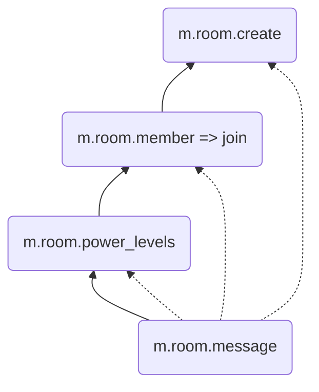
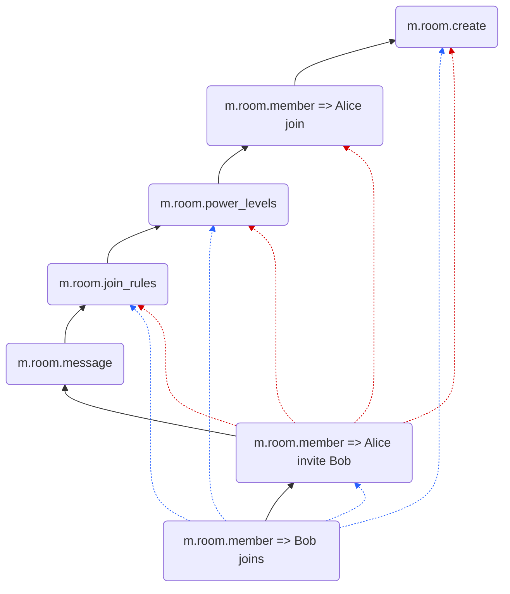
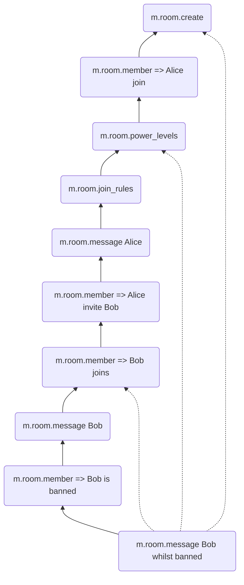
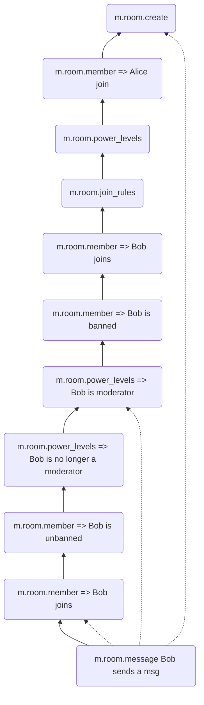
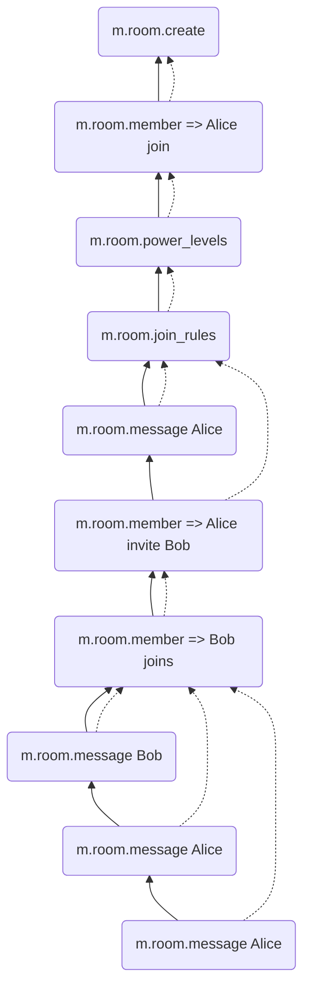
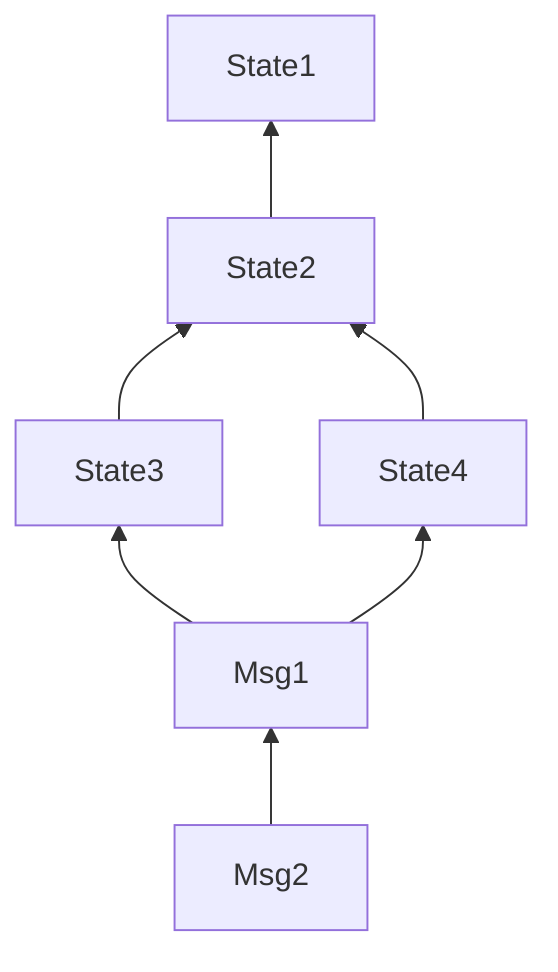
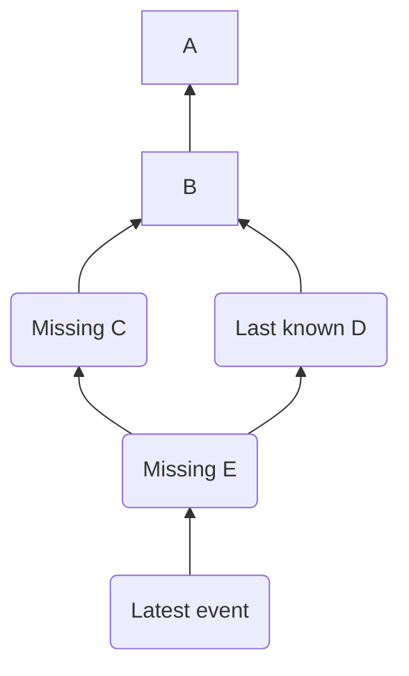
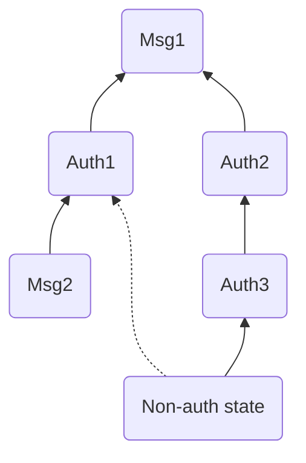
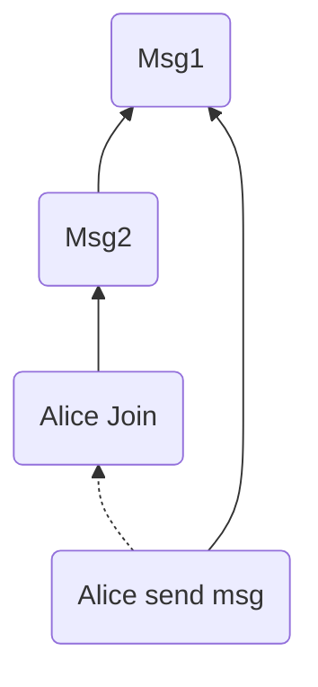
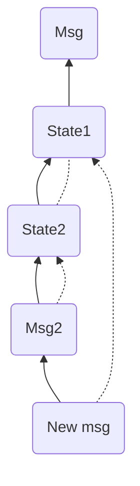

# MSC4242: State DAGs

Room state is important: who is joined to a room, who is an admin in the room, and what are the join rules
(invite/public/restricted) are fundamental properties of a room. The current mechanism to ensure
eventual consistency over federation for room state is suboptimal and can cause state to
converge too slowly, or not at all. This MSC proposes a faster-to-converge and more secure
alternative in the form of state DAGs. A state DAG is only for the state
events in the room, where edges are defined using `prev_state_events` instead of `prev_events`.

State DAGs fix several vulnerabilities in state resolution. These vulnerabilities are not with the
algorithm, but with the data provided as inputs to the algorithm: a
case of garbage in, garbage out. Specifically, the State DAG proposal of this MSC:
 - _calculates_ the `auth_events` key which is today sender-specified in every event,
 - _mandates_ that all servers fill in the entire state DAG on receipt of new events with unknown
   `prev_state_events` by walking back up the DAG to the create event via the `/get_missing_events` endpoint.
   This obsoletes the `/state`, `/state_ids` and `/event_auth` endpoints.
 - _calculates_ room state based on `prev_state_events`. This unifies step 4 and step 5 of the PDU
   checks as the calculated room state is used to calculate the `auth_events`.

## Problem properties: eventually consistent authorisation
To decide on the authorisation of incoming events, servers in a room need to replicate authorisation
events (*auth events*), which make up the part of the room state necessary for the authorisation decision
(*auth state*). Auth events are state events, and defined as all events of types relevant to write access
to a room, namely `{ m.room.create, m.room.power_levels, m.room.member, m.room.join_rules, m.room.third_party_invite }`.
Other state events that are relevant for authorisation or security are events of the types
`{ m.room.history_visibility, m.room.guest_access, m.room.encryption, m.room.server_acl }`. It is critical that these event
types are synchronised rapidly among all honest servers as they control the fundamental security properties
in the room.

All room events are partially ordered by hash links to previous events, i.e. the room DAG formed by
`prev_events`. In analogy with the room DAG, this MSC proposes to add additional hash links to form a
partial order on state events only, i.e. a state DAG formed by `prev_state_events`.

This MSC aims to improve the reliability of state event replication, as well as the security of
authorization decisions. In line with scientific research on
[Conflict-Free Replicated Data Types](https://dl.acm.org/doi/full/10.1145/3695249), a solution needs
to provide the following properties:
- Eventual state event delivery: If a state event is added to the room DAG by an honest server, it is eventually added on all honest servers.
- Room state convergence: Two honest servers that have the same set of state events in their room DAG derive the same room state.

This MSC aims to improve the security of authorization decisions. In line with scientific research on
[To the Best of Knowledge and Belief: On Eventually Consistent Access Control](https://publikationen.bibliothek.kit.edu/1000176494),
a solution needs to provide the following properties:
- Historic authorisation: An event stored by an honest server as part of its room DAG is authorised
  by the room state resolved from all events in the state DAG before the given event.
- Concurrent authorisation: If an event affects room state of an honest server, that event is
  authorised by the room state resolved from all events in the state DAG before *or concurrent to*
  the given event.

The eventual delivery and convergence properties in conjunction are said to make up the eventual
consistency guarantee, which is one of the strongest guarantees we can have while staying available
under partition, and what we want for authorisation in particular. The historic and concurrent
authorisation properties on the other hand describe *how* we want consistent authorisation to look like.
Room state convergence and concurrent authorisation are topic of the state resolution algorithm. As
this MSC assumes that state resolution is correct, these properties are assumed to be fulfilled, and
the focus is on eventual state event delivery and historic authorisation.

## Background: Authorisation rules today

When a server receives an event from another server, it needs to authorise that event. The
[checks performed on receipt of a PDU](https://spec.matrix.org/v1.10/server-server-api/#checks-performed-on-receipt-of-a-pdu)
outline the steps involved. 

The area this MSC concerns itself with is Steps 4 and 5:

> 4) Passes authorization rules based on the event’s auth events, otherwise it is rejected.
> 5) Passes authorization rules based on the state before the event, otherwise it is rejected.

The `auth_events` are a set of events which "authorise" the event. The idea is that this set of
events includes all events which "prove" that this event is allowed. For example, to send a message,
the message must have `auth_events` proving:
 - The room in question (`m.room.create` event)
 - The user was joined to the room (`m.room.member` event)
 - The user was authorised to send into the room (`m.room.power_levels` event)

These authorisation events must also themselves be authorised. For example, to join an
invite-only room, your `m.room.member` join event must also reference the `m.room.member` invite
event. This forms an "auth chain" as any given event references auth events which reference auth
events which reference auth events, all the way to the `m.room.create` event.


*A room DAG showing the `auth_events` (dashed arrows) for a `m.room.message`.
The `prev_events` path is shown with solid arrows.*


*A join event with its `auth_events` in blue, along with the invites `auth_events` in red, forming a "chain".*

However, this check alone is not enough. Despite the intention that they "prove" the event is
authorised, i.e. keeping up the historic authorisation property, they do no such thing. They are just
a "sanity check" that _at some point_ this event _could_ be authorised.
The best illustration of this is to consider a banned user. At one point in
time, the banned user was joined to the room. Nothing stops the banned user from sending messages
into the room, referencing their _old_ join event prior to the ban. This would pass **this step** of
the PDU checks.


*Bob attempting to evade a ban by referencing in his `auth_events` his join event from earlier.*

As a result, PDUs need additional checks, including Step 5, which verifies the historic authorisation property:
_at the state before the event was sent_, the user was allowed to do this action. For non-faulty
servers, the set of events relating to authorisation will be the same in both `auth_events` and the
state before the event. Due to this, Step 4 is effectively useless as it stands and servers can
viably skip this step and still make the correct authorisation decisions, hence why it is just a
"sanity check". Merging of Step 4 and 5 into one useful check is part of this proposal.

Unfortunately, it's not even a good sanity check because whilst the intention is that they prove
that a user was allowed to do an operation "at some point in time", in practice nothing stops
servers from cherry picking events. For example, consider the case where Bob joins the room, is then
banned from the room, then the power levels make Bob a moderator in the room (perhaps by automated
tooling). At no point in time was Bob both joined to the room _and_ a moderator in the room.
However, nothing stops a server from referencing in its `auth_events` the power levels event which
make Bob a moderator and the join event of Bob, even though these events never co-existed at the
same point in time. Servers will decide the event as authorized, violating the historic authorisation
property. State DAGs fixes this issue.


*Bob referencing the power level event when he was a moderator, despite never being joined and a moderator at the same time.*

Finally, faulty servers may simply avoid sending events after a ban,
instead opting to send events earlier in the DAG, as concurrent events. This could simply be a delayed event, so would be
sent to clients if not for Step 6: soft failure. Soft failure stops old events from reaching client
devices if the event fails auth checks at the _current state_. This proposal alters soft failure,
see the section on "Soft Failure" below. If the concurrent event is a state event, state resolution
ensures that the event never makes it into the room state because bans are applied first.

## Proposal

### High level summary of changes
- `auth_events` are removed from all events, and replaced with `prev_state_events`. The state DAG
  formed by `prev_state_events` is used to calculate `auth_events` for state resolution.
  This targets the historic authorisation property.
- Room state is derived from the DAG induced by `prev_state_events`, NOT `prev_events`.
  Events which specify faulty `prev_state_events` (e.g. referencing non-state events or events in different rooms) are rejected.
- `prev_state_events` are populated with the current forward extremities of the set of state events in the room.
- Servers **MUST** have all paths from any state event to the `m.room.create` event. For any
  event received over federation via `/send`, the sending server **MUST** be able to provide the
  complete paths via `/get_missing_events`. This targets the eventual state event delivery property.
- `/send_join` returns the complete state DAG for the new server's join event in a new `state_dag` field.
- `/get_missing_events` has an optional flag `state_dag` which walks the state DAG if set. It is also tweaked
  to be deterministic.
- Strictly no client changes are required.
- A new room version is required.

### Detailed description

The `auth_events` field is removed, as it is not particularly useful beyond occasionally making
partitioned servers aware of some authorisation events they may have missed. Instead, it is
replaced with _another DAG_, called the "state DAG". This DAG references the "latest"
(forward extremities) state events. They are linked together via a new field: `prev_state_events`
which functions in the same way as `prev_events` does today (it's a list of event IDs). All events
will have this field, even non-state events, in which case they serve to continually broadcast that
server's current forward extremities for state events.

Any given server can then _calculate_ what the `auth_events` should be for an event by using the
`prev_state_events`. This _calculated field_ is then used for state resolution.

Servers MUST NOT reference an event in `prev_state_events` which is not in fact a state event,
e.g. referencing an `m.room.message` event instead. Events which do this should be
[_rejected_](https://spec.matrix.org/v1.10/server-server-api/#rejection).

In addition, servers MUST be able to walk from any given state event back via `prev_state_events` to
the `m.room.create` event of the room. To enable
partitioned servers to request missing parts of the state DAG, the `/get_missing_events` endpoint is
expanded to include a new flag which indicates that the state DAG should be walked instead of the
room DAG. Otherwise, it functions the same as with the room DAG. If a server cannot provide a path
to the create event, the server SHOULD reject the `/send` transaction. This is identical to how
servers [behave today](https://github.com/element-hq/synapse/blob/v1.116.0/synapse/handlers/federation_event.py#L309)
with respect to `prev_events`, so this is just an expansion of this behaviour. It's worth noting that
Synapse will _not_ reject the `/send` transaction in this case as it processes missing events
asynchronously. This doesn't materially change the security properties of this approach, but it
does increase the time to convergence because the sending server may be unaware that their events
have not been successfully processed yet as they did not get back an error.


*Proposed room DAG with state DAG overlaid in dashed lines.*

As the state DAG is a DAG, it can fork and merge. Merge operations are subject to state resolution,
Non-state events cannot merge the state DAG. If they could, the state DAG would consist of more than
_just_ state events. This means the `prev_state_events` on non-state events may frequently reference
more than one state event, e.g:


*Both `Msg1` and `Msg2` will reference `prev_state_events: [State3, State4]`, as that is the current
state forward extremities.*

The combination of including `prev_state_events` in broadcasts of _any_ new event along
with enforcing that a path to the create event exists, allows partitioned servers to rapidly resync
relevant sections of the state DAG upon reconnection.
Thereby, state DAGs ensure the eventual state event delivery property under the assumption that servers
continue to send new events eventually.

#### Deriving room state from the state DAG

Servers MUST NOT derive room state from the `prev_events` key, and should instead use `prev_state_events`.
The room state calculated by the `prev_events` ordering is not trustworthy due to it relying on
untrusted responses to `/state` and `/state_ids`.

As servers now know the entire state DAG, they can use this to figure out the "state before the event".
This replaces the endpoints `/state`, `/state_ids` and `/event_auth` which were all previously used to
fetch missed events. This fixes a security vulnerability where faulty responses to `/state` or `/state_ids`
could cause state resets. This same _calculated room state_ is used to calculate the `auth_events` for
incoming events. This unifies steps 4 and steps 5 of the [PDU checks](https://spec.matrix.org/v1.10/server-server-api/#checks-performed-on-receipt-of-a-pdu):

> 1) Is a valid event, otherwise it is dropped. For an event to be valid, it must contain a `room_id`, and it must comply with the event format of that room version.
> 2) Passes signature checks, otherwise it is dropped.
> 3) Passes hash checks, otherwise it is redacted before being processed further.
> 4) Passes authorization rules based on the event’s auth events, otherwise it is rejected.
> 5) Passes authorization rules based on the state before the event, otherwise it is rejected.
> 6) Passes authorization rules based on the current state of the room, otherwise it is “soft failed”.

The "current state" of the room is given by the resolved state of the state DAG's forward extremities.

#### Soft Failure

> When an event is “soft failed” it should not be relayed to the client **nor be referenced by new events** created
> by the homeserver (i.e. they **should not be added to the server’s list of forward extremities of the room**).
> Soft failed events are otherwise handled as usual.

https://spec.matrix.org/v1.12/server-server-api/#soft-failure

Events in the state DAG **should be part of the forward extremities of a room** otherwise we run into the problems described below.

State DAGs exist to ensure that all servers rapidly converge on the same set of state events (eventual state event delivery) so they can
calculate the same current state in the room (room state convergence). Soft failure makes this harder and in certain cases can obstruct
servers from agreeing on the same current state. Consider this scenario (green nodes are the current state at `$vsOy`):


 - there are 3 concurrent events:
   * A) PL100 bans PL75
   * B) PL75 bans PL50
   * C) PL50 sets the join rules to invite
 - If you see all 3 events, state res says that PL100 banned PL75 and invalidates the ban of PL50,
   thus PL50 is allowed to set the join rules to invite.
 - Now suppose there is a bystander server observing these concurrent events
   * If you see B then C, C is soft failed. You then see A and come to the correct current state.
 - Now the bystander server sends some events which are unimportant ending at some event X.
 - The servers which sent the concurrent events are now unreachable.
 - A long dead server comes back and sees event X, and asks the bystander server for the `prev_state_events`
   to fill in the state DAG. The bystander server _knows about event C_ but will not deliver this to
   the long dead server because it was never part of the forward extremities of the room, so all those
   unimportant events never referenced it.
 - Thus, the long dead server does not know the join rules are "invite", _despite it being part of the current room state_.


So it is worth considering what value soft-failure has _for state DAGs_. Soft-failure is very useful for filtering
out messages which would otherwise be delivered to clients, because the stream (arrival) order doesn't care about
the topological positions of the events. This is still true for state DAGs. Other than that, the only value it has
is to help reduce the amount of events other servers need to pull in, i.e if you are sure that a given event is
useless, why bother sending it to other servers? This is precisely what "not referencing the event" ends up doing,
and as this scenario shows it is a liability because the server was mistaken. Servers
need to see the same events in order to come to the same conclusion (room state convergence), and anything which could prevent two honest
servers from exchanging those events should be avoided, to ensure eventual delivery. If the server constantly re-evaluated the soft-failure
status of events whenever the current state changed then this would help, but would be computationally infeasible
to do.

In current Matrix, eventual delivery of events is only ensured under the assumption that any server continuously sends new events.
The additional assumption is needed because homeservers do not
eagerly share known forward extremities with each other: it relies on servers _sending events_. As such, you can have
two servers who disagree on the current state because one server is aware of events that affect the current state
and the other is not. This is less of a problem than the soft-failure case because it will correct itself when an event
is sent, but the system requires some external input to provide eventual delivery, in order to
eventually converge. This will be addressed in a future MSC.

#### API changes

##### `/get_missing_events`

An additional top-level key `state_dag` is added. If `true`, the receiving server walks back via
`prev_state_events` and not `prev_events`. Default: `false`.

Example:
```json
{
  "earliest_events": [
    "$last_known_state_events_fwd_extremities"
  ],
  "latest_events": [
    "$event_received_via_send"
  ],
  "limit": 10,
  "state_dag": true
}
```

If the `limit` is reached, the sending server should continue to walk back until it has discovered *all*
`prev_state_events`. Care must be taken to ensure *all* paths to the `m.room.create` event are walked. Consider:


If this endpoint only returns E, then there is a link between the latest event and the last known
event, but sending server implementations MUST NOT stop walking the graph as it is not a complete graph since
C is still missing. This may result in additional `/get_missing_events` calls. This MSC recommends
that servers exponentially increase their `limit` until they have seen all events, e.g. `?limit=10`
then 20, 40, 80... This is a simple approach and there are better alternatives which can be explored
in a future MSC which do fewer round trips and exchange less information.
 - [Bloom filters](https://arxiv.org/abs/2012.00472)
 - [Range-based set reconciliation](https://arxiv.org/abs/2212.13567) 
 - [Merkle search trees](https://ieeexplore.ieee.org/abstract/document/9049566).

In addition to this, when `/get_missing_events` encounters an event with >1 `prev_state_event`, it
MUST walk these events in lexicographical order: `$bar` before `$foo`. This enables database engines
which use ASCII sorting (such as PostgreSQL's C collation) to sort correctly when using `ORDER BY`. This means
A-Z comes before a-z. This change makes `/get_missing_events` responses deterministic so they can be
cached, and so every compliant homeserver will return the exact same response when used with the same
request parameters. For example, given these graphs:
```
   A
  / \
 B   C
 |   |
 D   E

   A
  / \
 B   C
  \ / |
   D  E
```
Walking with `latest_events={D,E}` returns `[B,C]`. Algorithmically, the server should:
 - map `earliest_events` to a set of 'seen' event IDs.
 - sort the provided `latest_events` and put them into a queue, removing any in 'seen'.
 - while the queue is not empty and the limit has not been reached:
   * dequeue an event ID and find its `prev_state_events` PSE.
   * Remove IDs from PSE if they are in 'seen'.
   * add the remaining event IDs from PSE to the result list and the end of the queue.
 - the result list must not be reversed at the end, unlike non-state DAG `/get_missing_events` responses.

##### `/send_join`

For room versions which implement state DAGs:
- Do not return `auth_chain`, `state`, `servers_in_room` by default. Instead return `state_dag` which contains the entire state DAG.
- Verify that you have ALL paths from the `prev_state_events` of the join event to the create event for the room. If you don't, then you did not join the room successfully and the server is faulty. Join via a different server.
- Faster room joins: if `?omit_members=` is set, include `partial_state_event_ids`. See "Faster remote room joins" for more information.

#### State resolution changes

State resolution depends on auth chains. In order to include state DAGs
_without changing the state resolution algorithm_, servers MUST calculate the `auth_events` for each
incoming event using the state DAG. This makes `auth_events` a trustworthy source as it is calculated
from first principles, rather than just going with whatever the event says. This fixes a class
of state resets where incorrect `auth_events` could cause state to reset to an earlier room state.

The intended server behaviour would be:
 - for an incoming event E with `prev_state_events` A,
 - do state resolution on A to get the auth state S before the event E,
 - find the relevant auth events in S which would today be put into `auth_events`,
 - store them in a calculated `auth_events` field.

#### Auth rules changes

1. If type is `m.room.create`:
    1. If it has any `prev_events`, reject.
    2. If the event has a `room_id`, reject.
    3. **[Added in this version]** If it has any `prev_state_events`, reject.=
    4. If `content.room_version` is present and is not a recognised version, reject.
    5. If `additional_creators` is present in `content` and is not an array of strings where each string passes the same user ID validation applied to `sender`, reject.
    6. Otherwise, allow.
2. **[Added in this version]** Considering the event's `prev_state_events`:
    1. If there are entries which do not belong in the same room, reject.
    2. If there are entries which do not have a `state_key`, reject.
    3. If there are entries which were themselves rejected under the checks performed on receipt of a PDU, reject.
4. **[Changed in this version]** Considering the event’s calculated `auth_events`:
    1. **[Removed in this version]** If there are duplicate entries for a given `type` and `state_key` pair, reject.
    2. **[Removed in this version]** If there are entries whose `type` and `state_key` don’t match those specified by the auth events selection algorithm described in the server specification, reject.
    3. If there are entries which were themselves rejected under the checks performed on receipt of a PDU, reject.
    4. **[Removed in this version]** If any event in `auth_events` has a `room_id` which does not match that of the event being authorised, reject.
  
 ##### Rationale

- The create event changes are just to ensure that the create event cannot be changed, and parallels the existing rule
 on `prev_events`.
- The `auth_events` changes are removing a bunch of checks because that field no longer exists on the event, hence other
servers cannot set faulty fields. The notable exception is checking that the auth events are not rejected. This rule
should not technically be required as rejected events do not form part of the room state, but it has been included as an
additional safeguard.
- There is a new section validating `prev_state_events` as it is sent by other servers. The primary aim is to ensure that
any event IDs specified are state events which have not been rejected. It is worth noting that this purposefully ensures
cascading rejection: if A is rejected and B references A, then B is rejected and so on. There is no check akin to
"If there are duplicate entries for a given `type` and `state_key` pair, reject" because it is entirely possible for
`prev_state_events` to be pointing at two identical tuples on different branches.

#### Faster remote room joins

The state DAG model has implications on "faster remote room joins" which merely returns the auth chain for
the join event, non-member current state events, a list of servers in the room and nothing else. This tiny subset of events is fast
but provides very very weak guarantees that at the time the join was issued, those auth events existed
in the room.

State DAG rooms use a different approach. If `?omit_members=true`:
 - The `/send_join` response still includes _the entire state DAG._ The same amount of data is transferred with and without faster room joins.
 - The `/send_join` response includes a new array: `timeline` which represents the most recent events in the room,
   suitable for presenting in the timeline. How many events is configurable via a new query param `?timeline_limit=` which
   is a non-zero integer, with a hard cap of 64. This is subject to history visibility rules.
 - The `/send_join` response includes a new field: `partial_state_event_ids` which is a
   list of event IDs which contain what the join-helper server claims to be the current state, omitting all members _except_
   the `sender`s of the `timeline` events and non-member state events e.g the `sender` of the `m.room.create` event.
   This is sent alongside the entire state DAG. For clarity, the join event induced by `/send_join` is also omitted from
   `partial_state_event_ids` as it is implied. This avoids scenarios where the join-helper server claims the joining server isn't in the room
   despite just calling `/send_join`.
 - The `/send_join` response includes another new field: `partial_auth_chain_ids` which is a map of event ID to calculated auth event IDs.
   The join event and every event in `partial_state_event_ids` MUST be present as a key in this map, with the exception of the `m.room.create` event which MAY
   be absent. In addition, the auth event IDs for the partial state events MUST be present as keys in this map. Their auth events MUST
   similarly be present. This enables the entire auth chain for events in partial state events to be retrieved.

This creates a request/response that looks like the following:
```
PUT /_matrix/federation/v2/send_join/{roomId}/{eventId}?omit_members=true&timeline_limit=10
{
 // join event JSON
}

HTTP/1.1 200 OK
{
  "state_dag": [
    // event JSONs for all state ever in the room
  ],
  "event": {
    // join event JSON
  },
  "members_omitted": true,
  "partial_state_event_ids": [ "$event", "$ids" ],
  "partial_auth_chain_ids": {
    "$event": ["$a","$b"],
    "$ids": ["$a","$c"],
    "$a": [],
    "$b": ["$a"],
    "$c": ["$a", "$d"],
    "$e": ["$a"]
  }
  "timeline": [
    // most recent 10 events
  ]
}
```

The joining server should then perform the following:
 - Verify that the state DAG is connected.
 - Calculate the current state as that given by `partial_state_event_ids`, with the state DAG forward extremity as your join event.
   Do not verify all events in the state DAG yet. Only verify the partial state event IDs and the timeline events with
   steps 1, 2, 3 and 4 of the PDU checks (valid event, hashed and signed correctly, with correct `auth_events`).
 - Persist the state and timeline and unblock the CSAPI `/join` endpoint.
 - In the background, verify the entire state DAG with all steps of the PDU checks as usual. Ensure the claimed auth chain is deleted
   and replaced with its calculated counterpart.
 - If the state DAG is valid:
    * destroy the state associated with the room and replace it with the verified state. Invalidate client caches.
    * reverify all events in the `timeline`, as well as any live events which arrived in the interim.
 - If the state DAG is not valid:
    * destroy the state associated with the room. Invalidate client caches.

This technique makes several tradeoffs:
 - It sends more response data than faster remote room joins does today, because it is including the entire state DAG in the response. However, the cost of this
   is reasonably small compared to the cost of verifying the resulting events and storing state snapshots. By doing this, we guarantee that rooms will transition from being partially joined
   to "joined" or "failure" in finite time. If fetching the state DAG was deferred to another round trip, the partially joined room may _never_ transition in the
   case where an attacker has control over the network. This is stronger than what [MSC3902](https://github.com/matrix-org/matrix-spec-proposals/pull/3902) currently
   proposes.
 - It does not send the entire claimed current state, instead opting for sending 'partial' state as per [MSC3902](https://github.com/matrix-org/matrix-spec-proposals/pull/3902).
   This reduces the amount of events that need to be checked on the critical path. This is particularly effective on member events as members may be on different
   servers which will take time to fetch server keys for.

From an implementation perspective, servers which implement [MSC3902](https://github.com/matrix-org/matrix-spec-proposals/pull/3902) should need minimal changes to
adapt their system to work in state DAG rooms because the underlying data model is the same. Care must be taken to ensure that if the state DAG verification is
interrupted e.g due to restarting the server, that it is resumed on startup.

#### Consequences of having a full state DAG

`depth` can be calculated and hence trusted for events that are included in the state DAG. This has
not been true up until now because DAGs can be disjointed. This unlocks the potential for further
improvements to federation which uses this new trusted data. This will be used in a future MSC.

The state DAG model also converges more reliably than the auth chain model. Consider:
 - Servers A and B in the room.
 - Server B goes offline.
 - Server A changes the join rules. The join rules are only referenced in `auth_events` for member
   events, not for normal messages.
 - 100000 messages go by.
 - Server B comes back online and receives a message from Server A. They get the most recent 100
   messages and give up, hitting `/state_ids` for the state before event N-100.
 - Server A fails to return the join rules event ID for whatever reason.
 - Server B, whilst online and federating, is still unaware of critical information about the room.

In a state DAG model, as soon as Server B comes back online and receives a message from Server A, it
knows there is a difference in state events as it doesn't know the `prev_state_events`, there's no
need to `/state_ids`. It can then hit `/get_missing_events` with that event ID to fill in the gap,
_not only_ to authorise that join rules event, but also _every other_ missed state event. This
effectively collapses N `/event_auth` requests (where N is the number of missed auth events) into M
`/get_missing_events` requests (where M is driven by how small the desired `limit` is set).
Furthermore, if a server tries to be malicious and omit a state event, it can be detected as there will
be a missing event in `prev_state_events`. When coupled with rejecting `/send` transactions, this
provides incentive for servers to be honest and send all state events, otherwise they cannot communicate.
This is in stark contrast to today where an event omission from `/state_ids` cannot be detected.

#### What does this mean for "rejected" events?

This proposal firms up the concept of rejected events. In today's Matrix, events are rejected if they fail
Step 4 or Step 5 of the PDU checks. However, Step 4 is immutable, but Step 5 is not. The reason why we are
so loose on defining "rejected" events is because of Step 5 as we know we cannot trust the state before the event:

> This helps ensure that different servers’ view of state is more likely to converge, since rejection state of an event may be different. This can happen if a third server gives an incorrect version of the state when a server joins a room via it (either due to being faulty or malicious). 

https://spec.matrix.org/v1.10/rooms/v11/#rejected-events

This isn't possible when the state is derived entirely from the state DAG which is a provable source of data.
When joining a room, a faulty server can provide an _incomplete_ view of the state DAG. However, any event that
references missing state events MUST be able to be pulled in all the way to the create event, thus providing a
completely verifiable immutable sequence. This means once an event is rejected, it can never become "unrejected".

## Potential issues

### Size Concerns

This proposal is forcing all servers to store the entire state DAG, even if it is a subset of the
room DAG. This could be a lot of data, and so may be seen as undesirable. The author does not
contest this, but sees that the real concern is actually around "how much more" state will each
server need to store above the way Matrix functions today. It turns out that the current auth chain
technique also contains a lot of events, as servers need to fetch auth events recursively back to
the create event.

The largest contributor to room state are member events. Member events, once they exist, are never
truly removed because leaving a room sets your membership to `leave`. As such, they are still part
of the current state, and hence must be authorised along with everything else. The costliest moment
in a room is when a server joins the room for the first time, as the joining server must verify the
current state of the room. Hence, the bulk of the size is due to member events and that cost is paid
upon joining a room.

In a state DAG model, this does not change. The set of events returned also does not change at all
for member events. Consider the following example for an invite-only room:
 - A room with 4 members, Alice=invite, Bob=join, Charlie=leave, Doris=rejoined.
 - The auth chains for these members is as follows (omitting create event, join rules and power levels
   event as they do not change in this example):
   * Alice (invite) = []
   * Bob (join) = [BOB_INVITE]
   * Charlie (leave) = [CHARLIE_INVITE, CHARLIE_JOIN]
   * Doris (rejoined) = [DORIS_INVITE, DORIS_JOIN, DORIS_LEAVE, DORIS_INVITE]

The state DAG representation still includes all these events, just in a causal representation.
Other than this, the set of events in the state DAG may exceed those in auth chains in cases where
servers fail to respond to `/state_ids` correctly: see "Consequences of having a full state DAG".

However, in addition to these events we will also be storing non-auth state. How much extra space
will this entail? Rooms on matrix.org were analysed and >99% of rooms have < 100 historical non-auth state events.
Certain rooms are affected more than others, depending how that room is using Matrix. For example,
Matrix HQ (the largest and most notorious room on matrix.org) only has 169 extra state events:

```
Auth events:

 m.room.member             | 323368
 m.room.server_acl         |    713
 m.room.power_levels       |     22
 m.room.join_rules         |     14
 m.room.create             |      1

Non-auth events:

 m.room.aliases            |    142
 m.room.avatar             |      1
 m.room.bot.options        |      1
 m.room.canonical_alias    |      1
 m.room.guest_access       |      7
 m.room.history_visibility |      3
 m.room.name               |      1
 m.room.related_groups     |      1
 m.room.topic              |      8
 uk.half-shot.bridge       |      4
 ```

The reason for this surprising result is because the amount of _extra events_ included by including
non-auth state does NOT scale with the number of members
in the room. This makes intuitive sense, as the rate of topic changes shouldn't change depending on
if there are 100 or 100,000 members in the room.

There are exceptions however, which will all be affected by this proposal:
 - `org.matrix.msc3401.call.member` events. MSC3401 uses per-user room state to synchronise call info.
This _does_ scale with the number of users in the room and would be negatively affected by this
proposal, as all historical calls will need to be downloaded prior to joining the room.
 - `m.space.child` events. Space rooms will be more expensive to join, though this proposal would
 guarantee all servers see the same children.
 - `org.matrix.mjolnir.rule.user` events. Moderation rooms would be more expensive to join, though
 this proposal would guarantee all servers see the same rules.
 - `org.matrix.msc3672.beacon_info` events. MSC3489 (confusingly) uses per-user state events for live
 location sharing. MSC3672 swaps this to be EDUs.

There is also a long tail of outliers where rooms have very frequent topic changes or changes to
pinned events. These use cases will be negatively affected. The current worst case estimates are
between 1k-10k additional events for those rooms.

This hints at a missing data structure for Matrix, given 3 specific use cases only need reliable
pubsub for per-user room state: profile changes, MSC3401 call members, MSC3489 beacons. Per-user
room state cannot have conflicts in any meaningful sense as it can only be sent by one user.
This is what [MSC4354: Sticky Events](https://github.com/matrix-org/matrix-spec-proposals/pull/4354)
tries to achieve.

## Alternatives
 - Change the state resolution algorithm to pull in more events. Whilst this may fix certain classes
   of state resets, ultimately if the events themselves (or `/state_ids` responses) are faulty, then
   no amount of pulling in more events will help.
 - Auth DAGs. See below.

### Why not an auth DAG?

This proposal is creating a state DAG which includes every single state event, including those not
for authorisation e.g topics and room names. Earlier versions of this proposal only had the
*auth events* subset of state events, thus creating an "auth DAG". However, problems occur when you
need to "mix in" non-auth room state when calculating the state of the room before an event. Non-auth
state events still need to be authorised, but the partial ordering induced by `prev_auth_events`
cannot be used here as the non-auth state is only present on the partially synchronised room DAG
via `prev_events`. The security properties of this MSC rely on a fully synchronised DAG, so must use
`prev_auth_events`, but what happens if the two orderings disgree:

*A state event references very old `prev_auth_events: [Auth1]` which aren't even on the same fork according to `prev_events: [Auth3]` as the state event in question.*

In this scenario, the "auth state" is `[Auth1]` but the auth events in the `prev_events` includes `Auth2, Auth3`,
**which is not part of the auth state**.
In other words, the "auth state" is _completely different_ to the state before the event according to `prev_events`.
Reconciling these two cases is difficult. We MUST use the "auth state" as that is fully synchronised.
If we try to use `prev_events` state then we can end up with security vulnerabilities because the server
may not have backfilled to fill in `Auth2` and only have `Auth3`, therefore relying on `/state` to be
honest and include `Auth2`. If we just use the "auth state" then that means the non-auth state according to
`prev_events` is completely unauthorised: there are no checks that can be done _by all servers_ to ensure
that the non-auth state is allowed according to its position in the room DAG. To reliably do this, all
`prev_events` leading to the create event would need to be pulled in, at which point you might as well
just do a state DAG and at least leave messages out of the partial order.

Various proposals have been suggested to "mix" together `prev_auth_events` and `prev_events` such as:
 - `state_res(prev_auth_events) + (state_res(prev_events) - auth events)`: the auth events in `prev_events`
   are correctly excluded but we're combining two otherwise disjoint sets of state.
 - `state_res(union(prev_auth_events, prev_events))`: the auth events in `prev_events` (Auth2, Auth3) will
   potentially form part of the resolved state. If they are used for auth checks, this would violate
   the historic authorisation property.

It's not straightforward to reason or prove whether either proposal actually works. Using a state DAG fixes this
because there is a _single_ partial ordering that is _fully synchronised_, therefore the same steps
for calculating auth state would also calculate non-auth state.

## Security considerations

Servers may not respond to `/get_missing_events` or may respond incorrectly. In this scenario, a
faulty response MUST cause the `/send` transaction being received from that server to fail. This
discourages malicious servers from responding incorrectly (or not responding at all!), as it means
they can no longer communicate with the target homeserver. This property _only_ exists whilst Matrix
continues to have a full-mesh topology. The moment we introduce transitive delivery this incentive
is reduced as the intermediary homeserver lacks any incentive to ensure other server's events are
delivered.

### Mismatched `prev_events` and `prev_state_events`

The "Alternatives" section touched on the idea that if you have two partial orders, and one is
partially synchronised, it becomes difficult to ensure that all servers agree which events are causally
consistent with _both_ orders (see the graph on "Why not an auth DAG?"). State DAGs still have this
problem, but between _messages_ and state.

Events may specify `prev_events` which point to events which contradicts causality e.g point to events from
before you were joined. These events will pass the PDU checks as long as the `prev_state_events`
point to room state from when the sender was joined.


*Alice's message should not have `prev_events: [Msg1]` but it does.*

This currently has no end user visible effect as non-state events are delivered in stream (arrival)
ordering to clients. Servers should be wary that the `prev_events` key is effectively untrusted and
unverifiable in state DAG rooms. Due to partial synchronisation
(relying on `/state` and `/state_ids`), this has always been the case and has been the cause of various
state resets, despite attempting to have safeguards to guard against this (step 5 of the PDU checks).

A similar problem occurs when an event points to provably older `prev_state_events`:


*`New msg` should be pointing to `State2` since it is pointing to `Msg2` as a `prev_event`, but it chooses not to.*

This can be done as a form of ban evasion (e.g if `State2` was a ban) were it not for Step 6 soft failure checks.
Again, this in practice has no end-user visible effect. If it was a ban evasion attempt, assuming the server
had seen the ban `State2` then the `New msg` would be suppressed, just as soft failure works today.
This can be seen as a "worse" form of ban evasion as the event itself encodes proof that the server is misbehaving.
However, we cannot do auth checks on the `prev_events` state and _reject_ the event if the event fails the auth
checks, as not all servers are guaranteed to converge due to reliance on `/state`.

## Unstable prefix

- Room version is `org.matrix.msc4242.12`, based on room version 12.
- The `/get_missing_events` flag is `org.matrix.msc4242.state_dag`.
- There is no need to prefix the `/send_join` response key for the state DAG as it's already namespaced via the room version supplied in `/make_join`.
- There is no need to prefix `prev_state_events` as it's already namespaced via the room version.

## Dependencies

This MSC has no dependencies, but would benefit greatly from an MSC which makes events self-verifying,
such as [MSC4014](https://github.com/matrix-org/matrix-spec-proposals/pull/4014),
[MSC4243](https://github.com/matrix-org/matrix-spec-proposals/pull/4243),
[MSC4345](https://github.com/matrix-org/matrix-spec-proposals/pull/4345).

