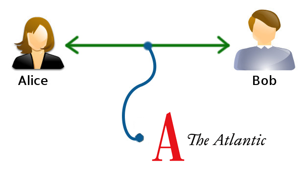

# MSC4281: Mitigating Membership Mistakes, or "Invisible" Cryptography

End-to-end encryption protects messages from people who are outside of an
encrypted room.  However, it does not protect against accidentally inviting an
unauthorised party to the room.  As a hypothetical example, it could be a
national security disaster to accidentally invite the Editor in Chief of a
magazine to a room in which an active military attack is being
discussed[¹](https://www.theatlantic.com/politics/archive/2025/03/trump-administration-accidentally-texted-me-its-war-plans/682151/).
This is illustrated by the classic diagram:

While this initially seems like a difficult problem to solve, an easy solution
emerges: one can prevent unexpected room members from decrypting messages by
simply preventing *all* members from decrypting messages.  This fully prevents
any accidental leaks of confidential information.

We propose adding a new encryption mode, called "invisible", that operates like
normal end-to-end encryption, except for two major differences:

- decryption keys are not provided to any of the recipient devices, and
- the `ciphertext` field is empty.

Together, these ensure that inadvertently-added members (and everyone else) will
not be able to read the messages sent to the room.

In addition, this scheme solves other problems with end-to-end encryption.

- [Sharing room keys for past messages on
  invite](https://github.com/element-hq/element-meta/issues/39): New members
  will now see the same content as existing members, without needing to forward
  decryption keys to them.
- Users without a logged-in device cannot decrypt messages:
  ([MSC3814](https://github.com/matrix-org/matrix-spec-proposals/pull/3814)
  tries to solve this) Again, this will no longer be a problem as these users
  will see the same content as all other members.
- Self-destructing messages:
  ([MSC2228](https://github.com/matrix-org/matrix-spec-proposals/pull/2228/files)
  tries to solve this) If messages are not decryptable in the first place, there
  is no need for them to self-destruct.

## Proposal

A new property is added to the `m.room.encryption` state event:

- `invisible`: boolean, defaults to `false`.  If set to `true`, clients should
  use the "invisible" encryption mode in this room.  Once set to `true`, it
  cannot be set to `false` again.  That is, even if a future `m.room.encryption`
  event sets the value to `false` (whether by explicitly including `"invisible":
  false`, or by omitting the property), clients should continue to treat the
  room as if it was set to `true`.  This is to prevent a malicious actor from
  being able to downgrade the security of the room.

If a room is in "invisible" encryption mode, then a client:

- MUST NOT send Megolm sessions to any other devices,
- MUST set the `ciphertext` property to the empty string,
- MUST immediately discard its own copy of the Megolm session after sending a
  message, in case the sender themselves are not supposed to be in the room, and
  so should not be allowed to read messages.

Since undecryptable messages are expected in this mode of encryption, clients
may omit displaying any indication of a decryption failure (such as "Unable To
Decrypt", or the user-friendly "Unknown Inbound Session Identifier" message),
and may instead opt to display nothing at all, hence "invisible" cryptography.

## Potential issues

The use of this proposal may violate federal record retention
laws[²](https://thehill.com/regulation/court-battles/5214036-trump-officials-face-records-lawsuit-over-signal-chat/).
Users must ensure that they are familiar with any relevant regulations before
using this feature when conducting government business.

## Alternatives

Rather than making this an encryption mode, we could create a new `m.invisible`
encryption algorithm.  However, this would require clients to implement new
encryption.  In addition, by making this an encryption mode, future encryption
algorithms in Matrix, such as MLS, can benefit from this proposal.

## Security considerations

This proposal does not address metadata -- an unexpected room member will still
be able to who is sending non-messages and when.  This can be addressed in a
future MSC.  One possibility is to omit the entire event, rather than just the
ciphertext.

## Trust and safety considerations

This proposal effectively prevents the transmission of abusive materials in
rooms where it is in use.

## Unstable prefix

Until this proposal is accepted, clients should use the property name
`org.matrix.msc4281.invisible`.

## Dependencies

None.
