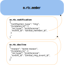

# MSC4310: MatrixRTC decline `m.rtc.notification`

MatrixRTC is the base layer that defines how devices participate in a call. For the specific
use case of a voice/video call we need additional signaling (outside of MatrixRTC) to provide
the expected user experience.

It is important to understand that this (and related) proposals intentionally decouple RTC-specific
signaling and general purpose MatrixRTC session state.

## Context

This proposal builds on the concept of [MSC4075: MatrixRTC Call Ringing](https://github.com/matrix-org/matrix-spec-proposals/pull/4075),
which introduces the `m.rtc.notification` event.
This event lives in parallel with the MatrixRTC session and uses intentional mentions to make the receiving clients ring.
The receiving clients will then monitor the room state and stop ringing once the user joined with one of their devices.

## Proposal

Conceptually this MSC will introduce an event, sent as a relation to the
`m.rtc.notification` event, which communicates a decline from one or more
parties. It can be used on clients to provide a good UX around a call decline
(stop ringing, play a decline sound, prompt the user with: "the call has been
declined" ...)

### Introduction

While the concept of this proposal is simple, it is important to outline what
needs to be achievable with the proposed solution.

- A client needs to easily react to such an event and needs to be able to
  **correlate the decline** with a `m.rtc.notification` event and ideally even
  the **MatrixRTC session** to check if the decline is relevant.
- It needs to be **flexible for 1:1 calls and group calls**. It should be
  possible to design a group ring and per group participant decline flow with
  this proposal even if some products might not need this feature.
- Clients have two possible ways of displaying **historic calls in the
  timeline**. They can compute the exact call history using the `m.rtc.member`
  events which contain the information at what time, which device joined.
  Alternatively they can use the notify and decline events only to render when a
  person tried to start a call and if that got declined. This is much simpler
  and therefore desired for very simple client implementations.

### Proposal (Changes)

This MSC proposes the `m.rtc.decline` event type, with a standard `m.reference`
relation.

- relation: `"m.relates_to": {"rel_type": "m.reference", "event_id": "$call_notification_event_id"}`

The `m.relates_to` field allows referencing the original `m.rtc.notification` event.
The optional reason can provide a message to the user receiving the decline.

This results in a tree of notification/decline events related to the
`m.rtc.member` events for the corresponding session.



Fetching the `m.rtc.member` events to compute a timeline item summarizing the
call allows to easily get all the
related elements and provide additional context in the timeline tile.
If a call was declined, who declined the call and who (can be multiple) started
the call by ringing others ...

### Example

Unencrypted (stable) example:

```json5
{
  "type": "m.rtc.decline", // "org.matrix.msc4310.rtc.decline"
  "content": {
    "m.relates_to": {
      "rel_type": "m.reference",
      "event_id": "$call_notification_event_id"
    },
  }
}
```

Client handling guidance:

- For 1:1 rings, on receipt of a decline, stop ringing and show a declined state.
- For group rings, on receipt of a decline from a participant, update that
  participant’s state. The clients are free if and in which way they want to inform
  the user about a decline.
- Ignore declines which do not relate to a known `m.rtc.notification` event.
- If the user has since joined the MatrixRTC session (per `m.rtc.member`),
  declines for the corresponding notification can be ignored.
- Decline events SHOULD NOT mention users and SHOULD NOT trigger push
  notifications by default.

## Potential issues

### Alternatives

There are other formats in which the decline relation could be represented:

#### Reaction

Use already existing reactions to the notification event. This makes it
extremely trivial to implement:

- Pros ✅
  - All clients already have support.
  - The timeline rendering already has access to the reaction and can incorporate
    this into the custom tile rendering.
- Cons ❌
  - Feels hacky.
  - In encrypted rooms, reactions are unencrypted.
  - Does not allow for more custom fields (decline call later, decline "Out Of Office",
    decline "in meeting")
  - Might collide with already existing reaction logic in clients
  - Hard to include into an rtc member based timeline rendering

#### Reusing the existing `m.rtc.notification` event

Reusing the `m.rtc.notification` event type which did not have this use case in mind,
the event type name might be a bit off.

This custom event will be sent as a reaction to the initial notify event:

- Pros ✅
  - Using the same event type does not need new widget permissions, and no additional
  event types would need to be introduced in SDKs.
- Cons ❌
  - There would be no clear separation of concerns, and the semantics would be muddled.

#### Additional fields

A `reason` field was considered but due to the lack of an immediate product feature
it was not justifiable to have it in this MSC. Future MSC's with a dedicated usecase
for such a feature can be created.

## Security considerations

Relations are unencrypted and might make it possible to guess a decline because the
original state event is unencrypted.

## Unstable prefix

While this is an open proposal, the prefix `org.matrix.msc4310.rtc.decline` **MUST**
be used for the new event type. When referencing an unstable
`m.rtc.notification` from MSC4075, use the appropriate unstable prefix from
that MSC.

## Dependencies

This MSC builds on [MSC4075](https://github.com/matrix-org/matrix-spec-proposals/pull/4075)
