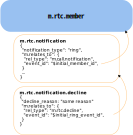

# MSC4310: MatrixRTC decline `m.rtc.notification`

MatrixRTC is the base layer that defines how devices participate in a call. For the specific
usecase of a voice/video call we need additional signalling (outside of MatrixRTC) to provide
the expected user experience.

It is important to understand that this (and related) proposals intentionally detangle rtc specific
signalling and general purpose MatrixRTC session state.

## Context

This proposal builds on the concept of [MSC4075: MatrixRTC Call Ringing](https://github.com/matrix-org/matrix-spec-proposals/pull/4075)
introducing the `m.rtc.notification` event.
This event lives in parallel with the MatrixRTC session and uses intentional mentions to make the receiving clients ring.
The receiving clients will then monitor the room state and stop ringing once the user joined with one of their devices.

## Proposal

Conceptually this MSC will introduce a event, that will be sent as a relation to the `m.rtc.notification` event
which communicates a decline from one or more parties. It can be used on the clients to provide a good UX around
a call decline (stop ringing, play a decline sound, prompt the user with: "the call has been declined" ...)

### Introduction

While the concept of this proposal is simple it is important to outline what needs to be achievable with
the proposed solution.

- A client needs to easily react to such an event and needs to be able to **correlate the decline** with a
  `m.rtc.notification` event and best case even the **MatrixRTC session** to check if the declien is relevant.
- It needs to be **flexible for 1:1 calls and group calls**. It should be possible to design a group ring
  and per group participant decline flow with this proposal even if some products might not need this feature.
- Clients have two possible ways of displaying **historic calls in the timeline**. They can compute the exact call
  history using the `m.rtc.member` events which contain the information at what time, which device joined.
  Alternatively they can use the notify and decline events only to render when a person tried to start a call
  and if that got declined. This is much simpler and therefore desired for very simple client implementations.

### Proposal (Changes)

This MSC Proposes the `m.rtc.decline` event type, with a standard `m.reference`
relation and a `reason` field.

- relation: `"m.relates_to": {"rel_type":"m.reference", "event_id":"$call_notify_event_id"}`
- reason:

  ```json
  "reason"?: "decline description"
  ```

The `m.relates_to` field allows to reference the original `m.rtc.notification` event.
The optional reason can provide a message to the user receiving the decline.

This results in a tree of notify events on `m.rtc.member` events.



Fetching the `m.rtc.member` events to compute a timeline item summarizing the
call allows to easily get all the
related elements and provide additional context in the timeline tile.
If a call was declined, who declined the call and who (can be multiple) started
the call by ringing others ...

## Potential issues

### Alternatives

There are other formats in which the decline relation could be formatted:

#### Reaction

Use already existing reactions to the notify event. This makes it extremely trivial to implement:

- Pros ✅
  - All clients already have support. 
  - The timeline rendering already has access to the reaction and can incorporate this into the custom tile rendering.
- Cons ❌
  - Feels hacky
  - Will be unencrypted as reactions
  - Does not allow for more custom fields (decline call later, decline ooo, decline in meeting)
  - Might collide with already existing reaction logic in clients
  - Hard to include into an rtc member based timeline rendering

#### Reusing the existing `m.rtc.notification` event

Reusing the `m.rtc.notification` event type which did not have this usecase in mind,
the event type name might be a bit off.

This custom event will be sent as a reaction to the initial notify event:

- Pros ✅
  - using the same event type does not need new widget permissions. And no additional
  event types would need to be introduced in js-sdk and rust sdk.
- Cons ❌
  - There would be no a clear separation and usecase.

## Security considerations

Relations are unencrypted and the custom relation type will leak metadata about call notify and deline events.

## Unstable prefix

While this is an open proposal the prefix `org.matrix.msc4310.rtc.decline` needs to be used for the new event type

## Dependencies

This MSC builds on [MSC4075](https://github.com/matrix-org/matrix-spec-proposals/pull/4075)