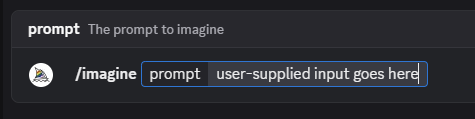

# MSC4332: In-room bot commands

Many bots on Matrix have a command interface consisting of `!botname <command>`, and have a pretty
long help menus which can make it difficult to find the right command. Many clients already have a
concept of "slash commands" which are [desirable to reuse](https://github.com/matrix-org/matrix-spec/issues/93)
and [come up occasionally](https://github.com/matrix-org/matrix-spec/issues/2170) - finding a way to
populate this feature with bot-specific details is beneficial.

This proposal suggests that bots maintain a state event in the rooms it joins to advertise available
commands, and their syntax. This does require that bots need power levels to maintain their state
event though, so bots without such power level (or are looking to maintain backwards compatibility
with clients which don't support this MSC) will need to rely on the existing `!botname help` convention.

*Note*: There's a good chance that this MSC is over-engineered for what it *actually* needs to accomplish.
It may get broken down into smaller MSCs as use cases materialize around it.


## Proposal

A new state event type is introduced: `m.bot.commands`. The state key is the bot's own user ID to
prevent other users/bots from changing it (this is a feature of rooms: see [`state_key`](https://spec.matrix.org/v1.15/client-server-api/#room-event-format)).

When presenting command options to users, clients SHOULD use this event to suggest per-bot commands
too, unless the user ID implied by the `state_key` is not joined to the room. (Note that this means
"invalid" state keys get treated as unjoined users: an empty string, "not_a_user_id", etc can't
join rooms, but `@bot:example.org` can.)

The `content` for such an event fits the following implied schema:

```jsonc
{
  "sigil": "!", // Defaults to `!` if not specified. Clients can use this to show the user a consistent
                // experience in the form of slash commands, but ultimately send the command as a
                // sigil-prefixed string to the room. Eg: the UI might say `/botname`, but the command
                // becomes `!botname` upon sending.
  "commands": [
    {
      "syntax": "botname example {roomId} {userId}", // `{words}` are variables.
      "variables": {
        // Variables use m.text from MSC1767 Extensible Events to later support MSC3554-style translations.
        // See https://spec.matrix.org/v1.15/client-server-api/#mroomtopic_topiccontentblock
        // See https://github.com/matrix-org/matrix-spec-proposals/blob/main/proposals/1767-extensible-events.md
        // See https://github.com/matrix-org/matrix-spec-proposals/pull/3554
        "roomId": {
          "m.text": [{"body": "The room ID"}]
        },
        "userId": {
          "m.text": [{"body": "The user ID"}]
        }
      },
      "description": {
        // We also use m.text here for the same reason as the variables.
        "m.text": [{"body": "An example command with variables"}]
      }
    }
  ]
}
```

**Note**: It's not currently proposed that a command can include a literal `{` in its syntax. A future
iteration of this MSC may introduce an escape sequence, but for now the text between an opening curly
brace and closing curly brace is considered the variable name. This includes more curly braces: `{{var}}`
becomes the variable `{var}` with another `}` tacked on. `{var with spaces}` becomes `var with spaces`.

**Reminder**: A convention among Matrix bots is to use their project name as the prefix for commands.
It's expected that this prefix goes into the `syntax` rather than `sigil` to avoid conflicts with
built-in client commands (discussed later in this proposal).

A client may show the variables and commands similar to Discord:



When the user sends the command, the client creates either an `m.room.message` event with the following
`content` shape:

```jsonc
{
  // These fields would be replaced by MSC1767 Extensible Events in future.
  "body": "!botname example !room:example.org @alice:example.org", // note that the syntax template is populated
  "msgtype": "m.text",

  // Mentions should always be added, to lower the chances of command conflicts.
  // Bots SHOULD look for mentions where possible to avoid accidental activations.
  "m.mentions": {
    "user_ids": ["@bot:example.org"] // should be a single element array, containing the bot's user ID
                                     // from the `m.bot.commands` state event's `state_key` (or `sender`).
  },

  // This is a new content block so bots don't *need* to do string unpacking when
  // commands are sent this way. Bots may still need to unpack `body` when users
  // send commands without client support/manually.
  "m.bot.command": {
    // The syntax is effectively used as a "command ID", so bots can identify which
    // command the client is using without needing to track arbitrary strings. Whether
    // the bot unpacks this string is an implementation detail for the bot.
    "syntax": "botname example {roomId} {userId}",
    "variables": {
      // These are just the variables and their user-supplied values.
      "roomId": "!room:example.org",
      "userId": "@alice:example.org"
    }
  }
}
```

Bots can then respond however they normally would to the command input.

Clients SHOULD be aware that some bots may attempt to create conflicts with built-in commands or other
bots. Where conflicts with built-in events exist, clients SHOULD NOT show the bot's option to the user.
Where conflicts with other bots exist, clients SHOULD show the bot's name/user ID in the autocomplete
text. For example, "@Giphy /gif {search}". Clients MAY wish to always disambiguate commands like
this to avoid future conflicts with built-in commands. From an implementation perspective, clients
might cause their built-in commands to always take precedence over any bot's commands to avoid users
becoming confused.

**Tip**: Bots which don't use `m.bot.command` and need to support spaces in their variables can use
quotes in the command syntax to surround user input. For example, `"syntax": "gif \"{search}\""`.

To aid consistency, clients SHOULD apply the described grammar validation to the following predefined
variables:

* `userId` - Must be a valid [user ID](https://spec.matrix.org/v1.15/appendices/#user-identifiers) for
  the room version.
* `roomId` - Must be a valid [room ID](https://spec.matrix.org/v1.15/appendices/#room-ids).
* `roomAlias` - Must be a valid [room alias](https://spec.matrix.org/v1.15/appendices/#room-aliases).
* `eventId` - Must be a valid [event ID](https://spec.matrix.org/v1.15/appendices/#event-ids).
* `serverName` - Must be a valid [server name](https://spec.matrix.org/v1.15/appendices/#server-name).
* `permalink` - Must be a valid [permalink URI](https://spec.matrix.org/v1.15/appendices/#uris)
  (either `matrix.to` or `matrix:`).

**Note**: For clarity, the above variables do not have to point at a room/user/server/etc that is known
to the client. They just need to *look* valid per the grammar.


## Extensions

The following extensions/features are best considered by future MSCs:

* Specifying a minimum power level required to send a command, to hint to users that a command may
  be unavailable to them. This wouldn't be enforced by auth rules, but clients can stop a lot of the
  accidental usage if they know the power level the caller must have.

* Specifying a non-`m.room.message` event template to send instead. This could be useful if the bot
  wants to minimize "visible" traffic in the room or has custom event types it wants to use. In future,
  being able to specify extensible event content blocks which should be added to the resulting event
  may be a better option. In either case, bots should not be able to cause users to send state events
  to prevent bots from tricking users into changing power levels, join rules, etc.

  Such an event template could be used to quickly add features to clients ahead of mainline releases.
  For example, a client which doesn't yet have support for polls may suggest adding a "poll bot" that
  sets its command event template to [an `m.poll.start` event](https://github.com/matrix-org/matrix-spec-proposals/blob/main/proposals/3381-polls.md).

* Support for non-text variables like images/files, booleans, integers, etc.

* Support for regex(-ish) validation on variables.

* Support for repeated variables. For example: `{userId...}` to specify multiple user IDs.

* Support for optional variables. For example: `[userId]`, if a user ID is not required.


## Potential issues

Mentioned in the proposal, the lack of variable escaping isn't great.

Using state events limits a bot's ability to advertise commands if it isn't given power to do so.

The lack of formal "command IDs" isn't great - there's no clear reason to include them at this stage,
however.

There are probably more potential issues this MSC needs to consider.


## Alternatives

Not using state events would work, but can be tricky to manage. This proposal fills a gap until proposals
which solve the problem space more completely are written and proven by implementation.


## Security considerations

Mentioned in the proposal, clients should be explicitly aware that bots may try to create confusion
for users and override built-in commands or another bot's commands. For example, a bot may advertise
a `myroomnick` command which leads to the client's functionality not working as expected. Clients
should be taking measures to minimize this confusion from happening.


## Unstable prefix

While this proposal is not considered stable, implementations should use `org.matrix.msc4332.commands`
in place of `m.bot.commands` and `org.matrix.msc4332.command` in place of `m.bot.command`.


## Dependencies

This proposal has no direct dependencies, but benefits more strongly from the following Extensible
Events MSCs:

* [MSC1767 (accepted)](https://github.com/matrix-org/matrix-spec-proposals/blob/main/proposals/1767-extensible-events.md)
* [MSC3554: Translatable Text](https://github.com/matrix-org/matrix-spec-proposals/pull/3554)
